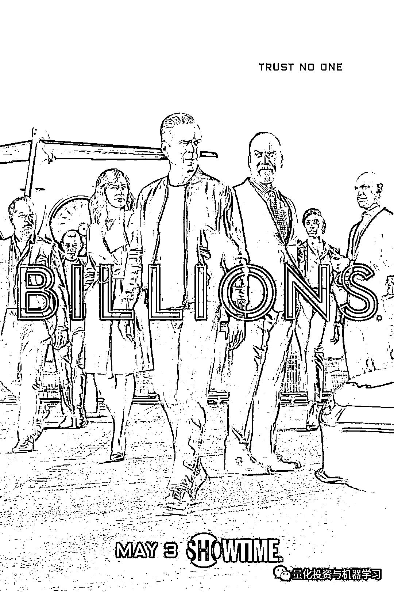

# 最新！Billions 第五季第 1 集，快来收看！

> 原文：[`mp.weixin.qq.com/s?__biz=MzAxNTc0Mjg0Mg==&mid=2653298189&idx=1&sn=850362ebdd7f5dd58a118983b0f3f21a&chksm=802ddc18b75a550e0f62df33e058694cf6f59fb6fca583f86aecdc7ba019a7246280e12ce230&scene=27#wechat_redirect`](http://mp.weixin.qq.com/s?__biz=MzAxNTc0Mjg0Mg==&mid=2653298189&idx=1&sn=850362ebdd7f5dd58a118983b0f3f21a&chksm=802ddc18b75a550e0f62df33e058694cf6f59fb6fca583f86aecdc7ba019a7246280e12ce230&scene=27#wechat_redirect)

**标星★****置顶****公众号     **爱你们♥   

量化投资与机器学习公众号独家报道

****在这一季，权力之争变成了生存之战，所有角色都必须适应，否则就有灭绝的危险。****

**第五季剧情概览：**

Bobby Axelrod 和 Chuck Rhoades 不仅要面对他们自己重燃的竞争对手，还要面对一些新面孔，他们希望能永久地把他们两个拉下马。Mike Prince 对 Axelrod 的统治地位构成了威胁，Chuck 发现自己以一个熟练而精明的地区检察官的形式与法律较量。Taylor Mason 被迫回到 Axe 资本，作为唯一一个能够在 Axe 和 Chuck 之间保持中立的人，是迫使 Taylor 回到 Axe 资本的原因。为了保护公司的员工和他们的资产，Taylor 会成为 Axe 的王牌还是 Chuck 希望一劳永逸地终结 Axe 的统治地位的“怪物杀手”？与此同时，Wendy Rhoades 重新评估了她过去效忠的对象，并开始组建一些新的、强大的自己的团队，该团队会让 Axe 和 Chuck 大吃一惊。

****One man's enemy is another man's ally.****

记住第五季的这句话！

**《亿万》第五季第 1 集**

在后台输入

**第五季 E01**

量化投资与机器学习微信公众号，是业内垂直于**Quant、MFE、Fintech、AI、ML**等领域的**量化类主流自媒体。**公众号拥有来自**公募、私募、券商、期货、银行、保险资管、海外**等众多圈内**18W+**关注者。每日发布行业前沿研究成果和最新量化资讯。

你点的每个“在看”，都是对我们最大的鼓励