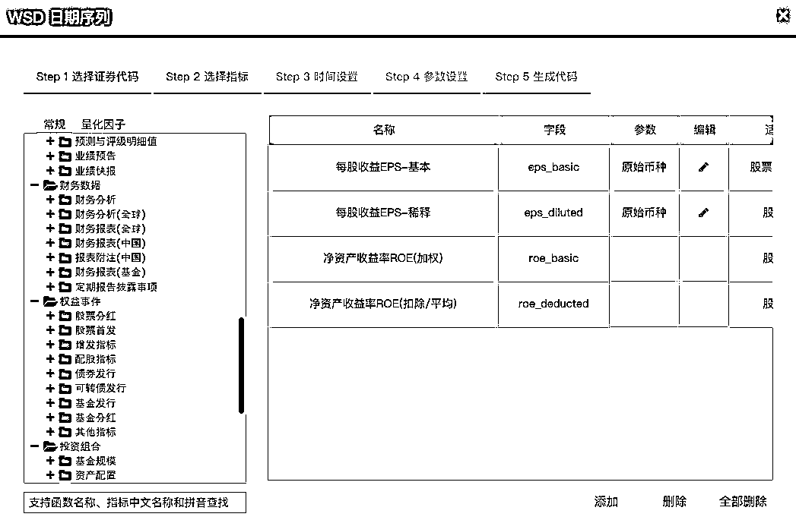

# 巴菲特的 Alpha：利用机器学习量化『股票基本面』

> 原文：[`mp.weixin.qq.com/s?__biz=MzAxNTc0Mjg0Mg==&mid=2653298184&idx=1&sn=d283a81aeb45b7b4dd7593f7c8f66597&chksm=802ddc1db75a550bc6780a71d4431246959b2b0e883eccdfa762aed9e09cae93aec485946bff&scene=27#wechat_redirect`](http://mp.weixin.qq.com/s?__biz=MzAxNTc0Mjg0Mg==&mid=2653298184&idx=1&sn=d283a81aeb45b7b4dd7593f7c8f66597&chksm=802ddc1db75a550bc6780a71d4431246959b2b0e883eccdfa762aed9e09cae93aec485946bff&scene=27#wechat_redirect)

**标星★****置顶****公众号     **爱你们♥   量化投资与机器学习编辑部**未经允许，禁止转载**

***1***

**前言**

如果说投资界最佩服的两位老爷子，那就是：
**巴菲特（基本面投资者）、西蒙斯（量化投资者）**无论二位如何操作，其本质都是在市场上寻求超额收益，即所谓的**Alpha**。

基本面投资和量化投资各有特点，主要是以下几个方面：

总结一下：

**基本面投资：**根据财务报表中概述的收益来衡量公司的额内在价值，识别出市场不确定的证券。如果某一证券的公允价值高于市价，则该股票被低估，并且给出卖出意见。反之。

**量化投资：**通过数学、统计建模等方式，利用计算机技术从庞大的历史数据中海选出能带来超额收益的“大概率”事件来制定策略。

如果将这两种投资模式结合起来，就是我们所说的：

**Quantamental**

**Quantamental：**它是 Quantitative 和 Fundamental 两者的结合，就是“量化”+“基本面”的意思，简称**量本投资**。

当然二者也各有优缺点：

**基本面投资：**提供了深刻、独到的见解；局限是根据金融数据的表面价值来假设一个经济实体，缺乏独特的洞察力。

**量化投资：**能够快速分析投资领域；它是投资分析领域的一个小子集，有时会陷入追逐已经位于高位的股票，或者持有反映行为偏差的亏损股票 。

根据摩根士丹利的分析：在过去的 20 年里，比如估值、成长、质量和动量因子，已经驱动了全球股票经理 65%的相对收益。

35%的回报要归因于基本面选股。这种方法有其优点，但这使得该策略依赖于市场因素，使其成为超额收益的唯一来源。

美国银行美林的 Alpha Surprise 模型就是其中一个例子，该模型对公司基本面分析师的预测进行量化叠加。 在过去的 30 年里，该模型 23 次跑赢了标普 500 指数。

*“Quantamental” model with attractive risk/return profile The Alpha Surprise model is a quantitative discipline applied to our fundamental research franchise – it screens for inexpensive, out-of-consensus stock ideas using our fundamental analysts’ earnings estimates. The model has generally offered investors attractive relative returns at comparable or lower levels of risk than the market’s, and, with the exception of the Tech Bubble, has outperformed the S&P 500 in every three-year window since inception.*

人类世界的数据已经开始出现爆发性增长，新模型纳入的数据也更加丰富。在金融界，软件可以跟踪通话记录中的情绪，并检测高管的词汇模式，并以此量化整个市场的交易情绪等等。

在更大的范围内，跟踪和存储数据可以揭示长期的经济模式。例如，商场停车场的卫星图像可以确定商场的销售量等等。

美国银行美林在 2019 年的年度机构因子调查发现，Quantamental 是一个关键趋势：

在报告中我们也给大家分享一些有趣的发现：

**量化模型总体上已经变得更加复杂，平均每个模型有****18 个因****子****构成**，而不是 20 世纪 90 年代大多数模型中使用的 7-8 个因子。

今年，人工智能和机器学习变得尤为重要，因为投资者将传统因子与机器学习结合起来，研究更大的数据集，识别非线性关系。调查发现，**超过 20%的参与者使用机器学习来产生 Alpha：**

**17%****的机器学习用户使用的是****非监督式学习方法**，比如我们常见的 PCA 等。强化学习则用的额最少：

几乎 40%的人使用不同形式的另类数据，其中网上数据最为普遍，占另类数据用户的 30% 。 只有大约 10% 的人声称使用信用卡、卫星和地理定位数据。

下面让我们利用机器学习来研究一下如何量化基本面！

***2***

**机器学习中的分类**

我们将建立一个机器学习分类器来判断一只股票是买入、卖出还是持有。为了确定一个股票或公司是否属于这三种类型之一，我们将看一下每个公司的季度报告。这些季度报告包含了必要的财务信息，我们需要用基本面分析的方法来训练我们的机器学习分类器。

**获取全部代码，见文末**

**1、基础数据——季度数据**

为了训练分类器模型，我们需要收集大量的财务季度报告。国外数据从这里：

http://www.stockpup.com/data/

国内推荐 Wind，因为比较全，财务量化因子也是 PIT 的。如果没有钱买他们的终端，可以用**WindQuant 万矿**，这个是免费的，数据和 Wind 一致：

www.windquant.com

## **2、整理数据**

DataFrame 显示如下：

我们可以观察到所有不同的列和对应于每个列的日期。Stockpup 还提供了价格信息（最高、最低等），这对我们判断股票是买进、持有还是卖出非常重要。

我们有很多种方法来决定股票是否值得投资。如果在过去的三个季度中，资产增加了，负债减少了，我们是否可以将其归类为买入？或者，如果股价上涨，长期债务下降？无论怎样，我们有许多选择来确定股票的类别。简单地说，这是基本面分析的基础。

***3***

**基本面分析开始**

在不了解基本面分析的情况下，我们如何从根本上分析这些季度报告？既然我们不是巴菲特那样的基本面专家，就让我们用自己的基本面分析方法来简化一下吧：

*   根据所选季度的季度报告，观察从上一个报告到当前所选报告的值的变化。
*   然后，观察下一个季度报告中的价格值，看看是否有显著的价格跳跃。
*   最后，使用当前报告包含过去报告的变化和未来报告的价格行为，确定是买进、持有还是卖出。

从本质上讲，我们正在检测上一季度到当前季度的变化是否会影响未来的价格。我们将根据上一份报告来判断每一份季度报告的表现，然后观察未来的价格走势。如下图所示：

我们将在每个季度报告中应用这种分析方法来创建新的基础数据。如果一只股票本季度值得投资，这种方法将进行分类。显然，我们不能在最初的 QR 或最近的 QR 上使用这种方法，因为分析的要求过去和未来的季度报告。

***4***

**清理数据**

**1、创建类标签**

为了对每一份季度报告进行分类，我们将尽量不把事情复杂化。如果下个季度价格大幅上涨，那就是买入。如果下跌，那就是卖出。如果两者都不是，那就继续持有。

以下是我们对每个季度报告的具体类别要求：

*   买：下一季度，高价和低价的涨幅均在 3% 以上

*   卖：下一季度，高价和低价跌幅达 -3% 或以上

*   持有：如果两者都没有发生

我们还可以考虑其他可能的结果，但为了简单起见，我们保持这些条件不变。我们不知道下个季度最新季度报告的价格高低，因为这是对未来的预测，而这是不可能的。

**2、季度报告中的基本面数据**

如前所述，对于我们的基本面数据，我们将观察两个 QRs 来创建新值。以前的 QR 到当前或当前 QR 的变化将以百分比变化来度量，而不是它们的实际值。例如：

*   假设上一季度，股票的价值是 1000 美元。而在本季度，股价目前为 1100 美元；增加了 10%。现在，我们用当前 QR 的 10%来替换 1100 的股票价值。

我们对每个 QR 都这样做（不包括第一个 QR，因为我们无法将它与不存在的东西进行比较）。现在每个 QR 都有每个基本值的变化百分比。

**3、编码**

现在我们已经用百分比变化衡量了 QRs，并标记为买入、持有或卖出，下面通过代码实现：

**a. 导入数据集**

pickle 文件是一个 DataFrames 字典，其中包含 stockpup 网站上每个股票代码 / 公司的 QRs。

**b. 辅助函数**

**c. 每个股票代码来转换数据**

有几点需要注意：

1、为了在以后训练我们的分类模型，所有来自 DFs 字典的 DataFrames 被合并为一个。

2、索引被重置，因为不再需要日期。每一行或每一个 QR 现在都包含了过去和未来 QRs 的信息，所以日期对于模型不再重要

3、删除与价格相关的特征或列，以防止数据泄漏。在正常的 QRs 中，这些特征不包括在内。

最后，我们导出最终的 DF 用于数据探索和训练分类模型。

***5***

**数据探索**

接下来，为了更加熟悉我们的数据，我们必须执行一些简单的探索性数据分析。我们这样做是为了更好地理解数据，并确保在转换数据时没有遗留。

如大家所见，我们的数据存在一个类不平衡问题。这可能是一个问题，但我们不希望丢弃数据点，以便每个类都等于数量最少的类。尽管这可能是解决不平衡的可行方案，但是我们还有其他的选择可以探索。另一个选择是在验证我们的分类模型时使用不同的评估指标。当进入建模阶段时，我们将对此选项进行扩展。

数据相关性： 

从我们所看到的，一些特征对确定类标签有影响。有些与股票/季度报告是否值得买进、卖出或持有几乎没有关系。既然我们知道 QR 中的一些特征在确定类标签时并不重要，那么我们可以从数据集中删除这些特征。

***6***

**特征工程**

现在我们已经对我们的数据进行了一些研究，我们可以继续进行更多的研究，或者转移到特征工程中，或者更具体地说，是特征选择。特征工程是改变数据集以增强机器学习模型的过程。有许多选项可以用来设计数据集的特征。包括但不限于：

*   **创建交互功能。**两个截然不同的特征相互作用，从而创建一个全新的特征。
*   **减少特征的数量。**由于我们有 30 多个基本特征，我们可以消除不重要的特征以提高模型的性能。
*   **使用领域知识。**如果根据经济和金融研究，我们知道哪些特征对股票价格最重要，那么我们就可以给这些特征赋予权重。

**1、特征选择**

在本文中，我们将简单地删除不重要的特征。这样做，我们可以潜在地提高模型的准确性，并减少训练时间。我们将展示两种不同的特征选择方法。这样，我们可以比较由于我们方法的不同，模型的性能与略有不同的数据集会产生什么样的结果。

**方法 1：根据相关值选择前 10 个特征**

我们选择与决策类标签相关的前 10 个特征：

*   取每个特征的绝对值（处理负相关性）。
*   按绝对值排序。
*   将数字特征分割为只包含前 10 个最相关的特征。
*   加入决策类标签，以便将它们包含在新的 DF 中。
*   将前 10 名的 Correlation DF 导出为 pickle 文件。

我们现在有了一个新的分类模型数据集。希望这个新的数据集能增强我们的分类模型，并加快训练时间。

**方法 2：基于树分类器选择前 10 个特征**

下一种特征选择方法比我们刚才做的要复杂一些。通过使用 sklearn，我们将实现一个基于决策树的分类器来确定哪些特征是最重要的。通过使用这个分类器，我们将能够确定哪些特征是最重要的分类 QR 或股票。

接下来，随着重要特征的排序，我们将其可视化，以确定哪些特征被确定为最重要的。 

根据 forest.feature_importances_ 方法，以下是十个是最重要的特征：

*   **P/B Ratio**
*   **Assets**
*   **Shares split adjusted**
*   **Shares**
*   **P/E Ratio**
*   **Asset turnover**
*   **Liabilities**
*   **Current Assets**
*   **Cash at end of period**
*   **Revenue**

***7***

**机器学习分类器**

为了找到性能最佳的机器学习分类模型，我们将通过多个模型运行数据。每种模式都有其独特的优点和缺点。为了确保我们对数据使用的是最优模型，我们必须尝试每个分类器。

我们将使用的分类模型:

*   **AdaBoost**
*   **决策树**
*   **DummyClassifier**
*   **Gradient Boost**
*   **KNN**
*   **逻辑回归**
*   **朴素贝叶斯**
*   **随机森林**
*   **SVM**
*   **XGBoost**

有很多模型!它们中的每一个都将被训练和安装到我们的数据集，以确定最佳性能的模型。

**1、**DummyClassifier****

为了度量每个模型的性能，需要将它们与基线模型进行比较。这就是我们的虚拟分类器的用武之地。虚拟分类器的功能类似于随机猜测每个 QR 的类标签。它通常是基于概率的，类标签是根据它们的样本大小来决定的。

以建立的虚拟分类器为基线模型，为每个模型设定一个性能标准。为了被认为是一个可行的模型，每个模型必须能够超越虚拟分类器。如果他们不能超越基线模型，那么模型也不会比随机猜测更好。

***8***

**对分类模型进行编程**

**1、导入库并加载数据：**

在导入数据时，我们可以选择需要哪个数据集。如果我们希望比较两个不同数据集的模型性能，这是很重要的。

**2、缩放和训练，测试，分割数据：**

使用的缩放方法（归一化）主要取决于大家，因为每个缩放器都有自己独特的优势。然后我们将数据分解为 X 和 Y 变量的训练集和测试集，我们将需要这些数据来拟合和评估我们的模型。

## **3、创建虚拟分类器：**

我们通过实例化分类器来创建虚拟分类器，然后将其匹配到我们的训练集。接下来，我们使用测试集来制作预测标签，并与实际标签进行比较。最后，我们打印出一份包含我们需要的评估指标的分类报告：

***9***

**评价指标**

由于我们处理的是一个不平衡的数据集，我们不能依赖准确性作为我们的模型的评估指标，这就是为什么它没有包括在分类报告中。准确性可能是一个重要的衡量标准，但是由于我们问题的本质和类别的不平衡，准确度将被忽略，而**有利于准确率和召回率**。

**精确率是针对我们预测****结果****而言的：**它表示的是预测为正的样本中有多少是真正的正样本。

**召回率是针对我们原来的****样本****而言的：**它表示的是样本中的正例有多少被预测正确了。

**精确率>召回率**

为什么我们选择精确率而不是召回率呢？当涉及到投资决策时，我们不希望分类器将卖出错误地归类为买入。在我们保守的投资策略中，**我们宁愿错过投资机会（召回率），也不愿投资错误的股票（精确率）**。很明显，两者之间有一个平衡，这就是 F1-Score 发挥作用的地方。但是，每个分类模型的总体判断将基于其相对于基线模型的精度评分的增加。

***10***

**混淆矩阵（误差矩阵）**

对于每个分类器，我们将可视化它们的混淆矩阵以获得更好的可解释性。混淆矩阵将显示被错误分类的 QRs 的数量。

随着混乱矩阵的可视化，以及基线模型的创建和评估，我们已经正式完成了我们的第一个分类模型。

***11***

**构建更多的分类模型**

要创建更多的模型，我们所要做的只是复制基线模型的代码，然后修改几行代码。下面是一个模型的代码（与 DummyClassifier 非常相似）：

正如我们所看到的，在代码中只有两到三行需要修改来构建每个模型。

我们需要改变的两三行是:

1、with open(“top10_df.pkl”, “rb”) as fp：只有在测试其他不同特征的数据集时才进行修改。

2、from sklearn.ensemble import AdaBoostClassifier：将这些导入更改为适当的库及其各自的分类器。

3、clf = AdaBoostClassifier()：将这个变量更改为适当的分类器。

其他一切都保持不变。

***12***

**网格搜索——参数调整**

在调整模型以适应数据集时，我们可以保持模型不变，也可以通过使用网格搜索来提高模型的性能。通过使用这种方法，我们能够适当地根据我们的数据集调整每个分类模型的参数。

到目前为止，网格搜索将是最耗时的。不是因为我们的代码很多，而是因为每个参数组合的迭代数量。有些模型需要比其他模型更长的时间来进行网格搜索，但是整个过程仍然需要相当多的时间，因为我们将网格搜索我们拥有的每个模型。

网格搜索的代码对于每个模型基本上是相同的，我们只需要修改几行代码。

正如大家所看到的，需要编写的代码并不多，实际上这里有一些我们以前使用过的代码（分类报告和混淆矩阵）。

需要改变的是：

*   params 变量，它将是一个字典，字典的键对应于相应的分类器参数，字典的值是我们希望为每个迭代尝试的不同值。

*   当变量最初被更改以适应每个新的分类器时，clf 早就应该被更改了。

**1、网格搜索的参数**

这些参数需要设置为适合我们自己的个人需求。正如我们所看到的，clf 和 params 已在上面处理。但对于其他参数：

*   return_train_score 设置为 True，以便以后观察评估的结果。
*   verbose 设置为 5，这样我们就可以看到每个迭代的进度和它们的分数。
*   scoring 设置为 f1_macro，因为我们在确定最佳参数时优先考虑 F1 评分。

**2、F1 分数宏平均（macro-average)**

F1 分数优先于精确率的原因仅仅是分类的数量。当精确率被优先化时，精确率分数可能会显著增加，但被归类为某些类别的 QRs 的数量会大大减少。 在我们的示例中，分类器很少对 Buy 或 Sell 进行分类，但是许多分类都在 Hold 类中。 这是因为 Hold 类是大多数类。 我们不希望我们的分类器很少告诉我们什么时候投资，我们希望至少有一定数量的机会属于召回率得分。

为了在精确率和召回率之间取得平衡，我们会优先考虑 F1 的分数。我们之所以选择宏观平均而不是微观平均，是因为宏观忽视了阶级不平衡。持有类，作为占主导地位的类，当涉及到投资活动时，我们几乎什么都不知道，因为我们更想知道股票是买还是卖。总的来说，使用 F1 分数宏平均值将允许网格搜索在我们喜欢的条件下找到最佳参数。

******13******

**每个分类模型运行和评估**

现在我们有了数据、分类器代码、评估报告和网格搜索代码，我们可以将它们应用到每个分类模型中。

**1、保存分类模型**

一旦我们决定了哪个模型最适合我们的数据，我们就可以用正确调优的参数保存拟合的模型。看看下面的代码，看看如何保存一个模型（只有两行代码）：

这段代码将导出我们的模型以供其他文件使用。

**2、表现最佳的模型**

在我们的例子中，**性能最好的模型来自 XGBoost 分类器**，它使用了来自树分类数据集的前 10 个重要特征。该分类器的分类报告如下：

正如我们在这里看到的，与基线模型相比，在 XGBoost 模型中，Buy 类增加了 10%，Sell 类增加了 20%。这是对 DummyClassifier 模型的重大改进。在很多方面，我们基本上是在预测未来。如果我们的分类器能够以 47%的准确率来决定一个股票是否值得投资，那么我们应该认为这是一个重大的突破！

***14***

**分类新数据**

假设我们想用分类器来预测一个新的 QR。我们怎么才能做到呢？最好的选择是找到最近的 QR 和以前的 QR 的值。然后，观察它们之间的百分比变化，以便它们与我们自己的数据集的格式匹配。

新的数据可以从许多报告 QRs 的网站获得，我们可以通过网络搜集这些值，也可以手工输入。Stockpup 也有最新的 QRs，对于本文来说，我们将利用该网站的最新值。在前面的部分中，我们从每个库存中删除了最新的 QR，因为没有未来的最高和最低价格用于我们的类标签。所以这些 QRs 仍然没有被标记，但是现在我们可以用分类器的预测来标记它们。

**1、最新的 QR 和可视化辅助函数：**

在处理新数据时，为了与配合分类器，我们必须对数据进行扩展，因为我们最初就是这样训练分类器的。必须对数据进行处理，以包含百分比修正、正确的特征列和与其他相关数据的缩放值。一旦我们有了所有这些，我们就可以对最新的 QR 进行分类。

**2、分类最新的 QR**

在这个例子中，我们将使用来自 AMD 的最新 QR：

根据我们的分类器，AMD 有 42.5%的机会持有。最主要的概率将决定分类器如何确定股票的名称。

***15***

**结论**

根据季度报告来决定股票价值并不是什么新成就。对于大多数基础分析人员来说，我们使用的策略可能被认为过于简单或过时，但是对于学习机器学习分类来说，这已经足够了。我们可以添加更多的特征来改进模型，或者根据新的策略改变现有的特征。

我们甚至可以用神经网络做实验，看看它们是否能比我们现有的模型表现得更好。我们将在未来的文章中给大家讲解！

***16***

****获取全部代码（手慢无！）****

在**后台**输入（严格大小写）***JBM-Quant 最爱***2020 年第 89 篇文章

量化投资与机器学习微信公众号，是业内垂直于**Quant、MFE、Fintech、AI、ML**等领域的**量化类主流自媒体。**公众号拥有来自**公募、私募、券商、期货、银行、保险资管、海外**等众多圈内**18W+**关注者。每日发布行业前沿研究成果和最新量化资讯。

你点的每个“在看”，都是对我们最大的鼓励