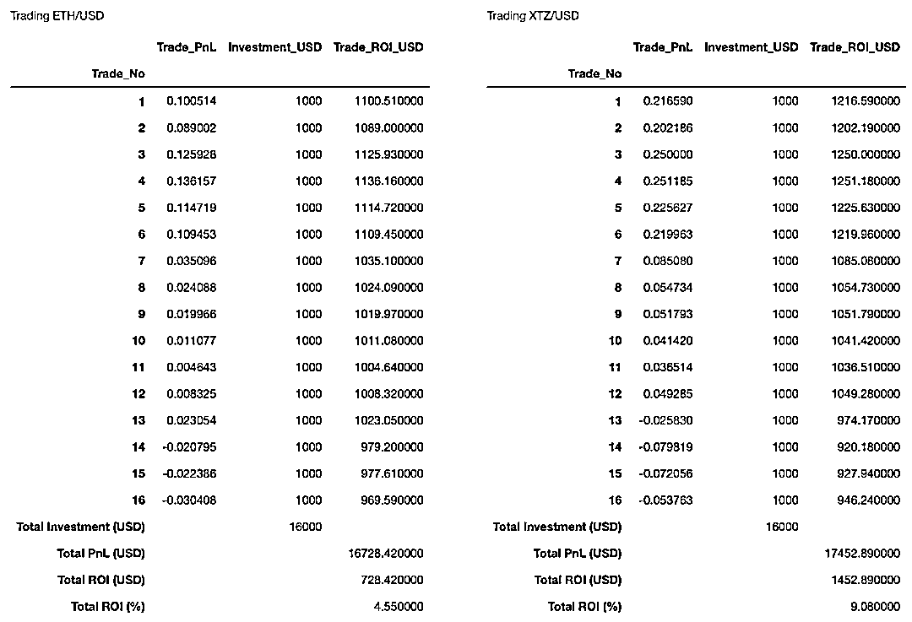

# 信号在哪里？比特币日内算法交易模型（附代码）

> 原文：[`mp.weixin.qq.com/s?__biz=MzAxNTc0Mjg0Mg==&mid=2653298174&idx=1&sn=97510a98ae882fade327dda4030fd050&chksm=802ddfebb75a56fd9b72579fd20d4b7196c8bab62a6618630d748605f1acd9271fee3bf80350&scene=27#wechat_redirect`](http://mp.weixin.qq.com/s?__biz=MzAxNTc0Mjg0Mg==&mid=2653298174&idx=1&sn=97510a98ae882fade327dda4030fd050&chksm=802ddfebb75a56fd9b72579fd20d4b7196c8bab62a6618630d748605f1acd9271fee3bf80350&scene=27#wechat_redirect)


**标星★****置顶****公众号     **爱你们♥   

作者：Pawel       编译：1+1=6  

***1***

**前言**

加密货币有一个非常显著的特征是：**高度线性相关**。价格的上下波动几乎是在一分钟的时间内瞬间发生的，你可以想象到一个看不见的人同时在幕后操纵着一切。然而，这一切是从哪里开始的呢？哪种加密货币是主流货币？是比特币在所有的加密市场上传播新的买入/卖出信号，并触发其他比特币的价格上涨或下跌作为反馈吗？我们认为，由于历史、法律或流动性等诸多原因，比特币是所有市场参与者密切关注的货币。

在今天的推文中，我们将设计一个比特币交易多头模型。将使用比特币日内价格（1 分钟开高低收时间序列）来识别突发的的价格变化作引发的市场效应。在此基础上，我们将模拟交易次模型，即在触发信号后，在一分钟打开一个新的多头头寸，并应用 2 步验证止损来结束交易。我们将在每笔交易中投入固定数额的资金，暂不考虑手续费。

***2***

**数据准备**

先导入在今相关 Python 库：

```py
import ccrypto as cc
import numpy as np
import pandas as pd
import matplotlib.dates as mdates
import matplotlib.pyplot as plt
import plotly.graph_objects as go
import pickle
import warnings
warnings.filterwarnings("ignore")

blue, orange, red, green = '#1f77b4', '#ff7f0e', '#d62728', '#2ca02c'
grey8 = (.8,.8,.8) 
```

通过使用 Python 的字典类型，我们可以有效地存储许多时间序列，甚至可以作为 Pandas 的 DataFrame 对象，下面的代码很好用：

```py
coins = ['BTC', 'ETH', 'XRP', 'BCH', 'LTC', 'EOS', 'XTZ', 'LINK', 
         'XLM', 'DASH', 'ETC', 'ATOM']

database = {}
for coin in coins:
    print(coin + '...', end=" ")
    try:
        database[coin] = cc.getCryptoSeries(coin, freq='m', ohlc=True, exch='Coinbase')
        print('downloaded')
    except:
        print('unsuccessful')

with open('timeseries_20200420_20200427.db', 'wb') as handle:
    pickle.dump(database, handle) 
```

```py
BTC... downloaded
ETH... downloaded
XRP... downloaded
BCH... downloaded
LTC... downloaded
EOS... downloaded
XTZ... downloaded
LINK... downloaded
XLM... downloaded
DASH... downloaded
ETC... downloaded
ATOM... downloaded 
```

在上面的例子中，我们分别下载了比特币、以太坊、XRP、比特币现金、莱特币、EOS、Tezos、Chainlink、Stellar Lumens、Dash、以 ETC 和 Cosmos。在本文中，数据将涵盖最后 7 个交易日，即从 2020 年 4 月 20 日到 2020 年 4 月 27 日。对于流动性较差的币，时间序列可能会有一些缺失的数据。但在今天的这篇帖子中，数据的确实将不是一个问题，大家在后文会看到！

如果大家在国内下载加密货币数据，Wind 是可以的，他们有一个免费的在线平台：***www.windquant.com***，所有用户都可以进行注册。 

下面就是获取比特币的代码生成器：


这是取到的数据：


好的，回到主题，我们从文件中导入所有时间序列，你可以通过运行下面的代码：

```py
with open('timeseries_20200420_20200427.db', 'rb') as handle:
    ts = pickle.load(handle)

print(ts.keys())
dict_keys(['BTC', 'ETH', 'XRP', 'BCH', 'LTC', 'EOS', 'XTZ', 'LINK', 'XLM', 'DASH', 
           'ETC', 'ATOM'])

dict_keys(['BTC', 'ETH', 'XRP', 'BCH', 'LTC', 'EOS', 'XTZ', 'LINK', 'XLM', 'DASH', 
           'ETC', 'ATOM']) 
```

或者肉眼检查数据，例如：

```py
cc.displayS([ts['BTC'].head(), ts['ETH'].head()], ['Bitcoin (start)','Ethereum (start)'])
cc.displayS([ts['BTC'].tail(), ts['ETH'].tail()], ['Bitcoin (end)','Ethereum (end)']) 
```


***3***

**数据可视化探索**

在我们的研究中发现：**如果比特币的价格在 1 到 15 分钟内迅速上涨，大量其他币的价格也会随之上涨。**

对于看空 15 分钟 K 线的技术交易者来说，屏幕上的竖线为他们提供了强烈的买入信号（开放多头仓位）。 然而，15 分钟是一个很长的时间在加密货币算术交易中。

让我们分析一下数据，通过使用 Python 的 plotly 库比较 BTC 和 ETH 的时间序列来说明我们所讨论的内容。Plotly 提供了一个非常简单的方法来可视化开高低收时间序列。代码如下：

```py
whiteP, blackP, redP, greyP = '#FFFFFF', '#000000', '#FF4136', 'rgb(150,150,150)'

fig = go.Figure(data=go.Candlestick(x     = ts['BTC'].index, 
                                    open  = ts['BTC'].iloc[:,0], 
                                    high  = ts['BTC'].iloc[:,1],
                                    low   = ts['BTC'].iloc[:,2],
                                    close = ts['BTC'].iloc[:,3],)
               )
fig.update(layout_xaxis_rangeslider_visible=False)
fig.update_layout(plot_bgcolor=whiteP, width=500)
fig.update_xaxes(showgrid=True, gridwidth=1, gridcolor=greyP)
fig.update_yaxes(showgrid=True, gridwidth=1, gridcolor=greyP)
fig.update_yaxes(title_text='BTC/USD')

cs = fig.data[0]
cs.increasing.fillcolor, cs.increasing.line.color = blackP, blackP
cs.decreasing.fillcolor, cs.decreasing.line.color = redP, redP

fig.show() 
```

对于比特币和以太坊来说，它们 1 分钟的交易模式与一些突出的紧密联动有很多相似之处：


在这里，你可以很容易地在 16:22（2020 年 4 月 23 日）发现比特币价格的一个峰值，同时在 ETH 中发现相应峰值：


BTC 价格从 7400 美元的阻力位上升到约 7700 美元，即仅在 4 分钟内上涨 4% 。有趣的是，如果你比较 K 线图的每 1 分钟 bar，你会发现这两种加密货币的交易有多密切。两者之间的唯一区别在于交易量及其在价格上的表现。

***4***

**开仓信号**

在我们的研究中，我确定 BTC 收盘价与一分钟前之间 0.5%的变化率可以很好地触发下一分钟以开盘价，于是开启新的交易（做多头寸）。

因为我们的触发信号是基于比特币的，所以我们可以在一段时间内使用本地的 DataFrame btc 来确定它们。代码如下：

```py
btc = ts['BTC']

btc = btc[['BTCUSD_O', 'BTCUSD_C']]  

btc['BTCUSD_C_LAG1'] = btc['BTCUSD_C'].shift(1)

def rr(z):
    '''Calculates rate of return [percent].
       Works with two DataFrame's columns as an input.
    '''
    x, y = z[0], z[1]
    return 100*(x/y-1)

btc['rate_of_reutrn'] = btc[['BTCUSD_C', 'BTCUSD_C_LAG1']].apply(rr, axis=1)

display(btc)

btc = btc.dropna() 
```


假设 0.5%为阈值，我们可以找到并说明所有可能的触发点如下：

```py
thr = 0.5

tmp = btc[btc.rate_of_reutrn > thr]

fig, ax = plt.subplots(1,1,figsize=(15,5))
ax.plot((btc.BTCUSD_C), color=grey8)
ax.plot([tmp.index, tmp.index], [tmp.BTCUSD_O, tmp.BTCUSD_C], color=red)
ax.grid()
ax.legend(['BTCUSD 收盘价', '触发信号'])
plt.gcf().autofmt_xdate()
myFmt = mdates.DateFormatter('%Y-%m-%d %H:%M')
plt.gca().xaxis.set_major_formatter(myFmt) 
```


在考虑时间序列跨度的情况下，潜在触信号的数量很少（16 个）。触发信号在以下位置确定：

```py
print(tmp.index)

DatetimeIndex(['2020-04-20 20:05:00', '2020-04-20 20:06:00',
               '2020-04-21 11:59:00', '2020-04-21 13:23:00',
               '2020-04-21 19:50:00', '2020-04-21 19:51:00',
               '2020-04-23 15:35:00', '2020-04-23 16:05:00',
               '2020-04-23 16:19:00', '2020-04-23 16:20:00',
               '2020-04-23 16:21:00', '2020-04-23 18:00:00',
               '2020-04-24 13:05:00', '2020-04-25 17:50:00',
               '2020-04-26 12:49:00', '2020-04-27 02:00:00'],
              dtype='datetime64[ns]', name='date', freq=None) 
```

也就是说，根据我们的模拟交易策略，我们将以开盘价进行新交易，开盘价为（时间索引当一个新的仓位将被触发）：

```py
ind_buy = tmp.index + pd.Timedelta(minutes = 1)
print(ind_buy)

DatetimeIndex(['2020-04-20 20:06:00', '2020-04-20 20:07:00',
               '2020-04-21 12:00:00', '2020-04-21 13:24:00',
               '2020-04-21 19:51:00', '2020-04-21 19:52:00',
               '2020-04-23 15:36:00', '2020-04-23 16:06:00',
               '2020-04-23 16:20:00', '2020-04-23 16:21:00',
               '2020-04-23 16:22:00', '2020-04-23 18:01:00',
               '2020-04-24 13:06:00', '2020-04-25 17:51:00',
               '2020-04-26 12:50:00', '2020-04-27 02:01:00'],
              dtype='datetime64[ns]', name='date', freq=None) 
```

***5***

**2 步验证进行止损**

我们有数百种方法来平掉仓位。在这里，让我们应用一个简单的止损方法。它可以在两种情况下被激活：

1、如果在交易中滚动的 PnL 低于某一阈值。

2、如果计算为滚动最大交易的 PnL 与当前交易的 PnL 之间的相对差异超过某个水平。

```py
def check_stoploss(z, thr1=-0.15, thr2=-0.15):
    p1, p2 = z
    if p1 < thr1 or p2 < thr2:
        return False
    else:
        return True 
```

以上两个阈值都假定为 15%。换句话说，在交易的 PnL 将下低于 -15% （情况 1），我们将以最接近的收盘价平仓。同样，如果交易的 PnL 将上升到 31%这样一个新的最大值，并且由于那一刻价格将下跌超过-15%（情况 2），我们将兑现（希望该交易的 PnL 值为正）。

***6***

**模拟交易**

考虑到每笔交易何时开盘和何时结束的规则，在接下来的日内算法交易模拟中，让我们假设我们每笔交易每次投资 1000 美元（不考虑手续费）。首先，我们可以分析，如果我们只交易比特币。我们的代码是对所有预先确定的 16 个触发信号的循环。它的编写方式是收集滚动交易的 PnL 信息，达到/新的 PnL 最大值。

```py
backtested_coins = ['BTC']

results = {}

for coin in backtested_coins:

    df = ts[coin]

    tradePnLs = list()

    for ib in range(len(ind_buy)):
        i = ind_buy[ib]
        try:
            op = df.loc[i][0]

            tmp = df[df.index >= i]
            tmp['open_price'] = op  
            tmp['current_price'] = df[coin + 'USD_C']
            tmp['pnl'] = tmp.current_price / op - 1

            fi = True
            out1 = list()
            out2 = list()
            for j in range(tmp.shape[0]):
                if fi:
                    maxPnL = tmp.pnl[j]
                    maxClose = tmp.iloc[j, 3]
                    fi = False
                else:
                    if tmp.pnl[j] > maxPnL:
                        maxPnL = tmp.pnl[j]
                        maxClose = tmp.iloc[j, 3]
                out1.append(maxPnL)
                out2.append(maxClose) 

            tmp['maxPnL'] = out1
            tmp['maxClose'] = out2
            tmp['drawdown'] = tmp.current_price / tmp.maxClose - 1
            tmp['hold'] = tmp[['pnl', 'drawdown']].apply(check_stoploss, axis=1)

            sell_executed = True
            try:
                sell_df = tmp[tmp.hold == 0]
                sell_time, close_price = sell_df.index[0], sell_df.current_price[0]
                tmpT = tmp[tmp.index <= sell_time]
            except:
                sell_executed = False

            plt.figure(figsize=(15,4))
            plt.grid()
            plt.plot(tmp.pnl, color=grey8, label = "Rolling trade's PnL (open trade)")
            if sell_executed:
                plt.plot(tmpT.pnl, color=blue, label = "Rolling trade's PnL (closed)")
                plt.title("Trade's final PnL = %.2f%%" % (100*tmpT.iloc[-1,6]))
                tradePnLs.append(tmpT.iloc[-1,6])
            else:
                plt.title("Current trade's PnL = %.2f%%" % (100*tmp.iloc[-1,6]))
                tradePnLs.append(tmp.iloc[-1,6])
            plt.plot(tmp.maxPnL, color=orange, label = "Rolling maximal trade's PnL")
            plt.plot(tmp.index, np.zeros(len(tmp.index)), '--k')
            plt.suptitle('Trade No. %g opened %s @ %.2f USD' % (ib+1, i, df.loc[i][0]))
            plt.legend()
            locs, labels = plt.xticks()
            plt.xticks(locs, [len(list(labels))*""])
            plt.show()

            plt.figure(figsize=(14.85,1.5))
            plt.grid()
            plt.plot(tmp.drawdown, color=red, label = "Rolling trade's drawdown")
            plt.plot(tmp.index, np.zeros(len(tmp.index)), '--k')
            plt.gcf().autofmt_xdate()
            myFmt = mdates.DateFormatter('%Y-%m-%d %H:%M')
            plt.gca().xaxis.set_major_formatter(myFmt)
            plt.legend()
            plt.show()

            print("\n\n")
        except:
            pass 
```

对于我们列表中的第一笔交易，将止损配置维持在情况 1=-0.15 和情况 2=-0.15 的水平，我们得到的结果是：


可以简单理解为交易的仍然是盈利+11.16%（在时间序列结束）。这次没有触发止损。

但是，如果我们允许设置情况 2=-0.03，那么如果该交易的 PnL 值比该交易自开市以来所达到的最大 PnL 值下降超过 3%，则该交易将通过执行止损过程自动关闭：


在这种情况下，我们的投资收益率为+6.72% ，即+67.20 美元。

我们在本文为大家提供一个直观的例子，说明在给定一组可靠的时间序列的情况下，设计和测试你自己的交易策略的可能性。

如果我们用下面的代码补充上面的循环，我们将能够准备一个交易日志。如果交易因止损而终止，你会将交易的 PnL 视为实现的 PnL，而在所有其他情况下，则视为未兑现的 PnL：

```py
c = 1000  
    tradePnLs = np.array(tradePnLs)
    n_trades = len(tradePnLs)
    res = pd.DataFrame(tradePnLs, columns=['Trade_PnL'])
    res['Investment_USD'] = c
    res['Trade_ROI_USD'] = np.round(c * (tradePnLs + 1),2)
    res.index = np.arange(1,n_trades+1)
    res.index.name = 'Trade_No'
    ROI = res.Trade_ROI_USD.sum() - (n_trades * c)
    ROI_pct = 100 * (res.Trade_ROI_USD.sum() / (n_trades * c) - 1)
    tot_pnl = res.Trade_ROI_USD.sum()
    res.loc[res.shape[0]+1] = ['', np.round(n_trades * c,2), '']
    res.rename(index = {res.index[-1] : "Total Investment (USD)"}, inplace=True)
    res.loc[res.shape[0]+1] = ['', '', np.round(tot_pnl,2)]
    res.rename(index = {res.index[-1] : "Total PnL (USD)"}, inplace=True)
    res.loc[res.shape[0]+1] = ['', '', np.round(ROI,2)]
    res.rename(index = {res.index[-1] : "Total ROI (USD)"}, inplace=True)
    res.loc[res.shape[0]+1] = ['', '', np.round(ROI_pct,2)]
    res.rename(index = {res.index[-1] : "Total ROI (%)"}, inplace=True)

    results[coin] = res 
```

如果是 BTC，我们可以得到：

```py
display(results['BTC']) 
```


2.64%%的增益似乎很低。让我们来看看，在同一时间段内，在交易其他加密货币时，我们是否可以使用相同的一组基于比特币的触发信号来击败基准。

***7***

**ETH、XTZ、DASH 和 LINK 与基准测试**

替换当前代码行：

```py
display(results['BTC'])backtested_coins = ['BTC', 'ETH', 'XTZ', 'DASH', 'LINK']backtested_coins = ['BTC', 'ETH', 'XTZ', 'DASH', 'LINK'] 
```

然后重新运行整个模拟：

```py
cc.displayS([results['ETH'], results['XTZ']], ['Trading ETH/USD', 'Trading XTZ/USD'])
cc.displayS([results['DASH'], results['LINK']],['Trading DASH/USD', 'Trading LINK/USD']) 
```




Tezos （XTZ）在单笔交易中获得了最好的利润：25.12%

***8***

**总结**

在今天的推文，我们学习了如何处理日内交易数据和设计基于实时事件的算法交易策略。短时间内获得巨大收益的潜力是巨大的。但你必须想出一个好的交易**模式。在加密货币世界中要想获得长期的盈利，就像在其他的交易市场中一样困难**。希望大家可以从本文中有所收获！

2020 年第 88 篇文章

量化投资与机器学习微信公众号，是业内垂直于**Quant、MFE、Fintech、AI、ML**等领域的**量化类主流自媒体。**公众号拥有来自**公募、私募、券商、期货、银行、保险资管、海外**等众多圈内**18W+**关注者。每日发布行业前沿研究成果和最新量化资讯。

你点的每个“在看”，都是对我们最大的鼓励