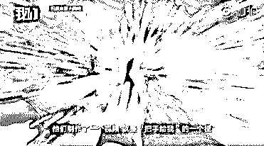
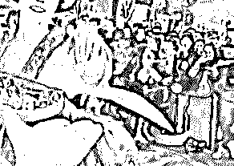
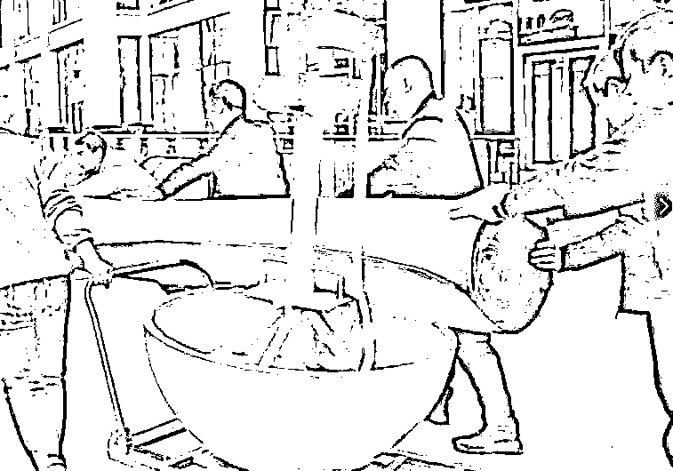

# 为什么小姐姐能摇一晚上不倒?

> 原文：[`mp.weixin.qq.com/s?__biz=MzAxNTc0Mjg0Mg==&mid=2653298169&idx=1&sn=a380bdff5dbbb8074c945ae7bb936698&chksm=802ddfecb75a56fa76bf7848e351d689b0063526c68104b5aac3f6bcc2833d2da16b1c4ebb8b&scene=27#wechat_redirect`](http://mp.weixin.qq.com/s?__biz=MzAxNTc0Mjg0Mg==&mid=2653298169&idx=1&sn=a380bdff5dbbb8074c945ae7bb936698&chksm=802ddfecb75a56fa76bf7848e351d689b0063526c68104b5aac3f6bcc2833d2da16b1c4ebb8b&scene=27#wechat_redirect)

**标星★****置顶****公众号     **爱你们♥   

**引言**

西安大唐不夜城“不倒翁”女孩街头表演的视频曾一夜走红网络。在大唐不夜城步行街，“不倒翁”小姐姐身姿轻盈眼神妩媚令人梦回大唐，一颦一笑将中国唐朝美人的妩媚娇羞演绎得淋漓尽致。

图 1\. 小姐姐成名作：把手给我

图 2\. 是不是也被这小眼神迷倒了

这勾人的小眼神，我觉得画面太美还能看 100 遍。尽管很美，但其实小姐姐表演得很辛苦。别只看到小姐姐在演出时体态轻盈、游刃有余，这背后可是下足了苦功夫。

图 3\. 带 T 型架的底座，重达 250 公斤^([1])

大唐不夜城的真人不倒翁演员都是经过层层选拔的，女性演员身高要在 163 厘米左右，体重不超过 50 公斤。扮演不倒翁的演员冯佳晨^([2])，今年 23 岁，身高 163 厘米，体重 45 公斤。虽有近 10 年的舞蹈功底，但这个表演刚开始的时候对她来说真的不容易。因表演需要将下半身完全固定在如图 3 所示的铁架子上，仅靠腰部发力运作不倒翁的底座，冯佳晨每天表演完，胯和膝盖都会被磨青^([3])。

不倒翁，是一种最常见的玩具。通常形状像一个蛋型、上轻而下重，扳倒后还能自动竖立起来。历史最早记载唐代的捕醉仙^([4])就是一种不倒翁。不倒翁不倒的原理并不难以理解：上轻下重的物体比较稳定，重心越低越稳定。当不倒翁在竖立状态处于平衡时，重心和接触点的距离最小，即重心最低。偏离平衡位置后，重心总是升高的。因此，这种状态的平衡是稳定平衡。所以不倒翁无论如何摇摆，总是不倒的。

图 4\. 不倒翁原理。左：不倒翁在竖立时重心最低；右：不倒翁偏离平衡位置后重心升高

**但不倒翁究竟是如何运动的呢？小姐姐又是如何操控不倒翁，让其自由的摇摆呢？** 本文将建立不倒翁小姐姐的数学模型，研究不倒翁的运动方程，并通过计算给出小姐姐摇晃的最佳策略。

## 模型

先不考虑小姐姐的主动发力和地面滚动阻力，建立一个简单的不倒翁模型。在此基础上，再建立一个考虑小姐姐的主动发力和地面滚动阻力的模型。

### 简单的不倒翁模型

我们把不倒翁简化为仅在二维平面（图 5 中的  平面）内运动的半球。半球和地面均为刚性，两者无滑移。如图 5 所示的半球，其质量为 ，质心为 ，半球球心为 。

图 5\. 半球的质心

容易求得半球质心位置  和对  轴的转动惯量^([5])

<mjx-container jax="SVG" display="true" role="presentation" tabindex="0" ctxtmenu_counter="11" style="overflow-x: auto;outline: 0px;display: block;text-align: center;margin: 15px 0px;" data-formula="h = \frac{3}{8}r,\quad I_c = \frac{83}{320} mr²"></mjx-container>

若该半球某时刻的位置如图 6 所示， 为半球重力，地面对半球的支撑力和摩擦力分别为  和 。

图 6\. 半球运动和受力分析图

为了确定运动方程，需要知道半球是如何运动的。我们用  与垂直方向的角度变量  来描述半球的状态。考虑点  和  的坐标

<mjx-container jax="SVG" display="true" role="presentation" tabindex="0" ctxtmenu_counter="12" style="overflow-x: auto;outline: 0px;display: block;text-align: center;margin: 15px 0px;" data-formula="\mathbf{x}_O  = \begin{pmatrix}
x \\
0
\end{pmatrix},\quad
\mathbf{x}_C = \mathbf{x}_O + h\cdot \begin{pmatrix}
\hphantom{-}\sin\theta \\
-\cos\theta\end{pmatrix}"></mjx-container>

因此，质心  的速度为

<mjx-container jax="SVG" display="true" role="presentation" tabindex="0" ctxtmenu_counter="13" style="overflow-x: auto;outline: 0px;display: block;text-align: center;margin: 15px 0px;" data-formula="\mathbf{v}_C = \frac{\mathrm{d} \mathbf{x}_C}{\mathrm{d}t} =
\begin{pmatrix}
\dot{x} \\
 0
\end{pmatrix}
+
h \dot{\theta} \cdot \begin{pmatrix}
\cos\theta \\
\sin\theta
\end{pmatrix}"></mjx-container>

其中  和  是  和  对时间的一阶导数。将  点速度对时间求导数，得到质心的加速度

<mjx-container jax="SVG" display="true" role="presentation" tabindex="0" ctxtmenu_counter="14" style="overflow-x: auto;outline: 0px;display: block;text-align: center;margin: 15px 0px;" data-formula="\mathbf{a}_C = \begin{pmatrix}
\ddot{x}          +  h\ddot{\theta} \cos\theta - h\dot{\theta}² \sin\theta \\
\hphantom{\ddot{x} +\,\,\,} h\ddot{\theta} \sin\theta + h\dot{\theta}² \cos\theta
\end{pmatrix}"></mjx-container>

现在让我们通过考虑作用在物体上的所有力来研究运动方程。运动方程不仅要考虑刚体的平动，还必须考虑到关于质心转动：

<mjx-container jax="SVG" display="true" role="presentation" tabindex="0" ctxtmenu_counter="15" style="overflow-x: auto;outline: 0px;display: block;text-align: center;margin: 15px 0px;" data-formula="\begin{aligned} \begin{pmatrix} F \\ N - m g \end{pmatrix} &amp; = m \mathbf{a}_C \\
 -(h\sin\theta) N + (r-h \cos\theta) F &amp; = I_C \ddot{\theta} \end{aligned}"></mjx-container>

有三个方程，却有四个未知数（，，，）。要求解这个问题，还需要一个描述接触条件的表达式。对于不倒翁，假设半球与地面接触点没有滑移，则有

<mjx-container jax="SVG" display="true" role="presentation" tabindex="0" ctxtmenu_counter="46" style="overflow-x: auto;outline: 0px;display: block;text-align: center;margin: 15px 0px;" data-formula="x = -\theta \cdot r
\quad\text{或}\quad
\ddot{x} = -\ddot{\theta} \cdot r"><svg xmlns="http://www.w3.org/2000/svg" width="26.539ex" height="2.67ex" role="img" focusable="false" viewBox="0 -980 11730 1180" aria-hidden="true" style="height: auto;max-width: 300% !important;"><g stroke="currentColor" fill="currentColor" stroke-width="0" transform="matrix(1 0 0 -1 0 0)"><g data-mml-node="math"><g data-mml-node="mtext" transform="translate(5326, 0)"><text data-variant="normal" transform="matrix(1 0 0 -1 0 0)" font-size="850.9px" font-family="serif">或</text></g></g></g></svg></mjx-container>

从而可得： <mjx-container jax="SVG" display="true" role="presentation" tabindex="0" ctxtmenu_counter="43" style="overflow-x: auto;outline: 0px;display: block;text-align: center;margin: 15px 0px;" data-formula="\ddot{\theta} = - \frac{h\,m\cdot (g+r \dot{\theta}²) \sin\theta}{I_C+m\cdot (r²+h²-2 h r \cos\theta)}"></mjx-container>上式微分方程也可由欧拉-拉格朗日方程^([6])导出，感兴趣的读者可自行尝试。上式微分方程可由 MATLAB 函数 ode45 函数给出数值解，并结合式  可完全确定不同时刻半球的位置和角度。计算结果如图 7 所示。

图 7A. 理想不倒翁模拟动画

图 7B. 角度 、角速度  和质心高度  随时间的变化。

模拟结果表明，如果地面没有滚动阻力（机械能守恒），不倒翁将不停的摇摆。角度  为 0 时速度，角速度  最大，重心  最低。

### 不倒翁小姐姐模型

在前文中，本文仅给出了一个不倒翁玩具在理想地面上的运动状态。而实际上不倒翁小姐姐的底座在摇晃的过程中是受到滚动阻力的，小姐姐的腰部在不停地扭动。为了了解小姐姐到底是如何将不倒翁摇晃起来的，接下来将建立一个考虑滚动阻力和小姐姐摇晃的模型。

根据网络上的视频和图片，假设整个不倒翁底座重  kg，是由质量为  kg，半径为  m，厚为  m 的铁制半球形圆壳和质量为  kg，半径为  的球缺（）配重以及支架（忽略支架的质量）组成。小姐姐身高  ，体重 。如图 8 左图所示。

图 8\. 不倒翁小姐姐模型图

实际摇晃过程中，小姐姐只能通过摇晃上半身带动底座摇晃。因此可将小姐姐简化为两个由铰链连接的圆柱（图 8 中图）。假设小姐姐的密度^([7])为 <mjx-container jax="SVG" role="presentation" tabindex="0" ctxtmenu_counter="88" style="" data-formula="\rho_s=10³\, \mathrm{kg/m³}"></mjx-container> ，则容易求得圆柱半径为  m。假设小姐姐腰以下长  m，腰以上长  m。小姐姐的腰部以下固定在 T 字型支架上，因此我们将小姐姐的下半身与底座看成一体（图 8 右图），质量为  kg，转动惯量为  。小姐姐上半身质量为  kg，转动惯量为  。

图 8 右图是对两部分的受力分析，将小姐姐上半身对下半身的作用力简化为力  和力偶矩 。在底座实际滚动过程中，由于地面和底座的变形，地面对底座的支撑力  的作用点并不在  点，偏离距离  可由滚动阻力系数给出。与**简单的不倒翁模型**类似，我们可以定义出 、、、 和  的坐标、速度和加速度，然后分别给出系统两部分的动力学方程，对于底座和小姐姐的下半身组成的整体有 <mjx-container jax="SVG" display="true" role="presentation" tabindex="0" ctxtmenu_counter="21" style="overflow-x: auto;outline: 0px;display: block;text-align: center;margin: 15px 0px;" data-formula="\begin{aligned} \begin{pmatrix} F-F_x \\ N -F_y- m_1 g \end{pmatrix} &amp; = m_1 \mathbf{a}_C \\
-(h\sin\theta+d) N + (r-h \cos\theta) F +M &amp; = I_1 \ddot{\theta}
\end{aligned}"></mjx-container> 对于小姐姐的上半身有 <mjx-container jax="SVG" display="true" role="presentation" tabindex="0" ctxtmenu_counter="26" style="overflow-x: auto;outline: 0px;display: block;text-align: center;margin: 15px 0px;" data-formula="\begin{aligned} \begin{pmatrix}
F_x \\
F_y- m_2 g
\end{pmatrix}
&amp; = m_2 \mathbf{a}_E
\\
l\cos(\theta+\beta) F_x + l\sin(\theta+\beta) F_y - M &amp; = I_2 (\ddot{\theta}+\ddot{\beta})
\end{aligned}"></mjx-container>根据以上六式以及  可以求解出 ，由于表达式比较复杂，这里不再列出。小姐姐可以通过  来控制 ，即小姐姐可以通过摇晃上半身来使整个不倒翁底座摇晃起来。假设小姐姐摇晃的  随时间的变化满足： <mjx-container jax="SVG" display="true" role="presentation" tabindex="0" ctxtmenu_counter="33" style="overflow-x: auto;outline: 0px;display: block;text-align: center;margin: 15px 0px;" data-formula="\beta(t) = A_\mathrm{mp} \sin\left(\frac{2\pi}{T}\right)"></mjx-container>其中  为摇晃幅度， 为摇晃周期。

## 求解

经过我们的分析，终于得到了小姐姐的摇晃方程。可有人说看不懂方程，也不想看方程，就要看小姐姐摇。没办法，为了满足读者的要求，我们只好写段 MATLAB 程序模拟一下。不倒翁底座的摇晃方程可以由 ode45 函数直接求解，但为了加快程序运行速度并实时显示，使用了 Euler 法求解，时间步长取  s。模拟的主要步骤如下：

*   根据时间确定上半身相对于底座的角度 、角速度  和角加速度 
*   根据角速度更新角度：
*   根据角加速度更新角速度：，其中角加速度  由运动方程给出。
*   确定底座球心  的水平位置：。
*   根据底座球心  的水平位置，以及底座的转动角度，确定半圆位置。
*   更新时间步 。如果  s，结束；否则跳到第 1 步。

为了模拟的视觉效果，我们还需要动态展示出结果。为此专门写了一个函数用来画底座半圆和性感的小姐姐。绘制结果如图 9 所示。很多人看了我画的小姐姐，表示震惊：实在是太像了，将小姐姐妙曼的身姿展现得淋漓尽致，这大长腿，这伸出的纤纤玉手。

图 9\. 小姐姐和半个球，我画的小姐姐是不是很性感！

根据运动方程，算出某时刻半圆心的位移以及角度后，需要对半圆和小姐姐进行平移和旋转，平移容易。旋转可根据以下公式进行： <mjx-container jax="SVG" display="true" role="presentation" tabindex="0" ctxtmenu_counter="38" style="overflow-x: auto;outline: 0px;display: block;text-align: center;margin: 15px 0px;" data-formula="\begin{align*}
x&amp; = (x_0-x_\mathrm{c})\cdot\cos\theta - (y_0-y_\mathrm{c})\cdot\sin\theta + x_\mathrm{c}\\
y&amp; = (x_0-x_\mathrm{c})\cdot\sin\theta + (y_0-y_\mathrm{c})\cdot\cos\theta + y_\mathrm{c}
\end{align*}"></mjx-container>以上公式将点  绕  旋转  角。将以上公式写成 MATLAB 函数 rotxy。

## 结果

为了研究小姐姐究竟是如何通过摆动上半身将底座摇晃起来的。我们研究了不同情况下，底座摇晃的规律。

若小姐姐不摇晃，即摇晃幅度，并且没有滚动阻力，即，则模型退化为**简单的不倒翁模型**，对于，结果如图 10 所示。

图 10A. 没有滚动阻力，小姐姐不摇的模拟动画

图 10B. 没有滚动阻力，小姐姐不摇时角度和腰部受力变化

结果表明，即使小姐姐不摇晃，小姐姐的腰也受到周期性的作用力。若加入滚动阻力的考虑并假设 ，则结果如图 11 所示。

图 11A. 有滚动阻力，小姐姐不摇的模拟动画

图 11B. 有滚动阻力，小姐姐不摇时角度和腰部受力变化

结果表明，在滚动阻力的作用下，不倒翁底座会逐渐停止摇晃。也就是说，在实际情况中，想要保持不倒翁底座的摇晃，小姐姐必须持续不断的摇晃身体。

接下来我们讨论小姐姐摇晃身体的周期对不倒翁底座运动的影响。假设小姐姐摇晃身体的幅度 。研究表明，小姐姐身体的摇晃与不倒翁底座的摇晃之间会产生共振效应，当小姐姐摇晃身体的周期  s 时，不倒翁底座摇晃的幅度最大，结果如图 12 所示。

图 12A. 小姐姐摇晃周期为 2.18 s 的模拟动画

图 12B. 小姐姐摇晃周期为 2.18 s 时角度和腰部受力变化

而更小的周期（如  s，结果见图 13）或更大的周期（如  s，结果见图 14）都不能让不倒翁底座大幅度地摇晃。

图 13A. 小姐姐摇晃周期为 1 s 的模拟动画

图 13B. 小姐姐摇晃周期为 1 s 时角度和腰部受力变化

图 14A. 小姐姐摇晃周期为 3 s 的模拟动画

图 14B. 小姐姐摇晃周期为 3 s 时角度和腰部受力变化

## 结论

*   通过运动和受力分析可以求解出不倒翁小姐姐的运动方程，并可以确定出小姐姐与底座发生共振的最佳摇晃周期。
*   小姐姐能大幅度摇晃的最佳周期为 2.2 s 左右。若小姐姐照此周期不停的摇，一小时大约要晃 <mjx-container jax="SVG" role="presentation" tabindex="0" ctxtmenu_counter="115" style="" data-formula="3600/2.2\approx 1636"></mjx-container> 下。
*   在本文的最佳周期模拟中，小姐姐晃动幅度约为 <mjx-container jax="SVG" role="presentation" tabindex="0" ctxtmenu_counter="16" style="" data-formula="40^\circ"></mjx-container> ，这相当于要晃出 1 m 左右的距离，一个周期内腰移动的距离约为 4 m。小姐姐腰间平均水平发力在 130 N 左右。因此一个周期小姐姐做功约 520 J，摇 1 小时做功约 850 kJ。因为仅考虑了水平方向的力，实际上这低估了小姐姐实际做功。
*   根据上面两条结论，可知“不倒翁”小姐姐摇一晚上真的很累，为“不倒翁”小姐姐点赞！
*   听说不少群众模仿“不倒翁”小姐姐并闪了腰，请大家小心模仿。此外，骨科专家也告诫大家谨慎模仿。

## 附录

点击文章左下角“**阅读原文**”获取本文 PDF 版和附件。

### 参考资料

[1]

曲江新区，不倒翁小姐姐的秘密终于藏不住了: *https://kuaibao.qq.com/s/XAC2019112600405400?refer=spider* [2]

百度百科，冯佳晨: *https://baike.baidu.com/item/冯佳晨/24144236* [3]

南京晨报，西安“不倒翁”女孩的表演走红网络，大家都想牵她的手！: *https://new.qq.com/omn/20191117/20191117A03D2I00.html* [4]

Roly-poly toy --- Wikipedia, The Free Encyclopedia: *https://en.wikipedia.org/wiki/Roly-poly_toy* [5]

Mass moment of inertia of a hemisphere: *https://blitiri.blogspot.com/2014/05/mass-moment-of-inertia-of-hemisphere.html* [6]

Euler–Lagrange equation --- Wikipedia, The Free Encyclopedia: *https://en.wikipedia.org/wiki/Euler-Lagrange_equation* [7]

Body composition during growth in children: limitations and perspectives of bioelectrical impedance analysis: *https://www.ncbi.nlm.nih.gov/pubmed/26039314* 

* * *

2020 年第 87 篇文章

量化投资与机器学习微信公众号，是业内垂直于**Quant、MFE、Fintech、AI、ML**等领域的**量化类主流自媒体。**公众号拥有来自**公募、私募、券商、期货、银行、保险资管、海外**等众多圈内**18W+**关注者。每日发布行业前沿研究成果和最新量化资讯。

你点的每个“在看”，都是对我们最大的鼓励