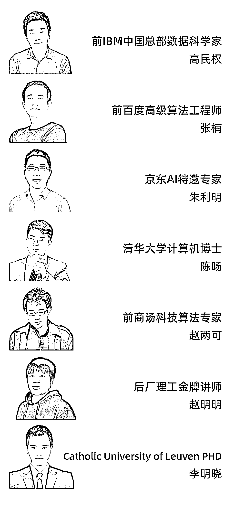

# 涨知识 | 如何像大学蹭课一样蹭个 AI 课？

> 原文：[`mp.weixin.qq.com/s?__biz=MzAxNTc0Mjg0Mg==&mid=2653298164&idx=1&sn=96fa539910a22da264c44df180c934cf&chksm=802ddfe1b75a56f7580168f3525e3aa63fa75b7c5aae1cc8d76299b6f4cb74388e4047cf8015&scene=27#wechat_redirect`](http://mp.weixin.qq.com/s?__biz=MzAxNTc0Mjg0Mg==&mid=2653298164&idx=1&sn=96fa539910a22da264c44df180c934cf&chksm=802ddfe1b75a56f7580168f3525e3aa63fa75b7c5aae1cc8d76299b6f4cb74388e4047cf8015&scene=27#wechat_redirect)

2020 年，是多灾多难的一年，由于疫情的影响，导致部分企业加剧了降薪、裁员的步伐，而停滞不前、不学习的人终将会被淘汰。

目前，就连研究生想要找到一份高薪的工作，也是十分具有挑战的。

后厂理工学院一直致力于提升互联网人的发展，作为一家有责任感的教育公司，为了帮助职场人顺利度过这场难关。我们为优秀人才推出一项福利计划。

*人间自有真情在；*

*宜将寸心报春晖。*

这项福利计划就是专为职场人特别推出——**《战疫培优奖学金计划》。每学一节课都有奖学金，上一节课，返一节学费，我们为你的梦想买单！**

**活动详情**

**活动规则：**学员只要认真上课，**完成课程进度**，准时**提交课后作业**，即可获得当节课的**学费返还奖励**（按月度发放）。**需要申请，名额有限，先到先得。**

后厂理工学院是慧科教育科技集团有限公司旗下一所创新实战大学。旨在帮助在职人员，在**4-6 个月内**找到一份人工智能、机器学习、深度学习、数据科学家、算法工程师等岗位，**拿到年薪 30 万+的 offer。**

我们培养的学员，遍布于全世界各大厂、科技公司。目前培养的学员中，**80%**的同学拿到了**高薪 offer**，其中不乏国内外知名企业的算法岗位或者国外名校的 AI Phd，Master 的 offer。

**部分学员涨薪情况**

**注：为保护学员个人隐私，隐去学员姓名，信息若有虚假，我们愿承担法律责任**

后厂理工学院为了锻造 AI 人才，研发人工智能课程，**培养上百名优秀的算法工程师，**不少人现在成为 BAT 等算法 leader。

那么，**如何才能获取战疫培优奖学金计划的资格呢？**请微信扫码咨询教务老师。

长按扫码添加

👇👇👇

咨询返奖学金学 AI 详情

对于 AI 的学习，单纯的理论知识是不够的，在成为 AI 工程师之前，必须经过**大量的项目实践，****参加后厂理工学员的这项培养计划，你将有以下收获：**

1、你的简历上会多一些大厂认可、含金量高的名企实训项目；

2、获得 OMO 社群进入资格，高端 AI 同窗校友人脉社区，结识 AI 大咖；

3、一线大厂名师亲自带你完成项目，并且建立深厚友谊；

4、“陪伴式”教学，助教、班主任全程贴心辅导，完成课程进度+准时提交作业；

5、大厂绿色通道和内推服务，帮你敲开互联网名企大门，让你在就业环境如此严峻的情况下依然拿到 30 万+高薪 offer。

**收获一：9 大名企项目实训，**

**打造高端 AI 精品课程**

后厂理工学院的项目都是结合真实大厂企业需求，设计研发前沿工程项目，**企业一线开发岗位的师父亲自带领你真实参与项目的每一个流程，完成项目落地。**

课程组负责为大家提供数据集、项目指导。参与这类项目一方面可以让大家巩固理论知识，另一方面也是大家可以放进简历中极具含金量的项目经历。

**我们将教会你：**

*   搭建三大主流学习框架

*   深入了解算法模型原理

*   提升 AI 模型落地、部署、优化经验

*   掌握大规模数据机器学习数据流处理实战经验

*   解决企业级应用问题

并且，我们推出了**《战疫培优奖学金计划》。每学一节课都有奖学金，上一节课，返一节学费，我们为你的梦想买单！**

**收获二：打造 OMO 高端 AI 社群**

**线下沙龙+大咖面对面**

线上涨知识、线下提升社交圈。后厂理工学院除了拥有**高端 AI 同窗校友人脉社区**，我们还定期**邀请 AI 领域名咖**举办线下交流会。在这里认识的 AI 大咖，将是你一生受用不尽的资源。

我们的**学员 50%**来自 985、211，并且有**10%**的学员**来自海外知名院校**。参加活动不仅可以使学员结交高端人脉，而且还有与**P8、P9、T7**技术大咖面对面交流。（小编偷偷告诉你：还有机会添加老师微信，进行技术交流噢~）

**收获三：全球大厂一线核心项目专家**

**数年深耕人工智能行业**

后厂理工学院是慧科集团旗下平台，我们的老师均来自国际名校**（清华大学、佛罗里达大学、浙江大学）**且均具备世界知名企业**（阿里巴巴、商汤科技、IBM 中国实验室）**的实际工作经验。真实大厂一线名师，老师**亲自带你完成项目**，聚焦每一位用户的学习与成长。

**收获四：“陪伴式”教学**

**N 对 1 全程贴心辅导**

后厂理工学院每周都会给学员留项目和作业，以便于学员巩固练习，每周都能获得实战收获，最终完成一个**惊艳面试官的落地项目。**

不仅如此，**完成课程进度+准时提交作业****，就可以收到返还的学费。享受高端学习服务。**

授课老师、助教老师、班主任老师多对一服务。从课上到课下，**从专业辅导到日常督学、甚至生活建议，360 度无死角为学员安心学习铺平道路。**陪伴式解答学员疑惑，为学员保驾护航。

后厂理工学院还为学员准备了线上招聘会，企业双选会**，模拟面试+笔试训练**，只为让学员顺利进入心仪的企业。

**收获五：大厂绿色通道+**

**内推服务+猎聘服务**

后厂理工学院与大厂有深度的合作，旨在为各大厂 AI 在各种实践领域的应用积累和挑选一批宝贵的实践性人才。不仅如此，在后厂理工学院学习的学员，可以免去我们合作的生态企业筛选面试。

**选择我们，你就已经打败了 90%的面试者**

后厂理工学院与**Boss 直聘、拉勾网、智联招聘**等多家就业招聘企业达成合作，为学员提供优先推荐服务。

不仅如此，**后厂理工学院郑重承诺承诺，正式开课前 3 节课接受无条件退款。按照要求完课后，退还全部学费。**

**我们为何推出《战疫培优奖学金计划》？**

后厂理工学院坚信 AI 改变世界，科技改变教育，当我们用优质的教育资源连接每一个有潜力的 AI 人才，就会爆发巨大的能量。

疫情期间，无数人失业（待业）在家，我们深知，每一笔教育投入都会成为巨大的负担。

为了让大家能够放心坚持学习，真正的学有所成，我们特此推出了“**战疫培优奖学金计划**”，**上一节课，返一节课学费**，让每个人都能接受到优质前沿的 AI 教育资源，让人才腾飞，助力国家发展，共战疫情。

**根据学员的不同需求，分为两个班型：**

*   核心能力提升班：**7800 元**

    **（战疫培优奖学金计划：加 6000 元即可申请）**

*   导师制名企实训班：**23800 元（签订无 offer/年薪达不到 23.5 万退款保障协议）**

    **（战疫培优奖学金计划：加 2000 元即可申请）**

注：参加战疫培优奖学金返学费计划的学员，不再享受奖学金、分期、保 offer 等优惠政策。

想要具体了解**《战疫培优奖学金计划》**课程申请规则，你可以扫码添加教务老师微信，进行咨询。

长按扫码添加

**申请返奖学金 AI 名额**

抓紧时间

👇👇👇

分享福利，邀请小伙伴一起来学

PS：报名本次培训课程，需要完成入学测试题，并且原则上具备本科及以上学历。报名导师制名企实训班型的同学，如没有通过入学测试题的话，必须参加我们的零基础课程，否则不保 offer。报名战疫培优奖学金计划班型的，需要进行申请才可入学。