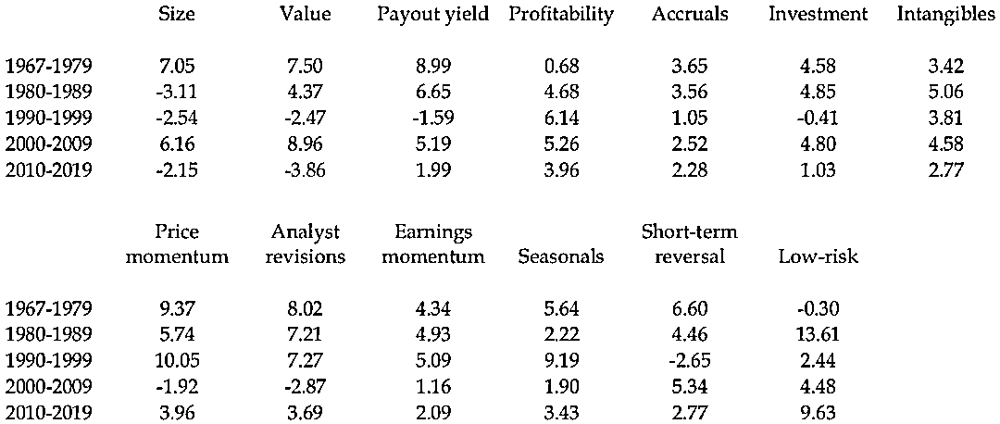

# 2010-2019：因子投资十年回顾，谁将笑到最后？

> 原文：[`mp.weixin.qq.com/s?__biz=MzAxNTc0Mjg0Mg==&mid=2653298153&idx=1&sn=2948e40dcfcc4ed66b3eb6a5a0524e00&chksm=802ddffcb75a56ea97cca79077ceb592aa14328786e083b11e558d9d9fd261b18ef6a7bda3de&scene=27#wechat_redirect`](http://mp.weixin.qq.com/s?__biz=MzAxNTc0Mjg0Mg==&mid=2653298153&idx=1&sn=2948e40dcfcc4ed66b3eb6a5a0524e00&chksm=802ddffcb75a56ea97cca79077ceb592aa14328786e083b11e558d9d9fd261b18ef6a7bda3de&scene=27#wechat_redirect)

**标星★****置顶****公众号     **爱你们♥   

作者：David Blitz | Robeco 量化研究主管

编译：圆的馒头

***1***

**前言**

在 2010-2019 年期间，广泛使用的 Fama-French 模型中的因子的平均收益率为负值。也许令人惊讶的是，这样一个失落的十年在历史上并非没无先例，因为 2010 年的因子表现实际上与 20 世纪 90 年代的因子表现非常相似。相比之下，在过去的十年里，许多其他因子确实带来了正溢价。这些因子包括**低风险、价格动量、盈利动量、分析师修正、季节性和短期反转**。因此，在最近的因子表现方面似乎存在明显的二分法：**虽然普遍接受的因子在挣扎，但被认为是次等或多余的各种因子仍然有效。****总之，2010-2019 这十年就像是 2000-2009 十年的镜像，在这十年里，Fama-French 因子表现异常强劲，其它大多数因子也紧随其后。**

***2***

**Fama-French 因子的表现**

资产定价文献深受 Eugene Fama 和 Kenneth French 教授工作的影响。在 1993 年，Fama 和 French 提出了一个三因子模型，该模型扩展了经典的带有规模（SMB）和价值（HML）因子的资本资产定价模型。2015 年，Fama 和 French 将他们广泛使用的三因子模型与盈利能力（RMW）和投资（CMA）因子相结合，形成了一个自此成为新学术标准的五因子模型。这些因子的回归系列可在 Kenneth 数据库中获得。

图 1 比较了 2010 年前后 Fama-French 因子的表现。在最近的 2010-2019 十年间，Fama-French 因子的收益率都远低于其长期平均水平。规模和价值因子甚至经历了一个消极的十年，价值因子的收益特别差。Arnott、Harvey、Kalesnik、Linnainmaa（2020 年）以及 Famaand 和 French（2020 年）提出了价值溢价可能已经永久消失的日益严重的担忧。他们的结论是：**尽管最近的价值因子表现的确很糟糕，但仍然在统计学上可以预期的变化范围之内。**

图 1：Fama-French 因子的表现

然而，困难的不仅仅是规模和价值因子。在过去的十年中，投资因子的溢价也未能实现，收益率接近于零。只有盈利因子产生了正收益，但这一溢价的幅度仅为 2010 年前水平的一半左右。这两个新增因子的弱表现尤其引人注目，因为它们是在 Fama 和 French（2015 年）的研究中引入的，该研究使用了截止 2013 年底的数据。换句话说，对于这两个新因子来说，最近的十年实际上仍然是部分（40%）的抽样期。尽管领先一步，但这两个新的因子并没有带来强劲的十年。这补充了 Linnainmaa 和 Roberts（2018 年）以及 Wahal（2019 年）的证据，他们发现在 Fama 和 French（2015 年）样本之前的 1963 年前期间，盈利能力和投资因子在样本外表现不佳。

在 2010-2019 年期间，Fama-French 四个因子的平均溢价为-0.28%，相比之下，1963-2009 年期间为 3.95%。在测试中我们发现这并不是因为这些因子之间的相关性增加了，因为 2010 年后的相关性实际上与 2010 年前的相关性非常相似（平均接近于零）。有人可能会认为，这些被广泛接受的因子的集体失败在历史上肯定是独一无二的，但是，如果按照表 1 中的十年数据来检查，就会发现事实并非如此。事实上，**2010 年至 2019 年的十年与 1990 年至 1999 年的十年非常相似**，因为也是在那个十年：

1、规模溢价为负数 2、价值溢价为负数 3、投资溢价接近零 4、盈利溢价为正数，但远低于长期平均水平

结果，这四个因子加在一起，也未能在那十年里带来正收益。

表 1：Fama-French 因子的表现

这并不是 2010-2019 年和 1990-1999 年这两个十年之间相似之处的终结，因为这两个十年恰好也是市场因子导致超额收益率达到两位数的唯一 20 年。相反，在 2000-2009 年和 1970-1979 年这两个未能实现市场溢价的二十年期间，因子溢价也是最高的。因此，**长期市场收益与因子溢价之间似乎存在反比关系**。当然，我们不能排除被随机性所愚弄的可能性，因为这些推论仅仅基于六个独立的十年观察，但结果仍然很有趣。

仅有 6 个独立的十年数据，也意味着很难可靠地评估 Fama-French 因子在 10 年期间出现负平均表现的可能性。根据 2010 年以前的数据，日历上的十年意味着概率为五分之一，如果把最近十年的数据包括在内，这一概率将上升到六分之二。然而，根据 Fama-French 因子滚动 10 年平均收益率，这一概率仅为 1.6%。因此，尽管日历十年（xyz0 到 xyz9）是独立十年观测的自然选择，但它们似乎夸大了 Fama-French 因子完全失落的十年的可能性。

***3***

****Kenneth French 中其他因子的表现****

Kenneth French 还跟踪了 Fama-French 五因子模型中未包括的一些因子的表现。其中一些是使用与价值、盈利能力和投资因子相同的 2x3 类型构建的。这意味着，价值加权的顶部 30%减底部 30%的投资组合是分别在大盘股和小盘股部分创建，然后取这两个多头-空头期投资组合 50%的平均值。对于其他因子，只有基于全域的价值加权分位数投资组合可用。对于这些因子，我们用前三个十分位数的平均值减去后三个十分位数的平均值，来创建前 30%减后 30%的投资组合。由于小盘股的因子溢价空间往往比大盘股的要高，不给予小盘股 50%的权重通常会导致对因子溢价作出更为保守的估计。

2x3 分类可用的因子有三种可供选择的价值指标（盈利对价格、现金流对价格、股息收益率）、动量（12-1 个月）和短期反转（1 个月）。其他因子包括可供选择投资因子（净股票发行）、应计利润（营运资本账面价值的变化）和三个低风险因子（60 个月市场贝塔系数、60 天方差和 60 天残差）。我们使风险因子贝塔中性通过杠杆化长期低风险和杠杆化短期高风险到正好为 1 的市场贝塔。为了简单起见，我们使用全样本数据（遵循 Blitz、vanVliet 和 Baltussen，2020 年），而不是像 Frazzini 和 Pedersen（2014 年）那样动态地完成这项工作。

图 2 和表 2 报告了这些因子的表现。在过去的十年中，这三个可供选择的价值指标都有负收益，类似于 HML 价值因子。另类投资因子，即净股票发行，也以负值告终。应计系数表现较好，2010-2019 年期间的收益率为 3.5%，甚至略高于 2010 年前期间的收益率。Fama 和 French（2016 年）发现，他们的五因子模型难以解释应计项目投资组合的表现，而 2010-2019 年期间的情况表明，当 Fama-French 因子陷入困境时，应计项目因子的表现确实不错。

图 2：KennethFrench 数据库中其他可用因子的表现

表 2：Kenneth French 中其他可用因子的执行情况

接下来我们将讨论**动量因子**，它经常被用来扩充 Fama-French 因子模型，例如将五因子模型转化为六因子模型。2009 年的动量收益率为-82%，导致 2000-2009 年期间成为动量因子失落的十年。这甚至导致了这个因子的存在性受到质疑，例如 Bhattacharya，Li 和 Sonaer（2017 年）根据 2012 年以前的数据，观察到“动量利润自 20 世纪 90 年代末以来变得微不足道”。在 2010-2019 年期间，我们观察到动量因子的平均溢价约为 3.5%，尽管低于其长期平均水平，但仍在正值区间内。因此，抛弃动量因子似乎为时过早。有趣的是，动量因子在另一个十年表现良好，这对于 1990-1999 年的 Fama-French 因子来说是很困难的。**事实上，这是动量最好的十年。**

在过去十年中，短期反转因子的实际收益率约为 3.5%，与动量因子类似，低于长期平均水平，但远高于零。然而，图 2 和表 2 中最值得注意的是三个低风险因子，在 2010-2019 年期间表现出约为 6-10%的溢价。这使其成为有史以来风险较低的第二个十年，只有 1980-1989 年的十年更为强劲。Fama 和 French（2016 年）认为，**低风险异常现象包含在他们的五因子模型中，但最近 10 年的研究表明，当 Fama-French 因子未能发挥作用时，低风险因子可以发挥作用。**

总之，Kenneth French 中与五因子模型中的因子密切相关的因子与该模型中的因子一样艰难，而 Kenneth French 中所有其他根本不同的因子都有可观的正收益，在低风险因素的情况下，甚至有很大的收益。和以前一样，与过去几十年的相似之处是惊人的。2010 年至 2019 年的“失落的十年”就像是 2000 年至 2009 年期间的镜像，在此期间，Fama-French 因子有着异常强劲的表现，而其他大部分因子也紧随其后，就像 1990-1999 年期间的重演，Fama-French 因子也未能发挥作用，而其他因子则占据了上风。

***4***

****Fama-French-Carhart 因子的国际表现****

Kenneth French 还提供了五因子模型的国际版本以及动量因子的数据。从 1990 年 7 月开始，这些数据的历史较短。图 3 显示了 2010-2019 年与 1990-2009 年全球除美国因子的表现，表 3 报告了这些因子按十年分列的表现。除美国以外的全球表现在许多方面与美国相似。就规模因子而言，我们观察到的长期表现要弱得多，但 2010-2019 年的表现仍略显积极。与美国一样，**价值因子在过去十年中的收益率为负值。投资因子接近于零**，也与美国一样。

图 3：Fama-French-Carhart 因子在除美国以外全球的表现

表 3：Fama-French-Carhart 因子在美国以外全球的表现

对于美国，我们观察到**盈利因子是 2010 年后仍然有效的五因子模型（除了市场因子）中的唯一因子**，尽管与 2010 年前相比，表现下降了约 50%。对于除美国以外的全球市场，我们还发现，盈利因子是 2010 年后唯一仍然有效的 Fama-French 因子。我们甚至发现，除美国以外的全球市场的表现丝毫没有下滑，因为 2010 年前和 2010 年后的盈利因子表现几乎完全相同。综合来看，Fama-French 因子的国际版本在过去十年里下降了大约三分之二的表现，但仍保持在积极的水平。

除美国以外的全球结果与美国结果最后的相似之处是动量因子。在美国，这一因子在 2010 年后仍然有效，我们观察到全球（不包括美国）的情况也是如此。事实上，就像盈利因子一样，我们观察到，与 2010 年前的表现相比，除美国以外的全球动量因子的表现丝毫没有下降。

***5***

****Hou-Xue-Zhang 因子的表现****

Fama-french 五因子模型的主要竞争者之一是 Hou-Xue-Zhang（2015 年）的四因子模型，也被称为 q 因子模型。这个模型包含了与 Fama-French 模型相似（但不完全相同）的市场和规模因子、一个投资因子和一个股本收益率因子。HXZ 因子的数据也是公开的。图 4 和表 4 报告了这些因子的表现。

图 4：Hou-Xue-Zhang 因子的表现

表 4：Hou-Xue-Zhang 因子的表现

HXZ 的规模因子显示了过去十年的负收益，类似于 Fama-French 的规模因子（SMB）。这并不奇怪，因为这两个序列非常相似，相关系数为 0.97。在过去十年中，HXZ 投资因子的收益率接近于零，类似于 Fama-French 投资因子（CMA）。这一点也不奇怪，因为这两个系列也是高度相关的，相关系数为 0.91。只有 HXZ 的股本收益率显示为正收益率，尽管这一收益率约为 3%，不到 2010 年以前水平的一半。这也与之前的研究结果一致，因为 HXZ 的股本收益率因子与 Fama-French 的盈利能力因子（RMW）和动量因子（WML）相关，相关系数分别为 0.67 和 0.49。对于这些因子，我们还观察到，2010 年后的收益率为正值，但低于 2010 年前的水平。**股本收益率因子和动量的相关性已经被 Novy-Marx（2015 年）证实，他发现这个因子完全依赖于最近公布的季度收益，从而捕捉公司基本面的动量，在收益惊喜之后，季度收益往往很高。**

除了 q 因子之外，HXZ 数据库还包含来自 Hou、Xue 和 Zhang（2019 年）论文的大约五十个单因子的价值加权十分位数投资组合。由于大多数这些因子早在 2010 年之前就已记录在案，过去十年也构成了这些因子的抽样范围之外时期。按照与之前相同的方法，我们将前三个十分位数的平均值减去后三个十分位数的平均值，从而将这些数据转化为因子收益系列。我们将密切相关的因子通过平均收益率组合成综合因子，使因子的数量减少到 13 个。例如，HXZ 数据库包含五个独立的季节因子，我们将它们组合成一个复合季节因子。图 5 和表 5 报告了这些因子的表现。

图 5：Hou-Xue-Zhang 数据库中其他可用因子的性表现

表 5：Hou-Xue-Zhang 数据库中其他可用因子的表现

规模：ME；价值：BM，Rev_12，EP，CP，EM，SP，OCP；股息收益率：OP，NOP；盈利能力：OPE，OPA，COP；应计利润率：OA，TA，DA，POA；投资：IA，dPIA，NOA，dNOA，IG，NSI，CEI；无形资产：OCA，ADM，RDM，RER；价格动量：R6_6，R11_1；分析师修：RE_1，RE_6；盈利动量：Abr_1，Abr_6，ROE_1，ROE_6，dROE_1，dROE_6，SUE_1，SUE_6；季节性：r1a，r5a，r10a，r15a，r20a；短期反转：SRev；波动性：IVFF_1，TV_1，beta_1。

与我们在前面的发现一致，**规模和价值的综合因子在最近十年呈现负溢价**。然而，值得注意的是，其他 11 个**综合因子在 2010-2019 年间都呈现出正收益**：**股息收益率、盈利能力、应计利润、投资、无形资产、价格动量、分析师修正、盈利动量、季节性、短期反转和低风险。**对于盈利能力、价格动量、短期反转和低风险来说，这与我们对 Kenneth French 版本这些因子的早期结果是一致的。对于其他因子，这是一个额外的见解。主要的教训是，**尽管 Fama-French 因子经历了一个失落的十年，但 Fama-French 并不认可的许多因子实际上有一个不错的十年，在某些情况下甚至是一个非常好的十年。**

***6***

**总结**

只有时间才能证明，Fama-French 因子能否在未来 10 年再次卷土重来。与此同时，它们近期的疲弱表现将对资产定价研究产生影响。首先，五因子模型通常很难解释 2010-2019 年期间资本资产定价模型（CAPM）的强劲表现，因为如果 Fama-French 因子本身没有溢价，那么 Fama-French 因子的正面负荷将无助于解释收益。我们的研究结果还质疑了传统资产定价文献的愿景，即将整个“因子动物园”（即数百个所谓的因子）缩减为只有少数几个因子，而这些因子应该能够解释整个股票收益的横截面。**尽管 Fama-French 因子仍具有强劲的长期表现，但迄今为止，它们已经经历了两个失落的十年**，在此期间，各种其它因子都能够发挥作用。因此，似乎需要更多的因子来准确和全面地描述股票收益的横截面。

### 参考资料

*   Arnott, Robert D., Campbell R. Harvey, Vitali Kalesnik, and Juhani T. Linnainmaa. 2020\. “Reports of Value’s Death May Be Greatly Exaggerated.” SSRN working paper, no. 3488748.

*   Bhattacharya, Debarati, Wei-Hsien Li, and Gokhan Sonaer. 2017\. “Has Momentum Lost its Momentum?”Review of Quantitative Finance and Accounting, vol. 48, no. 1: 191-218.

*   Fama, Eugene F., and Kenneth R. French. 1992\. “The Cross‐Section of Expected Stock Returns.”Journal of Finance, vol. 47, no. 2 (April): 427-465.

*   Fama, Eugene F., and Kenneth R. French. 1993\. “Common Risk Factors in the Returns on Stocks and Bonds.” Journal of Financial Economics, vol. 33, no. 1 (February): 3–56.

*   Fama, Eugene F., and Kenneth R. French. 2015\. “A Five-Factor Asset Pricing Model.” Journal of Financial Economics, vol. 116, no. 1 (April): 1–22.

*   Fama, Eugene F., and Kenneth R. French. 2016\. “Dissecting Anomalies with a Five-Factor Model.”Review of Financial Studies, vol. 29, no. 1 (January): 69-103.

*   Fama, Eugene F. and French, Kenneth R. 2020 “The Value Premium.” SSRN working paper, no.3525096.

*   Hou, Kewei, Chen Xue, and Lu Zhang. 2015\. “Digesting Anomalies: An Investment Approach.”Review of Financial Studies, vol 28, no. 3 (March): 650-705.

*   Hou, Kewei, Chen Xue, and Lu Zhang. 2019\. “Replicating Anomalies.” Review of Financial Studies(forthcoming).Linnainmaa, Juhani T., and Michael R. Roberts. 2018\. “The History of the Cross-Section of StockReturns.” Review of Financial Studies, vol. 31, no. 7 (July): 2606-2649.

*   Novy-Marx, Robert. 2015\. “How Can a Q-Theoretic Model Price Momentum?” SSRN working paper, no. 2572144.

*   Wahal, S. 2019\. “The Profitability and Investment Premium: Pre-1963 Evidence.” Journal of Financial Economics, vol. 131, no. 2 (February): 362-377.

2020 年第 86 篇文章

量化投资与机器学习微信公众号，是业内垂直于**Quant、MFE、Fintech、AI、ML**等领域的**量化类主流自媒体。**公众号拥有来自**公募、私募、券商、期货、银行、保险资管、海外**等众多圈内**18W+**关注者。每日发布行业前沿研究成果和最新量化资讯。

你点的每个“在看”，都是对我们最大的鼓励