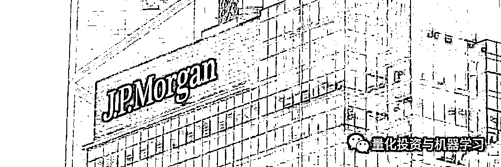
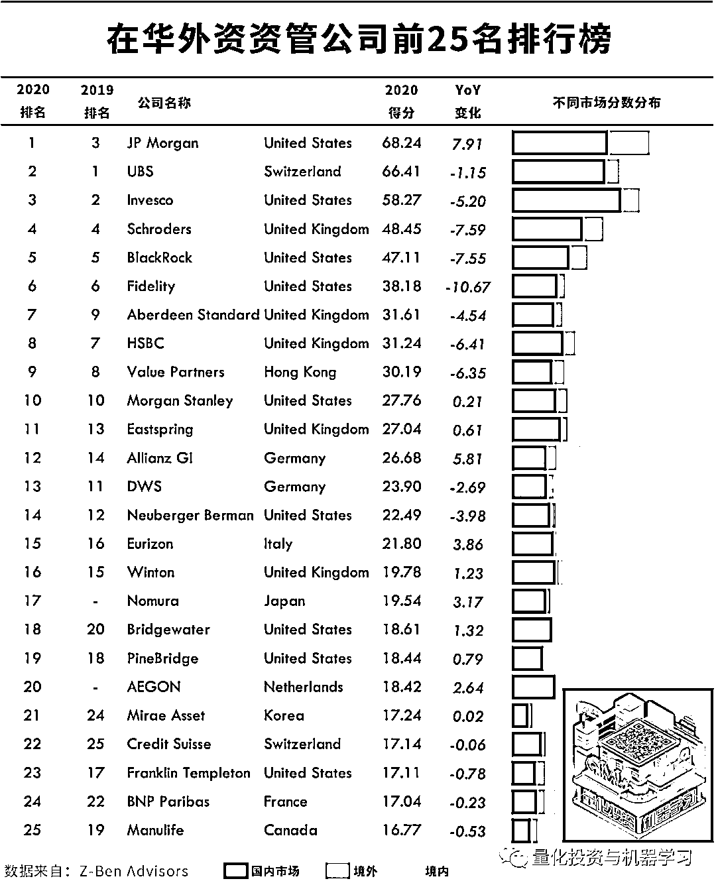
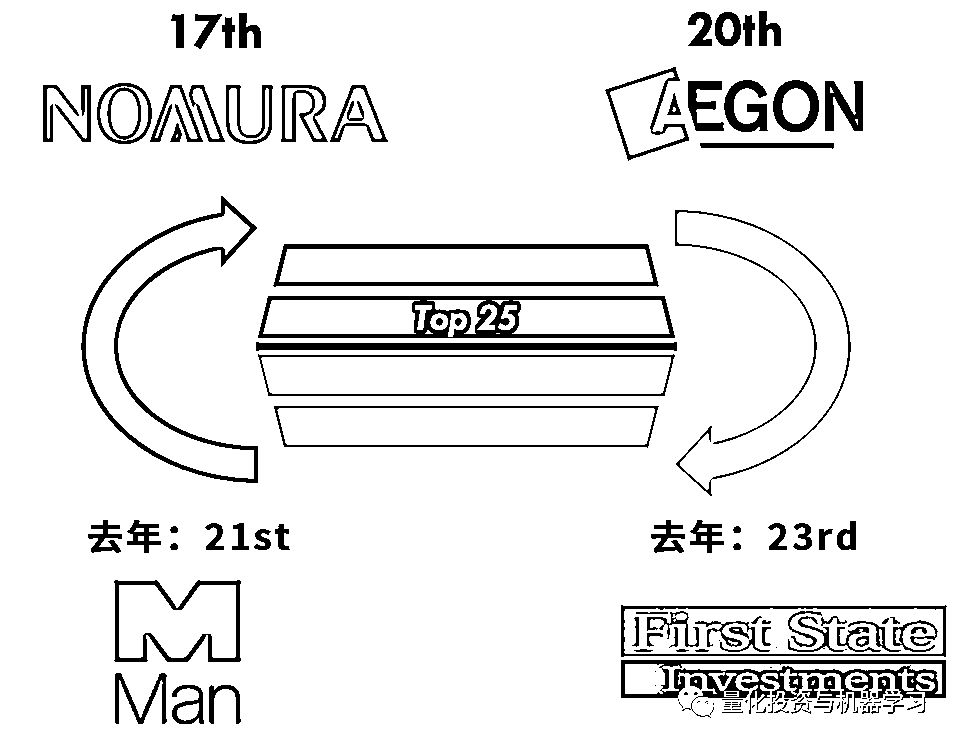
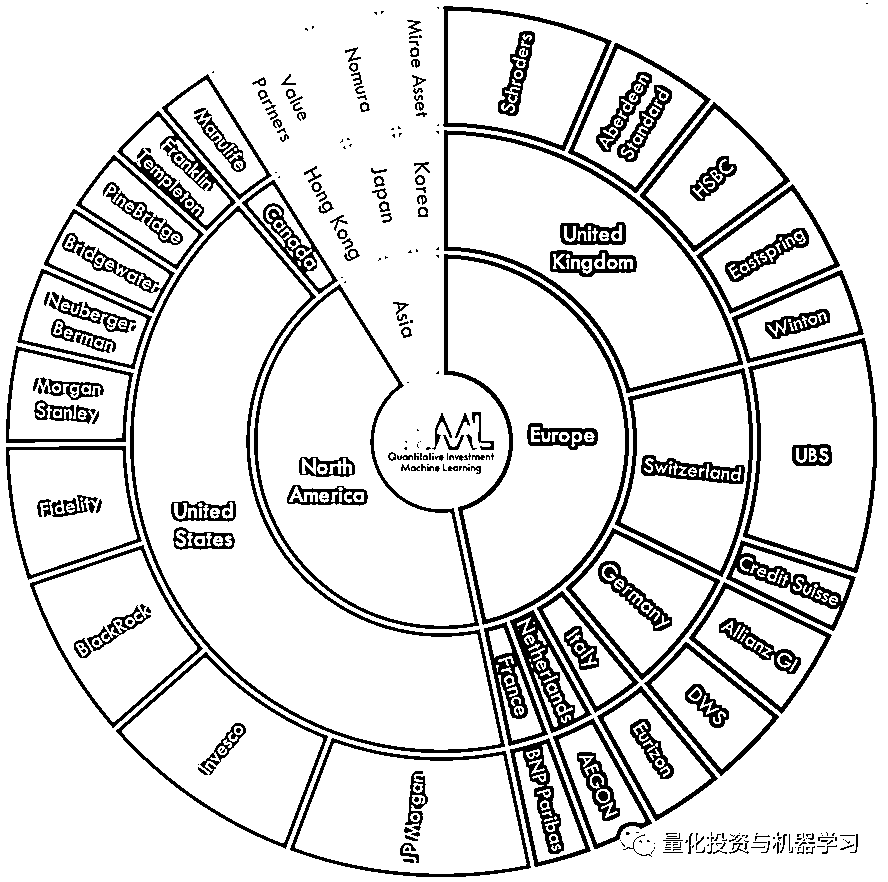
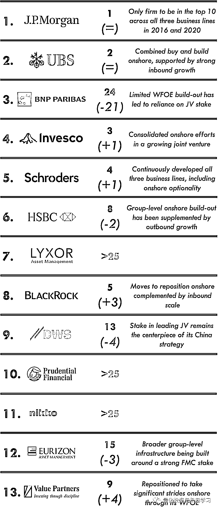
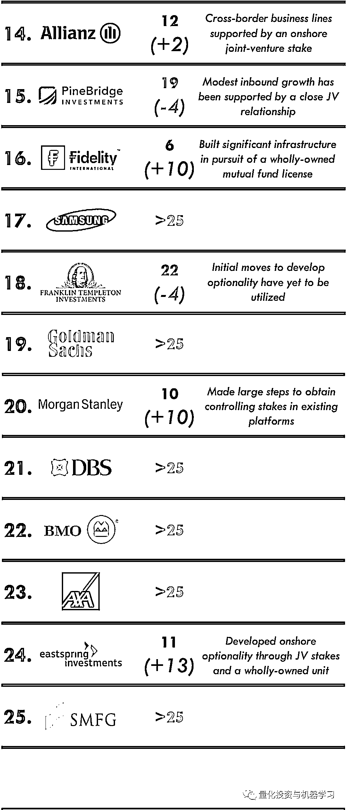
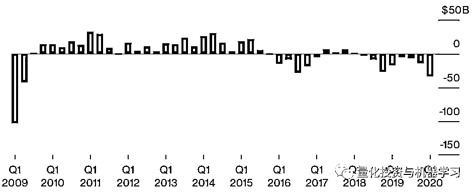

# 刚刚！2020 中国 Top 外资资管公司榜单出炉，猜猜谁第一？

> 原文：[`mp.weixin.qq.com/s?__biz=MzAxNTc0Mjg0Mg==&mid=2653298139&idx=1&sn=8532dc4e5e8462213385967809d2f9a5&chksm=802ddfceb75a56d823ccdbe780fdcc272bbfdf83df1826f2519792b6b22fe25affc35c9723b8&scene=27#wechat_redirect`](http://mp.weixin.qq.com/s?__biz=MzAxNTc0Mjg0Mg==&mid=2653298139&idx=1&sn=8532dc4e5e8462213385967809d2f9a5&chksm=802ddfceb75a56d823ccdbe780fdcc272bbfdf83df1826f2519792b6b22fe25affc35c9723b8&scene=27#wechat_redirect)

**标星★****置顶****公众号     **爱你们♥   

量化投资与机器学习公众号独家报道

刚刚，泽奔咨询发布了第五份《2020 China Rankings》报告，在这份报告中，**摩根大通（J.P. Morgan）荣登中国表现最佳外资资管公司宝座。**

瑞银（UBS）和景顺（Invesco）在均下滑一位，分别位列第二和第三，而施罗德（Schroders）、贝莱德（BlackRock）和富达（Fidelity）则保住了 2018 年的排名，分别位列第四、第五和第六。

摩根大通位居榜首也是有原因的：

今年 4 月初，摩根大通同意斥资 10 亿美元，将上投摩根基金管理有限公司（China International Fund Management, CIFM）的所有权转为 100% ，并与招商银行集团签署了财富管理战略合作协议。

摩根大通没有透露其从上海国际信托收购 CIFM 少数股权的财务条款。然而，该公司去年 8 月斥资 3500 万美元将所持 CIFM 股权从 49%增至 51%，支付了比其净资产价值高出 33%以上的溢价，**也由此成为了首家控股中国合资基金公司的外资机构**。假设估值类似，剩余 49%股权的价值接近 10 亿美元。

截至去年 12 月底，摩根大通的全球资产仅略高于 2 万亿美元，3 个月前该公司为中国客户管理的资产为 400 亿美元。 

与上投摩根的这笔交易，标志着中国投资市场发展的一个重要里程碑。政府希望通过吸引大型国际竞争对手的更多参与，加速中国投资市场的增长，提高投资标准。

此举利用了 4 月 1 日开始实施的新政策：**取消****证券公司****基金管理公司外资股比限制，符合条件境外投资者可依法提交设立证券公司或变更公司实际控制人申请。这意味着外资券商持股比例可至 100%。**

根据 Morgan Stanley 和 Oliver Wyman 的估计，**中国是全球第三大资产管理市场，仅次于美国和英国，管理资产规模为 5.3 万亿美元**。预计到 2023 年，这一规模将增至 9 万亿美元，在未来 10 年为西方基金管理公司提供全球最大的单一增长机会。

总部位于伦敦的对冲基金管理公司 Man Group 和 First State Investments 跌出前 25 名，分别被野村证券和 Aegon 取代，分别排在第 17 位和第 20 位。其它值得注意的变动包括：桥水基金上升两位，至 18 位，而总部位于伦敦的 Winton 下降一位，至 16 位。

我们还可以看到，**前 25 名的地域分布中美国公司占据了前 5 名中的 3 席。尽管如此，欧洲公司在前 25 名中所占份额最大，为 47%。**

5 年过去了，**2016 年的 25 强他们现在排位如何？**

随着金融市场大幅下挫，越来越多的证据表明，新冠肺炎将导致全球经济陷入深度衰退，今年第一季度，全球资产管理公司都出现了大规模的投资者撤资。

# 其中，全球对冲基金遭遇 2009 年以来最严重的季度撤资。在 2020 年第一季度，投资者从对冲基金净撤资 330 亿美元，为十多年来最多。

HFR 近期发布的一份报告称，这是自 2009 年第二季度投资者撤资约 420 亿美元以来规模最大的季度资金流出。2019 年全年，投资者撤资 431 亿美元。

在上月的市场动荡中，一些最知名的基金受到了冲击，包括达里奥、Michael Hintze 和 Adam Levinson 管理的基金。

再加上今年营收大幅下滑，可能严重制约了全球基金管理公司在中国内地实施扩张计划的能力。

2020 年第 84 篇文章

量化投资与机器学习微信公众号，是业内垂直于**Quant、MFE、Fintech、AI、ML**等领域的**量化类主流自媒体。**公众号拥有来自**公募、私募、券商、期货、银行、保险资管、海外**等众多圈内**18W+**关注者。每日发布行业前沿研究成果和最新量化资讯。

你点的每个“在看”，都是对我们最大的鼓励