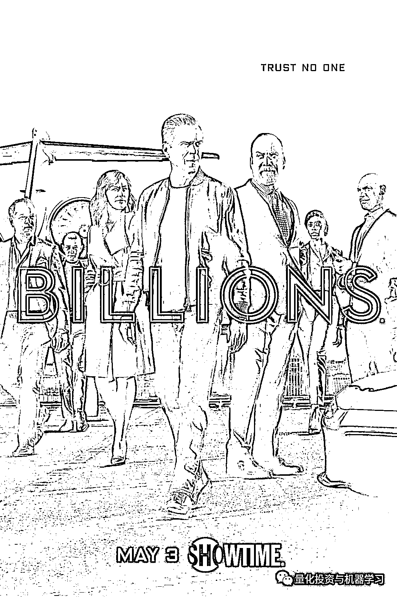
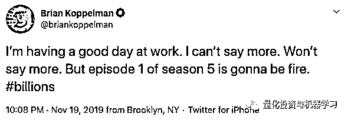
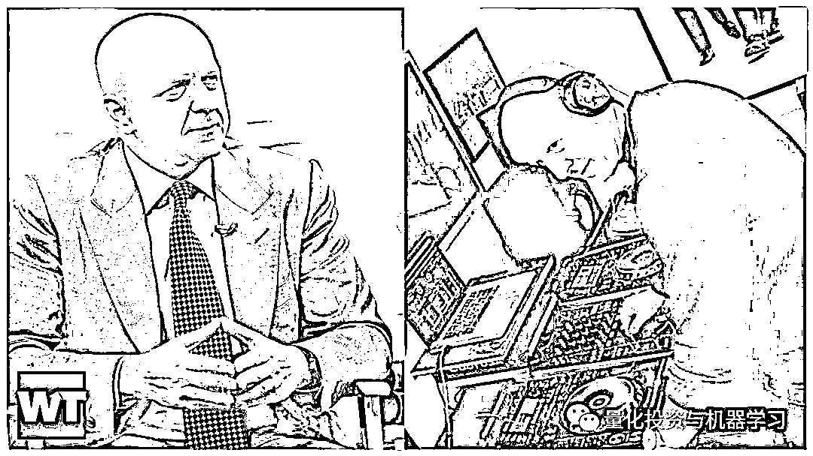
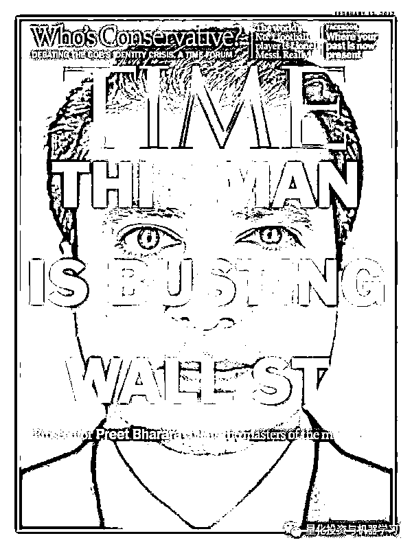

# Billions 第五季定档！权力与生存之战，高盛 CEO 亲上阵

> 原文：[`mp.weixin.qq.com/s?__biz=MzAxNTc0Mjg0Mg==&mid=2653298124&idx=1&sn=a7fc07b01e5bcbd539e963f2b3530846&chksm=802ddfd9b75a56cf7a9947be4a296540405c22bfa545932698f8405580d9a4395c6d071bd236&scene=27#wechat_redirect`](http://mp.weixin.qq.com/s?__biz=MzAxNTc0Mjg0Mg==&mid=2653298124&idx=1&sn=a7fc07b01e5bcbd539e963f2b3530846&chksm=802ddfd9b75a56cf7a9947be4a296540405c22bfa545932698f8405580d9a4395c6d071bd236&scene=27#wechat_redirect)

**标星★****置顶****公众号     **爱你们♥   

量化投资与机器学习公众号独家报道

是的，没错 

**5 月 3 日**

**美国东部时间晚上 9 点**

Billions 第五季强势来袭

****One man's enemy is another man's ally.****

**让我们拭目以待！**

**第 1、2、3、4 季资源已全部整理好**

**文末查看**

先来看看**第五季预告**吧，有 2 个！

[`mp.weixin.qq.com/mp/readtemplate?t=pages/video_player_tmpl&action=mpvideo&auto=0&vid=wxv_1313412010675240960`](https://mp.weixin.qq.com/mp/readtemplate?t=pages/video_player_tmpl&action=mpvideo&auto=0&vid=wxv_1313412010675240960)

第五季预告 1

[`mp.weixin.qq.com/mp/readtemplate?t=pages/video_player_tmpl&action=mpvideo&auto=0&vid=wxv_1313419237377146880`](https://mp.weixin.qq.com/mp/readtemplate?t=pages/video_player_tmpl&action=mpvideo&auto=0&vid=wxv_1313419237377146880)

第五季预告 2

****在这一季，权力之争变成了生存之战，所有角色都必须适应，否则就有灭绝的危险。****

**第五季剧情概览：**

Bobby Axelrod 和 Chuck Rhoades 不仅要面对他们自己重燃的竞争对手，还要面对一些新面孔，他们希望能永久地把他们两个拉下马。Mike Prince 对 Axelrod 的统治地位构成了威胁，Chuck 发现自己以一个熟练而精明的地区检察官的形式与法律较量。Taylor Mason 被迫回到 Axe 资本，作为唯一一个能够在 Axe 和 Chuck 之间保持中立的人，是迫使 Taylor 回到 Axe 资本的原因。为了保护公司的员工和他们的资产，Taylor 会成为 Axe 的王牌还是 Chuck 希望一劳永逸地终结 Axe 的统治地位的“怪物杀手”？与此同时，Wendy Rhoades 重新评估了她过去效忠的对象，并开始组建一些新的、强大的自己的团队，该团队会让 Axe 和 Chuck 大吃一惊。

同时，让粉丝们第一次看到 ulianna Margulies 和 Corey Stoll 扮演的新角色。

Margulies 将饰演一个名叫 Catherine Brant 的新角色，她被描述为“常春藤联盟的社会学教授和畅销书作者”。

Stoll 将扮演 Michael Prince，一个来自印第安纳州某小镇的商业巨头。

Chuck 已经准备好扳倒他的敌人了，哈哈~

在上一季中，Billions 改变了它的核心冲突，作为改革律师 Chuck Rhoades 与对冲基金巨头 Bobby Axelrod，利用他们的法律和货币权力对抗他们的敌人：美国司法部长 Waylon "Jock" Jeffcoat 和竞争对手 Taylor Mason。但是这个协议不会长久。在第四季结束时，Rhoades 和 Axelrod 再次密谋互相攻击。**一个律师和一个对冲基金经理，都渴望权力，试图超越对方！**

联合制片人 Koppelman 在去年 10 月，在 Twitter 上就分享了他对即将到来的第五季第一集的兴奋。：

Taylor 还专门发了一条视频：爱了！爱了！ 

[`mp.weixin.qq.com/mp/readtemplate?t=pages/video_player_tmpl&action=mpvideo&auto=0&vid=wxv_1313363132924002305`](https://mp.weixin.qq.com/mp/readtemplate?t=pages/video_player_tmpl&action=mpvideo&auto=0&vid=wxv_1313363132924002305)

同时，高盛首席执行官 David Solomon 将客串 Billions 第五季，David Solomon 在去年年底被邀请参加演出，并在三月初完成拍摄。本色出演他自己！

David Solomon 称为华尔街的“潮流引领者”，以 DJ - D-Sol 为自己的艺名，

**白天是华尔街大佬，晚上是酒吧 DJ**

正如所 David Solomon 所称：“我是一个对现代音乐产业很感兴趣的终身发烧友。”业余时间，David Solomon 会在各大夜店客串 DJ，并在 Instagram 上拥有超过 1 万名粉丝，称其为“djdsolmusic”。

2008 年经济危机之后，美国涌现出好几部金融题材的电影和纪录片，如《监守自盗》、《利益风暴》、《大而不倒》、《大空头》等都记录了资本战场上的腥风血雨，而金融领域的电视剧却并不多。

而且，在欧美，金融剧和律政剧虽然是流行影视题材，但其实拍好并不容易；编剧往往为了展现其高大上而夸大其词，就像过着普通人生活的网络写手们写富豪文，幻想着富豪的 king size 大床、两千平米的别墅、每天早上要一边喝咖啡一边看经济新闻；好笑中带着一丝尴尬。

国内的职业剧，基本上全面扑街了~

你会发现：编剧闭门造车，行业知识错漏百出，演员从造型到演技都很出戏，而不管讲哪个行业，最终都是以谈恋爱为主。

但是，**Billions 来了**

这不仅是一部从金钱、内幕交易、权利、欲望等一些系列的纽约市政治与经济领域的较量的华尔街大片，还是一部极度烧脑的金融美剧，**剧情中融会贯通一大堆金融领域专业词汇，让大家边看剧边学习**。剧中双方斗智斗勇的情节，富豪漂亮的投资手法也都借鉴了华尔街的真实故事。毕竟在华尔街，现实可比剧精彩多了。

有网友评价：**尔虞我诈，环环相扣，高潮迭起，仿佛亲身感受到两位主角博弈过程中的快感。相比之下，宫斗剧弱爆了！**

在中国，私募“一哥”徐翔大家耳熟能详，其事迹也是充满了传奇色彩。在美国华尔街，也有这么一位和徐翔有着惊人的相似的人物，华尔街对冲基金巨头，SAC 的创始人 Steve Cohen（史蒂文• 科恩），其旗下基金被称为美国最赚钱的基金之一，其近 20 年内高达 30%的年均收益率一度被认为投资传奇。而在被控内幕交易后，该基金被迫对外部投资者关闭，并缴纳 18 亿美元天价罚款及和解金。**亿万中的主角鲍比·阿克塞尔罗德的原型正是史蒂夫• 科恩。**

剧中鲍比的原型：科恩

科恩来自中产家庭，上中学时非常喜欢玩扑克牌，大多数时候，他都能赢 500-1000 美元。这对于一个中学生来说，可是不小的数目。

科恩说：**我对赚钱本身不感兴趣，我就喜欢赌赢后带来的刺激和成就感。**

1978 年科恩从宾大沃顿商学院毕业。之后进入华尔街 Gruntal 公司成为一名初级交易员，凭借着独特的天赋，工作第一天他就获得了 8000 美元的收益。由于表现出色，很快科恩就开始独立领导自己的团队，手下有 6 名交易员，负责管理 7500 万美元的资金。1987 年 10 月 19 日美国股市单日暴跌 22.6%，创下华尔街史上最大百分比跌幅。科恩认为，纽交所的经纪人们把股市价格看得太低了，之后他把公司的 5000 万美元资金押注股市。暴跌后第二日股市出现反弹，科恩的大胆押注帮助公司弥补了损失。Gruntal 公司允许交易员从收益中提取 60%，科恩在第一年赚了 10 万美元，第二年赚了 100 万美元。在他 25 岁左右的时候，在市场平淡的年份里，他也可以赚得 500 万美元；行情好的话那就是 1000 万美元。1992 年，在华尔街积累了丰富经验和雄厚财富的科恩成立了自己的基金：**塞克资本（SAC Capital）**，公司的名字源于他自己名字的三个首字母缩写。 

在之后的 18 年里，以平均收益率超 30%傲视群雄，2000 年的收益率甚至高达 70.34%。

Billions 中，Axe Capital 手下的基金经理一年收入都是百万美元起步。超级跑车，豪宅，以及巨大的压力是 Axe Capital 的基金经理典型写照。这也是 SAC 旗下基金经理的写照。许多人了解 SAC 是因为，曾经有一个中国明星交易员江平，在 2009 年拿到了令人咋舌的 1 亿美元奖金！这个数字已经超过了许多对冲基金的创始人。这就是 SAC 基金经理的收入水平。

**在 SAC 工作的人大概是世界上最辛苦的 200 名员工，“没业绩，毋宁死”，他们年薪通常 200 万美元以上，但关键要看各人表现，而不是 SAC 整体赢利情况**。在 SAC 有着丰盛的假日派对，三名公司内部的按摩师，以及公司旁边的雪茄吧。在公司的停车场更是豪车云集，从法拉利，马萨拉蒂到宾利一应俱全。

 **“如果说索罗斯是老虎，他就是对冲基金行业的大白鲨”** 科恩的一位资深客户对媒体如此表示。

也正是因为超高的回报，科恩管理的基金也屡遭质疑，甚至是调查。

查克的原型叫 Bharara，是一名印度裔的美国联邦检察官。他起诉过花旗银行和美国银行，有过成功定罪连胜 85 起的记录。

时代杂志称之为：**干死华尔街的人**

检察官原型普利特·巴拉拉登上时代周刊

Bharara 指控科恩及他的公司涉嫌内幕交易。从此契而不舍地追踪科恩和他公司的交易行为。

但有一点真实和剧肯定是一样的，双方博弈，涉及的不仅仅是两个人，而是所有利益相关者。所有的人都在做交易，有人为金钱，有人为名声，有人为权力，每个人都在出售筹码，而这是一场不带感情不留余地的厮杀，因为只有踩着对方才能更上一层楼。

2013 年，终于有一项指控得到落实，SAC 承认涉及内幕交易，当局开出了 18 亿美元的罚单，创下美国有史以来最高的内幕交易罚金纪录。8 名直接参与内幕交易的员工先后入狱。 

曾经辉煌一时的 SAC 退出了历史舞台。

经历了多重内幕交易丑闻之后，SAC 进行转型。将公司更名为**Point72 资产管理公司**，作为认罪协议的一部分，科恩同意他的公司将不再为外部投资者管理资金。Point72 正式成为一家家族理财室，其资本绝大部分是科恩本人的，还有少量来自员工。

新公司的名字可能源自 SAC 的地址 72 Cummings PointRoad。公司在网站宣布，Point72.com 所代表的是道德、卓越、机遇、创新和领导力。公司使命是通过提供卓越的风险收益回报力争成为资产管理界的翘楚；同时坚持最高的道德标准，并向业内的优秀人士提供机遇。

在 Piont72 成立的当年，公司便获得了不菲收益，远超其他对冲基金表现。据纽约时报报道，2014 年 4 月以 100 亿美元启航的 Point72 总收益达到 25-30 亿美元。虽然这部分收益未剔除运营成本，但短短 8 个月内就有如此强劲表现还是证明科恩宝刀未老。

已经迫不及待了！大家是不是也一样的心情呢？欢迎留言区讨论！

****One man's enemy is another man's ally.****

记住第五季的这句话！

**《亿万》1-4 季资源下载**

在后台输入

**亿万全集**
**相关热门文章：**   2020 年第 83 篇文章

量化投资与机器学习微信公众号，是业内垂直于**Quant、MFE、Fintech、AI、ML**等领域的**量化类主流自媒体。**公众号拥有来自**公募、私募、券商、期货、银行、保险资管、海外**等众多圈内**18W+**关注者。每日发布行业前沿研究成果和最新量化资讯。

你点的每个“在看”，都是对我们最大的鼓励