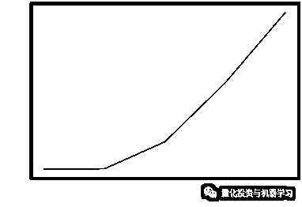

# Python 王牌加速库 2：深度学习下的障碍期权定价

> 原文：[`mp.weixin.qq.com/s?__biz=MzAxNTc0Mjg0Mg==&mid=2653298083&idx=1&sn=8399b1a304af88f723e8d4aaa75686c4&chksm=802ddfb6b75a56a06df2419cb11b6a35327a83279d1ee59fde15a67eaba32833946c3b7b53d4&scene=27#wechat_redirect`](http://mp.weixin.qq.com/s?__biz=MzAxNTc0Mjg0Mg==&mid=2653298083&idx=1&sn=8399b1a304af88f723e8d4aaa75686c4&chksm=802ddfb6b75a56a06df2419cb11b6a35327a83279d1ee59fde15a67eaba32833946c3b7b53d4&scene=27#wechat_redirect)


**标星★****置顶****公众号     **爱你们♥   

作者：Yi Dong    编译：1+1=6

***1***

**前言**

上一期推文中，我们使用了 Numba 和 CuPy 来运行蒙特卡罗模拟来确定亚式障碍期权的价格。

 

蒙特卡罗模拟需要数以百万计的路径来得到精确的答案，这需要大量的计算。Ryan 等人得研究表明，可以训练深度学习模型对衍生品进行估值。深度学习模型是准确和快速的，能够产生比传统模型快一百万倍的估值。在今天的推文中，我们将使用一个**全连接网络来学习亚式障碍期权的定价模式**。采用蒙特卡罗模拟作为训练的定价依据。我们使用与上一篇文章相同的亚式障碍期权模型，参数如下：

*   T：到期如（年）

*   S：现货（美元）

*   K：Strike（美元）

*   sigma：波动率（per）

*   r：无风险利率（per）

*   mu：Drift Rate（per）

*   B：Barrier（美元）

下面的内容主要包括两个主题：

*   使用蒙特卡罗定价动态数据集训练期权定价神的经网络模型。

*   使用蒙特卡罗定价静态数据集训练期权定价神经网络模型并进行推断。

***2***

**批处理数据生成**

数据集是深度学习训练的重要组成部分。我们将修改之前的单一亚式障碍期权定价代码来处理一批障碍期权定价。

加载库：

```py
import cupy
import numpy as np
import math
import time
import torch
cupy.cuda.set_allocator(None)
from torch.utils.dlpack import from_dlpack 
```

批量障碍期权定价模拟的 CuPy 版本如下：

```py
cupy_batched_barrier_option = cupy.RawKernel(r'''
extern "C" __global__ void batched_barrier_option(
    float *d_s,
    const float T,
    const float * K,
    const float * B,
    const float * S0,
    const float * sigma,
    const float * mu,
    const float * r,
    const float * d_normals,
    const long N_STEPS,
    const long N_PATHS,
    const long N_BATCH)
{
  unsigned idx =  threadIdx.x + blockIdx.x * blockDim.x;
  unsigned stride = blockDim.x * gridDim.x;
  unsigned tid = threadIdx.x;
  const float tmp3 = sqrt(T/N_STEPS);

  for (unsigned i = idx; i<N_PATHS * N_BATCH; i+=stride)
  {
    int batch_id = i / N_PATHS;
    int path_id = i % N_PATHS;
    float s_curr = S0[batch_id];
    float tmp1 = mu[batch_id]*T/N_STEPS;
    float tmp2 = exp(-r[batch_id]*T);
    unsigned n=0;
    double running_average = 0.0;
    for(unsigned n = 0; n < N_STEPS; n++){
       s_curr += tmp1 * s_curr + sigma[batch_id]*s_curr*tmp3*d_normals[path_id + batch_id * N_PATHS + n * N_PATHS * N_BATCH];
       running_average += (s_curr - running_average) / (n + 1.0);
       if (running_average <= B[batch_id]){
           break;
       }
    }

    float payoff = (running_average>K[batch_id] ? running_average-K[batch_id] : 0.f); 
    d_s[i] = tmp2 * payoff;
  }
}

''', 'batched_barrier_option') 
```

注意，参数（K, B, S0, sigma, mu, r）以批处理长度的数组形式传入。输出数组是一个 1-D 的二维数组。第一个维度用于 Batch，第二个维度用于 Path。。

通过输入两组选项参数进行测试：

```py
N_PATHS = 2048000
N_STEPS = 365
N_BATCH = 2
T = 1.0

K = cupy.array([110.0, 120.0], dtype=cupy.float32)
B = cupy.array([100.0, 90.0], dtype=cupy.float32)
S0 = cupy.array([120.0, 100.0], dtype=cupy.float32)
sigma = cupy.array([0.35, 0.2], dtype=cupy.float32)
mu = cupy.array([0.15, 0.1], dtype=cupy.float32)
r =cupy.array([0.05, 0.05], dtype=cupy.float32) 
```

把这一切放进一个简单的函数来启动 1GPU 内核。每个 Path 的期权价格是相应路径 terminal 值的平均值。这可以很容易地通过 Cupy 函数平均值（axis=1）计算出来

```py
def batch_run():
    number_of_threads = 256
    number_of_blocks = (N_PATHS * N_BATCH - 1) // number_of_threads + 1
    randoms_gpu = cupy.random.normal(0, 1, N_BATCH*N_PATHS * N_STEPS, dtype=cupy.float32)
    output = cupy.zeros(N_BATCH*N_PATHS, dtype=cupy.float32)
    cupy.cuda.stream.get_current_stream().synchronize()
    s = time.time()
    cupy_batched_barrier_option((number_of_blocks,), (number_of_threads,),
                       (output, np.float32(T), K, B, S0, sigma, mu, r,
                        randoms_gpu, N_STEPS, N_PATHS, N_BATCH))
    v = output.reshape(N_BATCH, N_PATHS).mean(axis=1)
    cupy.cuda.stream.get_current_stream().synchronize()
    e = time.time()
    print('time', e-s, 'v',v)
batch_run()
```

time 0.013919591903686523 v [21.22405    0.8480416]

这将为 66ms 中的这两组期权参数生成 21.22 和 0.848 的期权价格。

它的工作效率很高，因此我们将构造一个 OptionDataSet 类来包装上面的代码，以便我们可以在 Pytorch 中使用它。对于每个下一个元素，生成指定范围内的均匀分布随机期权参数，启动 GPU 内核计算期权价格，通过 DLPack 将 CuPy 数组转换为带有 zero-copy 的 Pytorch 张量。请注意我们是如何实现 iterable Dataset 接口的：

```py
class OptionDataSet(torch.utils.data.IterableDataset):

    def __init__(self, max_len=10, number_path = 1000, batch=2, threads=256,seed=15):
        self.num = 0
        self.max_length = max_len
        self.N_PATHS = number_path
        self.N_STEPS = 365
        self.N_BATCH = batch
        self.T = np.float32(1.0)
        self.output = cupy.zeros(self.N_BATCH*self.N_PATHS, dtype=cupy.float32) 
        self.number_of_blocks = (self.N_PATHS * self.N_BATCH - 1) // threads + 1
        self.number_of_threads = threads
        cupy.random.seed(seed)

    def __len__(self):
        return self.max_length

    def __iter__(self):
        self.num = 0
        return self

    def __next__(self):
        if self.num > self.max_length:
            raise StopIteration
        X = cupy.random.rand(self.N_BATCH, 6, dtype=cupy.float32)
        X = X * cupy.array([200.0, 0.99, 200.0, 0.4, 0.2, 0.2], dtype=cupy.float32)
        X[:, 1] = X[:, 0] * X[:, 1]
        randoms = cupy.random.normal(0, 1, self.N_BATCH * self.N_PATHS * self.N_STEPS, dtype=cupy.float32)
        cupy_batched_barrier_option((self.number_of_blocks,), (self.number_of_threads,), (self.output, self.T, cupy.ascontiguousarray(X[:, 0]), 
                              cupy.ascontiguousarray(X[:, 1]), cupy.ascontiguousarray(X[:, 2]), cupy.ascontiguousarray(X[:, 3]), cupy.ascontiguousarray(X[:, 4]), cupy.ascontiguousarray(X[:, 5]), randoms, self.N_STEPS, self.N_PATHS, self.N_BATCH))
        Y = self.output.reshape(self.N_BATCH, self.N_PATHS).mean(axis=1)
        self.num += 1
        return (from_dlpack(X.toDlpack()), from_dlpack(Y.toDlpack())) 
```

将所有与 Pytorch 数据集相关的内容都放到一个名为 cupy_dataset.py 的文件中：

```py
%%writefile cupy_dataset.py 
import cupy
import numpy as np
import torch
from torch.utils.dlpack import from_dlpack
cupy.cuda.set_allocator(None)

cupy_batched_barrier_option = cupy.RawKernel(r'''
extern "C" __global__ void batched_barrier_option(
    float *d_s,
    const float T,
    const float * K,
    const float * B,
    const float * S0,
    const float * sigma,
    const float * mu,
    const float * r,
    const float * d_normals,
    const long N_STEPS,
    const long N_PATHS,
    const long N_BATCH)
{
  unsigned idx =  threadIdx.x + blockIdx.x * blockDim.x;
  unsigned stride = blockDim.x * gridDim.x;
  unsigned tid = threadIdx.x;
  const float tmp3 = sqrt(T/N_STEPS);

  for (unsigned i = idx; i<N_PATHS * N_BATCH; i+=stride)
  {
    int batch_id = i / N_PATHS;
    int path_id = i % N_PATHS;
    float s_curr = S0[batch_id];
    float tmp1 = mu[batch_id]*T/N_STEPS;
    float tmp2 = exp(-r[batch_id]*T);
    unsigned n=0;
    double running_average = 0.0;
    for(unsigned n = 0; n < N_STEPS; n++){
       s_curr += tmp1 * s_curr + sigma[batch_id]*s_curr*tmp3*d_normals[path_id + batch_id * N_PATHS + n * N_PATHS * N_BATCH];
       running_average += (s_curr - running_average) / (n + 1.0);
       if (running_average <= B[batch_id]){
           break;
       }
    }

    float payoff = (running_average>K[batch_id] ? running_average-K[batch_id] : 0.f); 
    d_s[i] = tmp2 * payoff;
  }
}

''', 'batched_barrier_option')

class OptionDataSet(torch.utils.data.IterableDataset):

    def __init__(self, max_len=10, number_path = 1000, batch=2, threads=256,seed=15):
        self.num = 0
        self.max_length = max_len
        self.N_PATHS = number_path
        self.N_STEPS = 365
        self.N_BATCH = batch
        self.T = np.float32(1.0)
        self.output = cupy.zeros(self.N_BATCH*self.N_PATHS, dtype=cupy.float32) 
        self.number_of_blocks = (self.N_PATHS * self.N_BATCH - 1) // threads + 1
        self.number_of_threads = threads
        cupy.random.seed(seed)

    def __len__(self):
        return self.max_length

    def __iter__(self):
        self.num = 0
        return self

    def __next__(self):
        if self.num > self.max_length:
            raise StopIteration
        X = cupy.random.rand(self.N_BATCH, 6, dtype=cupy.float32)
        X = X * cupy.array([200.0, 0.99, 200.0, 0.4, 0.2, 0.2], dtype=cupy.float32)
        X[:, 1] = X[:, 0] * X[:, 1]
        randoms = cupy.random.normal(0, 1, self.N_BATCH * self.N_PATHS * self.N_STEPS, dtype=cupy.float32)
        cupy_batched_barrier_option((self.number_of_blocks,), (self.number_of_threads,), (self.output, self.T, cupy.ascontiguousarray(X[:, 0]), 
                              cupy.ascontiguousarray(X[:, 1]), cupy.ascontiguousarray(X[:, 2]), cupy.ascontiguousarray(X[:, 3]), cupy.ascontiguousarray(X[:, 4]), cupy.ascontiguousarray(X[:, 5]), randoms, self.N_STEPS, self.N_PATHS, self.N_BATCH))
        Y = self.output.reshape(self.N_BATCH, self.N_PATHS).mean(axis=1)
        self.num += 1
        return (from_dlpack(X.toDlpack()), from_dlpack(Y.toDlpack())) 
```

覆盖 cupy_dataset.py

这里是一个测试代码样本，有 10 个数据点、batch 为 16：

```py
ds = OptionDataSet(10, number_path=100000, batch=16, seed=15)
for i in ds:
    print(i[1]) 
```


我们可以实现相同的代码使用 Numba 加速计算在 GPU：

```py
import numba
from numba import cuda

@cuda.jit
def batch_barrier_option(d_s, T, K, B, S0, sigma, mu, r, d_normals, N_STEPS, N_PATHS, N_BATCH):
    ii = cuda.threadIdx.x + cuda.blockIdx.x * cuda.blockDim.x
    stride = cuda.gridDim.x * cuda.blockDim.x
    tmp3 = math.sqrt(T/N_STEPS)
    for i in range(ii, N_PATHS * N_BATCH, stride):
        batch_id = i // N_PATHS
        path_id = i % N_PATHS
        tmp1 = mu[batch_id]*T/N_STEPS
        tmp2 = math.exp(-r[batch_id]*T)
        running_average = 0.0
        s_curr = S0[batch_id]
        for n in range(N_STEPS):

            s_curr += tmp1 * s_curr + sigma[batch_id]*s_curr*tmp3*d_normals[path_id + batch_id * N_PATHS + n * N_PATHS * N_BATCH]
            running_average = running_average + 1.0/(n + 1.0) * (s_curr - running_average)
            if i==0 and batch_id == 2:
                print(s_curr)
            if running_average <= B[batch_id]:
                break
        payoff = running_average - K[batch_id] if running_average > K[batch_id] else 0
        d_s[i] = tmp2 * payoff

class NumbaOptionDataSet(object):

    def __init__(self, max_len=10, number_path = 1000, batch=2, threads=512, seed=15):
        self.num = 0
        self.max_length = max_len
        self.N_PATHS = number_path
        self.N_STEPS = 365
        self.N_BATCH = batch
        self.T = np.float32(1.0)
        self.output = cupy.zeros(self.N_BATCH*self.N_PATHS, dtype=cupy.float32) 
        self.number_of_blocks = (self.N_PATHS * self.N_BATCH - 1) // threads + 1
        self.number_of_threads = threads
        cupy.random.seed(seed)

    def __len__(self):
        return self.max_length

    def __iter__(self):
        self.num = 0
        return self

    def __next__(self):
        if self.num > self.max_length:
            raise StopIteration
        X = cupy.random.rand(self.N_BATCH, 6, dtype=cupy.float32)
        X = X * cupy.array([200.0, 0.99, 200.0, 0.4, 0.2, 0.2], dtype=cupy.float32)
        X[:, 1] = X[:, 0] * X[:, 1]
        randoms = cupy.random.normal(0, 1, self.N_BATCH * self.N_PATHS * self.N_STEPS, dtype=cupy.float32)
        batch_barrier_option(self.number_of_blocks,), (self.number_of_threads,)
        o = self.output.reshape(self.N_BATCH, self.N_PATHS)
        Y = o.mean(axis = 1) 
        self.num += 1
        return (from_dlpack(X.toDlpack()), from_dlpack(Y.toDlpack()))
ds = NumbaOptionDataSet(10, number_path=100000, batch=16, seed=15)
for i in ds:
    print(i[1]) 
```


***3***

**模型**

为了将期权参数映射到价格，我们使用了 6 层全连接神经网络，其隐含维度为 512。将此 DL 价格模型写入 model.py： 

```py
%%writefile model.py
import torch.nn as nn
import torch.nn.functional as F
import torch

class Net(nn.Module):

    def __init__(self, hidden=1024):
        super(Net, self).__init__()
        self.fc1 = nn.Linear(6, hidden)
        self.fc2 = nn.Linear(hidden, hidden)
        self.fc3 = nn.Linear(hidden, hidden)
        self.fc4 = nn.Linear(hidden, hidden)
        self.fc5 = nn.Linear(hidden, hidden)
        self.fc6 = nn.Linear(hidden, 1)
        self.register_buffer('norm',
                             torch.tensor([200.0,
                                           198.0,
                                           200.0,
                                           0.4,
                                           0.2,
                                           0.2]))

    def forward(self, x):
        x = x / self.norm
        x = F.elu(self.fc1(x))
        x = F.elu(self.fc2(x))
        x = F.elu(self.fc3(x))
        x = F.elu(self.fc4(x))
        x = F.elu(self.fc5(x))
        return self.fc6(x) 
```

覆盖 model.py

输入参数首先通过除以（200.0,198.0,200.0,0.4,0.2,0.2）缩小到 0-1 范围。然后在 ELu 激活函数后，将其 5 次隐射到隐藏维度 512。选择 ELu 是因为我们需要计算参数的二阶微分。如果使用 ReLu，二阶微分总是 0。最后一层是线性层，它将隐藏维度映射到预测的期权价格。

在训练方面，我们使用了一个高级库 Ignite 来训练 PyTorch 中的神经网络：


https://github.com/pytorch/ignite

我们使用 MSELoss 作为损失函数，Adam 作为优化器，CosineAnnealingScheduler 作为学习率调度器。下面的代码将随机期权数据提供给定价模型进行训练。

```py
from ignite.engine import Engine, Events
from ignite.handlers import Timer
from torch.nn import MSELoss
from torch.optim import Adam
from ignite.contrib.handlers.param_scheduler import CosineAnnealingScheduler
from ignite.handlers import ModelCheckpoint
from model import Net
from cupy_dataset import OptionDataSet
timer = Timer(average=True)
model = Net().cuda()
loss_fn = MSELoss()
optimizer = Adam(model.parameters(), lr=1e-3)
dataset = OptionDataSet(max_len=10000, number_path = 1024, batch=4800)

def train_update(engine, batch):
    model.train()
    optimizer.zero_grad()
    x = batch[0]
    y = batch[1]
    y_pred = model(x)
    loss = loss_fn(y_pred[:,0], y)
    loss.backward()
    optimizer.step()
    return loss.item()

trainer = Engine(train_update)
log_interval = 100

scheduler = CosineAnnealingScheduler(optimizer, 'lr', 1e-4, 1e-6, len(dataset))
trainer.add_event_handler(Events.ITERATION_STARTED, scheduler)
timer.attach(trainer,
             start=Events.EPOCH_STARTED,
             resume=Events.ITERATION_STARTED,
             pause=Events.ITERATION_COMPLETED,
             step=Events.ITERATION_COMPLETED)    
@trainer.on(Events.ITERATION_COMPLETED)
def log_training_loss(engine):
    iter = (engine.state.iteration - 1) % len(dataset) + 1
    if iter % log_interval == 0:
        print('loss', engine.state.output, 'average time', timer.value())

trainer.run(dataset, max_epochs=100) 
```

损失在不断减少，这意味着定价模型可以更好地预测期权价格。平均计算一个批大小（mini-batch）量需要花费大约 12ms，在接下的文章中，我们将尝试挖掘 GPU 的全部潜力来加速训练。

***4***

**TensorCore 混合精度训练**

V100 GPU 有 640 个张量核，可以加速半精度矩阵乘法运算，这是 DL 模型的核心运算。由 NVIDIA 开发的 Apex 库（*https://github.com/NVIDIA/apex*）使 Pytorch 中的混合精度和分布式训练变得容易。通过改变 3 行代码，可以利用张量核加速训练。

```py
from apex import amp
from ignite.engine import Engine, Events
from torch.nn import MSELoss
from ignite.handlers import Timer
from torch.optim import Adam
from ignite.contrib.handlers.param_scheduler import CosineAnnealingScheduler
from ignite.handlers import ModelCheckpoint
from model import Net
from cupy_dataset import OptionDataSet
timer = Timer(average=True)
model = Net().cuda()
loss_fn = MSELoss()
optimizer = Adam(model.parameters(), lr=1e-3)
opt_level = 'O1'
model, optimizer = amp.initialize(model, optimizer, opt_level=opt_level)
dataset = OptionDataSet(max_len=10000, number_path = 1024, batch=4800)

def train_update(engine, batch):
    model.train()
    optimizer.zero_grad()
    x = batch[0]
    y = batch[1]
    y_pred = model(x)
    loss = loss_fn(y_pred[:,0], y)
    with amp.scale_loss(loss, optimizer) as scaled_loss:
        scaled_loss.backward()
    optimizer.step()
    return loss.item()

trainer = Engine(train_update)
log_interval = 100
timer.attach(trainer,
             start=Events.EPOCH_STARTED,
             resume=Events.ITERATION_STARTED,
             pause=Events.ITERATION_COMPLETED,
             step=Events.ITERATION_COMPLETED)    
scheduler = CosineAnnealingScheduler(optimizer, 'lr', 1e-4, 1e-6, len(dataset))
trainer.add_event_handler(Events.ITERATION_STARTED, scheduler)

@trainer.on(Events.ITERATION_COMPLETED)
def log_training_loss(engine):
    iter = (engine.state.iteration - 1) % len(dataset) + 1
    if iter % log_interval == 0:
        print('loss', engine.state.output, 'average time', timer.value())

trainer.run(dataset, max_epochs=100) 
```

它改进了以 8ms 计算每个 mini-batch。为了获得更好的性能，我们将模型权值降低到半精度，因此需要调整损失以确保半精度动态范围与计算结果一致。它是猜测什么是正确的损失比例因子，并自动调整，如果梯度溢出。最后，在保持模型预测精度的前提下，获得最佳的硬件加速性能。

***5***

**多个 GPU 训练**

Apex 让多 GPU 训练变得容易。在同一个训练脚本中，我们需要注意一些额外的步骤：

1、添加参数——local_rank，该参数将由分布式启动程序自动设置。

2、初始化进程组。

3、根据数据集中的进程 id 生成独立的批处理数据。

4、包装模型和优化器来处理分布式计算。

5、衡量损失和优化。

为了启动分布式训练，我们需要将所有内容都放到一个 Python 文件中。以下是一个例子：

```py
%%writefile distributed_train.py 
import cupy
import numpy as np
import math
import time
import os
import torch
from torch.utils.dlpack import from_dlpack
import torch.nn as nn
import torch.nn.functional as F
import torch
from apex import amp
from ignite.engine import Engine, Events
from torch.nn import MSELoss
from torch.optim import Adam
from ignite.contrib.handlers.param_scheduler import CosineAnnealingScheduler
from ignite.handlers import ModelCheckpoint
from apex.parallel import DistributedDataParallel 
import argparse
from model import Net
from cupy_dataset import OptionDataSet

parser = argparse.ArgumentParser()
parser = argparse.ArgumentParser()
parser.add_argument("--local_rank", default=0, type=int)
args = parser.parse_args()

args.distributed = False
if 'WORLD_SIZE' in os.environ:
    args.distributed = int(os.environ['WORLD_SIZE']) > 1

if args.distributed:
    torch.cuda.set_device(args.local_rank)
    torch.distributed.init_process_group(backend='nccl',
                                         init_method='env://')

torch.backends.cudnn.benchmark = True

model = Net().cuda()
loss_fn = MSELoss()
optimizer = Adam(model.parameters(), lr=1e-3)
opt_level = 'O1'
model, optimizer = amp.initialize(model, optimizer, opt_level=opt_level)
if args.distributed:
    model = DistributedDataParallel(model)
dataset = OptionDataSet(max_len=10000, number_path = 1024, batch=10240, seed=args.local_rank)

def train_update(engine, batch):
    model.train()
    optimizer.zero_grad()
    x = batch[0]
    y = batch[1]
    y_pred = model(x)
    loss = loss_fn(y_pred[:,0], y)
    with amp.scale_loss(loss, optimizer) as scaled_loss:
        scaled_loss.backward()
    optimizer.step()
    return loss.item()

trainer = Engine(train_update)
log_interval = 100

scheduler = CosineAnnealingScheduler(optimizer, 'lr', 1e-4, 1e-6, len(dataset))
trainer.add_event_handler(Events.ITERATION_STARTED, scheduler)

@trainer.on(Events.ITERATION_COMPLETED)
def log_training_loss(engine):
    iter = (engine.state.iteration - 1) % len(dataset) + 1
    if iter % log_interval == 0:
        print('loss', engine.state.output)

trainer.run(dataset, max_epochs=100) 
```

覆盖 distributed_train.py

要启动多进程训练，我们需要运行以下命令：

```py
%reset -f

!python -m torch.distributed.launch --nproc_per_node=4 distributed_train.py 
```

所有的 GPU 都在训练这个网络。然而，它有几个问题：

1、由于没有模型序列化，因此不会保存经过训练的模型；

2、没有验证数据集来检查训练进度；

3、大部分时间都花在蒙特卡罗模拟上，因此训练速度较慢；

4、我们使用几个路径（1024）作为每个期权参数集，这些参数集是噪声的，并且模型不能收敛到一个低成本值。

**解决方案是将蒙特卡罗仿真数据保存在磁盘上**。这允许我们：

1、为不同的模型使用相同的数据集，节省蒙特卡罗仿真时间

2、通过增加路径数量来生成更精确的定价数据

我们将使用 CuPy 来运行蒙特卡罗仿真，因为它是最有效的方法。使用前面文章中定义的 OptionDataSet：

```py
from cupy_dataset import OptionDataSet 
```

为保存的数据文件和模型检查点创建目录：

```py
!mkdir -p datafiles
!mkdir -p check_points 
```

定义一个函数来生成数据集文件：

```py
def gen_data(n_files = 630, options_per_file = 10000, seed=3):
    counter = 0
    ds = OptionDataSet(max_len=n_files * options_per_file, number_path=8192000, batch=1,
                   seed=seed)
    x = []
    y = []
    for i in ds:
        if counter!=0 and counter % options_per_file == 0:
            filename = 'datafiles/'+str(seed) + '_' + str(counter//options_per_file) + '.pth'
            state = (torch.cat(x, 0), torch.cat(y, 0))
            torch.save(state, filename)
            x = []
            y = []
        x.append(i[0].cpu())
        y.append(i[1].cpu())
        counter += 1
    return seed 
```

它将为每个文件生成包含 x 和 y 大小矩阵选项的文件，文件名采用 seed_group.pth，我们可以测试运行 n_files = 5 和 options_per_file = 16。

```py
gen_data(n_files=5, options_per_file = 16, seed=3)
X, Y = torch.load('datafiles/3_1.pth')
print(X)
print(Y) 
```


在本文中，我们将使用 DASK 在多核 GPU 上生成数据集：

```py
import dask
import dask_cudf
from dask.delayed import delayed
from dask_cuda import LocalCUDACluster
cluster = LocalCUDACluster()
from dask.distributed import Client
client = Client(cluster)
client 
```


下面的代码是一个在 4 个 GPU 上生成 100x5x16 个数据点示例。对于真正的深度学习模型训练，我们需要数以百万计的数据点。大家可以尝试将 n_files 和 options_per_file 更改为较大的数字。

```py
futures = []
for i in range(0, 100):
    future = client.submit(gen_data, 5, 16, i)
    futures.append(future)
results = client.gather(futures) 
```

一旦生成了数百万个数据点，我们就可以将这些数据点组合在一起，并将它们拆分为训练和验证数据集。

```py
import pathlib

files = list(pathlib.Path('datafiles/').glob('*.pth'))
trn_size = int(len(files)*0.7)
trn_files = files[:trn_size]
val_files = files[trn_size:]

trn_x = []
trn_y = []
count = 0

for i in trn_files:
    tensor = torch.load(i)
    if count % 10 == 0:
        print(count,'/',len(trn_files))
    trn_x.append(tensor[0])
    trn_y.append(tensor[1])
    count += 1

X = torch.cat(trn_x)
Y = torch.cat(trn_y)
torch.save((X,Y), 'trn.pth')

val_x = []
val_y = []
count = 0

for i in val_files:
    tensor = torch.load(i)
    if count % 10 == 0:
        print(count,'/',len(val_files))
    val_x.append(tensor[0])
    val_y.append(tensor[1])
    count += 1

X = torch.cat(val_x)
Y = torch.cat(val_y)
torch.save((X,Y), 'val.pth') 
```

我们创建了两个用于训练和验证的数据文件 trn.pth 和 valn .pth。我们可以定义一个新的 PyTorch 数据集来从文件加载数据并将其写入文件。该数据集采用 rank 和 world_size 参数进行分布式训练。它将整个数据集加载到 GPU 内存中，并根据 rank id 对数据点进行采样，使得不同 rank_id 的数据集给出不同的数据。

```py
%%writefile filedataset.py
import torch

class OptionDataSet(torch.utils.data.Dataset):
    def __init__(self, filename, rank=0, world_size=5):
        tensor = torch.load(filename)
        self.tensor = (tensor[0].cuda(), tensor[1].cuda())
        self.length = len(self.tensor[0]) // world_size
        self.world_size = world_size
        self.rank = rank

    def __getitem__(self, index):
        index = index * self.world_size + self.rank
        return self.tensor[0][index], self.tensor[1][index]

    def __len__(self):
        return self.length 
```

写入 filedataset.py

**在训练深度学习模型时，防止过拟合的一个有效方法是使用单独的验证数据集来监控样本外的性能**。当验证数据集的性能下降时，这意味着发生了过拟合，因此我们可以停止训练。我们把所有的东西放在一个脚本，可以在多个 GPU 有效地训练模型：

```py
%%writefile distributed_training.py
import torch
from ignite.engine import Engine, Events
from torch.nn import MSELoss
from ignite.contrib.handlers.param_scheduler import CosineAnnealingScheduler
from apex import amp
import argparse
import os
from apex.parallel import DistributedDataParallel
import apex
from apex.optimizers import FusedLAMB
from model import Net
from filedataset import OptionDataSet
from ignite.metrics import MeanAbsoluteError
import ignite
import shutil
import torch.distributed as dist

parser = argparse.ArgumentParser()
parser.add_argument("--local_rank", default=0, type=int)
parser.add_argument("--path", default=None)
parser.add_argument("--mae_improv_tol", default=0.002, type=float)
args = parser.parse_args()

args.distributed = False
if 'WORLD_SIZE' in os.environ:
    args.distributed = int(os.environ['WORLD_SIZE']) > 1

if args.distributed:
    torch.cuda.set_device(args.local_rank)
    torch.distributed.init_process_group(backend='nccl',
                                         init_method='env://')

torch.backends.cudnn.benchmark = True

trn_dataset = OptionDataSet(filename='./trn.pth',
                            rank=dist.get_rank(),
                            world_size=int(os.environ['WORLD_SIZE']))
trn_dataset = torch.utils.data.DataLoader(trn_dataset,
                                          batch_size=1024,
                                          shuffle=True,
                                          num_workers=0)

val_dataset = OptionDataSet(filename='./val.pth',
                            rank=dist.get_rank(),
                            world_size=int(os.environ['WORLD_SIZE']))
val_dataset = torch.utils.data.DataLoader(val_dataset,
                                          batch_size=1024,
                                          shuffle=False,
                                          num_workers=0)

model = Net().cuda()
optimizer = FusedLAMB(model.parameters(), lr=1e-3)
loss_fn = MSELoss()

model = apex.parallel.convert_syncbn_model(model, channel_last=True)
model, optimizer = amp.initialize(model, optimizer, opt_level='O1')

best_mae = 100000

if args.path is not None:
    def resume():
        global best_mae
        checkpoint = torch.load(args.path)
        best_mae = checkpoint['best_mae']
        model.load_state_dict(checkpoint['state_dict'])
        amp.load_state_dict(checkpoint['amp'])
        optimizer.load_state_dict(checkpoint['optimizer'])
    resume()

if args.distributed:
    model = DistributedDataParallel(model)

def train_update(engine, batch):
    model.train()
    optimizer.zero_grad()
    x = batch[0]
    y = batch[1]
    y_pred = model(x)
    loss = loss_fn(y, y_pred[:, 0])
    with amp.scale_loss(loss, optimizer) as scaled_loss:
        scaled_loss.backward()
    optimizer.step()
    return loss.item()

trainer = Engine(train_update)
log_interval = 500

scheduler = CosineAnnealingScheduler(optimizer, 'lr', 1e-5, 5e-6,
                                     len(trn_dataset),
                                     start_value_mult=0.999, end_value_mult=0.999,
                                     save_history=False
                                     )
trainer.add_event_handler(Events.ITERATION_STARTED, scheduler)

def save_checkpoint(state, is_best, filename='checkpoint.pth.tar'):
    torch.save(state, filename)
    if is_best:
        shutil.copyfile(filename, 'check_points/model_best.pth.tar')

@trainer.on(Events.ITERATION_COMPLETED)
def log_training_loss(engine):
    iter = (engine.state.iteration - 1) % len(trn_dataset) + 1
    if iter % log_interval == 0:
        print('loss', engine.state.output, 'iter', engine.state.iteration,
              'lr', scheduler.get_param())

metric = MeanAbsoluteError()
loss_m = ignite.metrics.Loss(loss_fn)

def eval_update(engine, batch):
    model.eval()
    x = batch[0]
    y = batch[1]
    y_pred = model(x)
    return y, y_pred[:, 0]
evaluator = Engine(eval_update)
metric.attach(evaluator, "MAE")
loss_m.attach(evaluator, "loss")

@trainer.on(Events.EPOCH_COMPLETED)
def log_evalnumber(engine):
    global best_mae
    mae_improv_tol = args.mae_improv_tol  
    evaluator.run(val_dataset, max_epochs=1)
    metrics = evaluator.state.metrics
    average_tensor = torch.tensor([metrics['MAE'], metrics['loss']]).cuda()
    torch.distributed.reduce(average_tensor, 0, op=torch.distributed.ReduceOp.SUM)
    torch.distributed.broadcast(average_tensor, 0)
    average_tensor = average_tensor/int(os.environ['WORLD_SIZE'])

    mae = average_tensor[0].item()
    is_best = False
    if (1 - mae / best_mae) >= mae_improv_tol or \
            (engine.state.epoch == engine.state.max_epochs and
             mae < best_mae):
        best_mae = mae
        is_best = True

    # print("RANK {}   Val Results - Epoch: {}  Avg MAE: {:.5f} loss: {:.5f} BEST MAE: {:.5f}"
    #      .format(dist.get_rank(), trainer.state.epoch, metrics['MAE'], metrics['loss'], best_mae))

    if dist.get_rank() == 0:
        print('Epoch {}/{}'.format(engine.state.epoch, engine.state.max_epochs))
        print('Best MAE Improvement Tolerance for checkpointing: {}%'.format(100 * mae_improv_tol))
        print("RANK {} AVG {} NGPUs, best-mae: {:.5f} mae: {:.5f} loss: {:.5f}".format(
            dist.get_rank(),
            int(os.environ['WORLD_SIZE']),
            best_mae,
            average_tensor[0].item(),
            average_tensor[1].item()))
        fname = 'check_points/current_pth.tar'
        if is_best:
            save_checkpoint({'epoch': trainer.state.epoch,
                             'state_dict': model.module.state_dict(),
                             'best_mae': best_mae,
                             'optimizer': optimizer.state_dict(),
                             'amp': amp.state_dict()
                             }, is_best,
                            filename=fname)
        inputs = torch.tensor([[110.0, 100.0, 120.0, 0.35, 0.1, 0.05]]).cuda()
        res = model(inputs)
        print('test one example:', res.item())

trainer.run(trn_dataset, max_epochs=2000) 
```

覆盖 distributed_training.py

与前面的代码相比，它有点复杂，因为：

*   它处理验证数据集的评估

*   它将模型序列化到一个文件中，并根据 MAE 跟踪执行得最好的模型

*   它从文件中恢复训练

我们可以通过以下命令来启动分布式训练：

```py
ngpus=!echo $(nvidia-smi -L | wc -l)
!python -m torch.distributed.launch --nproc_per_node={ngpus[0]} distributed_training.py 
```

我们需要一些耐心来训练定价模型，直到它收敛。

***6***

**推断和 Greeks**

一旦训练被聚合，执行得最好的模型就被保存到 check_points/目录中。

为了得到一个好的模型，我们需要数百万个数据点来训练模型，直到它收敛。通常在一台 8 个 GPU 的 DGX-1 机器上需要 10-20 个小时。我们使用 1000 万个训练数据点和 500 万个验证数据点对模型进行训练。我们没有研究训练样本的最小数量是多少，只是简单地使用了大量的数据样本。大家可以通过使用更少的数据点来进行训练。

为了节省时间，可以运行以下命令下载权重并使用它们进行推断：

```py
! ((test ! -f './check_points/model_best.pth.tar' ||  test ! -f './check_points/512/model_best.pth.tar') && \
  bash ./download_data.sh) || echo "Dataset is already present. No need to re-download it." 
```

数据集已经存在。不需要重新下载。

我们可以加载模型参数并使用它进行推断。

```py
from model import Net
import torch
checkpoint = torch.load('check_points/model_best.pth.tar')
model = Net().cuda()
model.load_state_dict(checkpoint['state_dict'])
inputs = torch.tensor([[110.0, 100.0, 120.0, 0.35, 0.1, 0.05]]).cuda()
model(inputs)

tensor([[18.7140]], device='cuda:0', grad_fn=<AddmmBackward>) 
```

建立深度学习模型的好处之一是可以很容易地计算出 Greeks。我们只需要利用 Pytorch 中的 auto-grad 特征。下面是一个计算多元多项式函数一阶微分的例子。

```py
import torch
from torch.autograd import grad
'''
z = (xy)²
x = 3, y =2

first order deriv [24 36]
'''
inputs = torch.tensor([3.0,2.0], requires_grad=True)
z = (inputs[0]*inputs[1])**2
first_order_grad = grad(z, inputs, create_graph=True)
print(first_order_grad)
(tensor([24., 36.], grad_fn=<AddBackward0>),) 
```

我们可以使用 grad 函数来计算参数：K, B, S0, sigma, mu, r 的一阶差分：

```py
inputs = torch.tensor([[110.0, 100.0, 120.0, 0.35, 0.1, 0.05]]).cuda()
inputs.requires_grad = True
x = model(inputs)
x.backward()
first_order_gradient = inputs.grad
first_order_gradient

tensor([[-6.7092e-01, -2.1257e-02,  7.8896e-01,  1.9219e+01,  4.8331e+01,
         -1.8419e+01]], device='cuda:0') 
```

画出函数曲线：

```py
%matplotlib inline
import pylab
import numpy as np
def compute_delta(S):
    inputs = torch.tensor([[110.0, 100.0, S, 0.35, 0.1, 0.05]]).cuda()
    inputs.requires_grad = True
    x = model(inputs)
    x.backward()
    first_order_gradient = inputs.grad
    return first_order_gradient[0][2]
prices = np.arange(10, 200, 0.1)
deltas = []
for p in prices:
    deltas.append(compute_delta(p).item())
fig = pylab.plot(prices, deltas)
pylab.xlabel('prices')
pylab.ylabel('Delta')
fig 
```


在 PyTorch 中计算二阶导数也很简单。我们只需要应用两次 grad 函数。下面是计算同一多项式函数的二阶导数的例子:

```py
import torch
from torch.autograd import grad
'''
z = (xy)²
x = 3, y =2

first order deriv [24 36]
d2z/dx2 = 8
d2z/dxdy = 24
d2z/dy2 = 18
'''

inputs = torch.tensor([3.0,2.0], requires_grad=True)
z = (inputs[0]*inputs[1])**2
first_order_grad = grad(z, inputs, create_graph=True)
second_order_grad_x, = grad(first_order_grad[0][0], inputs, retain_graph=True) #
second_order_grad_y, = grad(first_order_grad[0][1], inputs)
print(second_order_grad_x)
print(second_order_grad_y)
tensor([ 8., 24.])
tensor([24., 18.]) 
```

利用这个机制，我们可以在下面的例子中计算二阶导数：

, , , , , 

```py
import torch
from torch import Tensor
from torch.autograd import Variable
from torch.autograd import grad
from torch import nn

inputs = torch.tensor([[110.0, 100.0, 120.0, 0.35, 0.1, 0.05]]).cuda()
inputs.requires_grad = True
x = model(inputs)

loss_grads = grad(x, inputs, create_graph=True)
drv = grad(loss_grads[0][0][2], inputs)
drv
Out[9]:
(tensor([[-0.0143,  0.0039,  0.0098, -0.3183,  1.1455, -0.7876]],
        device='cuda:0'),) 
```

Gamma 是 S 的二阶差分。 我们可以把 Gamma 曲线画成股票价格的函数：

```py
import pylab
import numpy as np
def compute_gamma(S):
    inputs = torch.tensor([[110.0, 100.0, S, 0.35, 0.1, 0.05]]).cuda()
    inputs.requires_grad = True
    x = model(inputs)
    loss_grads = grad(x, inputs, create_graph=True)
    drv = grad(loss_grads[0][0][2], inputs)
    return drv[0][0][2]

prices = np.arange(10, 200, 0.1)
deltas = []
for p in prices:
    deltas.append(compute_gamma(p).item())
fig2 = pylab.plot(prices, deltas)
pylab.xlabel('prices')
pylab.ylabel('Gamma')
fig2 
```


隐含波动率是基于期权报价对标的资产的预测波动率。给出的模型是价格与期权参数的反向映射，用蒙特卡罗模拟法很难做到这一点。但如果我们有深度学习定价模型，这是一个简单的任务。我们可以先画出波动率和期权价格之间的关系：

```py
import pylab
import numpy as np
def compute_price(sigma):
    inputs = torch.tensor([[110.0, 100.0, 120.0, sigma, 0.1, 0.05]]).cuda()
    x = model(inputs)
    return x.item()
sigmas = np.arange(0, 0.5, 0.1)
prices = []
for s in sigmas:
    prices.append(compute_price(s))
fig3 = pylab.plot(sigmas, prices)
pylab.xlabel('Sigma')
pylab.ylabel('Price')
fig3 
```



给定价格 P，隐含波动率是 compute_price 函数的根。我们可以用二分法求根。

```py
def bisection_root(small, large, fun, target, EPS=1e-6):
    if fun(large) - target < 0:
        print('upper bound is too small')
        return None
    if fun(small) - target > 0:
        print('lower bound is too large')
        return None
    while large - small > EPS:
        mid = (large + small) / 2.0
        if fun(mid) - target >= 0:
            large = mid
        else:
            small = mid
    mid = (large + small) / 2.0
    return mid, abs(fun(mid) - target)
quoted_price = 16.0
sigma, err = bisection_root(0, 0.5, compute_price, quoted_price)
print('implied volativity', sigma, 'error', err)

implied volativity 0.18517351150512695 error 4.76837158203125e-06 
```

2020 年第 82 篇文章

量化投资与机器学习微信公众号，是业内垂直于**Quant、MFE、Fintech、AI、ML**等领域的**量化类主流自媒体。**公众号拥有来自**公募、私募、券商、期货、银行、保险资管、海外**等众多圈内**18W+**关注者。每日发布行业前沿研究成果和最新量化资讯。

你点的每个“在看”，都是对我们最大的鼓励