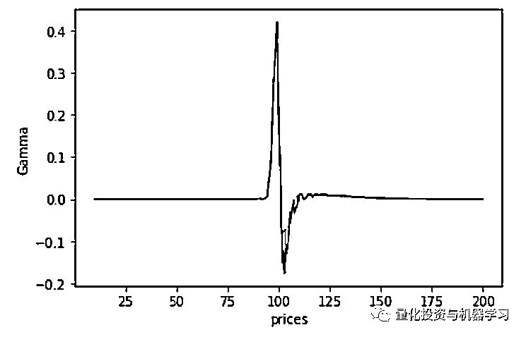

# Python 王牌加速库：奇异期权定价的利器

> 原文：[`mp.weixin.qq.com/s?__biz=MzAxNTc0Mjg0Mg==&mid=2653298060&idx=1&sn=bcff37c5a4ef291d6bb65cabd59bf1eb&chksm=802ddf99b75a568f78813cdfa715544f499d796cd6342fea7eacd7f478c72863d9ffd3d92417&scene=27#wechat_redirect`](http://mp.weixin.qq.com/s?__biz=MzAxNTc0Mjg0Mg==&mid=2653298060&idx=1&sn=bcff37c5a4ef291d6bb65cabd59bf1eb&chksm=802ddf99b75a568f78813cdfa715544f499d796cd6342fea7eacd7f478c72863d9ffd3d92417&scene=27#wechat_redirect)


**标星★****置顶****公众号     **爱你们♥   

作者：Yi Dong    编译：1+1=6 

***1***

**前言**

在金融领域，计算效率有时可以直接转化为交易利润。**量化分析师面临着在研究效率和计算效率之间进行权衡的挑战**。使用 Python 可以生成简洁的研究代码，从而提高了研究效率。但是，一般的 Python 代码速度很慢，不适合用于生产环境。在这篇文章中，我们将探索如何使用**Python 的 GPU 库来高性能实现奇异期权定价领域遇到的问题**。

***2***

**定价计算概述**

Black-Scholes 模型可以有效地用欧洲行权规则为 plain vanilla 定价。像障碍（Barrier）期权和篮子（Basket ）期权这样的期权具有复杂的结构。蒙特卡罗模拟是一种有效的定价方法。为了得到一个精确的价格和一个小的变动，你需要许多模拟路径，计算十分密集。

幸运的是，每个模拟路径都是独立的，**大家可以利用多核 NVIDIA GPU 在一个节点内加速计算，甚至在必要时将其扩展到多个服务器**。由于独立路径的并行化，使用 GPU 可以将计算速度提高几个数量级。

传统上，对 GPU 的蒙特卡罗仿真是在 CUDA C/ C++代码中实现的。大家必须明确地管理内存并编写大量样板代码，这对代码维护和生产效率提出了挑战。

最近，Deep Learning Derivatives（Ryan et al，2018）的论文被引入到使用深度神经网络来近似期权定价模型。该方法利用计算时间与推理时间进行定价训练，与 GPU 上的蒙特卡罗模拟相比，它实现了额外的数量级加速，这使得在生产环境中的实时奇异期权定价成为一个现实目标。

在这篇文章中介绍的方法对奇异期权类型没有任何限制。它适用于任何可以用蒙特卡罗方法模拟的期权定价模型。

在不失一般性的情况下，大家可以使用**亚式障碍期权**作为一个示例。亚式障碍期权是亚式期权和障碍期权的混合。衍生品价格取决于标的资产价格 S、执行价格 K 和障碍价格 B 的平均值。以上下看涨期权离散化亚洲障碍期权为例。

*   如果标的资产的平均价格低于这一水平，则该期权无效。

*   资产现货价格 S 通常在建模中被认为是属于几何布朗运动，它有三个参数：现货价格、波动率和漂移率。

*   期权的价格是到期时的预期利润相对于当前价值的折现。

*   期权的路径依赖性使得对期权价格的解析解成为不可能。

这是使用蒙特卡罗模拟定价的一个很好的示例。你需要一个至少 16GB 的 GPU 来复现这个结果。

***3***

**第 1 部分：使用 GPU Python 库进行蒙特卡洛定价**

NVIDIA GPU 被设计用来使用大量线程进行并行计算。蒙特卡罗仿真是在 GPU 中可以很好加速的算法之一。在下面的小节中，大家将看到在传统的 CUDA 代码中使用蒙特卡罗模拟，然后在 Python 中使用不同的库实现相同的算法。

**CUDA 方法**

传统上，蒙特卡罗期权定价是在 CUDA C/ C++中实现的。下面的 CUDA C/ C++代码示例使用蒙特卡罗方法计算期权价格：

```py
#include <vector>
#include <stdio.h>
#include <iostream>
#include <chrono>
#include <cuda_runtime.h>
#include <helper_cuda.h>
#include <curand.h>

#define CHECKCURAND(expression)                         \
  {                                                     \
    curandStatus_t status = (expression);                         \
    if (status != CURAND_STATUS_SUCCESS) {                        \
      std::cerr << "Curand Error on line " << __LINE__<< std::endl;     \
      std::exit(EXIT_FAILURE);                                          \
    }                                                                   \
  }

// atomicAdd is introduced for compute capability >=6.0
#if !defined(__CUDA_ARCH__) || __CUDA_ARCH__ >= 600
#else
__device__ double atomicAdd(double* address, double val) {
      printf("device arch <=600\n");
        unsigned long long int* address_as_ull = (unsigned long long int*)address;
          unsigned long long int old = *address_as_ull, assumed;
            do {
                    assumed = old;
                        old = atomicCAS(address_as_ull, assumed,
                                                    __double_as_longlong(val + __longlong_as_double(assumed)));
                          } while (assumed != old);
              return __longlong_as_double(old);
}
#endif

__global__ void sumPayoffKernel(float *d_s, const unsigned N_PATHS, double *mysum) {
  unsigned idx =  threadIdx.x + blockIdx.x * blockDim.x;
  unsigned stride = blockDim.x * gridDim.x;
  unsigned tid = threadIdx.x;

  extern __shared__ double smdata[];
  smdata[tid] = 0.0;

  for (unsigned i = idx; i<N_PATHS; i+=stride)
  {
    smdata[tid] += (double) d_s[i];
  }

  for (unsigned s=blockDim.x/2; s>0; s>>=1)
  {
    __syncthreads();
    if (tid < s) smdata[tid] += smdata[tid + s];
  }

  if (tid == 0)
  {
    atomicAdd(mysum, smdata[0]);
  }
}

__global__ void barrier_option(
    float *d_s,
    const float T,
    const float K,
    const float B,
    const float S0,
    const float sigma,
    const float mu,
    const float r,
    const float * d_normals,
    const long N_STEPS,
    const long N_PATHS) {
  unsigned idx =  threadIdx.x + blockIdx.x * blockDim.x;
  unsigned stride = blockDim.x * gridDim.x;
  const float tmp1 = mu*T/N_STEPS;
  const float tmp2 = exp(-r*T);
  const float tmp3 = sqrt(T/N_STEPS);
  double running_average = 0.0;

  for (unsigned i = idx; i<N_PATHS; i+=stride)
  {
    float s_curr = S0;
    for(unsigned n = 0; n < N_STEPS; n++){
       s_curr += tmp1 * s_curr + sigma*s_curr*tmp3*d_normals[i + n * N_PATHS];
       running_average += (s_curr - running_average) / (n + 1.0) ;
       if (running_average <= B){
           break;
       }
    }

    float payoff = (running_average>K ? running_average-K : 0.f);
    d_s[i] = tmp2 * payoff;
  }
}

int main(int argc, char *argv[]) {
  try {
    // declare variables and constants
    size_t N_PATHS = 8192000;
    size_t N_STEPS = 365;
    if (argc >= 2)  N_PATHS = atoi(argv[1]);

    if (argc >= 3)  N_STEPS = atoi(argv[2]);

    const float T = 1.0f;
    const float K = 110.0f;
    const float B = 100.0f;
    const float S0 = 120.0f;
    const float sigma = 0.35f;
    const float mu = 0.1f;
    const float r = 0.05f;

    double gpu_sum{0.0};

    int devID{0};
    cudaDeviceProp deviceProps;

    checkCudaErrors(cudaGetDeviceProperties(&deviceProps, devID));
    printf("CUDA device [%s]\n", deviceProps.name);
     printf("GPU Device %d: \"%s\" with compute capability %d.%d\n\n",  devID, deviceProps.name, deviceProps.major, deviceProps.minor);
    // Generate random numbers on the device
    curandGenerator_t curandGenerator;
    CHECKCURAND(curandCreateGenerator(&curandGenerator, CURAND_RNG_PSEUDO_MTGP32));
    CHECKCURAND(curandSetPseudoRandomGeneratorSeed(curandGenerator, 1234ULL)) ;

    const size_t N_NORMALS = (size_t)N_STEPS * N_PATHS;
    float *d_normals;
    checkCudaErrors(cudaMalloc(&d_normals, N_NORMALS * sizeof(float)));
    CHECKCURAND(curandGenerateNormal(curandGenerator, d_normals, N_NORMALS, 0.0f, 1.0f));
    cudaDeviceSynchronize();

      // before kernel launch, check the max potential blockSize
      int BLOCK_SIZE, GRID_SIZE;
      checkCudaErrors(cudaOccupancyMaxPotentialBlockSize(&GRID_SIZE,
                                                         &BLOCK_SIZE,
                                                         barrier_option,
                                                         0, N_PATHS));

      std::cout << "suggested block size " << BLOCK_SIZE
                << " \nsuggested grid size " << GRID_SIZE
                << std::endl;

      std::cout << "Used grid size " << GRID_SIZE << std::endl;

      // Kernel launch
      auto t1=std::chrono::high_resolution_clock::now();

      float *d_s;
      checkCudaErrors(cudaMalloc(&d_s, N_PATHS*sizeof(float)));

      auto t3=std::chrono::high_resolution_clock::now();
      barrier_option<<<GRID_SIZE, BLOCK_SIZE>>>(d_s, T, K, B, S0, sigma, mu, r, d_normals, N_STEPS, N_PATHS);
      cudaDeviceSynchronize();
      auto t4=std::chrono::high_resolution_clock::now();

      double* mySum;
      checkCudaErrors(cudaMallocManaged(&mySum, sizeof(double)));
      sumPayoffKernel<<<GRID_SIZE, BLOCK_SIZE, BLOCK_SIZE*sizeof(double)>>>(d_s, N_PATHS, mySum);
      cudaDeviceSynchronize();
      auto t5=std::chrono::high_resolution_clock::now();

      std::cout << "sumPayoffKernel takes "
                << std::chrono::duration_cast<std::chrono::microseconds>(t5-t4).count() / 1000.f
                << " ms\n";

      gpu_sum = mySum[0] / N_PATHS;

      auto t2=std::chrono::high_resolution_clock::now();

      // clean up
      CHECKCURAND(curandDestroyGenerator( curandGenerator )) ;
      checkCudaErrors(cudaFree(d_s));
      checkCudaErrors(cudaFree(d_normals));
      checkCudaErrors(cudaFree(mySum));

      std::cout << "price "
              << gpu_sum
              << " time "
                << std::chrono::duration_cast<std::chrono::microseconds>(t5-t1).count() / 1000.f
                << " ms\n";
  }

  catch(std::
        exception& e)
  {
    std::cout<< "exception: " << e.what() << "\n";
  }
} 
```

这段 CUDA 代码很长。一般来说，它主要执行以下一系列任务：

1、分配 GPU 内存来存储随机数和模拟路径结果。

2、调用 cuRand 库生成随机数。

3、启动障碍期权内核来执行并行模拟。

4、启动 sum 内核来聚合最终基础资产价格。

5、释放内存。

大家必须显式地执行每个步骤。在这个代码示例中，它计算下表中指定的亚式障碍期权的价格。


亚式障碍期权的参数。K 是执行价格，B 是障碍价格，S0 是现货价格，sigma 是波动率百分比，mu 是漂移百分比，r 是利率。

本研究中，该期权的期限为一年。在 V100 GPU 上编译和运行这个 CUDA 代码，可以**在 26.6 ms 内生成正确的期权价格$18.70，8192 万条路径，365 个步骤**。使用这些数字作为以后比较的参考基准。在实际投资中，量化分析师通常使用更少的路径来进行蒙特卡罗模拟。

可以使用许多技巧来减少模拟所需的路径数，例如**重要性采样方法。**

在这五个步骤中，关键的部分是步骤 3，大家需要在其中描述详细的蒙特卡罗模拟。理想情况下，大家的努力应该集中在这一步上。幸运的是，在迁移到 Python GPU 库之后，其他步骤可以自动处理，而不会牺牲其性能。例如：

步骤 1：可以通过 CuPy 数组自动分配和初始化 GPU 内存。路径结果数组可以通过以下代码示例定义：

```py
output = cupy.zeros(N_PATHS, dtype=cupy.float32) 
```

步骤 2：CuPy 随机函数引擎下的 cuRAND 库。分配和随机数生成可以通过以下代码示例定义:

```py
randoms_gpu = cupy.random.normal(0, 1, N_PATHS * N_STEPS, dtype=cupy.float32) 
```

步骤 4：GPU 的平均值计算是 CuPy 库中的一个内置函数。

```py
v = output.mean() 
```

步骤 5：通过 Python 内存管理自动释放 GPU 内存。

在这篇文章的其余部分，我们会将重点介绍第 3 步，使用 Python 对亚式障碍期权进行蒙特卡罗模拟。

**Numba 库方法-单核 CPU**

下面的代码示例是一个实现蒙特卡罗模拟优化运行在一个单核 CPU：

```py
@njit(fastmath=True)
def cpu_barrier_option(d_s, T, K, B, S0, sigma, mu, r, d_normals, N_STEPS, N_PATHS):
    tmp1 = mu*T/N_STEPS
    tmp2 = math.exp(-r*T)
    tmp3 = math.sqrt(T/N_STEPS)
    running_average = 0.0
    for i in range(N_PATHS):
        s_curr = S0
        for n in range(N_STEPS):
            s_curr += tmp1 * s_curr + sigma*s_curr*tmp3*d_normals[i + n * N_PATHS]
            running_average = running_average + 1.0/(n + 1.0) * (s_curr - running_average)
            if running_average <= B:
                break

        payoff = running_average - K if running_average>K else 0
        d_s[i] = tmp2 * payoff 
```

蒙特卡罗仿真有两个嵌套的 for-loop。外部循环遍历独立路径。在内部循环中，标的资产价格逐步更新，最终价格设置为结果数组。

我们启用了 fastmath 编译器优化来加快计算速度。对于相同数量的仿真路径和步骤，需要**41.6s**才能产生相同的定价数。

**Numba 库方法-多核 CPU**

为了实现跨多个 CPU 核的计算，你可以通过**将 range 改为 prange 来并行化外层 for 循环：**

```py
@njit(fastmath=True, parallel=True)
def cpu_multiplecore_barrier_option(d_s, T, K, B, S0, sigma, mu, r, d_normals, N_STEPS, N_PATHS):
    tmp1 = mu*T/N_STEPS
    tmp2 = math.exp(-r*T)
    tmp3 = math.sqrt(T/N_STEPS)
    for i in prange(N_PATHS):
        s_curr = S0
        running_average = 0.0
        for n in range(N_STEPS):
            s_curr += tmp1 * s_curr + sigma*s_curr*tmp3*d_normals[i + n * N_PATHS]
            running_average = running_average + 1.0/(n + 1.0) * (s_curr - running_average)
            if running_average <= B:
                break
        payoff = running_average - K if running_average>K else 0
        d_s[i] = tmp2 * payoff 
```

这段代码产生了相同的定价结果，现在需要**2.34s**才能在 32 核、超线程化 DGX-1 Intel CPU 中计算出来。

**Numba 库方法-单核 GPU**

使用 Numba 可以很容易地从 CPU 代码转移到 GPU 代码。在函数装饰中将 njit 改为 cuda.jit。并使用 GPU 线程并行进行外部 for-loop 计算。

```py
@cuda.jit
def numba_gpu_barrier_option(d_s, T, K, B, S0, sigma, mu, r, d_normals, N_STEPS, N_PATHS):
    # ii - overall thread index
    ii = cuda.threadIdx.x + cuda.blockIdx.x * cuda.blockDim.x
    stride = cuda.gridDim.x * cuda.blockDim.x
    tmp1 = mu*T/N_STEPS
    tmp2 = math.exp(-r*T)
    tmp3 = math.sqrt(T/N_STEPS)
    running_average = 0.0
    for i in range(ii, N_PATHS, stride):
        s_curr = S0
        for n in range(N_STEPS):
            s_curr += tmp1 * s_curr + sigma*s_curr*tmp3*d_normals[i + n * N_PATHS]
            running_average += (s_curr - running_average) / (n + 1.0)
            if running_average <= B:
                break
        payoff = running_average - K if running_average>K else 0
        d_s[i] = tmp2 * payoff 
```

通过在 V100 GPU 上加速这种运算，计算时间可以减少到**65ms**，并产生相同的结果。

**CuPy 库方法-单核 GPU**

CuPy 提供了一种从原始 CUDA 源定义 GPU 内核的简单方法。RawKernel 对象允许大家使用 CUDA 的 cuLaunchKernel 接口调用内核。下面的代码示例将障碍期权的计算代码封装在 RawKernel 对象中：

```py
cupy_barrier_option = cupy.RawKernel(r'''
extern "C" __global__ void barrier_option(
    float *d_s,
    const float T,
    const float K,
    const float B,
    const float S0,
    const float sigma,
    const float mu,
    const float r,
    const float * d_normals,
    const long N_STEPS,
    const long N_PATHS)
{
  unsigned idx =  threadIdx.x + blockIdx.x * blockDim.x;
  unsigned stride = blockDim.x * gridDim.x;
  unsigned tid = threadIdx.x;

  const float tmp1 = mu*T/N_STEPS;
  const float tmp2 = exp(-r*T);
  const float tmp3 = sqrt(T/N_STEPS);
  double running_average = 0.0;

  for (unsigned i = idx; i<N_PATHS; i+=stride)
  {
    float s_curr = S0;
    unsigned n=0;
    for(unsigned n = 0; n < N_STEPS; n++){
       s_curr += tmp1 * s_curr + sigma*s_curr*tmp3*d_normals[i + n * N_PATHS];
       running_average += (s_curr - running_average) / (n + 1.0) ;
       if (running_average <= B){
           break;
       }
    }

    float payoff = (running_average>K ? running_average-K : 0.f);
    d_s[i] = tmp2 * payoff;
  }
}

''', 'barrier_option') 
```

在 Python 中启动这个 GPU 内核并运行蒙特卡罗模拟需要**29ms**，这与本地 CUDA 代码的基准测试（26ms）非常接近。

**Dask-多核 GPU**

为了获得更准确的期权价格估计，需要更多的蒙特卡罗模拟路径。之前使用的 NVIDIA V100 GPU 只有 16GB 的内存，几乎达到了运行 8M 模拟的内存极限。

**DASK 是 RAPIDS 在 GPU 上进行分布式计算的集成组件。大家可以利用它将蒙特卡罗模拟计算分布到跨多个节点的多个 GPU。**


https://dask.org/

首先，将所有计算封装在一个函数中，以允许在函数调用结束时释放分配给 GPU 的内存。该函数为随机数种子值添加一个额外的参数，这样每个函数调用都有一个独立的随机数序列。

```py
def get_option_price(T, K, B, S0, sigma, mu, r, N_PATHS = 8192000, N_STEPS = 365, seed=3):
    number_of_threads = 256
    number_of_blocks = (N_PATHS-1) // number_of_threads + 1
    cupy.random.seed(seed)
    randoms_gpu = cupy.random.normal(0, 1, N_PATHS * N_STEPS, dtype=cupy.float32)
    output =  cupy.zeros(N_PATHS, dtype=cupy.float32)
    cupy_barrier_option((number_of_blocks,), (number_of_threads,),
                   (output, np.float32(T), np.float32(K), 
                    np.float32(B), np.float32(S0), 
                    np.float32(sigma), np.float32(mu), 
                    np.float32(r),  randoms_gpu, N_STEPS, N_PATHS))
    v = output.mean()
    out_df = cudf.DataFrame()
    out_df['p'] = cudf.Series([v.item()])
    return out_df 
```

这个函数将模拟结果返回到一个 cudf GPU 数据模型中，以便在以后将其聚合到一个 dask cuda 分布式数据模型中。使用 Dask 在 DGX-中运行 1600800 万次模拟，代码示例如下：

```py
x = dask_cudf.from_delayed([delayed(get_option_price)(T=1.0, K=110.0,  B=100.0, S0=120.0, sigma=0.35, mu=0.1, r=0.05, seed=3000+i) for i in  range(1600)])
x.mean().compute()
x.std().compute() 
```

这种额外的计算能力产生了一个更精确的定价结果 18.71。调用 std 函数计算有 800 万条路径的定价的标准偏差为 0.0073。

***4***

**第 2 部分：基于深度衍生工具的期权定价**

在这篇文章的第 1 部分中，Python 被用来实现蒙特卡罗模拟，从而在 GPU 中有效地为奇异的期权定价。**在量化金融中，低延迟期权定价在生产环境中对管理投资组合风险非常重要。蒙特卡罗模拟，即使在 GPU 中加速，有时也不够有效。**

本文提出了一种利用深度神经网络逼近期权定价的模型，并利用蒙特卡罗模拟生成的数据对其进行训练。结果表明，深度神经网络能够生成准确的定价数据，推理时间数量级更快。


https://arxiv.org/pdf/1809.02233.pdf

受这篇文章的启发，我们在今天的推文中使用了类似的方法来建立一个近似的定价模型，并加快了推理延迟。利用一个高阶可微激活函数，证明了该模型可以有效地通过网络反向传递计算期权 Greeks。通过使用 TensorRT（https://github.com/NVIDIA/TensorRT）对模型进行转换，以提供最快的奇异期权定价速度，进一步提高了推理时间。

**神经网络逼近**

深度神经网络是一种很好的函数逼近器，在图像处理和自然语言处理中取得了很大的成功。深度神经网络通常具有良好的泛化能力，当神经网络训练了大量的数据时，泛化能力对不可见的数据集非常有效。由于蒙特卡罗模拟可以用来发现期权的准确价格，因此你可以使用它来生成尽可能多的数据点，给定计算预值。

一个有趣的发现来自《Noise2Noise: Learning Image Restoration without Clean Data》这篇论文。其实，讲到因为蒙特卡罗模拟中的噪声是无偏的，在随机梯度训练中可以消除。


https://arxiv.org/pdf/1803.04189.pdf

这一点在《Deeply Learning Derivatives》这篇论文中也得到了证明：**在相同路径数的情况下，模型的预测结果要优于蒙特卡罗模拟的结果。**


预测模型体系结构图

上图解释：你生成随机期权参数（X 个自变量），将它们输入到 GPU 的蒙特卡罗模拟中，然后计算出 ground truth 期权价格（Y 个因变量）。然后使用这个生成的大数据集来训练一个深度神经网络，将期权定价作为一个非线性回归问题来学习。

**数据生成**

在第 1 部分中我们使用 Dask 可以轻松地进行分布式计算。在这里，你可以使用 Dask 以分布式的方式生成一个大数据集：

```py
futures = []
for i in range(0, 100):
    future = client.submit(gen_data, 5, 16, i)
    futures.append(future)
results = client.gather(futures) 
```

gen_data 函数在单个 GPU 中运行，生成一组数据点并将它们保存在本地存储中。你可以使用第 1 部分中描述的任何 Python GPU 蒙特卡罗模拟方法。此示例代码使用不同的种子数运行 gen_data100 次，并将计算分配到多 GPU 环境中。

将 6 个期权参数统一采样到下表中指定的范围内：


总的来说，1000 万个训练数据点和 500 万个验证数据点是通过在分布中运行蒙特卡罗模拟产生的。对于每个蒙特卡罗模拟，大家使用 819.2 万条路径来计算期权价格。如第 1 部分所示，819.2 万条路径在该特定期权参数设置的价格中的标准差为 0.0073。

**神经网络模型**

由于我们没有关于这六个期权参数的结构信息，请选择通用的多层感知器神经网络作为定价模型。如下图：


与《Deeply Learning Derivatives》论文的不同之处在于使用**Elu**作为激活函数，计算参数的高阶微分。如果你在原始的论文中使用 ReLu，二阶微分总是 0。

https://ml-cheatsheet.readthedocs.io/en/latest/activation_functions.html#elu

生成的随机期权参数的范围，输入参数首先通过除以[200.0,198.0,200.0,0.4,0.2,0.2]缩小到(0-1)范围。然后它们被投射到 1024 的隐藏维度上 5 次。最后一层是线性层，它将隐藏维度映射到预测的期权价格。下面的代码示例是**PyTorch**中详细的模型实现：

```py
import torch.nn as nn
import torch.nn.functional as F
import torch

class Net(nn.Module):

    def __init__(self, hidden=1024):
        super(Net, self).__init__()
        self.fc1 = nn.Linear(6, hidden)
        self.fc2 = nn.Linear(hidden, hidden)
        self.fc3 = nn.Linear(hidden, hidden)
        self.fc4 = nn.Linear(hidden, hidden)
        self.fc5 = nn.Linear(hidden, hidden)
        self.fc6 = nn.Linear(hidden, 1)
        self.register_buffer('norm',
                             torch.tensor([200.0,
                                           198.0,
                                           200.0,
                                           0.4,
                                           0.2,
                                           0.2]))

    def forward(self, x):
        # normalize the parameter to range [0-1] 
        x = x / self.norm
        x = F.elu(self.fc1(x))
        x = F.elu(self.fc2(x))
        x = F.elu(self.fc3(x))
        x = F.elu(self.fc4(x))
        x = F.elu(self.fc5(x))
        return self.fc6(x) 
```

**神经网络训练**

我们提供了两种方法来训练神经网络，一种是使用 Ignite，另一种是使用神经模块（NeMo）。这两个都是高级 DL 库，可以简化训练模型。实验结果表明，采用混合精度训练和多 GPU 训练可以有效地提高训练速度。使用 MSELoss 作为损失函数，Adam 作为优化器，CosineAnnealingScheduler 作为学习率调度器。

**Greeks 和隐含波动率计算**

训练收敛后，性能最好的模型保存在本地存储器中。现在你可以加载模型参数，并使用它来运行推断：

```py
checkpoint = torch.load('check_points/512/model_best.pth.tar')
model = Net().cuda()
model.load_state_dict(checkpoint['state_dict'])
inputs = torch.tensor([[110.0, 100.0, 120.0, 0.35, 0.1, 0.05]])
start = time.time()
inputs = inputs.cuda()
result = model(inputs)
end = time.time()
print('result %.4f inference time %.6f' % (result,end- start)) 
```

当你输入与第 1 部分中相同的期权参数（在训练数据集中没有使用）时，该模型将生成正确的期权价格$18.714。最重要的是，与 CUDA 的蒙特卡罗法 26ms 的计算时间相比，它只需要**0.8ms**，**32 倍的加速**。

近似的期权定价模型是完全可微的，这意味着你可以根据输入参数计算任意阶的微分。在金融领域，这被用来计算期权中的**Greeks**。

由于价格评估中存在噪声，用蒙特卡罗模拟法计算 Greeks 是一项具有挑战性的工作。数值差分法可能存在噪声。然而，在你有了神经网络近似模型之后，利用 PyTorch 中的自动梯度特性来计算微分。**由于梯度是通过网络的后向传递计算出来的，因此该算法具有较高的计算效率。**

下面的代码示例展示了一个计算参数 K、B、S0、sigma、mu、r’的一阶微分的示例：

```py
inputs = torch.tensor([[110.0, 100.0, 120.0, 0.35, 0.1, 0.05]]).cuda()
inputs.requires_grad = True
x = model(inputs)
x.backward()
first_order_gradient = inputs.grad 
```

对于高阶微分，多次使用 PyTorch autograd.grad 方法：

```py
from torch import Tensor
from torch.autograd import Variable
from torch.autograd import grad
from torch import nn

inputs = torch.tensor([[110.0, 100.0, 120.0, 0.35, 0.1, 0.05]]).cuda()
inputs.requires_grad = True
x = model(inputs)

loss_grads = grad(x, inputs, create_graph=True)
drv = grad(loss_grads[0][0][2], inputs)
drv 
```

你可以生成的**delta**和**gamma**的 Greek 图形作为一个函数的基础价格：




隐含波动率是基于期权报价对标的资产的预测波动率。模型给出的是价格与期权参数的反向映射，用蒙特卡罗模拟法很难做到这一点。但如果你有一个深度学习定价模型，这是一个简单的任务。给定价格 P，隐含波动率是函数 compute_price 的根，如下面的代码所示：

```py
def compute_price(sigma):
    inputs = torch.tensor([[110.0, 100.0, 120.0, sigma, 0.1, 0.05]]).cuda()
    x = model(inputs)
    return x.item() 
```

任何数值求根的方法都可以使用，例如**Brent**算法是计算根的有效方法。

**TensorRT 推理加速**

在对深度学习网络进行训练之后，下一步通常是将模型部署到生产环境中。最直接的方法是将 PyTorch 模型置于推理模式。推理从输入到输出运行一个正向传递。如前所述，它运行得很快，可以在 0.8 ms 内获得准确的结果。然而，你可以做得更好。

NVIDIA 提供了一个强大的推理模型优化工具 TensorRT，其中包括一个深度学习推理优化器和 runtime，它为深度学习推理应用程序提供低延迟和高吞吐量。


在这篇文章中，TensorRT 帮助在 T4 GPU 上将 BERT 自然语言理解推理加速到 2.2 ms。受此启发，大家可以将训练有素的亚式障碍期权模型转换为 TensorRT 推理引擎，以获得显著的加速。

准备好 TensorRT 引擎文件后，可以使用它进行推理工作。

1、加载序列化的引擎文件。

2、分配 CUDA 设备阵列。

3、异步地将输入从主机复制到设备。

4、启动 TensorRT 引擎来计算结果。

5、异步地将输出从设备复制到主机。

下面的代码示例使用 TensorRT 引擎运行推理：

```py
import tensorrt as trt
import time
import numpy as np
import pycuda
import pycuda.driver as cuda
import pycuda.autoinit

TRT_LOGGER = trt.Logger(trt.Logger.WARNING)

with open("opt.engine", "rb") as f, trt.Runtime(TRT_LOGGER) as runtime:
    engine = runtime.deserialize_cuda_engine(f.read())

h_input = cuda.pagelocked_empty((1,6,1,1), dtype=np.float32)
h_input[0, 0, 0, 0] = 110.0
h_input[0, 1, 0, 0] = 100.0
h_input[0, 2, 0, 0] = 120.0
h_input[0, 3, 0, 0] = 0.35
h_input[0, 4, 0, 0] = 0.1
h_input[0, 5, 0, 0] = 0.05
h_output = cuda.pagelocked_empty((1,1,1,1), dtype=np.float32)
d_input = cuda.mem_alloc(h_input.nbytes)
d_output = cuda.mem_alloc(h_output.nbytes)
stream = cuda.Stream()
with engine.create_execution_context() as context:
    start = time.time()
    cuda.memcpy_htod_async(d_input, h_input, stream)
    input_shape = (1, 6, 1, 1)
    context.set_binding_shape(0, input_shape)
    context.execute_async(bindings=[int(d_input), int(d_output)], stream_handle=stream.handle)
    cuda.memcpy_dtoh_async(h_output, d_output, stream)
    stream.synchronize()
    end = time.time()
print('result %.4f inference time %.6f' % (h_output,end- start)) 
```

与 non-TensorRT 方法相比，它可以在四分之一（**0.2 ms**）的推断时间内生成准确的结果。

***5***

**总结**

在第 1 部分中，我们向大家展示了在 CUDA C/ C++中实现蒙特卡罗期权定价的传统方法，但有点复杂，但它具有最佳的绝对性能。使用 Python 的 GPU 库，可以用简洁的 Python 代码行实现完全相同的蒙特卡罗模拟，而不会带来显著的性能损失。

此外，在将模拟代码迁移到 Python 之后，大家可以使用其他有用的 Python 库来改进结果。通过使用 RAPIDS/Dask，大规模的蒙特卡罗仿真可以很容易地分布在多个节点和多个 GPU 上，从而获得更高的精度。

在第 2 部分中，我们再现了论文的结果。展示了使用神经网络逼近奇异期权价格模型的几个好处。它可以将期权价格的计算速度提高 35 倍，且结果准确。可微神经网络使得期权 Greeks 的计算变得容易。大家还可以使用 TensorRT 进一步改进网络推断时间，并实现最优的性能。

2020 年第 81 篇文章

量化投资与机器学习微信公众号，是业内垂直于**Quant、MFE、Fintech、AI、ML**等领域的**量化类主流自媒体。**公众号拥有来自**公募、私募、券商、期货、银行、保险资管、海外**等众多圈内**18W+**关注者。每日发布行业前沿研究成果和最新量化资讯。

你点的每个“在看”，都是对我们最大的鼓励