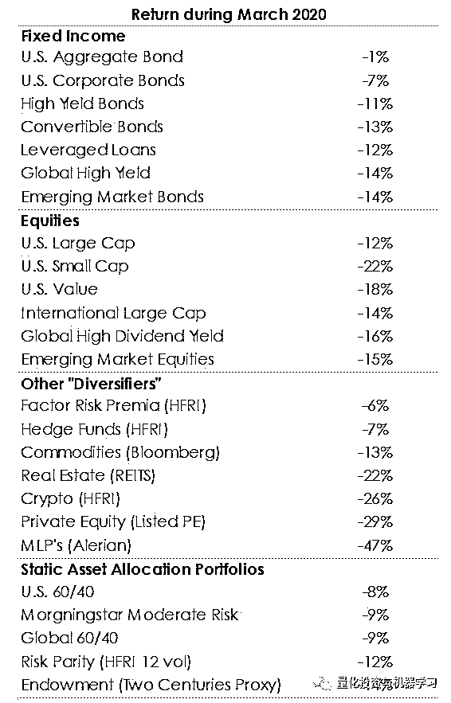

# 单因子世界

> 原文：[`mp.weixin.qq.com/s?__biz=MzAxNTc0Mjg0Mg==&mid=2653298043&idx=1&sn=e5bb65114ddf21e0fb5272ad074e91fb&chksm=802ddf6eb75a5678774704a6a9d07c677048f43574887a52b8c5256da84f82232097f60be229&scene=27#wechat_redirect`](http://mp.weixin.qq.com/s?__biz=MzAxNTc0Mjg0Mg==&mid=2653298043&idx=1&sn=e5bb65114ddf21e0fb5272ad074e91fb&chksm=802ddf6eb75a5678774704a6a9d07c677048f43574887a52b8c5256da84f82232097f60be229&scene=27#wechat_redirect)

**标星★****置顶****公众号     **爱你们♥   

作者：Mikhail       编译：1+1=6

过去 10 年，因子投资不断升温。然而，这么多年过去了，投资组合仍然由一个因子组成：**Equity Beta**。

1、在因子投资背后有许多论断和假设，在这里，有一个仍然是正确的：Equity Beta 是整个投资组合和许多多元资产类别中最重要的风险因子。

*   对于非量化人士来说，Equity Beta 和相关的股票风险溢价是由其与增长风险因子的潜在联系所驱动的。出乎意料的是经济负增长导致股市下跌，而正增长则恰恰相反。因为这种风险被认为是“不可分散的”，所以股票投资者可以获得正收益作为补偿

*   将股票收益与潜在的宏观经济风险因子联系起来，这与学院派的金融学一样古老。至少可以追溯到 1976 年，当时 Stephen Ross 提出了 APT 理论，作为 CAPM 的替代方案。

2、投资者应该从 10 年的因子投资中学到的一件事是：

*   由于这种共同的联系，任何与经济增长因子共同变动的资产类别在危机期间都变得与股票风险类似。

*   例如，高收益债券受经济增长因子影响，因此在危机期间表现得很像股票。由于高派息率和有限的财务灵活性，许多高派息股票都有同样的问题，这种问题比典型股票问题更严重。这就是为什么“为收益而拉伸”是一件冒险的事情。

3、看看 2020 年 3 月的收益，存在单因子世界的可能性变得切实存在。

*   传统上被视为多样化资产：国际和新兴市场股票、大多数固收、私人股本、大宗商品、房地产，以及多数类型的对冲基金和因子投资组合，都与同一基础增长因子有关。

*   即使是流动性驱动的价格冲击，似乎也只有在经济增长面临意想不到的巨大风险时才会出现。

*   这就是传统静态多样化继续失败的原因。即使在学习了 10 年的因子投资之后，投资者仍然持有主要由一个因子驱动的投资组合：Equity Beta。

下面是美国 60/40 组合：

4、如果说 Equity Beta 是与经济增长相关的“不可否认的首要因子”，那么，利率则是人们普遍接受的与通胀相关的“第二重要因子”。

*   然而，通胀与经济增长相关，尽管它对债券价格的影响是反向的，但我们仍可以认为，一个因子会影响其它所有因子。当你把低通胀与美联储的宽松政策和“避险”交易结合在一起时，第二重要因子似乎与“不可否认的第一因子”相反。

*   风险平价试图通过比标准的 60/40 投资组合更均匀地加权 Equity Beta 和利率敞口来解决单因子问题。然而，在我们对 1877 年的风险平价和 2020 年 3 月崩盘期间的长期研究中，我们没有看到所宣称的多元化的好处。或许这是因为股票、债券和大宗商品在很长一段时间内都以自己的方式依赖于一个因子：成长性因子（Growth）。

*   价值投资、低波动性、盈利能力和增长势头是否也与成长性因子有关？确实存在一定程度的影响 ，但它们的贡献微乎其微，而且它们的溢价是如此不可靠，而且往往相互抵消，因此它们对整个投资组合的影响几乎不存在——尤其是在市场冲击期间。

2020 年第一季度，股票风险因子的概念被真正引入了人们的视野。当经济增长陷入停顿，伴随着预期中的股市崩盘，几乎所有其它类型的投资也急剧下降——从传统的多元化投资组合到风险平价、因子投资、固收和商品、房地产和大多数对冲基金。除此之外，人们的收入也大幅下降。在经历了这样的冲击之后，人们自然会质疑我们是否真的生活在一个单因子的世界里。

2020 年第 80 篇文章

量化投资与机器学习微信公众号，是业内垂直于**Quant、MFE、Fintech、AI、ML**等领域的**量化类主流自媒体。**公众号拥有来自**公募、私募、券商、期货、银行、保险资管、海外**等众多圈内**18W+**关注者。每日发布行业前沿研究成果和最新量化资讯。

你点的每个“在看”，都是对我们最大的鼓励