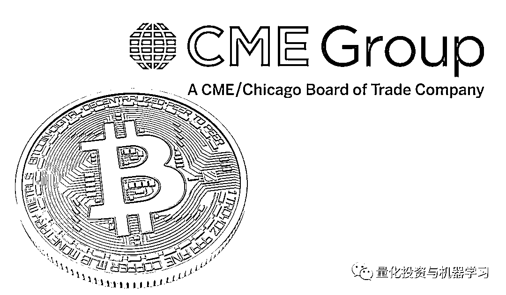

# 文艺复兴进军比特币！币圈割韭菜？

> 原文：[`mp.weixin.qq.com/s?__biz=MzAxNTc0Mjg0Mg==&mid=2653298031&idx=1&sn=55fdcd261278e8aebbb2183bb9fe8e74&chksm=802ddf7ab75a566cc8c156eb3a9f0eb6687b5e3d4faaeeee395ce9dae43132f6d06bd46a5183&scene=27#wechat_redirect`](http://mp.weixin.qq.com/s?__biz=MzAxNTc0Mjg0Mg==&mid=2653298031&idx=1&sn=55fdcd261278e8aebbb2183bb9fe8e74&chksm=802ddf7ab75a566cc8c156eb3a9f0eb6687b5e3d4faaeeee395ce9dae43132f6d06bd46a5183&scene=27#wechat_redirect)

**标星★****置顶****公众号     **爱你们♥   

量化投资与机器学习编辑部独家撰写

**未经授权，禁止转载**

根据一份监管申报文件披露具，AUM 达 750 亿美元的文艺复兴科技旗舰对冲产品大奖章基金开始涉足比特币，看来老爷子又要玩花样了

*量化投资与机器学习独家整理

文艺复兴科技表示将交易限于**芝商所（CME）的现金交割比特币期货合约**。

芝加哥商品交易所的比特币期货于 2017 年推出，以现金结算，无需接收比特币本身。CME 今年早些时候首次发布报告称，在 2020 年第一季度，交易比特币期货合约的新账户数量有所增加。

根据文艺复兴科技文件的描述：“比特币是这些期货交易的基础商品，是一种相对较新的、投机性很强的资产。同时，比特币和基于比特币的期货非常不稳定，随着时间的推移，投资结果可能会有很大的差异。”

从文件中可以看出，文艺复兴科技在比特币上的活跃程度并不明确，也不清楚它是否购买了任何一种加密货币期货，只知道它现在：**被允许参与比特币期货交易**。 

像比特币这样的加密货币仍然处于主流金融行业的边缘，由于渴望交易可能有利可图的新资产，华尔街正逐渐将它们纳入主流金融行业。

我们都知道，比特币的波动性是惊人的。它的价格从 2017 年初的不到 1000 美元飙升至当年 12 月的近 2 万美元的峰值，然后突然暴跌。自 2018 年以来，它的价格一直在 3000 美元到 1.2 万美元之间波动。

文艺复兴科技列出了加密货币交易涉及的一系列风险，如其有限的历史、波动性、缺乏官方认可的货币、监管以及易受恶意行为者操纵的影响等。

*量化投资与机器学习独家整理

大家看最后一句：

**这些因素中的任何一个都可能对该基金的投资价值产生重大而不利的影响。**

根据 WSJ 报道，大奖章基金今年年初至 4 月 14 日上涨了 24%。标准普尔 500 指数在过去 12 个月（截至 4 月 14 日）下跌了 11.4%。这远远超出了整个股票市场的涨幅，因新冠病毒的迅速传播以及政府抗疫举措使许多经济体陷入停顿，同期股票市场已经下跌了逾 11%。

报道称，大奖章迄今取得的骄人成绩大部分归功于在 3 月份 9.9%的涨幅。考虑到该基金高昂的投资者费用，收益数字甚至更加令人印象深刻。

据报道，扣除高额投资者费用前，大奖章基金今年迄今涨幅高达约 39%。

西蒙斯，今年马上要 83 岁了，身价超过 230 亿美元。根据彭博亿万富翁指数的估计，其**收入超过****10 亿****美元****！**

虽然老爷子仍然是文艺复兴的主席，但他主要关注的是慈善事业。今年早些时候。他的儿子成为了文艺复兴的董事长：

 前段时间编辑部推荐的由 Greg Zuckerman 撰写的畅销书***《The Man Who Solved the Market》***让我们了解了很多关于西蒙斯和文艺复兴的故事。也在量化圈引起热议，众多达人分享读书心得或评论。

**点击图片获取此书**

**江湖精彩**依旧****

往期推荐

 [2019 西蒙斯访谈一：量化策略、职业与交易](http://mp.weixin.qq.com/s?__biz=MzAxNTc0Mjg0Mg==&mid=2653293316&idx=1&sn=1828e486f53b70a21c04b94b020ed5c6&chksm=802dc911b75a4007c02d27551ebdfe712dfc60f8dfb6caf2aa9b6244d5f494741a8923413d6a&scene=21#wechat_redirect)  [2019 西蒙斯访谈二：数学，一生所爱！](http://mp.weixin.qq.com/s?__biz=MzAxNTc0Mjg0Mg==&mid=2653295879&idx=1&sn=682b0863d90682b69b4fc700f31e0c99&chksm=802dd712b75a5e043b3c1d550ca0e256898a870d4906895f7562272928055ca1e02bdbb85f39&scene=21#wechat_redirect)  [巴菲特+西蒙斯：完美！](http://mp.weixin.qq.com/s?__biz=MzAxNTc0Mjg0Mg==&mid=2653295230&idx=1&sn=e7db254a56084299d40cff2dc8fbc796&chksm=802dd06bb75a597d019c536a181953e88cf9e493cca776684fe688cc3582b842acd1ff1fa6b1&scene=21#wechat_redirect)  [想去文艺复兴？看看西蒙斯给你发多少钱！](http://mp.weixin.qq.com/s?__biz=MzAxNTc0Mjg0Mg==&mid=2653295088&idx=1&sn=866988471ef6e19cc4375f35f16906fb&chksm=802dd3e5b75a5af3e23ff993be3ca976d4b883182fc576145cb9525fefe783545ab2f7c8aaa9&scene=21#wechat_redirect)  [文艺复兴：西蒙斯的另一面！](http://mp.weixin.qq.com/s?__biz=MzAxNTc0Mjg0Mg==&mid=2653296499&idx=1&sn=cee54028e5d93e1375a315a530ef264f&chksm=802dd566b75a5c70659051d01a40d6a223ccf5ea30f134fa805c26d2f7c5d78f87f4afae53f8&scene=21#wechat_redirect)  [120 亿！全球 15 位顶级对冲基金经理收入揭晓~](http://mp.weixin.qq.com/s?__biz=MzAxNTc0Mjg0Mg==&mid=2653297105&idx=1&sn=877a0889c6cab876fc924cc06dc55604&chksm=802ddbc4b75a52d2f58e1f03b3e58b1c97f1abcbdb998657dcd0ed87c6a91e01994c0dda1bf0&scene=21#wechat_redirect)  [全球对冲基金备受疫情煎熬，文艺复兴暴跌 7%！](http://mp.weixin.qq.com/s?__biz=MzAxNTc0Mjg0Mg==&mid=2653297437&idx=1&sn=9f00834975468c9731f853fb38cd245d&chksm=802dd908b75a501ed04de3e95b97bc8157f19c751767de7784d30d249f41a0419e330de58ef9&scene=21#wechat_redirect) 2020 年第 79 篇文章

量化投资与机器学习微信公众号，是业内垂直于**Quant、MFE、Fintech、AI、ML**等领域的**量化类主流自媒体。**公众号拥有来自**公募、私募、券商、期货、银行、保险资管、海外**等众多圈内**18W+**关注者。每日发布行业前沿研究成果和最新量化资讯。

你点的每个“在看”，都是对我们最大的鼓励