# 二千零二十一、美国研究生院排名出炉，哈佛耶鲁竟然跌出前五?

> 原文：[`mp.weixin.qq.com/s?__biz=MzAxNTc0Mjg0Mg==&mid=2653298008&idx=1&sn=7a35de958fb24aa177315f38e17dedb1&chksm=802ddf4db75a565bf06208b504db73c238fbf19147bf8e2581b33289751a16fdd7e7c1ebca93&scene=27#wechat_redirect`](http://mp.weixin.qq.com/s?__biz=MzAxNTc0Mjg0Mg==&mid=2653298008&idx=1&sn=7a35de958fb24aa177315f38e17dedb1&chksm=802ddf4db75a565bf06208b504db73c238fbf19147bf8e2581b33289751a16fdd7e7c1ebca93&scene=27#wechat_redirect)

**标星★****置顶****公众号     **爱你们♥   

作者：UniCareer

US news 发布 2021 全美研究生院排名 

对商学院，法学院及医学院等 12 大学院排名 

其中商学院变数惊人 

哈佛跌出前五，耶鲁位列第九

纽约大学斯特恩商学院挺进前十 

成为今年全美商学院排名最大黑马

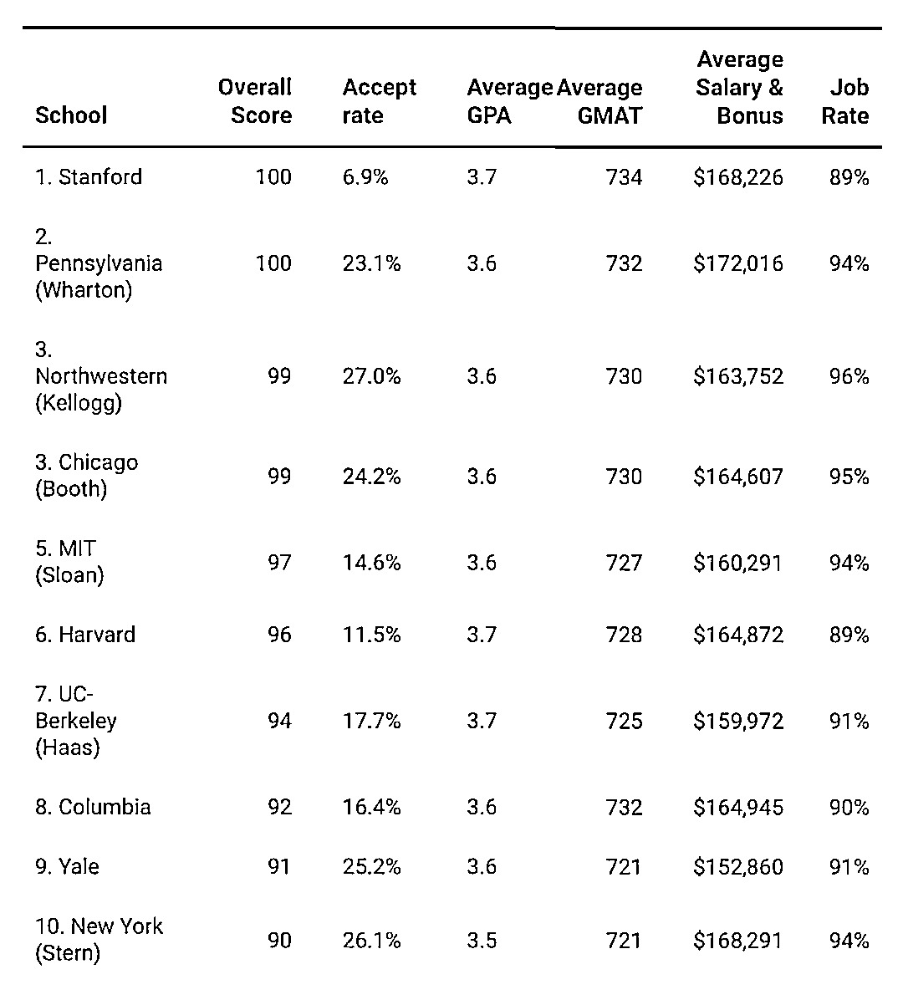

除此之外，本次排名还有哪些变动？ 

今天带你一起盘一盘 

***1***

**美国研究生院排名出炉**

近日，US News 发布全美 2021 年最佳研究生院排名，榜单共对十二个学院进行了排名，其中热度最高的当属：商学院、法学院、医学院、护理学院、工程学院和教育学院的排名，接下来就来给大家盘点一下：

 1 

**商学院排名** 

斯坦福大学商学院比去年排名上升一名，一举夺魁！去年的冠军宾夕法尼亚大学沃顿商学院则紧随其后位列第二！可以说是头把交椅轮流坐了。《纽约时报》把沃顿商学院形容为“最接近华尔街培训营的机构”，足以见得沃顿商学院在一众商学院之中的地位，与此相照应的，它也的确长期霸占着世界第一商学院的宝座。

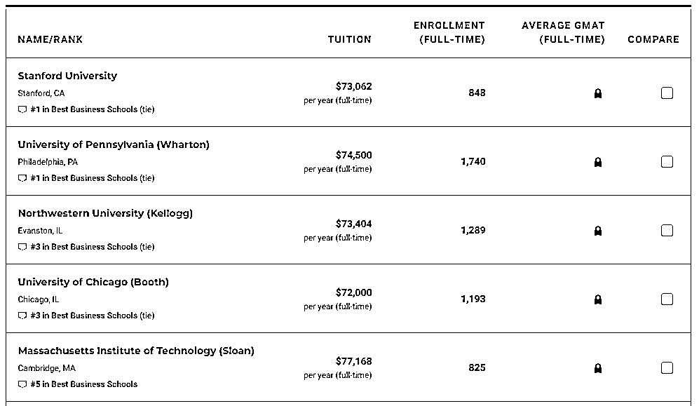

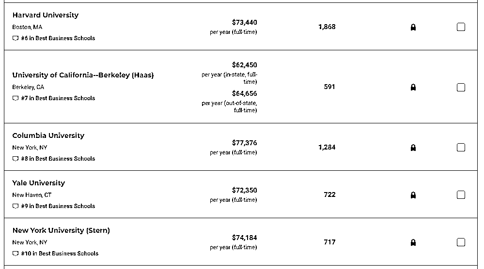

*图片来源：US News

西北大学的凯洛格商学院在排名中从去年的第六飞跃为第三！在前十名的 TOP 商学院名单中也出现了新面孔：纽约大学斯特恩商学院！他已经连续 3 年在排名上升：2019 年度第 17 名；2020 年度第 12 名；再到 2021 年度第 10 名，首次跻身前十，成为在这顶尖商学院的准追逐游戏中的最强黑马！  

 2

**法学院排名** 

法学院位列前三为耶鲁大学、斯坦福大学及哈佛大学，西北大学从去年的第十位前进到了第七位，而杜克大学则跌出了前十的位置，下降到第十二名。今年法学院排名中，上升幅度最大当属德州农工大学，上升 23 名，进入前 60，其次，新罕布什尔大学上升 14 名，进入前 90 和福特汉姆大学上升 12 名，闯进前 30。 

法学院的排名依据主要来自以下四个方面：

> *Quality Assessment 教学质量评估(weighted by 0.40)*
> 
> *Selectivity 招生质量(weighted by 0.25)*
> 
> *Placement Success 就业成功率 (weighted by 0.20)*
> 
> *Faculty Resources 教学资源 (weighted by 0.15)*

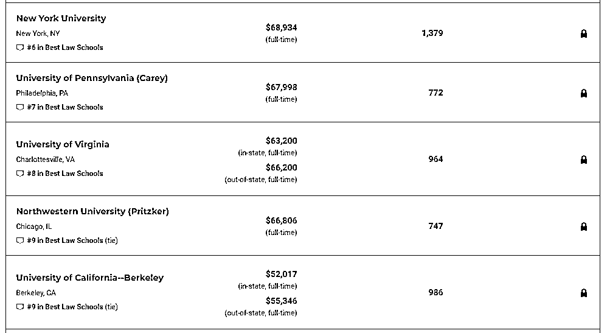

*图片来源：US News

 3

**医学院排名** 

医学院 Top3 依次是哈佛大学、约翰霍普金斯大学和宾夕法尼亚大学。值得注意的是今年纽约大学进步神速，从去年第九到今年第四和斯坦福大学平起平坐。芝加哥大学从去年的 70 名上升到今年的 58 名，挺进前 60。 

医学院的排名依据主要来自以下四个方面：

> *Quality Assessment 教学质量评估(weighted by 0.30)*
> 
> *Research Activity 研究活动 (weighted by 0.40)*
> 
> *Faculty Resources 教学资源 (weighted by 0.10)*
> 
> *Student Selectivity 招生质量(weighted by 0.20)*

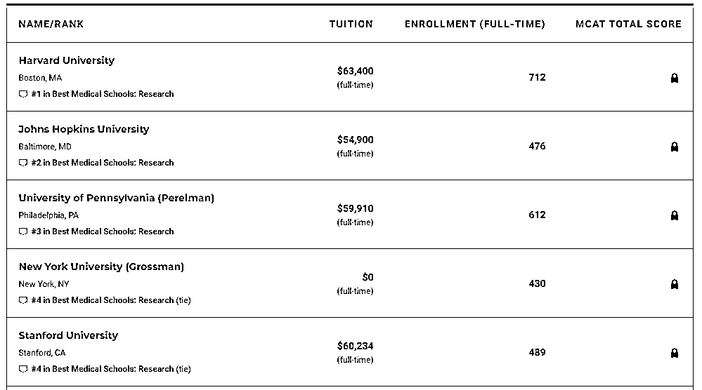

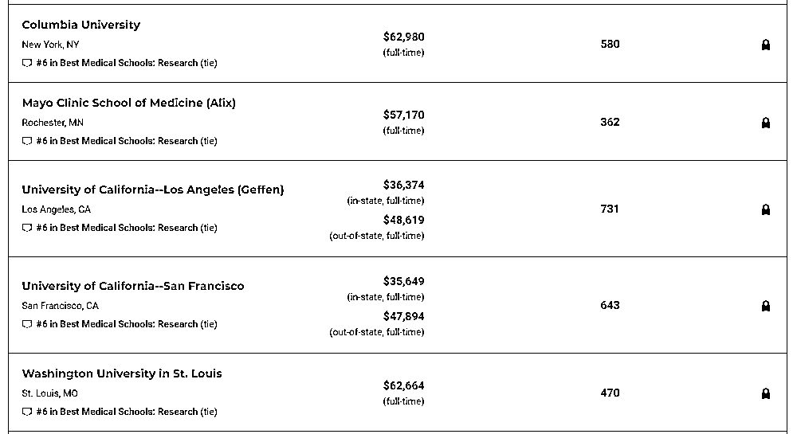

*图片来源：US News

 4

**工程学院排名** 

麻省理工学院、斯坦福大学和加州大学伯克利分校三大工科牛校霸榜前三，上升幅度较高的还有乔治华盛顿大学和圣路易斯华盛顿大学，下降幅度最大的则是莱斯大学，跌出了前三十。 

工程学院的排名依据主要来自以下四个方面：

> *Quality Assessment 教学质量评估(weighted by 0.40)*
> 
> *Student Selectivity 招生质量(weighted by 0.10)*
> 
> *Faculty Resources 教学资源 (weighted by 0.25)*
> 
> *Research Activity 研究活动 (weighted by 0.25)*

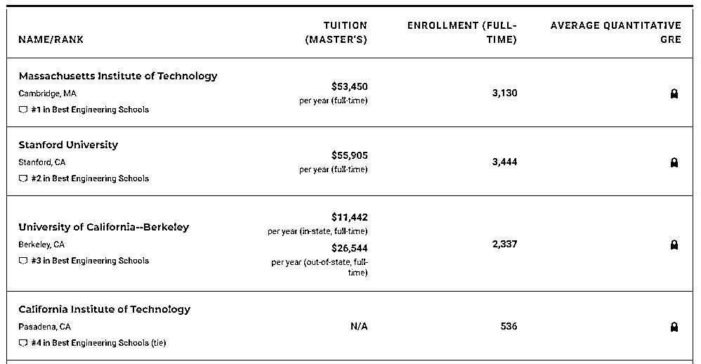

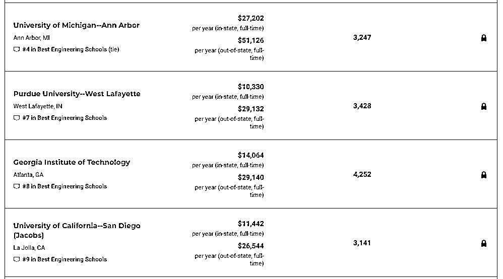

*图片来源：US News

 5

**教育学院排名** 

前三为哈佛大学、宾夕法尼亚大学和斯坦福大学，去年并列第三的 UCLA 加州系洛杉矶分校和威斯康星麦迪逊分校，今年则并列第四。

教育学院的排名依据主要来自以下四个方面：

> *Quality Assessment 教学质量评估 (weighted by 0.40)*
> 
> *Student Selectivity 招生质量(weighted by 0.18)*
> 
> *Faculty Resources 教学资源(weighted by 0.12)*
> 
> *Research Activity 研究活动 (weighted by 0.30)*

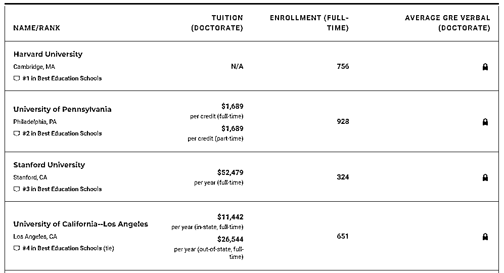

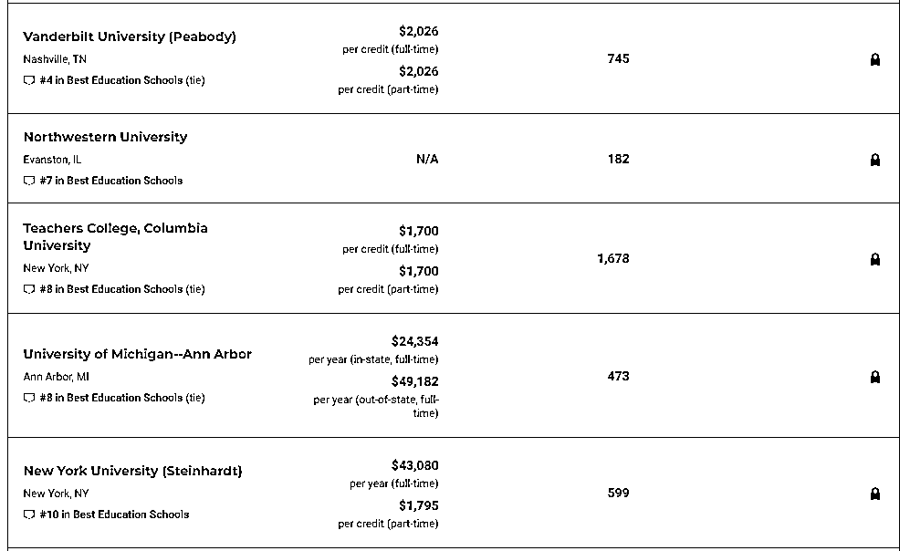

*图片来源：US News

 6

**护理学院排名** 

约翰霍普金斯大学称霸首位，位列第二的是杜克大学，而北卡罗来纳大学教堂山分校和宾夕法尼亚大学双双从去年的第五名上升至并列第三的位置。 

护理学院的排名依据主要来自以下四个方面：

> *Quality Assessment 教学质量评估 (weighted by 0.40)*
> 
> *Master's Program Student Selectivity and Master's Program Size 招生质量和项目规模(weighted by 0.1125)*
> 
> *Faculty Resources 教学资源(weighted by 0.2375)*
> 
> *Research Activity 研究活动 (weighted by 0.25)*

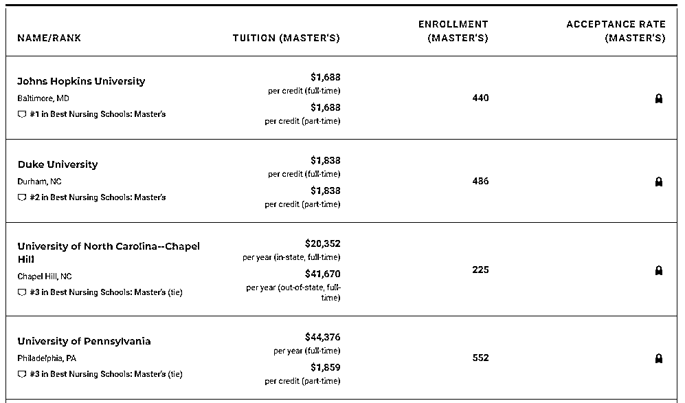

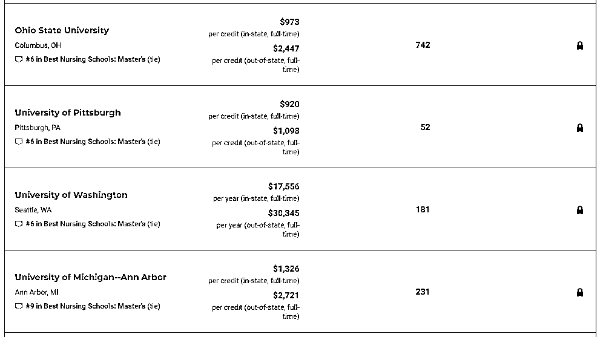

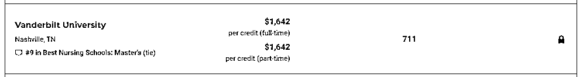

*图片来源：US News

***2***

**目标院校远比排名更重要**

 1 

**金融 Target School** 

**▶****美国**

华尔街上的精英们来自五湖四海，但是宾夕法尼亚大学和纽约大学的毕业学生却占了极大多数，根据研究报告，宾夕法尼亚大学的毕业生的人数在高盛，摩根斯坦利，花旗集团，巴克莱资本，黑石集团，华利安集团和野村控股这些公司中占第一位。

而纽约大学却是摩根大通，瑞士银行，Lazard 等公司的偏好。想进入华尔街，你并不需要来自东海岸或者常青藤。密歇根大学仅次于宾夕法尼亚大学和纽约大学占到了第三位。这群来自安娜堡的毕业生大多数就职于艾佛考尔和巴黎银行等。

***Goldman Sachs：***

University of Pennsylvania

Harvard University

 University of Michigan-Ann Arbor

 New York University

Cornell University

 Princeton University

Northwestern University

Yale University

***JPMorgan Chase：***

New York University

Harvard University

University of Pennsylvania

Columbia University

University of Michigan-Ann Arbor

University of Texas at Austin

Southern Methodist University

University of Notre Dame

University of Florida

University of California, Berkeley 

***Morgan Stanley：***

University of Pennsylvania

University of Michigan-AnnArbor

Harvard University

New York University

University of California, Los Angeles

University of Virginia

Princeton University

Duke University

Stanford University 

***Bank of American：***

Stanford University

Universityof Pennsylvania

Cornell University

Vanderbilt University

University of California, Los Angeles

University of Texas at Austin

New York University

Indiana University

University of Virginia

University of North Carolina

Dartmouth College

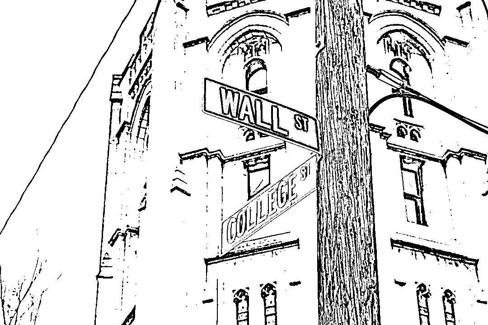

*图片来源：网络

**▶英国**

相对而言，在纽约的投行新人们就读学校范围更广，而伦敦政治经济学院、牛津大学、帝国理工学院和纽约大学斯特恩商学院则是英国投行招聘官最为青睐的地方。此外，不少欧洲学校的学生也能进入伦敦投行工作。 

相对在 QS 排名中更靠前的牛津和剑桥，LSE（伦敦政治经济学院）在投行 target school 中似乎更占优势。

***Goldman Sachs：***

London School of Economics

University of Oxford

Imperial College London

University of Warwick

University of Cambridge

University College London

Bocconi University

City, University of London

ESCP Europe

Durham University

***JPMorgan Chase：***

London School of Economics

Imperial College

Bocconi University

University of Warwick

University College London

WHU - Otto Beisheim School of Management

University of Oxford

HEC Paris

University of St Gallen

University of Cambridge

***Morgan Stanley：***

London School of Economics

Bocconi University

University of Cambridge

University of Oxford

ESADE Business School

University College London

ESSEC Business School

Imperial College London

Stockholm University

Loughborough University

**▶**澳大利亚****

申请大投行的话，澳洲八大都是 target school，不过投行 office 限制的地区只有香港和澳洲本地（墨尔本和悉尼）。（澳洲八大：澳大利亚国立大学、悉尼大学、墨尔本大学、莫纳什大学、昆士兰大学、新南威尔士大学、西澳大学、阿德雷德大学。）

**▶**加拿大****

皇后大学 Smith 商学院，约克大学的舒立克商学院和西安大略大学的 Ivey 商学院。这三家以 Ivey 最多，而且战略咨询公司 MBB（McKinsey, Bain, BCG）的 target 也是这三家再加滑铁卢的精算，其中 Ivey 因为是案例教学的创始学院之一，在管理咨询届的地位几乎媲美北美任何一所商院，他家的 career team 直接能帮你推荐纽约的面试，这在加拿大是没有任何商院能做到的。

 2

**咨询 Target School** 

如果你是名校本科毕业生，你有可能会得到咨询公司的面试，实习，甚至是工作机会；但是如果你是名校 MBA 项目毕业的话，可能你能得到的就不止是一个工作机会，而且是 Associate level 的工作机会。大量的 McKinsey, Bain, BCG (MBB) 新员工都来自名校的 MBA 项目。

**▶MBB 目标院校 | 哈佛耶鲁普林斯顿大旗不倒**

*   **Harvard (National)**

*   **Yale (National)**

*   **Princeton (National)**

*   Stanford (National)

*   MIT (National)

*   Penn (National)

*   Duke (National)

*   Dartmouth (National)

*   Brown (National)

*   Northwestern (Chicago offices)

*   U of Michigan (Chicago offices)

*   Cal Berkeley (San Francisco offices)

*   Georgia Tech (Atlanta offices)

*   UNC (Atlanta offices)

*   UVA (D.C. offices)

*   Texas (Texas offices)

**▶Target school at 2 of the 3 | 哥大可怜**

*   Columbia (不是贝恩的目标院校)

*   Cornell (不是贝恩的目标院校)

*   U Chicago (不是麦肯锡的目标院校）

*   Georgetown (不是贝恩的目标院校)

*   Emory (不是麦肯锡的目标院校)

*   Vanderbilt ((不是 BCG 的目标院校)

*   Rice (不是麦肯锡的目标院校)

*   UCLA (不是麦肯锡的目标院校)

*   USC (不是麦肯锡的目标院校)

*   Caltech (不是麦肯锡的目标院校)

**▶Target school at only 1 | NYU 威武**

*   Indiana (Bain Chicago)

*   Wisconsin (Bain Chicago)

*   Illinois (Bain Chicago)

*   Texas A&M (Bain Texas offices)

*   Wake Forest (Bain Atlanta)

*   Amherst (Bain)

*   Williams (Bain)

*   Pomona (Bain)

*   NYU (BCG New York)纽大当地真的太能打了

 3

**四大 Target School** 

以下是 EY 内部 2017-2018 年度 Target School 名单，大家自行感受：

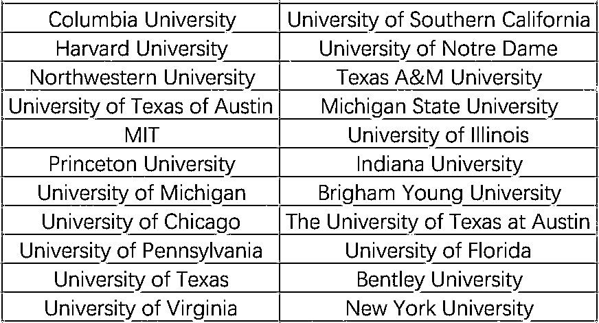

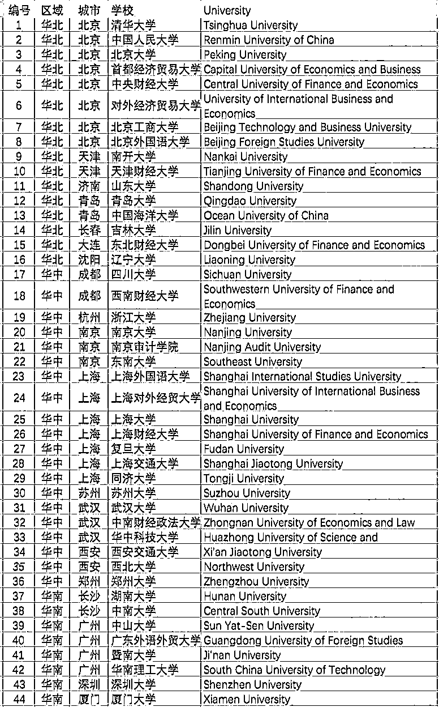

*图片来源：EY 内部 2017-2018Target School 名单

***3***

**如果不是目标院校怎么办?**

对于非 Target School 学生而言，为了获得第一轮面试机会，你需要更具创意一些甚至激进一些，比如：

 1

**用"生命"去 Target School** 

你更愿意成为 600 份在第一轮被审阅的简历中的一份，还是你更愿意给 20 个人发邮件，然后尝试吸引一个能帮助你跳过第一轮面试筛选的人的关注？根据 Linkedin 的数据，平均每天 30 封邮件和 30 个电话，是拿到面试的秘诀和关键！所以这是一道数学题，至于怎么套词？

> *一句话介绍你是谁，你的学校和专业，简单明了*
> 
> *一句话介绍你为什么找“我”，别告诉我你觉得我好看*
> 
> *一句话解释清楚你需要我帮你什么？（千万别第一次就提面试）*

比如你可以用以下的问题开场：

> *“Could you tell me about your conference last week?”*
> 
> *“How did you come to find yourself in the ... field?”*
> 
> *“How did you get started in (the area)?”*

 2

**不断 Follow Up 以及寻找内推机会** 

在第一封邮件中，要先提醒对方你是谁，如“I’m the guy wearing a yellow tie”。然后是问好和表达感谢。最好每隔几周就去问他一个小问题，让对方一直记得你。而且不能一上来就提内推，不能不能不能！重要的事情说三遍，你需要和他建立更加深层的关系！

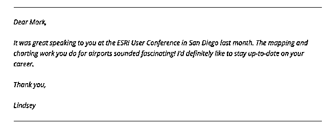

*图片来源：UniCareer

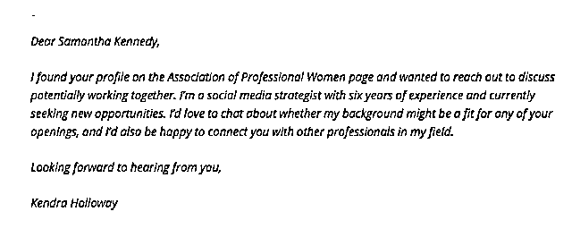

*图片来源：UniCareer

Target School 是垫脚石，但不是敲门砖，任何公司的录取都不是由单一因素决定的。而且大数据上的统计只对群体有意义，而个人的求职情况变数是很大的。企业本质上都是唯才是用，努力提升自己其实更重要。

量化投资与机器学习微信公众号，是业内垂直于**Quant、MFE、Fintech、AI、ML**等领域的**量化类主流自媒体。**公众号拥有来自**公募、私募、券商、期货、银行、保险资管、海外**等众多圈内**18W+**关注者。每日发布行业前沿研究成果和最新量化资讯。

你点的每个“在看”，都是对我们最大的鼓励