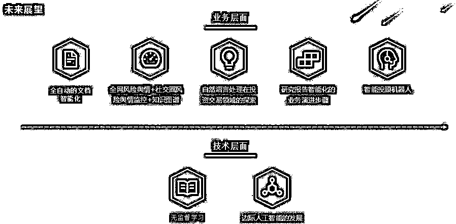

# 收藏！NLP 在金融投资领域的应用

> 原文：[`mp.weixin.qq.com/s?__biz=MzAxNTc0Mjg0Mg==&mid=2653298003&idx=1&sn=09facf600bc1e439b137495bbbbf14f9&chksm=802ddf46b75a5650c5ee8fd9df711df290f05cd1e2609abd4aed0df4aad4dc15260beaffca1a&scene=27#wechat_redirect`](http://mp.weixin.qq.com/s?__biz=MzAxNTc0Mjg0Mg==&mid=2653298003&idx=1&sn=09facf600bc1e439b137495bbbbf14f9&chksm=802ddf46b75a5650c5ee8fd9df711df290f05cd1e2609abd4aed0df4aad4dc15260beaffca1a&scene=27#wechat_redirect)

**标星★****置顶****公众号     **爱你们♥   

作者：泰极 | 华泰证券数字科技<mpsearch class="js_mpsearch appmsg_search_iframe js_uneditable custom_select_card" data-keywords="%5B%7B%22label%22%3A%22%E9%87%8F%E5%8C%96%E6%8A%95%E8%B5%84%22%7D%2C%7B%22label%22%3A%22Python%22%7D%2C%7B%22label%22%3A%22%E6%9C%BA%E5%99%A8%E5%AD%A6%E4%B9%A0%22%7D%2C%7B%22label%22%3A%22Quant%22%7D%2C%7B%22label%22%3A%22%E5%AF%B9%E5%86%B2%E5%9F%BA%E9%87%91%22%7D%2C%7B%22label%22%3A%22%E5%AE%BD%E5%AE%A2%22%7D%5D" data-w="286" data-ratio="1.5664335664335665" data-parentclass="appmsg_search_iframe_wrp" style="margin-left: 0.5em;margin-right: 0.5em;"></mpsearch>

***1***

**引言**

2017 年被称为中国金融科技的元年，这两年来，以人工智能为代表的新技术对金融业产生越来越重要的影响，人工智能不是一个新名词，在历史的长河里，它从人们曾忘却的暗流慢慢汇聚成今天的大江大河。自然语言处理作为人工智能的支流，也随着它的发展浪潮逐渐展现它的潜能。这次浪潮如此之大，让全球的金融行业都感受到它的湿意，虽然人工智能不能全部替代人工，自然语言处理也不能完全认知这个复杂的世界，但是它的发展之势势不可挡，作为金融行业从业者应该提前预判未来，早做投入，才能在未来金融科技的“军备竞赛”中有足够的弹药储备，立于不败之地甚至引领行业发展。

***2***

**人工智能发展的三次浪潮，自然语言处理迎来黄金发展期**

凡是过往，皆为序章。只有了解人工智能的过去，才能更好地畅想未来。人工智能的历史源远流长，这是人类自古以来的梦想。梦想很重要，因为许多伟大的事业都源于梦想，没有梦想哪来的奋斗热情。大约在公元前 900 年西周时期，中国的能工巧匠偃师就研制出了能歌善舞的伶人，这是中国最早记载的机器人。春秋后期，中国著名的木匠鲁班，在机械方面也是一位发明家，据《墨经》记载，鲁班曾制造过一只木鸟，能在空中飞行“三日不下”。

不过人工智能真正的发展还是要到 1936 年，英国数学家、计算机之父艾伦图灵在他的一篇《理想计算机》的论文中，就提出了著名的“图灵机模型”，1945 年他进一步论述了电子数字计算机设计思想，1950 年他又在《机器会思考吗？》一文中提出著名的“图灵测试”——一个人在不接触对方的情况下，通过一种特殊的方式，和对方进行一系列的问答。如果在相当长时间内，他无法根据这些问题判断对方是人还是计算机，那么就可以认为这个计算机具有同人相当的智力，即这台计算机是智能的。这一测试的本质是让人类测试机器是不是智能的，自此“人机大战”成了人工智能的试金石，在人工智能的发展史中一幕幕地上演。

而“人工智能”一词真正被提出来，是在 1956 年 Dartmouth 的会议上，由四位图灵奖得主、信息论创始人和一位诺贝尔奖得主一起将人工智能的名词定义出来，包括明斯基、西蒙、麦卡塞等等，这次会议被公认为人工智能研究的出生典礼。

如图所示，自 Dartmouth 会议以来，人工智能的发展起起伏伏，一共经历了公认的三次浪潮。

**第一次是发明了神经网络感知机**，看起来很像人的神经，却不能模拟稍微一点复杂的问题，所以很快进入第一次低潮。

**第二次浪潮是伴随着计算机的兴起**，1997 年，IBM 的深蓝在决定胜负的第六个回合中，只用了 22 步便迫使卡斯帕罗夫投子认负——这是棋王职业生涯里最快的失利，让全世界人类对人工智能的追捧达到了一定的高峰，但是这时候发明的 BP 神经网络或者其他网络最大的问题是，数据量少，深度不够，解决不了太多问题，因此 2000 年左右又破灭了。

**第三次浪潮算是看到了希望的曙光**：随着 2006 年 Hinton 提出的深度学习的技术，以及在图像、语音识别以及其他领域内取得的一些成功，大家认为经过了两次起伏，人工智能开始进入了成熟期。这个阶段性的成功是基于深度学习理论、海量大数据、Gpu 高速并行算力三个合力来实现的，2018 年 AlphaGo 在人机围棋比赛中连胜李世石 3 局，体现了人工智能在围棋领域的突破，作为人工智能领域的工作者，我们深感欣慰，其实质是深度学习网络（CNN）跟蒙特卡罗搜索树(MCTS)结合的胜利，是人类智慧的进步。同时人工智能不仅仅在比赛领域，也能解决一些实际问题，比如人脸识别算法、自动驾驶车辆目标检测等。

这时候自然语言处理的发展也同步被提升，怎么把一个词语表示成一组数学符号，并联系上下文，这是一个问题，2013 年谷歌提出的 word2vec 就是一个非常大的进步，现在很多人还在用这个词向量模型，让 NLP 真正激荡出令人期待的火花。接着 2014 年 seq2seq，可以解决中英文翻译的问题，谷歌的 NMT 模型超越了以往所有语言模型的效果，这导致国内有道、金山词霸、搜狗翻译都用了 NMT 模型，而抛弃了以前基于统计的 SMT 模型。2017 年的 Elmo，2018 年的 Bert 模型被认为开启了 NLP 新时代，2019 年 2 月的 Gpt2 模型，因为太强大担心被坏人破坏为由，只公开了部分模型。OpenAI 训练了一个大型无监督语言模型，能够生产连贯的文本段落，在许多语言建模基准上取得了 SOTA 表现。而且该模型在没有任务特定训练的情况下，能够做到初步的阅读理解、机器翻译、问答和自动摘要。微软亚洲研究院和哈工大都先后发表文章，NLP 引来了黄金发展时期，正赶上科创板元年，**NLP 技术和中国版“纳斯达克”邂逅，未来将点燃人工智能的熊熊大火**，人工智能、自然语言处理领域的创业变成了风口，也成为了未来几十年中国产业结构化调整，转型中高端的动能之一。

任何事情都有泡沫，但持续积累需要板凳要做十年冷的精神，神经网络从一出生到几次浪潮，后来成为冷门又成为大热门，这个过程让人感触，就在刚过去的北京时间 3 月 27 日晚，ACM（计算机协会）宣布把 2018 年度图灵奖颁给了深度学习“三巨头”Yoshua Bengio、Geoffrey Hinton 和 Yann LeCun，以表彰他们在深度学习神经网络上的工作。全世界都欠着三个人的奖项，三十年的坚持，历经漫漫长夜，他们的信念改变了自己的命运，也推动了人工智能新浪潮的发展。

***3***

**金融科技，智能投研公司层出不穷，科创板背景下大有所为**

**国内金融科技人工智能类成创投类热门**

2017 年算是金融科技的正式元年，这两三年，金融科技创业公司如雨后春笋，例如做金融数据搜索的香侬科技，做公告结构化的鼎复科技，pdf 图表检测和复原的庖丁科技，阿博茨、文因互联、阡寻科技等等，至少五六十家相关的公司。

智能投研方向到底该怎么做？我们的理解是深度结合业务，平台化的基础架构，优化算法，不断持续积累数据、系统开发经验，形成自己的金融科技“护城河”。许多公司可能没有业务支撑，**做的产品往往都是一厢情愿，带有一定的理想主义虚幻色彩，而不是真正领会市场和投资需求之后，深度融合业务思想再落地生根的。**

****

****事件驱动明星公司 Kensho****

**美国在自然语言处理结合投资研究领域率先进行探索，也基本想成了头部玩家掌握更多资源、拥有知名度和话语权的局面，例如明星公司 Kensho，试图构建全世界最大的国际事件数据库及知识图谱模型，来解决当今投资分析的“速度、规模、自动化”三大挑战问题。Kensho 的主打产品，叫“Warren”，可以通过扫描超过 9 万项全球事件，如药物审批、经济报告、货币政策等几乎地球上所有金融资产影响的事件，立即找到 6500 万个问题组合的答案。用户只需要在简单的文本框里输入非常复杂的问题——使用直白的英语。例如：当三级飓风袭击福罗里达州时，哪支水泥股的涨幅会最大？（最大的赢家是谁？德州工业[Texas Industries]）。同样，当朝鲜试射导弹时，哪支国防股会涨得最多？（雷神公司[Raytheon]、美国通用动力公司[General Dynamics]、和洛克希德马丁公司[Lockheed Martin]）。当苹果公司发布新 iPad 时，哪家苹果公司的供应商股价上涨幅度会最大？（为 iPad 内置摄像头生产传感器的豪威科技股份有限公司[OmniVision]）。**

**另外 Kensho 也发布了复杂的知识图谱产品“Visallo”，能够从海量的大数据中发现公司、组织、人物之间隐藏的关系，再和它的事件检测、事件影响分析系统联合在一起，Kensho 构建了一个强大的量化投研体系。**

****贝莱德的“阿拉丁神灯”**** 

**2000 年，贝莱德的创始人拉里芬克（Larry Fink）组建了贝莱德解决方案公司（BlackRock Solutions），并开发出了一个被称作“阿拉丁”（Aladdin）的风险管理系统。目前该系统已整合为一体化的投资交易风控平台，叫做“阿拉丁平台”（Aladdin Platform）。**

**Aladdin 的大型数据管理中心位于美国的华盛顿州，据称有上万台计算机，24 小时运行，上面跑着数十亿个经济场景的预测，并根据这些预测，检查客户投资组合中的每一项资产，对投资组合进行诊断。这些机器日复一日地记录和存储着历史事件，包括利率和汇率的变动、恶劣的天气灾难，政治丑闻等，再通过蒙特卡洛模拟，建立统计模型，计算它们对其管理的资产所存在的潜在影响。**

**Aladdin 的强大在于它这个平台管理的资产规模在 2017 年据传已经超过了 15 万亿美金，全球 225 万亿美元金融总资产的 7%。另外看网上说贝莱德的 Aladdin 业务在全球范围内的用户数量已增加至 25000 位，可以想象，其背后管理的资产规模目前会是何等的庞大。**

****金融搜索引擎 AlphaSense**** 

**大家都知道百度、谷歌搜索引擎，可以在全网搜索自己想要的内容，但是它不是针对金融的，所以在搜索的过程中会有很多无用的、和金融无关的信息，而且金融中需要的许多文件、数据，一般都在相应的专业网站上才能发布，和广义的通用的搜索引擎还是很不一样。**

**AlphaSense 就是在这种需求的背景下应运而生，它可以实时抓取，并能搜索合同、募股说明书、新闻舆情、研究报告、金融类风险管理函、政府数据网站，将 html、pdf 等文件进行结构化，并将高级语言搜索和自然语言处理算法融合，对这些文件信息进行语义分析并提取，例如可以输入某家公司，就可以搜索到实时的、历史的新闻，相应的研究报告、宏观研究数据等等，可以极大地提升效率，解决了金融信息丰富度和碎片化的问题，并且第一时间监控某个关键词或某个公司的情况，降低风险。目前国内也在做类似搜索引擎的公司有香侬科技、阿博茨、IBData、虎博科技等。**

**具体的示例，可以阅读 AlphaSense 官网的文章：**

***https://www.alpha-sense.com/blog/how-i-use-alphasense-for-equity-research-2525/***

****新兴公司 Econob****

**2013 年 4 月 23 日，拥有 190 万粉丝的美联社“推特”账号发出一条快讯：“突发新闻：白宫发生两起爆炸，贝拉克·奥巴马受伤”。虽然事后被证实是假新闻，4 月 23 日收盘时，道指涨 152.29 点，至 14719.46 点，涨幅 1.05%。但伤害已经造成，利用所谓“算法”进行交易的交易员已采取了抛售行为。**

**在扫描到包括“推特”和 Facebook 等社交网站发布的新闻信息之后，这些“算法”会自动执行买卖股票的指令。这个事件再度揭露了由电脑推动的高频交易对冲基金的影响。**

**最近有一些笑话：某公司发布公告称“预计不会造成很大麻烦”，因为里面有关键字：大麻，然后被文本识别出来发掘为工业大麻概念股，导致该股涨停了；千金药业由于产品“卫生棉条”中含有汉麻纤维而迎来尾盘涨停；桂发祥因为产品是“天津大麻花”而午后迎来资金追捧，最终收涨 6.61%；司尔特的“化肥产品能用来种大麻”而尾盘拉涨的操作；尾盘拉升大涨 6.52%的安井食品，据说是因为麻辣小龙虾被识别为大麻等等，都是基于文本挖掘的事件投资被人笑话，但我们想这个锅肯定不是 NLP 来背的。**

**在《全球金融科技权威指南》一书中提到了 Econob 公司，这家公司也是做自然语言处理落地的公司，他们开发了一套 ATRAP 系统，可以通过实时新闻来交易，例如如果 IBM 公司的盈利情况没有达到 250 亿美金的预期时，他们会卖出 IBM 股票，反之则会购买股票。每当新闻发布，ATRAP 系统便会稽查事实，如果满足了这些条件，它将会自动在市场上下单。另外识别评级事件也是可能实现的，未来也可以实现更通用的事件，例如政治事件、公司合并、CEO 离职甚至自然灾害，都是通过自动化软件去识别。一旦有这类高风险事件发生，软件就会立即提示或通知交易者。**

**前文我们介绍了自然语言处理在国内外投资领域应用的现状，本节将重点介绍自然语言处理在我们内部的实施路线。**

*****4*****

****NLP 服务框架 ****

****智能舆情****

****

**泰极智能舆情服务是基于平台化思想创建的一个内部服务，主要服务于风险监控和潜在的投资交易。组成部分为：极速爬虫、智能标签体系、深度融合业务的算法、事件因子、以及基于知识图谱构建的事件传导的影响链路。**

**对于私募客户，可能不一定非常关心超额收益，但是一定会关心风险控制能力。投资交易因为涉及到多因子，舆情作为因子之一，其有效性还需要继续探讨。**

****极速全网爬虫**** 

**在讲爬虫的过程中为什么会聚焦于“极速”？因为对于风险监控来说，风险事件感知的越早，那么在风险来临的时候就会更加从容，在投资领域也一样，进展获得相关消息，就可以及时采取措施而使得相关利益最大化。例如最近的天嘉宜化工爆炸事件，怎样在第一时间知道这条信息？我们认为：爬虫一定要快、全面。基于爬取的最新新闻，通过自然语言处理技术，比如通过关键词、公司名、人物名做定向监控，并及时应用于决策。**

**事实上，网站的数据更新还是比较慢，因为要经过人工编辑、审核、发布，所以我们考虑接入新浪微博实时数据来扩充数据源。**

****历史资讯库****

**华泰拥有过去十年的资讯数据库，这个为我们投资决策提供了太多的决策依据，堪称无价之宝。正如高盛 CEO 所罗门所说，金融行业拼的是搜集资讯和模式识别，历史数据非常重要。**

**带有人工校验、反馈的人工智能标签体系**

**抓取到各种新闻数据后，还需要和行业、个股关联到一起，并通过机器学习、深度学习做情感分类、事件标签等。**

****深度融合业务的算法**** 

****1、董监高情感面、热度等****

**在业务层面，研究者会关注上市公司董监高近期的舆情变化，这里面就会涉及新闻中包含公司、人物的提取，同时对于提取出来的公司和人物，进一步分析其公开讲话，了解其关注的业务重心，以及描述他们这些主体的情感面，包括这些新闻的热度变化情况。**

****2、公司舆情异常热度提醒****

**一般情况下，在公司没有发生任何事件时，其热度及新闻报道量是很平稳的、稀疏的甚至没有，但是一旦有事件发生，公司的新闻热度就会增加，如果事件严重程度较大，新闻热度就会激增。这时候就需要我们具备及时获取信息的能力。能不能在这个事件的热度发酵到高峰之前获悉？在这里我们构建了一个热度异常的算法，能够在热度曲线突然变化时报警。**

**技术思路主要是以滑动时间窗来划分时间周期，计算某个公司主体在每个周期内的新闻热度比（这个公司主体在当前计算周期 t 内被报道次数占所有公司报道次数的百分比），并对比上一个周期得到新闻热度比的变化率，综合计算，得到变化的幅度值 c，一旦超过 c 值就认为热度异常增加，进行报警，并且在这时通过句法分析，语义分析自动提取出发生的热点事件。**

****3、情感标签的精细化做法****

**一般情况下，都会通过标题+正文来做文本分类的方式给新闻、公告打标签，这种情况下，由于文本长短不一，正文可能要做文本截断。这就会导致部分信息缺失，可见其局限性。为了详细描述新闻里面的信息，我们将其进行分解，例如一篇新闻可能是通篇讲新能源，情感面是趋向于正面的，但是里面可能会提到一句“乐视汽车”，那“乐视汽车”周边几句话是负面的，要做面向评价对象主体的、句子级别的情感面分析。意思是乐视汽车，提到情感面是负面的，而通篇文章认为还是正面的。**

****4、事件标签检测****

**截至目前，综合历史新闻资讯数据，我们整理了一千多类事件标签，同时事件标签都有重要等级程度，收集到每条数据之后，就会自动获取对应包含的事件，同时根据事件的重要程度决定是否需要报警，如需报警则会立马启动。但目前来看，这些整理出来的事件还不够全面，需要持续迭代更新。**

**美国 Kensho 建立的民用领域最大的非结构化地缘政治和全球自然事件数据库，并用纳斯达克集团的云计算平台 FinQloud 进行数据存储，以保证数据安全。**

****事件因子**** 

**对于某些周期性发生的事件，通过文本分类或者特征提取的方式对采集到的新闻、公告等数据进行事件分类，并识别事件中涉及到的上市公司，基于基准指数对这些公司进行股票涨跌幅的回测。一般来说，回测需要使用较长时间的历史事件舆情数据和对应的行情数据，事件发生次数越多，回测的结论越客观。目前事件因子主要从事件分类体系中个股类型进行提取，目前已经有 92 类，并在细化其中较为重要的 50 类。对事件的热度、事件的影响力、事件的舆情进行提取加工，完善因子数据。**

****

****极搜公告**** 

**对于金融投资领域的数据源，除了新闻，公告也占了较大的比重，通过将所有年报公告（91 类公告）分别进行结构化处理，首先将公告分类，然后解析公告内容、还原公告目录，在历史公告库中，可以随意搜索公告数据。**

****知识图谱**** 

**基于上面讲到的数据源：新闻和公告，在经过标签体系结构化处理之后，就可以借助知识图谱做一系列的事情。比如：天嘉宜化工厂爆炸死亡 xx 人，这个事件严重程度比较高，从图谱的角度来看，这个公司可能影响到谁？其产业链上下游是哪些公司？其董监高是谁？和它类似的公司都有哪些？**

**但很可惜，金融知识图谱一般都是通过工商关系关联的，拥有了工商数据，其它相关知识从哪里获取？还是拿天嘉宜化工为例。从工商数据角度上看，其和其他公司似乎没有什么关联。但实际通过网络搜索，我们还是能够获取一些和它有关联的公司，甚至是其历史报道，这个时候就要考验我们在知识图谱中的关系补充能力。**

**公告、募股说明书里面披露的供应商关系、客户关系数据，舆情里提取出共现的关系数据等，都可以用来补充企业关联关系数据。为了提高关系补充是效率，可以尝试自动化提取产业链上下游。比如：通过句法分析，通过 deepdive 框架并加以远程监督，来提取上下游企业关系数据，当然还需要人为地添加和 Review。**

****金融 STR 服务**** 

****STR 的概念****

**传统的光学字符识别（OCR）技术已经发展了很多年。近年，随着具备拍照能力设备的大量普及，以及对信息快速获取的需求，涌现出非常多需要 OCR 技术支撑的业务场景。伴随着业务的发展，诞生出一个新概念——场景字符识别（STR）。通过手机拍发票，通过 OCR 技术，识别出发票中的日期、发票编号、金额、税率等，以简化发票信息的人工录入；通过 OCR 技术，自动识别扫描版的对账单，减少对账单的人工录入工作量。这些场景，使用通用的 OCR API，效果都难以达到预期。这是因为通过的 OCR 技术，不是为了特定场景定制的，也无法万用于任何场景。例如：手机拍的光线有可能有各种问题，照片上的发票可能是倾斜甚至有变形或者扭曲，对账单中的表格可能没有边框等。**

**传统的 OCR 技术，通常使用图像处理（如形态学处理）+机器学习（如 SVM）等技术，通常面临调参，场景适应性不高的问题。随着深度学习技术的发展，出现了基于目标检测的文字查找+对象分类技术，但是存在小目标检测准确率低的问题。之后出现了 CTPN 技术，能够实现连续文本的较为准确的检测技术，再通过 CNN+BiLSTM 技术实现文本的识别。CTPN+CNN+BiLSTM 需要大量的标注数据作为训练，且存在只能识别直线无变形文本的限制。可以看出，一个通用的 OCR 引擎适应所有场景是非常困难的。所以按照特定的领域场景定制设计并训练适合的 STR 服务，是未来的趋势。**

****金融 STR 的应用场景和核心技术****

**金融 STR 想得到的有两个重要场景：第一个是公告的自动化处理，例如季度报告，半年报，年度报告，需要把一些财务数据给提取出来，以前通过人工来做，现在可以通过人工智能算法来做，可以实现 70%左右的自动化处理，这里面涉及到扫描版的表格图像提取，提取了以后如何把表格里的文字和数字通过文本识别能力提取出来。第二个是投研业务的数据结构化处理，数据是投研业务的核心和基础。金融行业的数据基本上分为两种类型：（一）传统金融数据，通过自动化的方式收集、整理市场公开信息，将大量非结构化的数据转化为结构化数据。（二）特色数据或者另类数据，例如：卫星图片、某些通过 App 拦截的特殊数据等。**

**可见金融文档结构化，是支撑金融数据化研究和运营的关键技术。例如：分析财报数据用于投资分析，审查审阅合同、募股说明书等。在投行部门有许多募股说明书需要复核，就可以通过 STR 技术来获取相关表格，数字指标并自动审核，这样就可以自动化做一些工作提升效率，也避免一些可能的错误。像 Wind、财汇等金融数据生产公司，传统的方式是通过人工制定大量规则来达到预期 90%的准确率。而现在随着机器学习、深度学习的发展，借助这些新型技术能够大量节约成本，高效达到预期的同时能够支持更多的场景。目前 Wind、通联数据也在已有的技术基础上向自然语言处理、深度学习的方向转变。而自然语言处理技术的出现带来了一套全新的规则，要改变、适应、演变甚至成熟还是一个较大的挑战。**

**传统的基于图像处理的技术，存在适应性差，需要大规模调参的问题。近些年随着深度学习技术的发展，基于深度学习的目标检测技术发展迅速。出现了如 R-CNN，Faster-RCNN，YOLO，SSD 等目标检测模型。深度学习的目标检测具有适应性强，学习能力强等特点。YOLO、SSD 等基于 Look Once 思想的模型在基本保证准确性的前提下，大幅提升了处理性能。而基于 darknet 的 YOLOv3 模型，依赖少，训练部署简便。从处理性能，部署便利性综合评估，选择了 YOLOv3 模型作为表格检测的核心模型。**

**对于无边框的表格，需要将边框还原，才能够将最终的文字填写到单元格中。边框还原技术的关键是能够找出文字的位置，根据文字的位置推断表格线的可能位置。文字检测的技术常见的传统图像处理技术、目标检测技术等。这类问题与表格目标识别类似，但是需要更加准确的针对文字类型。目前比较流行的是 EAST(An Efficient and Accurate Scene Text Detector)模型，通过训练可以比较准确的定位文字类图形。**

**EAST 模型的 Pipeline 直接预测图像中任意方向和矩形形状的文本或文本行，通过单个神经网络消除不必要的中间步骤（例如候选聚合和单词分割）。EAST 有三个重要的特点：**

**(1) 提出了一个由两阶段组成的场景文本检测方法：FCN 阶段和 NMS 阶段。FCN 直接生成文本区域，不包括冗余和耗时的中间步骤。(2) 该 pipeline 可灵活生成单字级或行级文本预测，其几何形状可为旋转框或矩形。(3) 算法在准确性和速度上有较明显的性能优势。**

**完成字符提取之后，就可以根据字符的位置关系和连通性，补充连接，最终能够提取出连续文本框。连接补充主要基于传统的图像处理算法。首先采用形态学变换，将离散的文字变换为连通的区域。形态学变换的基本操作是膨胀 (Dilation)和腐蚀 (Erosion)，高级的包括开运算(Opening)、闭运算 (Closing)、形态梯度 (Morphological Gradient)等。**

**然后通过业界比较流行的 CNN+BiLSTM+CTC 网络来识别文字序列，转化为文字、数字。**

**总体来说，我们的思路如下：由于涉及表格样式较多（有无底纹、有无表格线、有无跨页等），为了提高通用性，采用 Fast-RCNN，Yolo V3 等目标检测算法来获取表格区域，然后通过 OCR 技术实现文字区域提取，恢复表格线，再提取文字块做文字识别，最后导出成 Excel。**

****

**这都是技术的沉淀和积累。而且边际问题很多，需要慢慢地去做，深入地去做。**

****智能外呼服务****

****智能外呼的场景分析****

**智能外呼顾名思义就是自动给客户打电话，有时候可能成为营销骚扰电话，从提效的方向考虑，可以自动对用户进行回访，调查客户满意度。我们就和客户服务中心在做这方面的工作，主要是其中的 NLP 部分。**

****智能外呼算法技术分析****

**这里清洗、标注了上万条的语料，把用户的意图分为 34 类，如下：**

****

**通过整理语料，分词、特征的提取、词向量以及分类算法（例如 FastText、TextCNN 等），配合具备兼容性和可扩展性的规则系统。**

**这里有必要解释一下为什么要加上规则系统，因为对于深度学习来说，他并不是万能的，能够通过深度学习解决的问题一般都是重复出现，有一定积累的问题，而对于新问题而言，由于没有历史数据的积累，无法进行学习，此时就有必要加入规则系统。这个问题不仅在 NLP 方面会遇到，在人工智能的任一领域都会遇到。所以必须要有规则，80%的自动化+20%的人工，才能得到问题的最优解。**

****智能外呼的未来——全自动视频聊天机器人**** 

**时代的浪潮滚滚向前，技术的发展日新月异，人工智能的发展也是这样波涛起伏，期待着它将随着科创板的春风破浪而去。**

****

****1、从“DeepFake”换脸到“生成新面孔”****

**利用 DeepFake 技术，你只需要一个 GPU 和一些训练数据，就能够制作出以假乱真的换脸视频。这是 AI 技术的突破，却也让人觉得恐慌。这意味着，任何一张脸都可以被替换。为了避免这种恐慌，下一代技术可能就是直接生成一张没有看过的脸，比如生成一个虚拟的人物作为客服，来和客户沟通。**

****2、从“呼出”智能到“呼入”智能**** 

**前面做的工作主要是智能呼出，意思是一般我们都是准备好了话术，根据话术中客户有可能的问题来做不同的意图识别，未来将做到“呼入”智能，接入客户来电，并实时回答问题。**

**2018 年 5 月，Google IO 大会上，谷歌 CEO 桑达尔.皮查伊展示了 Google Assistant 打电话的过程，直接打给美国中餐馆的服务员，自动完成了整个订餐过程。Google 在这个技术上持续耕耘了很多年，产品叫 Google Duplex，后面将持续研发，当然微软也有微软小冰。**

**所有的这些都预示着未来一定会有一个智能客服，会和客户智能通话，甚至是视频电话。**

*****5*****

****自然语言处理技术结合金融业务的未来****

**** 

****全自动的文档智能化****

**现在的金融文档智能化主要是处理公告、年报、募股说明书、合同、债券募集说明书等，实现 60%左右的智能化，剩下的都是各色各样比较难啃的骨头。** 

**例如针对公告，对于非扫描版文件，能达到 90%的自动化处理，pdf 里面有表格标签，可以很方便地把 pdf 转为 html 格式，然后还原出表格。对于扫描版文件（占公告总体的 10%左右），这里面只有 60%能处理掉，剩余的 40%样式各异，主要包括：无边框缺边框、标题反色、有底纹、跨页、单页多栏表格等各种格式的处理。**

**对于大多数同类型的公告，我们通过积累标注好的训练数据，来训练一个深度学习的黑盒子，来识别表格。这依赖于这个数据前提是同样模式、范式的数据，随着训练数据的增加，人工智能边际效应递减，也就是随着数据规模的增大，网络复杂度的增大，算力的提升，获得的进步越来越少，例如表格，我们如果标注的表格是实线表格，那么波浪线、虚线组成的表格深度学习网络可以识别吗？人的认知不是这样的，这种问题人也可以很快地识别出来，我们认为深度学习的模拟的工作模式仍然接近于对生物神经系统的模仿，而这种模仿其实并不能算是效率很高的模仿。人工智能有没有思维，有没有意识是另外的话题，但目前来看它的训练数据都是高度单一的，它的结构或者结构的规则也是比较单一的，难以形成更复杂的思维结构。人的经验、直觉、发散性思维、纠偏能力（类似于人工智能理论研究中的小样本学习、迁移学习等问题）可以解决这样的边际效应问题，但是对于目前的 AI 来说还是个待解的难题。这其实是目前人工智能技术理论的缺憾。**

****全网风险舆情+社交圈风险舆情监控+知识图谱**** 

**未来的金融爬虫应该是接近于百度的搜索引擎，甚至发展成为金融社区、自媒体等。除此之外，我们也在考虑如何拿到自媒体的数据做监控。例如我们面向目标对象评价的情感算法精准度、召回率有多高，如何保证稳定精准地运行。例如“天嘉宜化工厂爆炸”事件，它初步来看是负面的，负面新闻的主体是天嘉宜化工厂，然后爆炸事件可能是非常严重的负面事件。这个事件的严重等级需要人工列出来。它会影响到上下游哪些公司，上下游产业链怎么自动、半自动地构建？知识图谱可以在这里做得非常深入。**

**科创板出台后，我们相信对于中小型科技企业的关系查询、全面的风险控制能力提出了更全面、更实时的要求，所以爬虫能力+NLP 算法技术能力+知识图谱是我们持续跟进的方向。**

****自然语言处理在投资交易领域的探索**** 

**在投研领域，数据是业务的核心和基础。金融行业的数据基本上分为两种类型，一种是传统金融数据，通过自动化的方式收集、整理市场公开信息，将非机构化的数据转化为结构化数据。另外一种是特色数据或者另类数据，例如卫星图片、某些通过 App 拦截的特殊数据等。**

**在投资交易方面，需要事件识别的技术。当特定事件发生后，例如“发布季度报告”，提取出营收，看是否达到预期，类似于 Econob 的基于自然语言处理的交易系统。但是投资交易是个多因子问题，拿到信号后，需要先加入人工审核，才能进入下一步。**

**至于事件驱动投资的信号，也是越来越难找，以前的“高送转、股东分红”都基本失效了，在海量信息的噪声中，如何找到有效的投资事件信号？我们将重点基于极速的爬虫+事件信号的提取技术进行攻关。**

****研究报告智能化的业务演进步骤**** 

**在 A 股市场上，包括各大券商的研究所有上万的研究员，他们研究行业、公司、公告、财务数据，有明确的研究思路、特定的研究框架，随着时间的积累，他们的研究都比较透彻。但是这些研究工作总体来看，也有特定的格式，那么基于上述我们的自然语言处理工作，是否能够实现一些研报的自动化生产工作呢？**

**事实上，我们也做过一些探索。大致思路如下：数据是血液，研究框架是筋骨，自然语言的语句生成是皮肤是包装。举个例子，如果研究汽车行业，我们得了解汽车行业的研究背景、宏观发展，上下游产业链，国家政策等宏观数据，这些就是数据，然后可能分为新能源电动车、豪华车等，最后提出对几个龙头企业例如福特、大众的看法。**

**例如家电行业的框架图：**

****

**把这个框架图可以集成到知识图谱，然后通过爬虫、采购数据的方式去获取每一个节点的数据，最后通过自然语言生成话术模板，形成报告。**

**这里面可能需要用到一些文本摘要技术，例如家电行业是不是出了国家的什么政策，我们就要把政策摘要出来，然后放到相应的研究框架节点里。最后还可以通过一些 CopyNet 的技术让语句更通顺。**

****智能投顾机器人**** 

**之前外呼用到了智能对话的技术，主要是意图分类、相似句识别以及槽位填充，即：问“华泰证券股价是多少”，要把意图确定为问股价，然后还要把属性的槽位给提取出来“华泰证券”，然后根据这个意图和属性数据在数据库里进行查询并返回数据。**

**面向 C 端的智能投顾，在对话技术越加成熟以后，也可能会用到这些来应对投资者的问题，投资者可以简单问“招商银行怎么样”，我们能自动地应答，这样就节省了人力，另外还能解决一些普通查询不好查的问题，例如 i 问财的“贵州茅台过去十年的 roe 情况”，“macd 底部趋势反转的股票有哪些”等问题。**

**但是对于智能投顾来说，这种对话机器人技术只是解决了效率提升的问题，没有解决根本的资产配置问题，总体来讲在中国的金融公司中是“雷声大雨点小”。**

**笔者认为目前所谓热门的智能投顾都有如下几个问题：**

****1、智能投顾真的能给客户赚钱吗？还只是一个“智能”的营销工具？****

**源自《金融界银行》的报告中说，中国银行“中银慧投”、工商银行“AI 投”、招行的“摩羯智投”都表现不佳，有的跑输货币基金有的跑输股票型基金。目前中国全市场没有一款敢号称赚钱的智能投顾，这当然也有另外一个原因，中国的市场和美国的市场不太一样，美国市场重视基本面价值投资，中国的股票市场充满了短期投机的氛围，客户的钱给了智能投顾，三个月内亏了，客户就心虚了要赎回，巨幅回撤带给客户的压力是巨大的，亏损 20%能忍，但如果一直往下走，亏到 40%怎么办？50%呢？投资人往往在快熬到头的时候，心里的最后一道防线被突破，清仓走人。所以短期的智能投顾很难做，甚至有的人提出智能投顾要做一年期以上。**

**从目前来看，面向 C 端的智能投顾沦为营销工具，某些公司拿来宣传金融科技是可以的，但实际情况差强人意。**

****2、智能投顾的费率能大幅度降低吗？****

**智能投顾的优势是提升了效率，也不用人去管理，所以就可以大幅度降低费率。例如对于一支 ETF 指数基金，对于被动型管理基金，完全可以通过全自动的模型算法来去做，例如国外的 Schwab 公司可以做到 0 费率，中国对于基金管理费还是过高。**

****3、智能投顾自动调仓暂时无法实现****

**智能投顾自动调仓功能涉及我国的资产管理业务。该自动调仓功能在澳大利亚证券业内被称为“全权委托账户”服务，在我国法律法规中称作“代客理财”业务。智能投顾在业务方位、自动调仓、客户适当性义务上还存在一定的不确定性的合规法律风险，调仓涉及的管理费也是个问题。**

****4、智能投顾如何识别“黑天鹅”？****

**智能投顾是模型是基于风险组合、统计学模型的，那么如何应付黑天鹅？这也是很复杂的事情，光是组合管理是不够的，基于马科维茨风险均值方差理论的组合管理只是在钝化你对于风险的感受，但是它并不能防止亏钱。**

*****6*****

****自然语言处理技术的未来展望****

****无监督学习****

**吴恩达大家都知道，他最知名的是，人工神经网络通过观看一周 YouTube 视频，自主学会识别哪些是关于猫的视频。这个案例为人工智能领域翻开崭新一页。**

**现在自然语言处理其实也呈现出这个趋势，例如最新的 Bert、Gpt2 模型都是往无监督学习方向发展。对于这种发展趋势，能否训练一个对话的 Robot，能否让对话机器人阅读一些对话，识别里面的套路、思维逻辑，然后进行回复？这样都是未来发展的趋势，当然底层技术也需要发展。**

****解决边际效用问题——“边际人工智能”、“实时人工智能”**** 

**之前提过几次，人工智能能解决通用模式的问题，例如表格检测，字符识别，情感识别，公告的自动分类和结构化，但是它在达到一定的自动化处理程度后，就无效了。就好比给出人工智能海量的黑色斑马照片，它有可能把黑色当成一个标志，识别不出斑马来。**

**公告里提取表格，它有可能识别出有线框的表格，但是跨页的、无线框的识别不出来，识别出来之后的表格合并又将是一个新问题。同时这种训练语料又非常有限，怎么能做好呢？这就是需要用到迁移学习、小样本学习的能力，可能还要加入一些规则。**

**所以我们提出一个概念“边际人工智能”，未来的人工智能不仅仅是一个识别器，它还要是一个模仿的机器，一旦识别错误，立即发出反馈，同时还需要具备纠错的能力。例如训练了一个通用的表格检测模块，但有一个奇怪的表格没有识别出来，就把它标出来，送给模型，模型就能立即纠正（可能是加了一个规则系统）。**

**但是这不是一个办法，传统的机器学习是基于统计学的，意思就是必须有大量数据，才能识别出某些模式来，但是有些模式是很少见的，例如火山喷发。但是这个规则又必须具有一定的弹性，当符合这个规则的数据量达到一定程度以后，它又能转换为一个识别的模型。**

**怎么样把这个数据通用化，实现小样本、迁移学习、实时智能反馈，这样真正实现“边际人工智能”、“实时人工智能”，解决边际效应的问题，是我们未来自然语言处理技术的一个方向。**

**道路是曲折的，未来是光明的。人工智能大数据技术不断植入到金融体系之后，金融的 DNA 已悄然改变，这种说法有一种科幻和冒昧的味道。但人工智能、自然语言处理背后绝不是投机主义，而是基于算法、算力、数据、经验规则的持续积累，对科技文化、对人才的尊重和渴求，对行业格局的深邃洞悉，是对人类最初梦想的追逐，是我们长期坚持要形成的助力金融创新的“硬科技”。**

**量化投资与机器学习微信公众号，是业内垂直于**Quant、MFE、Fintech、AI、ML**等领域的**量化类主流自媒体。**公众号拥有来自**公募、私募、券商、期货、银行、保险资管、海外**等众多圈内**18W+**关注者。每日发布行业前沿研究成果和最新量化资讯。**

******你点的每个“在看”，都是对我们最大的鼓励**