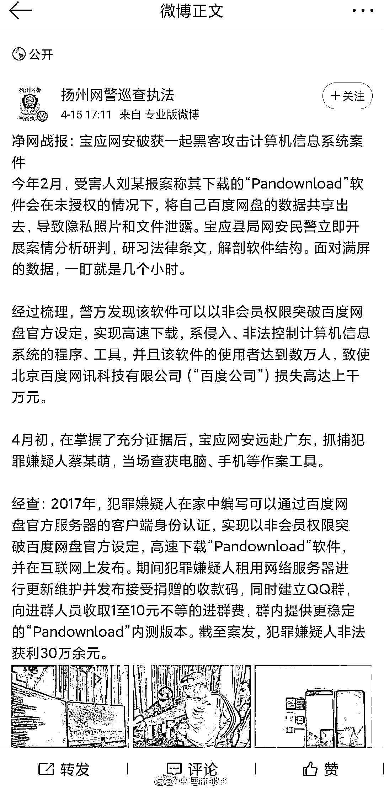
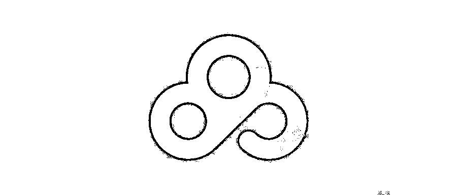
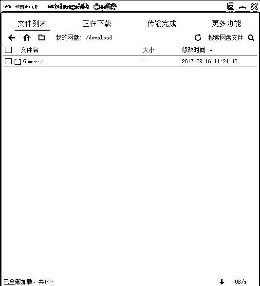
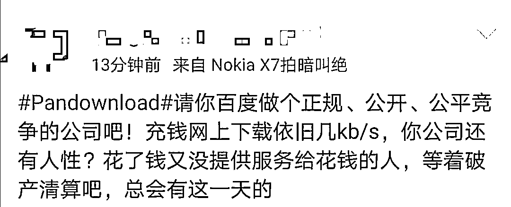
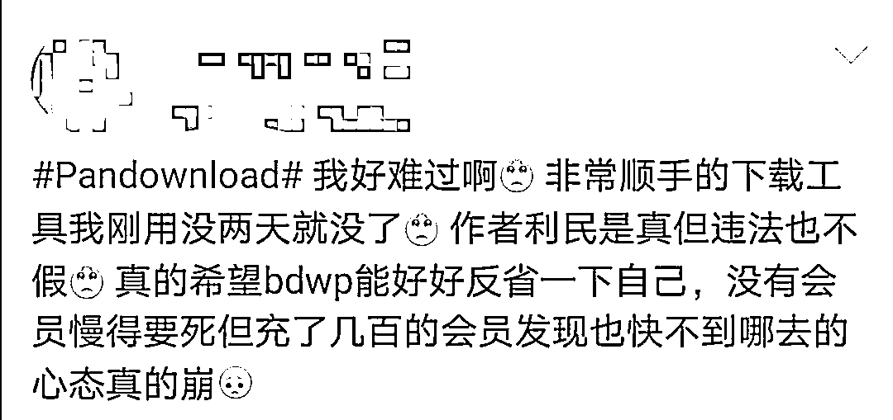
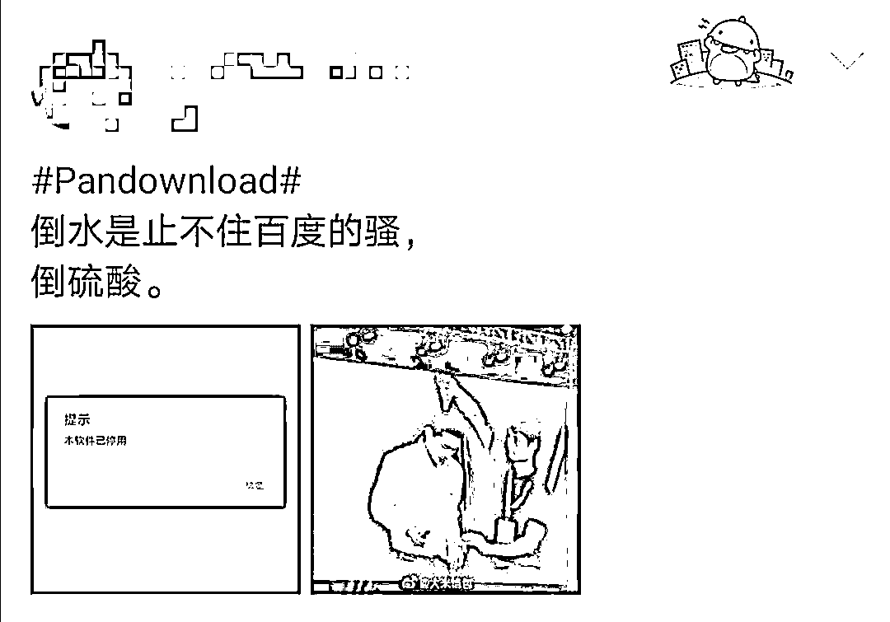
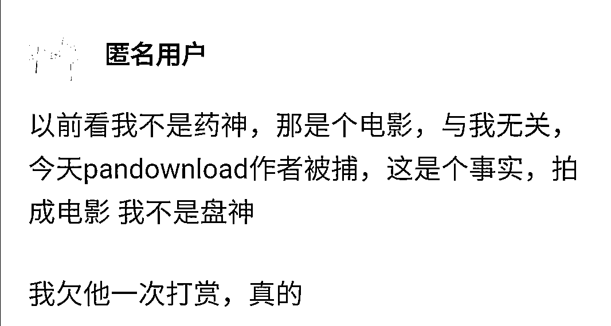

# 我不是盘神！PanDownload 作者被捕，一代神器凉凉

> 原文：[`mp.weixin.qq.com/s?__biz=MzAxNTc0Mjg0Mg==&mid=2653297992&idx=1&sn=03f1087d996e216e74ea73fcaea6b945&chksm=802ddf5db75a564b7377f4ad4a822c02f87bd77c36f5f7d03ac1d7e36b2a54bc36aedb6d0c9f&scene=27#wechat_redirect`](http://mp.weixin.qq.com/s?__biz=MzAxNTc0Mjg0Mg==&mid=2653297992&idx=1&sn=03f1087d996e216e74ea73fcaea6b945&chksm=802ddf5db75a564b7377f4ad4a822c02f87bd77c36f5f7d03ac1d7e36b2a54bc36aedb6d0c9f&scene=27#wechat_redirect)

**标星★****置顶****公众号     **爱你们♥   

***0***

**前言**

太心痛了！昨天，2020 年 4 月 15 日下午五点多钟的时候，微博@扬州网警巡查执法官方微博通报了一则消息。
PanDownload 开发者因为涉嫌非法入侵控制计算机信息系统的程序被警方逮捕了，当场查获电脑、手机等作案工具。微博发完以后一度上了热搜。虽然随后官微删了这条推文，但是已经基本确认了一代神器就此落幕了！

***1***

**Pandownload**

大家都知道，Pandownload 是一款第三方某度网盘工具。
某度巨坑的下载速度都是尽人皆知的，为此民间大神开发了 PanDownload，免费的，支持 PC 和 Android，下载完成以后解压缩，良心软件只有 5MB 大小。最重要的核心是解决了某度网盘令人抓狂的几 kb 下载速度。下载使用 PanDownload，一般下载速度平均 1~2MB/s，峰值速度有时候为 5MB/s 甚至更高。真的，用过的朋友应该都知道，真的是太香了！之前还发文给大家各种力推，如今凉凉了。

***2***

**大家是如何看待这件事的**

其实长期以来某度的功能做的太烂收费还高，用户大多是心存不满的，每隔一段时间就能听见某产品太烂而被 diss 的声音。
此次 Pandownload 神器凉了以后，便利一去不再，网友们的愤怒再次爆发转移到网盘本身，微博里各种评论直指网盘速度体验差。但毕竟 PanDownload 是第三方的软件，一直游走在灰色地带，人在屋檐下不得不低头，在市场竞争的环境下触碰到人家的利益，从正常的法律渠道而论，被抓也是无可厚非的。只不过这么好用的软件没有了真的太可惜了！而且说实在的比这过分的比比皆是，如果说这构成非法的话，那所有油猴里的脚本、各类平台内分享的破 j 软件都可以定罪了。知乎的一个网友形容的非常恰当，这就好比现实版的我不是药神，以这个为题材都可以拍一个**我不是盘神**了。话又说回来某度这样搞实在有点不大气，搞市场垄断，又不加强产品功能。花钱和没花钱一个模样，几百元的会员充进去，下载速度依旧几 kb，真的是让广大使用者失望透顶了。无论怎么说，作为使用者来说解决我的痛点，感谢 Pandownload 开发者无私奉献了这么一款神器软件，我能看到他背后的精神，致敬。最后要说的是，我们真的欠他一次打赏。欢迎留言。

量化投资与机器学习微信公众号，是业内垂直于**Quant、MFE、Fintech、AI、ML**等领域的**量化类主流自媒体。**公众号拥有来自**公募、私募、券商、期货、银行、保险资管、海外**等众多圈内**18W+**关注者。每日发布行业前沿研究成果和最新量化资讯。

你点的每个“在看”，都是对我们最大的鼓励