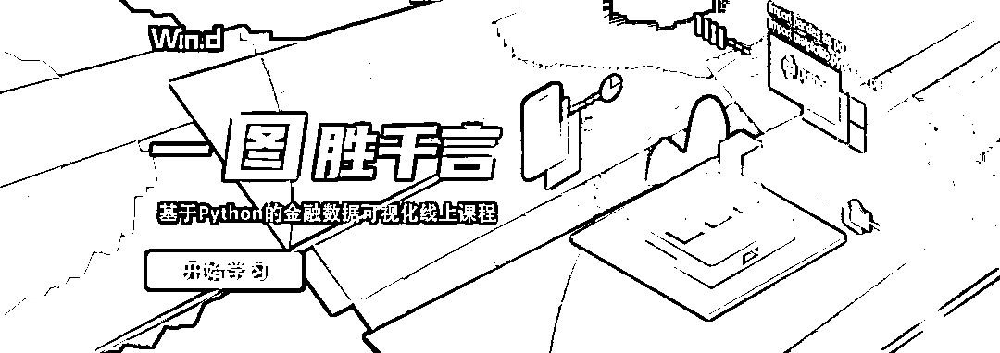
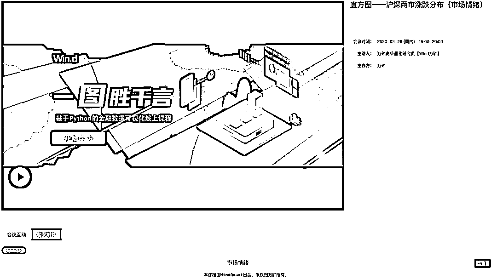
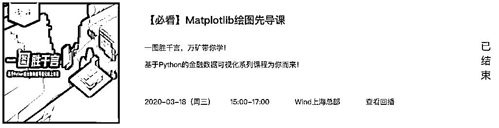
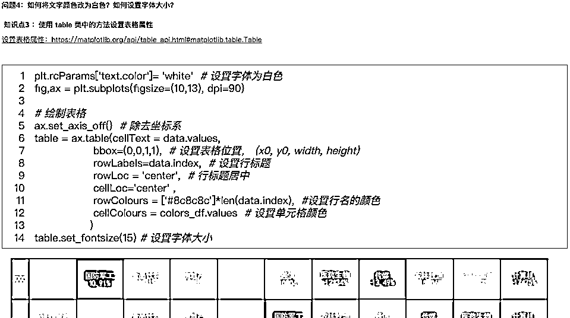
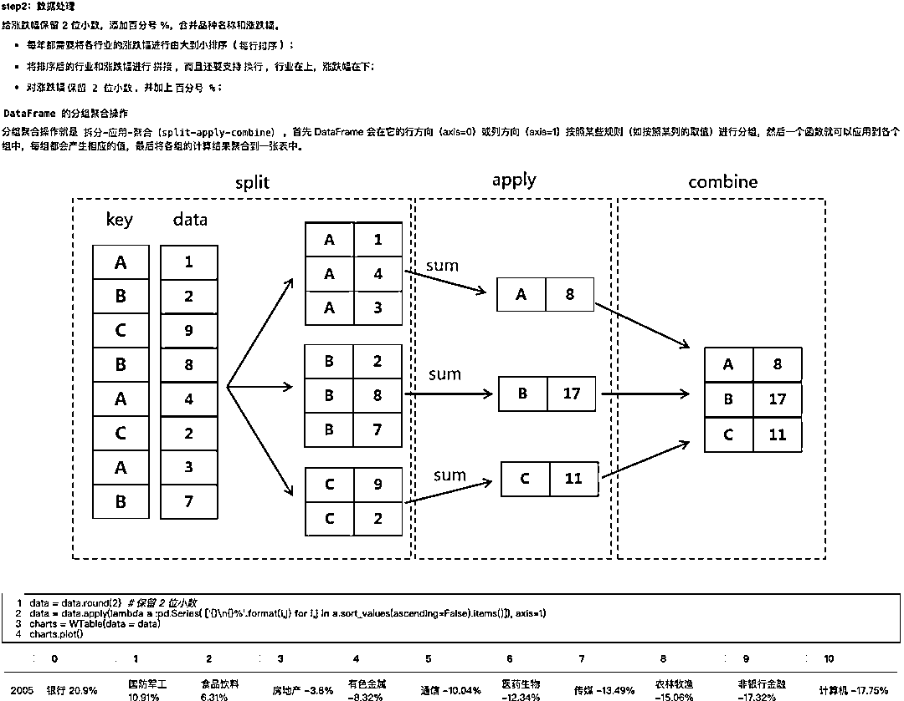
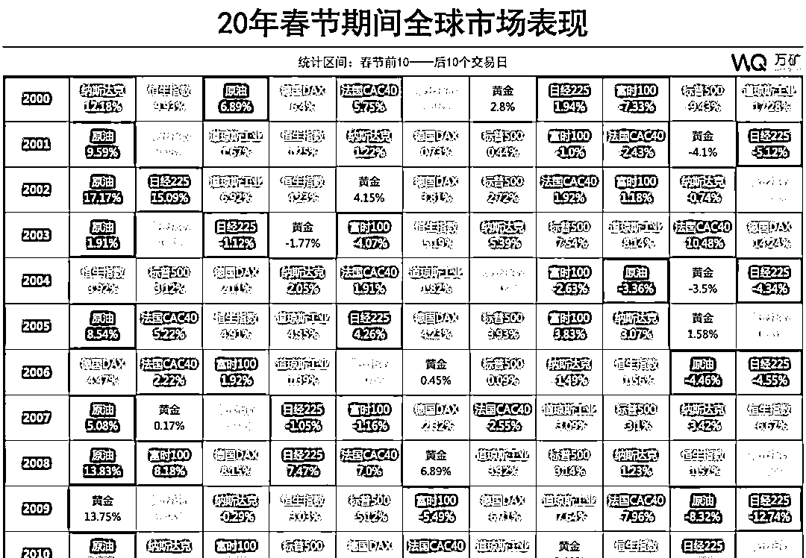
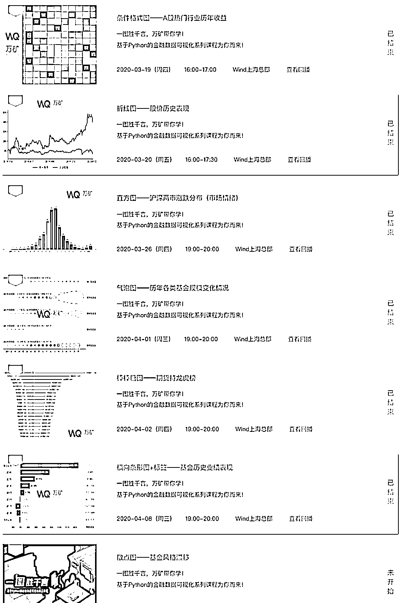
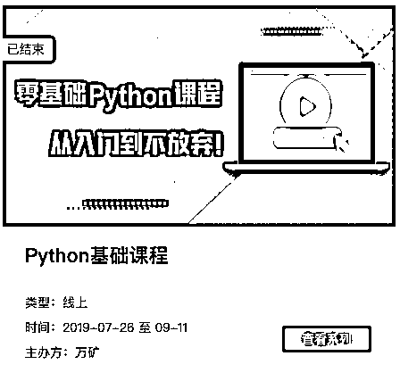
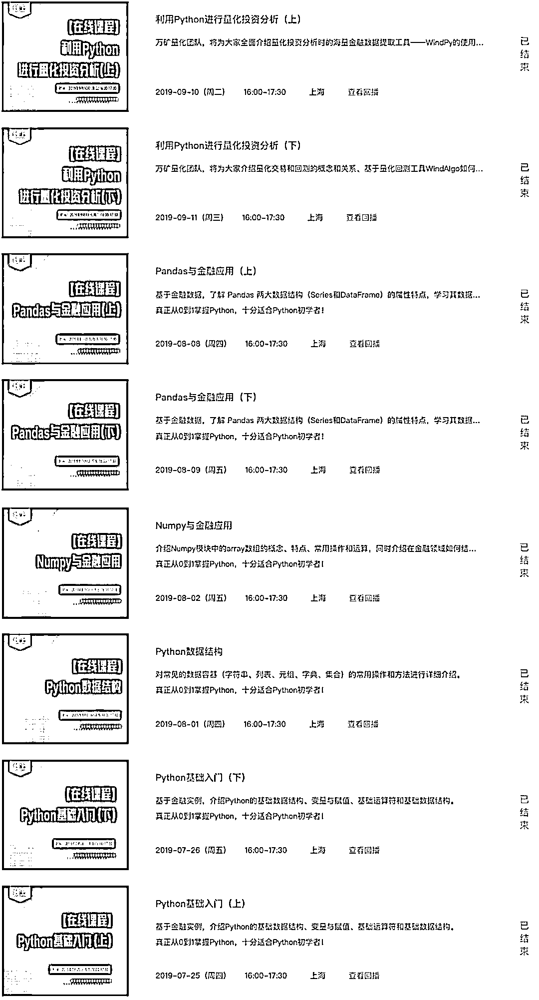

# 一图胜千言！

> 原文：[`mp.weixin.qq.com/s?__biz=MzAxNTc0Mjg0Mg==&mid=2653297986&idx=1&sn=67e9eea72ff7e1395ce94db962004a6f&chksm=802ddf57b75a5641da770379cb5fd42303dc476114422902e01db683fc00a292b3a9e81f4674&scene=27#wechat_redirect`](http://mp.weixin.qq.com/s?__biz=MzAxNTc0Mjg0Mg==&mid=2653297986&idx=1&sn=67e9eea72ff7e1395ce94db962004a6f&chksm=802ddf57b75a5641da770379cb5fd42303dc476114422902e01db683fc00a292b3a9e81f4674&scene=27#wechat_redirect)

**标星★****置顶****公众号     **爱你们♥   

在金融领域，炒股要看 K 线，研究要看报告，量化要用模型····。所有这些基于金融数据衍生出的 K 线、图表等，无时无刻出现在我们的身边。

*   **如何在万千数据中抓住重点？**

*   **如何从一张图中读到我们想要的信息？**

*   **如何使用恰当的图表？**

*   **如何画出自己想要的图表？**

数据可视化，更准确的说是**规范的数据可视化**让我们做到了这一点。

但是，很多人在这方面存在误用：

<<< 向左滑动查看

<<< 向左滑动查看

<<< 向左滑动查看

职场人最大的痛莫过于时间花了工作没完成，数据可视化这件事尤其如此。**作图不掌握要领，投入的时间都是徒劳，像是无头苍蝇，只是在横冲直撞。**

今天，**WindQuant 万矿量化平台经过数月打磨**，为全网用户重磅推出了一门基于 Python 的金融数据可视化在线课程。

此次系列课程与其他画图课程的**区别**是： 

*   **直击金融领域，Wind 强大数据支持**
*   **解决不会选图、不会用图困惑**
*   **基于 Python，提高程序化实战**

最关键的是： 

**免 费**

**免 费**

**01**

**高标准、精制作**

WindQuant 万矿量化平台推出的《一图胜千言》系列课程，由团队研究员精心编写，每一节课都由**课件+视频**构成。

同时，还专门编写了 Matplotlib 绘图先导课，对于**基础薄弱的同学进行强化学习**：

课程内容由浅入深，**每一行代码都有注释，每一张图都循序渐进**，一步步教大家如何让你的图从丑小鸭变成白天鹅！

*部分课件截图

*部分课件截图

**02**

**紧扣金融、动静结合**

此次课程全程都围绕： 

**金融数据+金融图表**

所有图表都是我们在**各大财经网站、博客论坛、研究报告、金融自媒****体**等领域看到的**高出场率图表。**同时，图表还**包括静态、动态**。

条件格式收益图：

动态全球 GDP 竞赛图：

[`mp.weixin.qq.com/mp/readtemplate?t=pages/video_player_tmpl&action=mpvideo&auto=0&vid=wxv_1172662752566067201`](https://mp.weixin.qq.com/mp/readtemplate?t=pages/video_player_tmpl&action=mpvideo&auto=0&vid=wxv_1172662752566067201)

部分课程内容：

**03**

**Python 强化，步步提高**

由于此次课程是基于 Python 进行编写。考虑到有些人的 Python 基础比较薄弱，没关系。我们也为大家准备了**《零基础 Python 课程》**。同样，所有课程都是由**课件+视频**构成。

ps:《零基础 Python 课程》可是 Wind-万矿 2019 年的**网红课程**哦！

心动不如行动，快来学习吧！所有课程都可通过**万矿官网【活动】**页面进行查看：

***www.windquant.com ******>> ******活动***

同时，大家也可**扫码下方二维码**查看具体课程内容：

**扫码，盘它**

量化投资与机器学习微信公众号，是业内垂直于**Quant、MFE、Fintech、AI、ML**等领域的**量化类主流自媒体。**公众号拥有来自**公募、私募、券商、期货、银行、保险资管、海外**等众多圈内**18W+**关注者。每日发布行业前沿研究成果和最新量化资讯。

你点的每个“在看”，都是对我们最大的鼓励