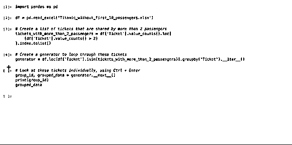
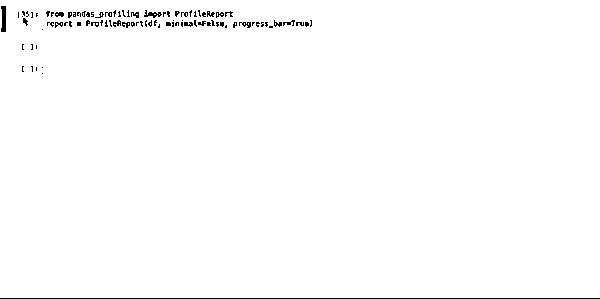
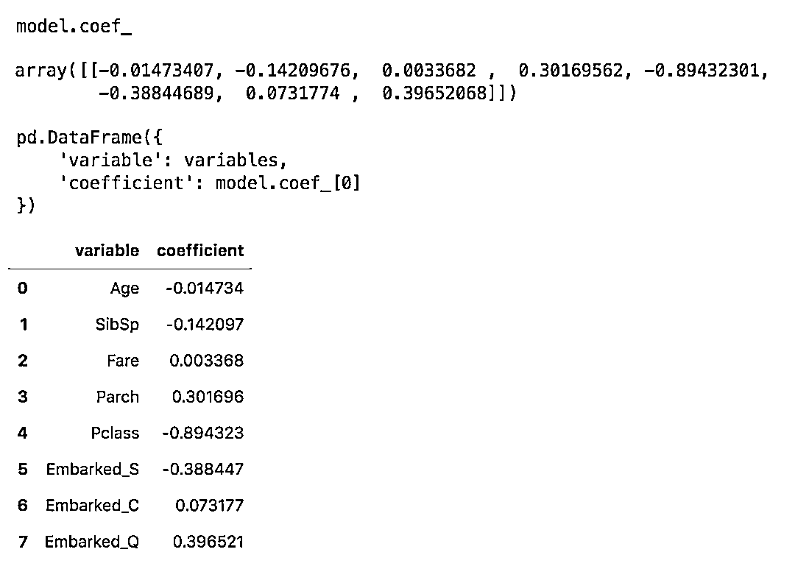
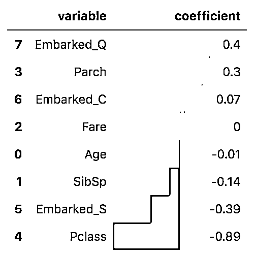
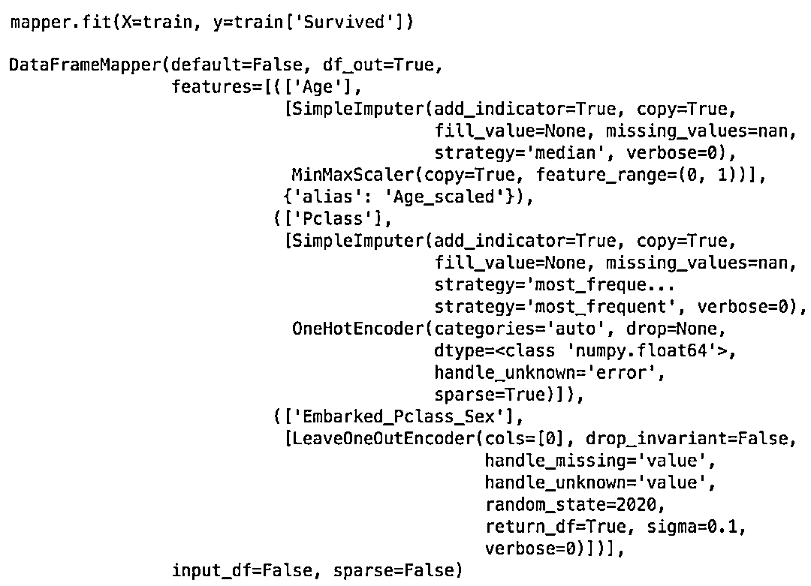

# 提高效率，拒绝重复！7 个 Pandas 数据分析高级技巧

> 原文：[`mp.weixin.qq.com/s?__biz=MzAxNTc0Mjg0Mg==&mid=2653297976&idx=1&sn=a682e11a58a01bca076da4450b9629b4&chksm=802ddf2db75a563b4bdddc8daa8c2b356ee449ad5ae1292909da264648707767133fcd65653a&scene=27#wechat_redirect`](http://mp.weixin.qq.com/s?__biz=MzAxNTc0Mjg0Mg==&mid=2653297976&idx=1&sn=a682e11a58a01bca076da4450b9629b4&chksm=802ddf2db75a563b4bdddc8daa8c2b356ee449ad5ae1292909da264648707767133fcd65653a&scene=27#wechat_redirect)


**标星★****置顶****公众号     **爱你们♥   

作者：Revert       编译：1+1=6


***1***

**用 df.groupby ().iter ()分析数据样本**

**与 Excel 相比，在 Jupyter Notebook 中逐行或逐组地查看数据集通常比较困难。一个有用的技巧是**使用生成器并使用*****Ctrl + Enter*****而不是*****Shift + Enter*****来迭代地查看同一个单元格中的不同样本。****

**首先，使用 *.**g******roupby()***（或 ***.iterrows()***）生成器创建一个单元格，并添加 ***._ iter__()***：**

```py
`generator = df.groupby(['identifier']).__iter__()` 
```

**然后，使用键盘快捷键***Ctrl + Enter***，尽可能多地运行以下单元格，以观察对你来说最重要的数据：**

```py
`group_id, grouped_data = generator.__next__()
print(group_id) 
grouped_data` 
```

**下面是一个分析泰坦尼克号数据集中的乘客的例子，这些乘客的机票号码完全相同。你没有能力把每一组乘客单独分开，所以使用这种方法可以让你用一种非常简单的方法分析每一组乘客：**

****

*****2*****

****用于数据探索和数据质量评估技巧****

**在数据科学中，我们常常倾向于从头开始编写我们的数据分析代码。因为所有的数据集都是不同的。然而，有一个神奇的 ***pandas_profiling ***包使得这种逻辑毫无意义。这个包实际上自动化了数据探索和数据质量评估步骤！看一看：**

****

**显然，它不能解决所有的数据分析问题，例如，如果数据中有文本变量。但它应该是你开始分析任何数据集的方式！**

*****3*****

****多重 chain****

**一旦你理解了可以使用链接方法组合多个操作，Pandas 就变得非常有趣。链接基本上是在相同的代码“行”中添加操作。** 

**运行下面的代码：**

*   **在数据集中添加新列（***.merge***）**

*   **计算女乘客比例（***.apply(female_proportion)***）**

*   **乘客人数超过一人的团体（***df.Ticket.value_counts()>1***）**

*   **拥有相同的票号（***.groupby('Ticket ')***）**

**我们不需要创建新的 dataframes，新的变量等任何新的东西。链接方法允许你把你的想法“翻译”成实际的操作。**

```py
`def female_proportion(dataframe):
    return (dataframe.Sex=='female').sum() / len(dataframe)

female_proportion(df)` 
```

```py
`df.merge(
    df.loc[
        df.Ticket.isin(
            df.Ticket.value_counts().loc[
                df.Ticket.value_counts()>1
            ].index
        )
    ].groupby('Ticket').apply(female_proportion) \
     .reset_index().rename(columns={0:'proportion_female'}),
     how='left', on='Ticket'
)` 
```

**下面的例子也是 chain 方法的一个很好的例子：**

*****4*****

****绘制系数/特征重要性与风格****

****如果你在做机器学习，如果用外行的话来解释清楚你的机器学习模型你觉得特别困难。** 这里有一个方法可以帮助你，那就是**在你的模型中有一个很好的视觉系数或者特征重要性。****

****

**以下是我们一直在重复使用的可视化结果（避免重新造轮子）：**

```py
`pd.DataFrame({
    'variable': variables,
    'coefficient': model.coef_[0]
}) \
    .round(decimals=2) \
    .sort_values('coefficient', ascending=False) \
    .style.bar(color=['grey', 'lightblue'], align='zero')` 
```

**结果如下：** 

****

**变量是根据系数（或变量重要性）进行排序的，彩色条允许我们快速找到最重要的变量。Pclass 列有最大的（负）系数，它的绝对值是第二大的系数 Embarked_Q 的两倍。**

*****5*****

****sklearn pandas****

****如果你是一名 Pandas 爱好者，你会不止一次地意识到，与 Pandas DataFrame 和 sklearn 联合并不总是最佳选择。但不要就此止步。一些贡献者创建了 sklearn_panda，它介于这两个包之间，为他们架起桥梁。它用一个 Pandas 友好的 ***DataFrameMapper***替换了 sklearn 的 ***ColumnTransformer***。****

```py
**`from sklearn.impute import SimpleImputer
from sklearn.preprocessing import OneHotEncoder
from sklearn.preprocessing import MinMaxScaler, StandardScaler
from sklearn_pandas import DataFrameMapper
from category_encoders import LeaveOneOutEncoder

imputer_Pclass = SimpleImputer(strategy='most_frequent', add_indicator=True)
imputer_Age = SimpleImputer(strategy='median', add_indicator=True)
imputer_SibSp = SimpleImputer(strategy='constant', fill_value=0, add_indicator=True)
imputer_Parch = SimpleImputer(strategy='constant', fill_value=0, add_indicator=True)
imputer_Fare = SimpleImputer(strategy='median', add_indicator=True)
imputer_Embarked = SimpleImputer(strategy='most_frequent')

scaler_Age = MinMaxScaler()
scaler_Fare = StandardScaler()

onehotencoder_Sex = OneHotEncoder(drop=['male'], handle_unknown='error')
onehotencoder_Embarked = OneHotEncoder(handle_unknown='error')

leaveoneout_encoder = LeaveOneOutEncoder(sigma=.1, random_state=2020)

mapper = DataFrameMapper([
    (['Age'], [imputer_Age, scaler_Age], {'alias':'Age_scaled'}),
    (['Pclass'], [imputer_Pclass]),
    (['SibSp'], [imputer_SibSp]),
    (['Parch'], [imputer_Parch]),
    (['Fare'], [imputer_Fare, scaler_Fare], {'alias': 'Fare_scaled'}),
    (['Sex'], [onehotencoder_Sex], {'alias': 'is_female'}),
    (['Embarked'], [imputer_Embarked, onehotencoder_Embarked]), 
    (['Embarked_Pclass_Sex'], [leaveoneout_encoder])
], df_out=True)

mapper.fit(X=train, y=train['Survived']) `**
```

****下面是使用. fit ()方法后的输出示例：****

********

*******6*******

******tqdm******

****在处理大型数据集时，数据操作需要时间。**使用 tqdm 来跟踪你的代码是否正在实际运行，以及它需要多长时间**，而不是在你的 Jupyter Notebook 无聊的等待，而不知道发生了什么。**对于运行速度太慢的脚本，这也是一种尽早中止的好方法。******

```py
**`from tqdm import notebook
notebook.tqdm().pandas()`** 
```

****现在所有的 Pandas DataFrame 都有了新的方法：****

*   *******.progress_apply， .progress_applymap*******

*   *******.progress_map*******

****它们与 apply、 applymap 和 map 一样，只是它们将绘制一个进度条。很酷！****

********

*******7*******

******使用.to clipboard()粘贴数据到 Excel 中******

****如果你是 Excel 的忠实用户，尽管 Pandas 有许多选项，但是通过最少的编码很难获得类似的输出水平。****

****有一件事可以这么干，那就是把我们的结果导出到 Excel 中。但是**没有使用.to_excel 方法**。相反，我们使用更流畅的 ***.to_clipboard(index=False)*** 将数据复制到剪贴板。然后在 Excel 中使用 Ctrl + V 将数据粘贴到当前电子表格中。****

****2020 年第 78 篇文章****

****量化投资与机器学习微信公众号，是业内垂直于**Quant、MFE、Fintech、AI、ML**等领域的**量化类主流自媒体。**公众号拥有来自**公募、私募、券商、期货、银行、保险资管、海外**等众多圈内**18W+**关注者。每日发布行业前沿研究成果和最新量化资讯。****

************你点的每个“在看”，都是对我们最大的鼓励****