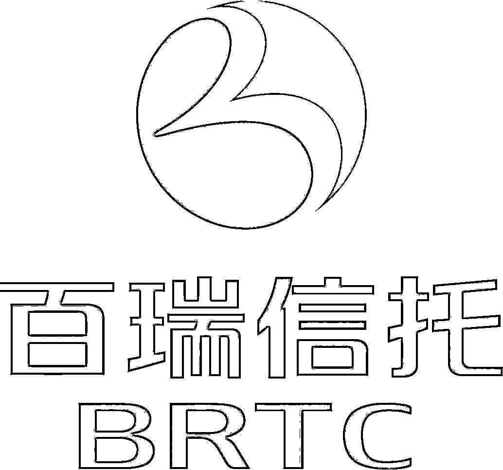

# 百瑞信托 | 数据分析多岗位招聘（郑州、北京、上海）

> 原文：[`mp.weixin.qq.com/s?__biz=MzAxNTc0Mjg0Mg==&mid=2653297960&idx=1&sn=1a710543106d34e60bac33f53ea1f386&chksm=802ddf3db75a562b736e38af1fd78cfc260282da958b04bb2c00dc730938af8b3f9389b792a3&scene=27#wechat_redirect`](http://mp.weixin.qq.com/s?__biz=MzAxNTc0Mjg0Mg==&mid=2653297960&idx=1&sn=1a710543106d34e60bac33f53ea1f386&chksm=802ddf3db75a562b736e38af1fd78cfc260282da958b04bb2c00dc730938af8b3f9389b792a3&scene=27#wechat_redirect)

**标星★****置顶****公众号     **爱你们♥

量化投资与机器学习微信公众号，是业内垂直于**Quant**、**MFE**、**Fintech****、AI、ML**等领域的**量化类 TOP 自媒体**。公众号拥有来自**公募、私募、券商、期货、银行、保险资管、海外**等众多圈内**18W+**用户，我们为所有量化金融机构**免费提供**岗位招聘与推广，再次感谢各大金融机构对我们的信任和支持！

**公司简介**

百瑞信托有限责任公司是经中国银行业监督管理委员会批准设立的非银行金融机构，公司始建于 1986 年 4 月 15 日，总部位于郑州，目前的股东包括大型央企国家电力投资集团公司、摩根大通和郑州市政府三方。截至 2019 年 6 月末，百瑞信托管理信托项目 331 个，管理信托规模达 2044.80 亿元。   

**待遇机会**

1、优渥的薪酬福利（可面议）；

2、丰富的量化投资经验储备；

3、共同成长的学习型组织，个人能力的持续提升。

**大数据专家岗**

**岗位描述**

1、结合数据挖掘技术，将市场规律策略体系化；

2、成为独当一面的量化基金经理。

**岗位要求**

1、博士学历；

2、国内外一流 IT 公司的大数据从业经验或量化投资基金从业经验。

**办公地点**

郑州、北京、上海

**数据分析岗**

**岗位描述**

1、金融数据库的维护与完善；

2、回测系统的搭建与优化；

3、协助专家进行量化策略的研究。

**岗位要求**

1、硕士及以上学历，计算机大类相关专业优秀毕业生；

2、c++、matlab、python 三种语言中至少会两种；

3、有财务知识或股票操作经验者优先。

**办公地点**

郑州

*注：我们对每家机构都经过严格的核对和身份认证，确保信息的准确性和邮箱的真实性。大家可放心投递！

**具体投递方式**

投递邮箱

***dongyf@brxt.net***

**简历命名**

**姓名-岗位**-**********来****源（公众号名称）******

**企业如有招聘需求，****请发邮件至：**

***lhtzjqxx@163.com***

**免费提供此项服务**

**部分实名招聘合作机构**

不定期更新···