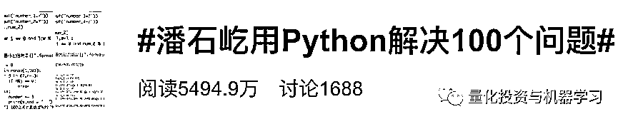
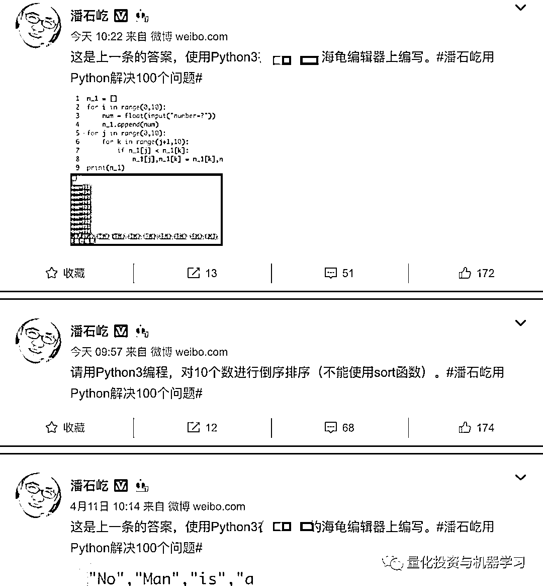
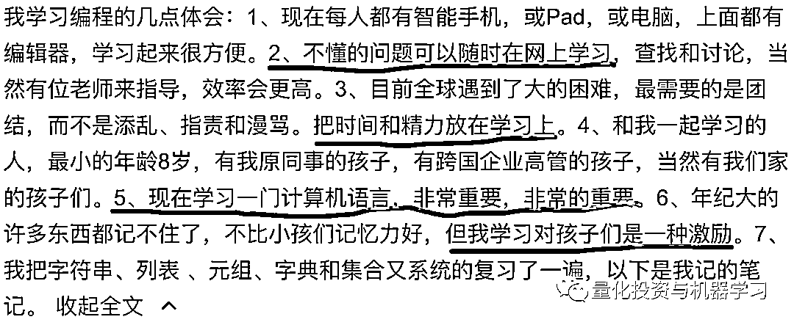
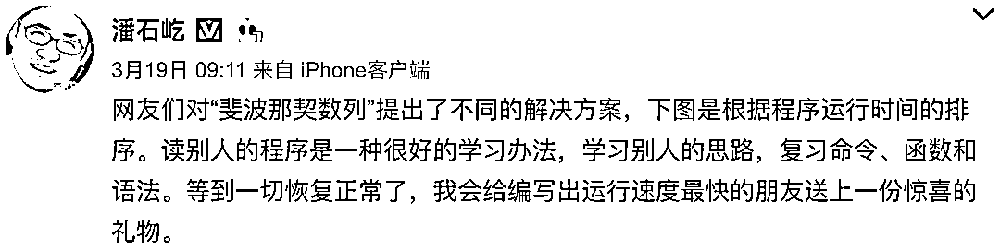
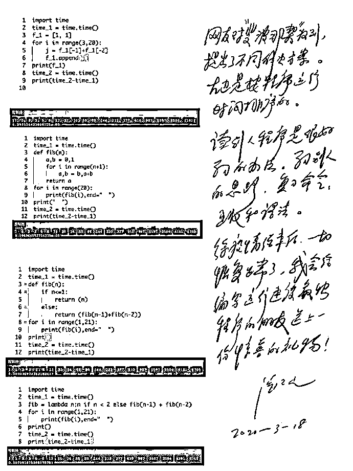
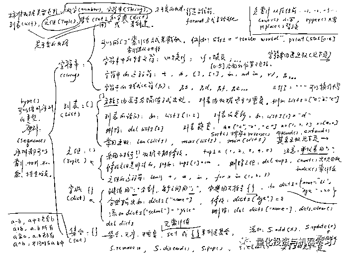
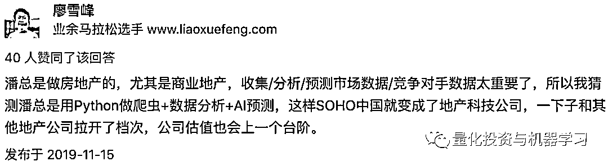
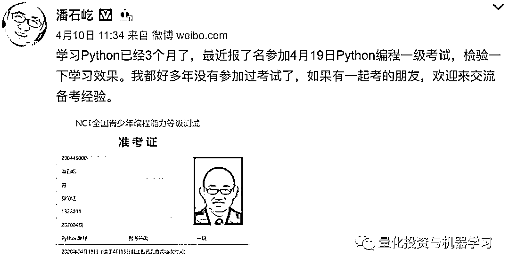
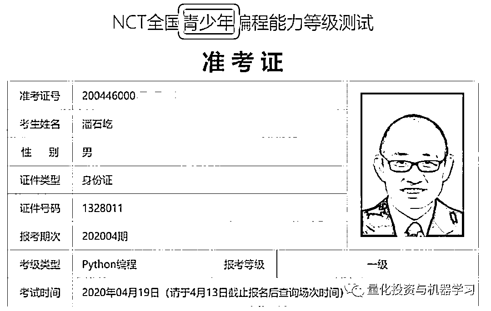
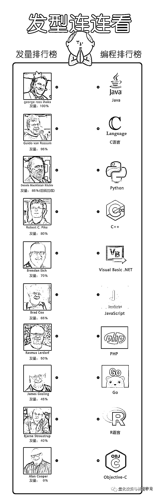

# 潘石屹与 Python

> 原文：[`mp.weixin.qq.com/s?__biz=MzAxNTc0Mjg0Mg==&mid=2653297943&idx=1&sn=b90e61e4e25a67bab791939bb8b2b534&chksm=802ddf02b75a5614077dc9ac49430d5e2a54d385942e975200597cc0d04f6822d48d12ff8c8a&scene=27#wechat_redirect`](http://mp.weixin.qq.com/s?__biz=MzAxNTc0Mjg0Mg==&mid=2653297943&idx=1&sn=b90e61e4e25a67bab791939bb8b2b534&chksm=802ddf02b75a5614077dc9ac49430d5e2a54d385942e975200597cc0d04f6822d48d12ff8c8a&scene=27#wechat_redirect)

**标星★****置顶****公众号     **爱你们♥   

量化投资与机器学习编辑部 | Allen**这不是 Python 推销广告**！！！******是一篇推文**

记得去年潘石屹在 56 岁生日当天，发布的一条微博宣布进军编程语言 Python：

*图片来自：微博

一半留言都是 Python 编程机构的营销账号，为了蹭热度也是拼了，毕竟大佬发话了，得抓住机会呀！

在这之后，潘总由连续发了几篇推文，总结下来就是：

**在不断发展的社会中，要指挥机器，就需要学习让机器听得懂的语言。而他觉得 Python 是进化最好的程序语言，也是最值得去学习的语言之一。**

同时，他还创立了一个微博话题，**5000+万的阅读量：**

几乎每天一题，目测 3 个月干完！

*图片来自：微博

在潘石屹的微博中，有这样一条：

我觉得这段话说的很好：

**1、勤于思考，多动手**

我们生活在如此发达的网络时代，要寻找想要的信息太便捷了，但是很多人还是填鸭式的。我在工作中也是遇到很多这样的人。一个很简单的问题，第一时间不是自己想办法先解决，**可以先百度啊（这也是自己解决问题的表现）**。而是没有经过思考就开始在群里问人，有些问题还很幼稚。

**2、请掌握一门编程语言**

公众号成立至今，一直致力为国内量化事业贡献一份自己的力量。在这其中，我们也意识到，不管你是否想做量化，掌握一门编程语言对你真的很有帮助，可能直接或间接的影响你的工作和生活。**人若有一技之长，走到哪里都不怕**！你们看到的很多招聘、求职加分项等等都现在都在提编程这个事。**现如今，Python 很火，你必须承认这一点。当然你可以在大环境下逆风前行，但是，有时候****顺势而为****也是一种智慧！**

**3、终身学习** 

这个问题已经满大街的心灵鸡汤了，在这里就不过多说了。我觉得这个问题关键在于：**你的执行力（坚持）和态度（对知识的渴求），当然自律也很重要！**

*图片来自：微博

下面的这张图是潘石屹的 Python 学习笔记，可见有多努力！

*图片来自：微博

廖雪峰在知乎说道：

*图片来自：知乎

可能带有调侃的成分，但态度决定一切！

在本周五，潘总的微博又炸了，发布了一则他要**参加 Python 编程考试**的消息（为了不给第三方打广告，把后面的第三方教育机构已隐去）：

*图片来自：微博

**青少年？**

**这个青少年长得有点捉急******

*图片来自：微博

有网友调侃：

*图片来自：微博

说起头发，民间有传闻：

**程序员的水平高低取决于他的****发际线******

*图片来自：网络

这么看的话，**潘总的级别起码在专家之上**

那让我们看看每个编程语言作者的发量，到底是否取决于发际线呢？

*图片来自：Python 作业辅导员

这么看下来也不一定啊，Python 的作者 Guido van Rossum 完胜啊！

因为潘总和我都是西北人，也算是老乡（都在一个地方长大：天水）。天水人有句俗语叫： 

**人要能反乱（fàn luan）**

意思就是人这一辈一定要：

**能折腾、多闯荡**

才能：

**干大事、成大器**

潘总是这样攒劲（zǎn jìn）的人，我们也应该是！各位加油！

周末快乐！欢迎各位读者讨论交流。 

2020 年第 77 篇文章

量化投资与机器学习微信公众号，是业内垂直于**Quant、MFE、Fintech、AI、ML**等领域的**量化类主流自媒体。**公众号拥有来自**公募、私募、券商、期货、银行、保险资管、海外**等众多圈内**18W+**关注者。每日发布行业前沿研究成果和最新量化资讯。

你点的每个“在看”，都是对我们最大的鼓励