# 指数夏普 VS 相关矩阵：多场景数据模型

> 原文：[`mp.weixin.qq.com/s?__biz=MzAxNTc0Mjg0Mg==&mid=2653297915&idx=1&sn=7024218e434b72c43973ae9a49414900&chksm=802ddeeeb75a57f8599fb21775fa1c3923b235d7138b1b68d140218602fa3e8f17ecc5492ad8&scene=27#wechat_redirect`](http://mp.weixin.qq.com/s?__biz=MzAxNTc0Mjg0Mg==&mid=2653297915&idx=1&sn=7024218e434b72c43973ae9a49414900&chksm=802ddeeeb75a57f8599fb21775fa1c3923b235d7138b1b68d140218602fa3e8f17ecc5492ad8&scene=27#wechat_redirect)


**标星★****置顶****公众号     **爱你们♥   

作者：Marti     编译：1+1=6

在本文中，我们将建立一个机基于标普 500 指数夏普与相关矩阵的数据集，展示不同的场景。这是一个包含 3 类 100×100 相关矩阵的数据集：

*   **与压力市场相关的相关矩阵**

*   **与反弹市场相关的相关矩阵**

*   **与正常市场相关的相关矩阵**

**压力市场定义**

在研究期内（252 个交易日），100 只等权重股票组成的股票池夏普指数低于-0.5。

**反弹市场定义**

在研究期内（252 个交易日），100 只等权重股票组成的股票池夏普指数高于 2。

**正常市场定义**

在研究期内（252 个交易日），100 只等权重股票组成的股票池夏普指数在-0.5 到 2 之间。

一旦我们得到了这个数据集，我们就可以拟合生成模型，如条件 CorrGAN，以生成看起来类真实且不可见的相关矩阵。利用这些生成模型，我们可以比较不同基于风险的投资组合构建方法性能，如层次风险平价、层次风险贡献、风险平价、反向波动率、最小方差、等权重等在模拟且非真实数据上的表现。

**相关阅读** 

数据是标普 500 的复权价（adj）

```py
import sys
from random import randint
import pandas as pd
import numpy as np
import fastcluster
from scipy.cluster import hierarchy
from scipy.stats import rankdata
import matplotlib.pyplot as plt
from mpl_toolkits.mplot3d import Axes3D
import matplotlib.pyplot as plt

df = pd.read_csv('data/SP500_HistoTimeSeries.csv')

df['Date'] = pd.to_datetime(df['Date'], infer_datetime_format=True)

df.index = df['Date']
del df['Date']
df = df.sort_index()

returns = df.pct_change(periods=1)

dim = 100
tri_a, tri_b = np.triu_indices(dim, k=1) 
```

随机抽取 500 只股票一年的日收益率（连续 252 个交易日）作为样本。删除缺失值。从可用的股票中随机选择 100 只股票。估计 100×100 经验相关矩阵。根据这 100 只等权重股票的夏普，将这个矩阵分为 3 类：压力型、反弹型、正常型。

```py
corr_vs_sharpe = []
stressed_mats = []
stressed_count = 0
rally_mats = []
rally_count = 0
normal_mats = []
normal_count = 0
for loop in range(20000):
    try:
        t_idx = randint(0, len(returns) - 252)

        period_returns = returns.iloc[t_idx:(t_idx + 252)]

        rmv = 0
        for col in period_returns.columns:
            if len(period_returns[col].dropna()) < 252:
                rmv += 1
                del period_returns[col]
        rmv, period_returns.shape

        idx = list(np.random.choice(len(period_returns.columns), dim,
                                    replace=False))

        period_returns[period_returns.columns[idx]].dropna().shape

        corr = period_returns[
            period_returns.columns[idx]].dropna().corr().values
        corr.mean()

        mean_return = (period_returns[period_returns.columns[idx]]
                       .dropna()
                       .mean(axis=1)
                       .mean() * 252)
        vol = (period_returns[period_returns.columns[idx]]
               .dropna()
               .mean(axis=1)
               .std() * np.sqrt(252))
        sharpe = mean_return / vol

        dist = 1 - corr
        Z = fastcluster.linkage(dist[tri_a, tri_b], method='ward')
        permutation = hierarchy.leaves_list(
            hierarchy.optimal_leaf_ordering(Z, dist[tri_a, tri_b]))
        prows = corr[permutation, :]
        ordered_corr = prows[:, permutation]

        corr_vs_sharpe.append([corr.mean(), sharpe])

        if sharpe < -0.5:
            stressed_mats.append(ordered_corr)
            np.save('stressed_mats/mat_{}.npy'.format(stressed_count),
                    ordered_corr)
            stressed_count += 1
        elif sharpe > 2:
            rally_mats.append(ordered_corr)
            np.save('rally_mats/mat_{}.npy'.format(rally_count),
                    ordered_corr)
            rally_count += 1
        else:
            normal_mats.append(ordered_corr)
            np.save('normal_mats/mat_{}.npy'.format(normal_count),
                    ordered_corr)
            normal_count += 1

        if loop < 10:
            plt.figure(figsize=(20, 8))
            plt.subplot(1, 2, 1)
            plt.plot((1 + period_returns[
                period_returns.columns[idx]]
                      .dropna().mean(axis=1)).cumprod())
            plt.title("sharpe: " + str(np.round(sharpe, 2)))

            plt.subplot(1, 2, 2)
            plt.pcolormesh(ordered_corr)
            plt.colorbar()
            plt.title("mean corr: " + str(np.round(corr.mean(), 2)))
            plt.show()
    except:
        pass 
```

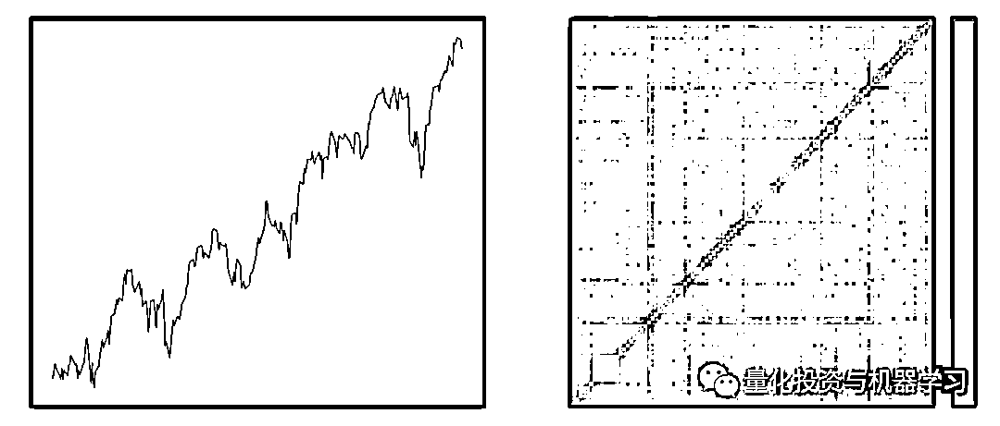

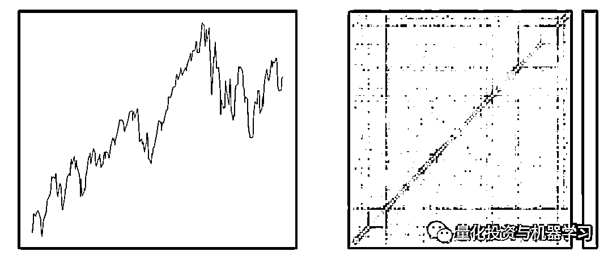

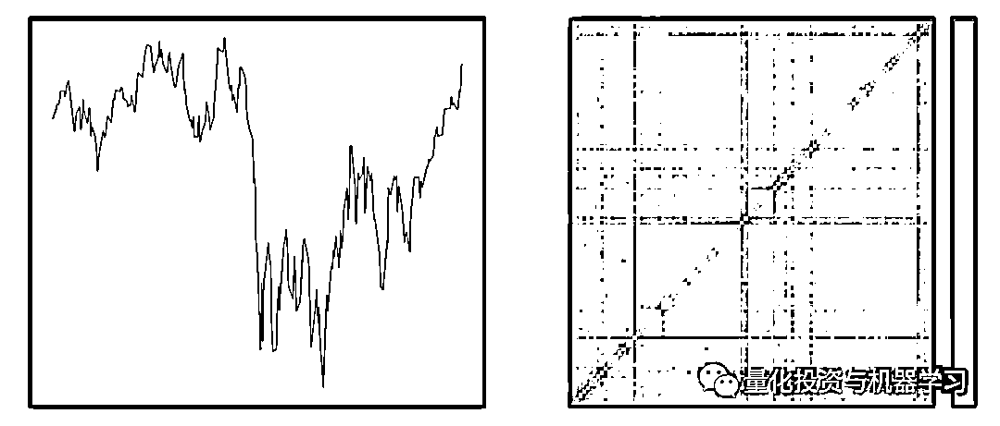

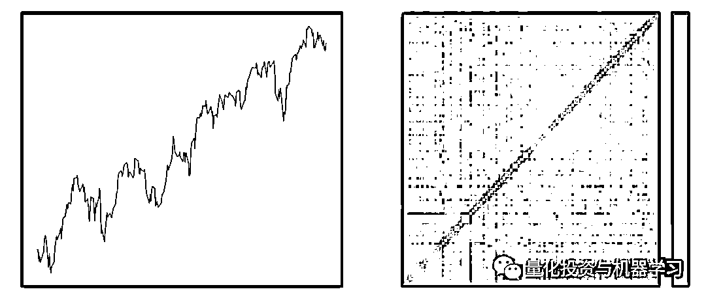

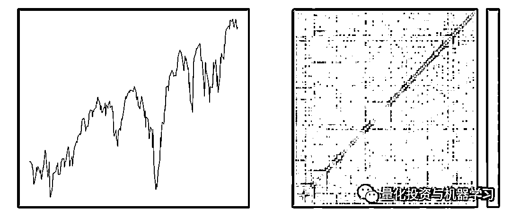

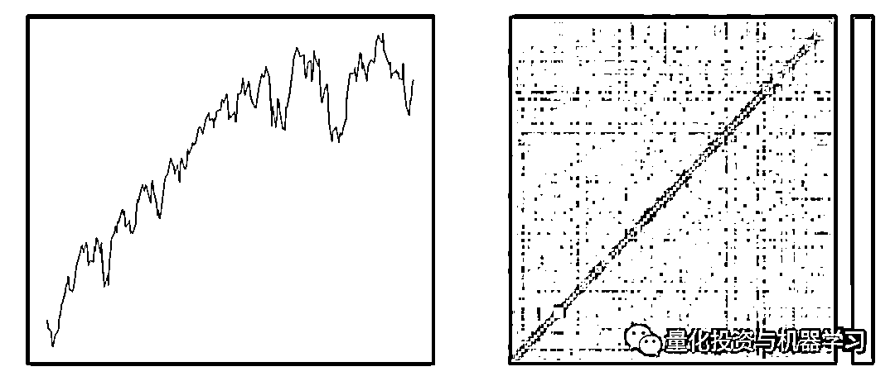

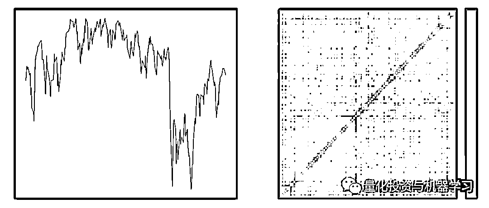

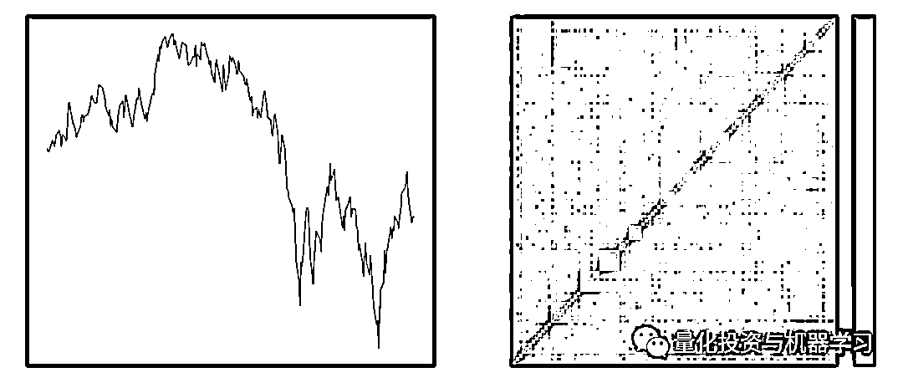

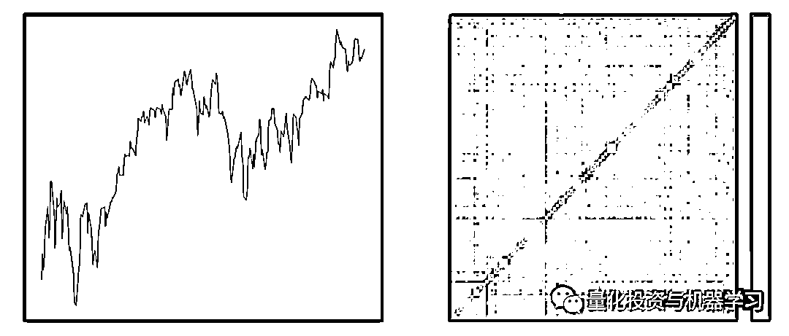

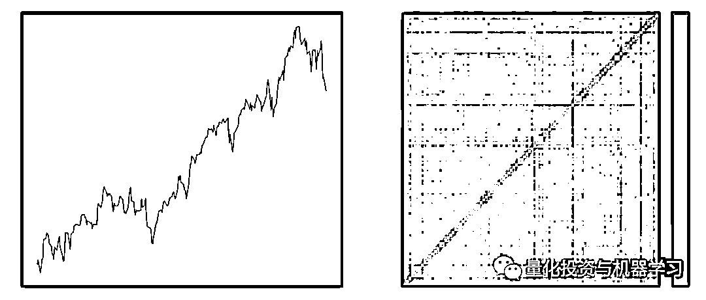

左边是夏普值的分布（每个样本 1 年 x100 只股票的夏普值）。我们基本上可以观察到两种模式：一种模式在 0 点，另一种模式在 1.5 点左右，样本量是原来的两倍。对于平均相关值（每个样本 1 年 x100 只股票的平均相关值），我们可以观察到几种模式：

*   0.25（低）

*   0.34（均值）

*   0.5（高)

```py
corr_vs_sharpe = np.array(corr_vs_sharpe)

plt.figure(figsize=(20, 6))
plt.subplot(1, 2, 1)
plt.hist(corr_vs_sharpe[:, 1], bins=100)
plt.title('Distribution of Sharpe')

plt.subplot(1, 2, 2)
plt.hist(corr_vs_sharpe[:, 0], bins=100)
plt.title('Distribution of Mean Correlation')
plt.show() 
```

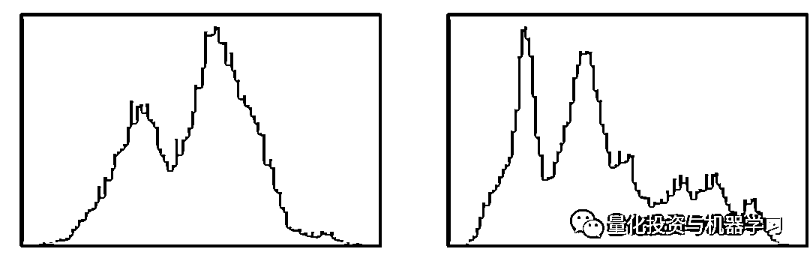

我们在下面的图表中说明了夏普和平均相关性之间的反相关关系：高平均相关性倾向于低夏普相关性；低平均相关性倾向于高夏普相关性。

```py
plt.figure(figsize=(20, 6))
plt.subplot(1, 2, 1)
plt.scatter(corr_vs_sharpe[:, 0], corr_vs_sharpe[:, 1])
plt.xlabel('mean corr')
plt.ylabel('sharpe')

plt.subplot(1, 2, 2)
plt.scatter(rankdata(corr_vs_sharpe[:, 0]),
            rankdata(corr_vs_sharpe[:, 1]))
plt.xlabel('rank mean corr')
plt.ylabel('rank sharpe')
plt.show() 
```

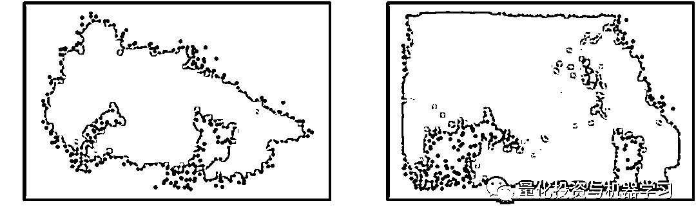

从这个抽样程序中，我们从 20000 个矩阵中得到以下结果：

```py
len(stressed_mats), len(rally_mats), len(normal_mats)

(1004, 3091, 15897) 
```

也就是说，5% 的压力矩阵，15% 的反弹矩阵，80% 的正常矩阵。

下面我们展示了一些重新排序的相关矩阵，它们与压力市场状态相关。

```py
for i, mat in enumerate(stressed_mats):
    plt.pcolormesh(mat)
    plt.colorbar()
    plt.title(round(mat.mean(), 2))
    plt.show()

    if i > 5:
        break 
```

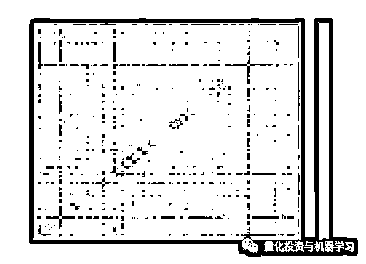

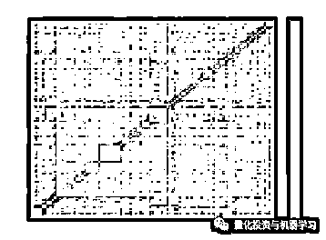

下面我们展示了一些重新排序的相关矩阵，它们与反弹市场状态相关。

```py
for i, mat in enumerate(rally_mats):
    plt.pcolormesh(mat)
    plt.colorbar()
    plt.title(round(mat.mean(), 2))
    plt.show()

    if i > 5:
        break 
```

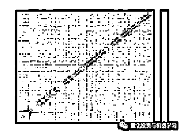

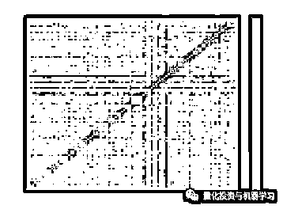

最后，我们显示了与 3 个市场状态相关的所有矩阵的所有相关系数分布（橙色压力，绿色反弹，蓝色正常）：

```py
stressed_corr_coeffs = []
for mat in stressed_mats:
    stressed_corr_coeffs.extend(list(mat[tri_a, tri_b]))

rally_corr_coeffs = []
for mat in rally_mats:
    rally_corr_coeffs.extend(list(mat[tri_a, tri_b]))

normal_corr_coeffs = []
for mat in normal_mats:
    normal_corr_coeffs.extend(list(mat[tri_a, tri_b]))

nbins = 500
plt.figure(figsize=(15, 6))
plt.hist(normal_corr_coeffs, bins=nbins, alpha=1,
         label='normal: $-0.5 \leq$ sharpe $\leq 2$',
         density=True, log=False)
plt.axvline(x=np.mean(normal_corr_coeffs), color='b',
            linestyle='dashed', linewidth=2)
plt.hist(stressed_corr_coeffs, bins=nbins, alpha=0.8,
         label='stressed: sharpe < -0.5',
         density=True, log=False)
plt.axvline(x=np.mean(stressed_corr_coeffs), color='r',
            linestyle='dashed', linewidth=2)
plt.hist(rally_corr_coeffs, bins=nbins, alpha=0.6,
         label='rally: 2 < sharpe',
         density=True, log=False)
plt.axvline(x=np.mean(rally_corr_coeffs), color='g',
            linestyle='dashed', linewidth=2)
plt.legend()
plt.show() 
```

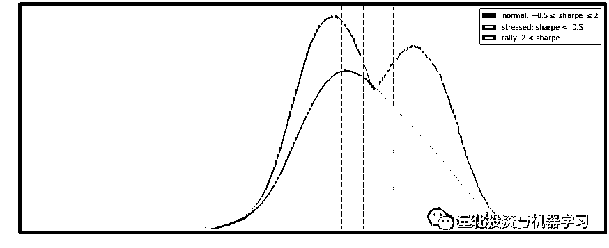

我们观察到，与压力市场相关的相关矩阵具有更高的相关系数（0.55）。反弹矩阵的分布是最对称的（0.25 左右）。

在本文中，我们阐述了相关性和夏普之间的关系（注意，这种关系可以通过投资者在极端市场中的羊群效应来证明，也可以机械地通过将投资组合的波动性与资产相关性联系起来）。本文的主要目的是说明抽样过程，以便建立一个适合市场状态的 GANs 培训数据库。

近期热点文章     2020 年第 76 篇文章

量化投资与机器学习微信公众号，是业内垂直于**Quant、MFE、Fintech、AI、ML**等领域的**量化类主流自媒体。**公众号拥有来自**公募、私募、券商、期货、银行、保险资管、海外**等众多圈内**18W+**关注者。每日发布行业前沿研究成果和最新量化资讯。

你点的每个“在看”，都是对我们最大的鼓励