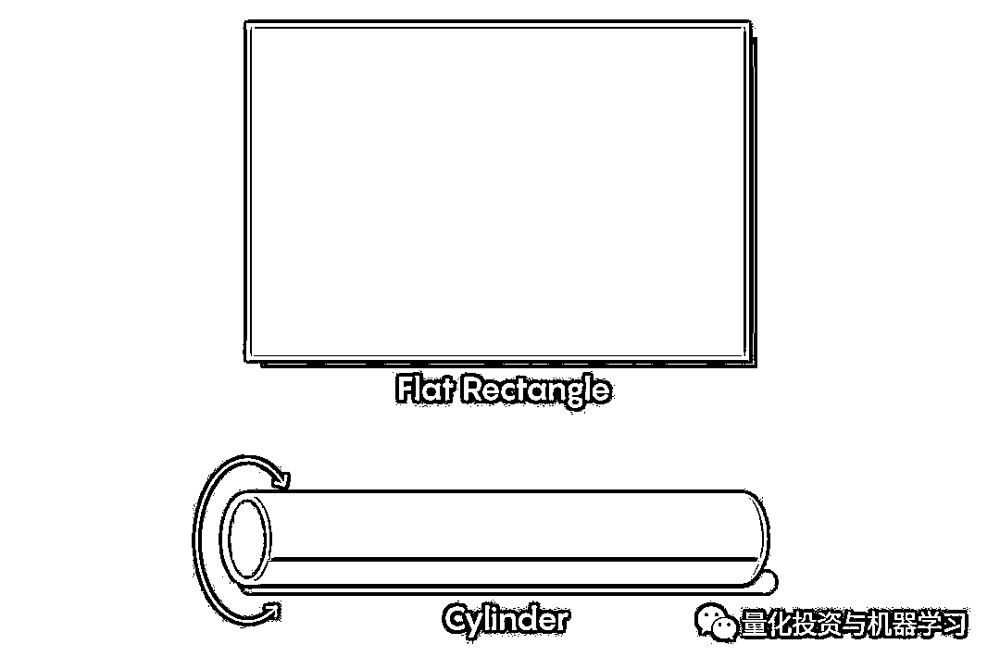
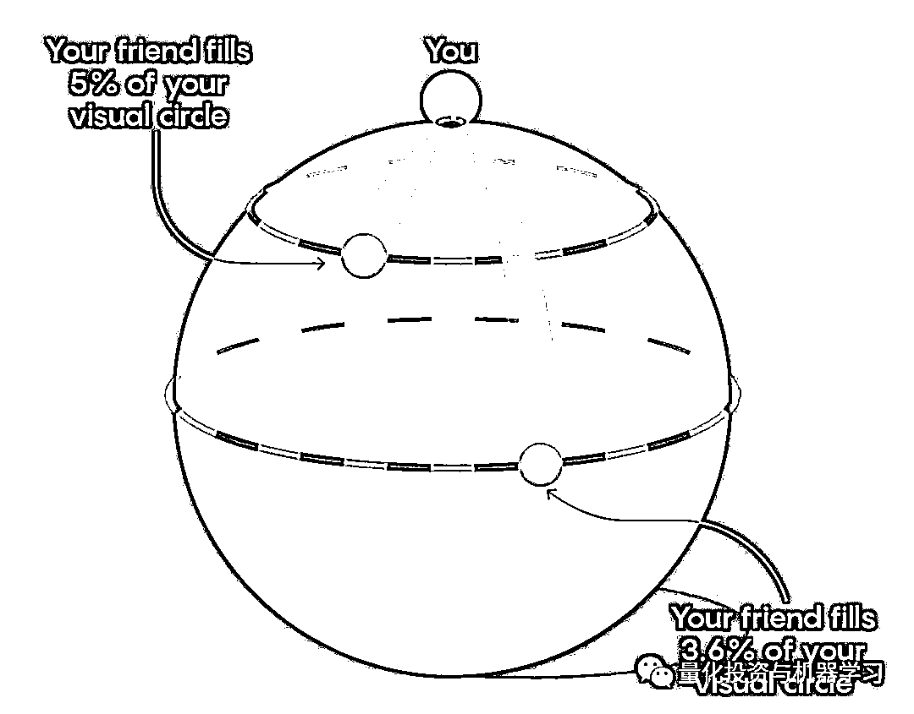

# 地球是个球体，那宇宙是个啥？

> 原文：[`mp.weixin.qq.com/s?__biz=MzAxNTc0Mjg0Mg==&mid=2653297909&idx=1&sn=00379e2462449014bce8c1955a3ac57a&chksm=802ddee0b75a57f64654b1c5dff3a0ca6bf6e162919250ecef61165798249e3765a8c7868ce6&scene=27#wechat_redirect`](http://mp.weixin.qq.com/s?__biz=MzAxNTc0Mjg0Mg==&mid=2653297909&idx=1&sn=00379e2462449014bce8c1955a3ac57a&chksm=802ddee0b75a57f64654b1c5dff3a0ca6bf6e162919250ecef61165798249e3765a8c7868ce6&scene=27#wechat_redirect)

**标星★****置顶****公众号     **爱你们♥   

在我们的心目中，宇宙似乎永远存在。但是利用几何学，我们可以探索各种三维形状，为“普通”无限空间提供选择。公众号今天为大家带来一篇别具一格的文章！

***1***

**前沿**

当你凝视夜空时，空间似乎永远向四面八方延伸。那是我们对宇宙的心理模型，但这并不一定正确。毕竟，曾有一段时间，每个人都认为地球是平坦的，因为我们的星球的曲率太细微以至于无法探测到，而球形的地球却是深不可测的。

今天，我们知道地球的形状像一个球体。但是我们大多数人很少考虑宇宙的形状。正如球体提供了平坦地球的替代物一样，其他三维形状也提供了“普通”无限空间的替代物。

我们可以问两个关于宇宙形状的独立但相互关联的问题。一个是关于其几何形状：对诸如角度和面积之类的物体进行精细的局部测量。另一个关于他的拓扑结构：如何将这些局部片段缝合在一起形成一个总体形状。

宇宙学证据表明，我们所能看到的宇宙部分是平滑且同质的，至少大致如此。空间的局部结构在每一点和每一个方向上都大同小异。只有三种几何形状符合此描述：平面、球面和双曲。让我们探索这些几何形状，一些拓扑注意事项，以及宇宙学证据中关于哪些形状最能描述我们的宇宙。

***2***

**平面几何**

这是我们在学校中学到的几何。三角形的角度加起来为 180 度，和一个圆的面积是πr²。平面三维形状最简单的例子是普通的无限空间，数学家称之为欧几里得空间，但也可以考虑其他平面形状。

这些形状更难以可视化，但是我们可以通过二维而不是三维思考来建立一些直觉。除了普通的欧几里得平面之外，我们还可以通过切出一部分平面并将其边缘贴在一起来创建其他平面形状。例如，假设我们切出一张矩形纸，然后用胶带将其相对的边缘粘上。将顶部和底部边缘贴上胶带，我们就能得到一个圆柱体：

接下来，我们可以用胶带把在左右两边粘起来，得到一个甜甜圈（数学家称之为环面）：

现在，你可能会想：“在我看来这并不平坦。” 你是对的。如果你真的试图以此方式用一张纸制作一个圆环，那么你会遇到困难。制作圆柱体会很容易，但是用胶带贴住圆柱体的两端是行不通的：纸张会沿着圆环的内圆起皱，并且不会沿着外圆伸展得足够远。你将不得不使用一些可拉伸的材料来代替纸张。但是这种拉伸会扭曲长度和角度，从而改变几何形状。

在普通的三维空间内，无法在不扭曲平面几何形状的情况下，用平面材料构建一个真实、平滑的物理圆环。但是我们可以抽象地推断出生活在扁平圆环内是什么的感觉。

想象你是一个二维生物，其宇宙是一个扁平的圆环。由于该宇宙的几何形状来自一张平坦的纸，因此，我们习惯于使用的所有几何事实至少在小范围内与平常相同：三角形中的角度之和为 180 度，依此类推。但是，我们通过切割和缠绕对全局拓扑所做的更改意味着，生活在圆环中的体验将与我们过去的感觉大不相同。

对于初学者来说，圆环上有直线路径可以循环并返回到它们的起点：

这些路径在扭曲的圆环上看起来是弯曲的，但是对于扁平圆环的居民而言，它们感觉是直的。而且由于光沿直线路径传播，因此如果你朝这些方向之一直视前方，你会从后面看到你自己：

在原纸上，你看到的光好像从你身后一直传到左手边，然后再次出现在右手边，就像你在玩一个环绕式电子游戏一样：

考虑这种情况的一种等效方法是，如果你（或一束光）穿过四条边中的一条，你会出现在一个看似新的“房间”中，但实际上是同一个房间，只是从一个新的有利位置看。当你在这个宇宙中漫步时，你可以进入原始房间的无限副本中。

这意味着你也可以通过朝不同的方向看到无限多不同副本的自己。这是一种霍氏镜像效应，除了你的副本不是反射：

在甜甜圈上，这些对应于许多不同的环，光线可以通过这些环从你身上传播回来：

同样，我们可以通过粘贴立方体或其他盒子的相对面来构建一个平坦的三维圆环。我们无法将这个空间可视化为普通无限空间内的一个对象，它根本不适合，但我们可以抽象地推断其中的生活。

就像二维圆环中的生活就像生活在一个由相同的矩形房间的无限二维阵列中一样，三维圆环中的生活就像生活在相同立方体房间中的无限三维阵列中一样。你将无限次看到自己的副本：

‍ 

三维圆环只是 10 个不同的平面有限世界中的一个。还有平坦的无限世界，例如无限圆柱体的三维模拟。在上述每个世界中，都有一个不同的镜像阵列供你体验。

***3***

**我们的宇宙是这些扁平形状之一吗？**

当我们看向太空时，我们不会无限地看到自己的副本。即使这样，也很难排除这些扁平形状。一方面，它们都具有与欧几里德空间相同的局部几何形状，因此没有局部度量可以区分它们。

而且，如果你确实看到了自己的一个副本，那么那幅遥远的图像将显示你（或你的星系）在遥远的过去是什么样子的，因为光必须传播很长时间才能到达你。也许我们在那里看到自己无法识别的副本。更糟糕的是，你自己的不同副本通常距离你的距离不同，因此它们中的大多数看上去彼此不会相同。也许它们离我们都太遥远了，以至于我们都看不到。

为了绕过这些困难，天文学家通常不是在寻找自己的副本，而是在我们能看到的最远的地方重复这些特征：宇宙大爆炸后不久留下的宇宙微波背景（CMB）辐射。实际上，这意味着在 CMB 中搜索具有热点和冷点匹配模式的成对的圆，这表明从两个不同的方向看，它们实际上是同一个圆。

2015 年，天文学家使用普朗克太空望远镜的数据进行了这种搜索。他们对数据进行了梳理，寻找我们希望在一个平面三维圆环或另一个称为平板的平面三维形状中看到的匹配圆的种类，但是他们未能找到它们。这意味着如果我们确实生活在一个圆环中，那么它可能是如此之大，以至于任何重复的模式都超出了可观测的宇宙范围。

***4***

**球面几何**

我们都熟悉二维球体——一个球或一个橙子或地球的表面。但是，我们的宇宙成为三维球体意味着什么呢？

很难可视化一个三维球体，但是通过简单的类比就可以很容易定义一个。就像二维球体是普通三维空间中距离某个中心点的固定距离的所有点的集合一样，三维球体（或“三球”）是四维空间中距离某个中心点固定距离的所有点的集合。

在三个球体中的生活与在平坦空间中的生活感觉非常不同。为了感受一下，想你您是一个生活在二维球体内的二维人。二维球体是整个宇宙，你无法看到或进入任何周围的三维空间。在这个球形的宇宙中，光沿着最短的路径传播：大圆。对你来说，这些大圆圈感觉像直线。

现在，想像你和你的二维朋友正在北极闲逛，而你的朋友去散散步。当你的朋友走开时，起初它们会在你的视觉圈中显得越来越小，就像在我们的普通世界中一样（尽管他们的收缩速度不会像我们习惯的那样快）。这是因为随着你的视觉圈子的扩大，你的朋友所占的比例会越来越小：

但是一旦你的朋友经过赤道，就会发生一些奇怪的事情：他们离你越远，他们看起来就越大。那是因为他们在你的视觉圈中所占的百分比正在增长：

当你的朋友距南极 10 英尺时，他们看起来与离你 10 英尺时一样大：

当他们到达南极时，你可以在各个方向看到他们，因此它们充满了你的整个视野：

如果没有人在南极，那么你的视觉地平线甚至会更加奇怪：你自己。那是因为从你身上散发出来的光会一直围绕球体，直到它回到你身边为止。

这直接延续到三维空间中的生活。三个球体上的每个点都有一个相反的点，如果那里有一个物体，我们会将其视为整个背景，就好像它是天空一样。如果那里什么也没有，我们将把自己当作背景，好像我们的外部已经被叠加在一个气球上，然后翻转过来并膨胀成整个地平线。

虽然三球体是球面几何的基本模型，但它不是唯一这样的空间。正如我们通过从欧几里得空间中切出一部分并将其粘合在一起来构建不同的平面空间一样，我们可以通过粘合三个球体的合适块来构建球面空间。这些粘贴形状中的每一个都会像圆环一样具有镜像效果，但是在这些球形形状中，只有有限的几个房间可以穿过。

***5***

**我们的宇宙是球面的吗？**

即使是我们当中最自恋的人，也通常不会将自己视为整个夜空的背景。但是，就像扁平的圆环一样，仅仅因为我们没有看到一个现象，这并不意味着它就不存在。球形宇宙的周长可能大于可观测宇宙的大小，从而使背景看起来离得太远了。

但是与圆环不同，可以通过纯粹的局部测量来探测球形宇宙。球形与无限的欧几里得空间不仅在其全局拓扑结构上而且在其精细几何形状上都不同。例如，由于球面几何中的直线是大圆，所以三角形比其欧几里得对应物更膨胀，并且它们的角度加起来超过 180 度：

实际上，测量宇宙三角形是宇宙学家测试宇宙是否弯曲的主要方式。对于宇宙微波背景中的每个热点或冷点，已知其直径和与地球的距离，形成了三角形的三条边。我们可以测量星星在夜空中所成的角度——三角形的三个角度之一。然后，我们可以检查边长和角度测量值的组合是否适合于平面、球形或双曲线几何形状（其中三角形的角度之和小于 180 度）。

大多数此类测试以及其他曲率测量表明，宇宙要么是平坦的，要么非常接近平坦。然而，一个研究团队最近认为，普朗克太空望远镜 2018 年发布的某些数据指向的是一个球状宇宙，尽管其他研究人员已经反驳说，这一证据很可能是统计上的侥幸。

***6***

**双曲几何**

与球体自身弯曲不同，双曲几何体向外打开。这是珊瑚礁和马鞍的几何形状。双曲几何的基本模型是一个无限广阔的空间，就像平面欧几里德空间一样。但是，因为双曲几何比平面几何向外扩展快得多，所以除非我们愿意扭曲其几何图形，否则就无法在普通的欧几里得空间中拟合一个二维双曲平面。例如，下面是一个被称为庞加莱圆盘的双曲平面的变形视图：

从我们的角度来看，边界圆附近的三角形看起来比中心附近的三角形小得多，但是从双曲几何的角度来看，所有三角形的大小都是相同的。如果我们真的尝试使三角形具有相同的大小，可能是通过使用弹性材料制作圆盘，然后从中心向外依次对每个三角形依次充气，我们的圆盘将开始像一顶软帽，并且随着我们向外展开，会越来越弯曲。当我们接近边界时，这种屈曲将失去控制。

从双曲几何的角度来看，边界圆距离任何内部点都无限远，因为你必须越过无限多个三角形才能到达那里。因此，双曲线平面向四面八方延伸到无穷远，就像欧几里德平面一样。但是就局部几何而言，双曲平面中的生活与我们习惯的生活大不相同。

在普通的欧几里得几何中，圆的周长与其半径成正比，但是在双曲几何中，圆的周长与半径成指数增长。我们可以在双曲线圆盘边界附近的三角形中看到指数堆积。

因为这个特征，数学家喜欢说在双曲空间中很容易迷路。如果你的朋友在普通的欧几里得空间中离开你，他们会开始看起来更小，但速度会变慢，因为你的视线圈并没有增长得那么快。但是在双曲线空间中，你的视觉圈呈指数级增长，因此你的朋友很快就会缩小到成指数级的小斑点。如果你没有仔细跟踪朋友的路线，以后几乎不可能找到通往他们的道路。

在双曲几何中，三角形的角度之和小于 180 度，例如，在我们的庞加莱圆盘的平铺中的三角形的角度之和等于 165 度：

这些三角形的边看起来不是笔直的，但这是因为我们正在通过变形的透镜查看双曲几何。对于庞加莱圆盘的居民而言，这些曲线是直线，因为从点 A 到达点 B 的最快方法是一条通向中心的捷径：

有一种自然的方法可以对庞加莱圆盘进行三维模拟，只需制作一个三维球，然后用三维的形状填充它，当它们接近边界球体时，这些形状变得越来越小，就像庞加莱圆盘中的三角形一样。就像平面几何和球面几何一样，我们可以通过切割出三维双曲球的合适块并将其面粘在一起来构成各种其他三维双曲空间。

***7***

**我们的宇宙是双曲的吗？**

双曲几何具有狭窄的三角形和呈指数增长的圆，感觉不像是适合我们周围空间的几何形状。事实上，正如我们已经看到的那样，到目前为止，大多数宇宙学测量似乎都倾向于一个平坦的宇宙。

但是我们不能排除我们生活在球面或双曲世界中的可能性，因为这两个世界的小块看上去几乎都是平坦的。例如，球面几何中的小三角形的角度之和仅略大于 180 度，而双曲几何形状中的小三角形的角度之和仅略小于 180 度。

这就是为什么早期人们认为地球是平坦的，在他们能够观测到的尺度上，地球的曲率微小到无法探测到。球面或双曲形状越大，它的每个小块就越平坦，因此，如果我们的宇宙是一个非常大的球面或双曲形状，则我们可以观测到的部分可能非常接近于平坦，因此只能通过我们尚未发明的超精密仪器来探测其曲率。

作者：Erica Klarreich、Lucy Reading-Ikkanda

来自：Quanta Magazine

编译：7788

近期热点文章     2020 年第 75 篇文章

量化投资与机器学习微信公众号，是业内垂直于**Quant、MFE、Fintech、AI、ML**等领域的**量化类主流自媒体。**公众号拥有来自**公募、私募、券商、期货、银行、保险资管、海外**等众多圈内**18W+**关注者。每日发布行业前沿研究成果和最新量化资讯。

你点的每个“在看”，都是对我们最大的鼓励