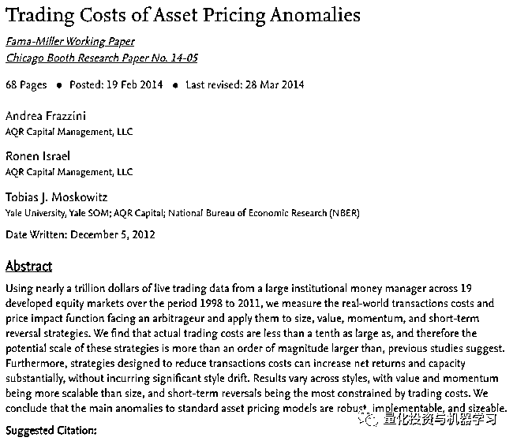
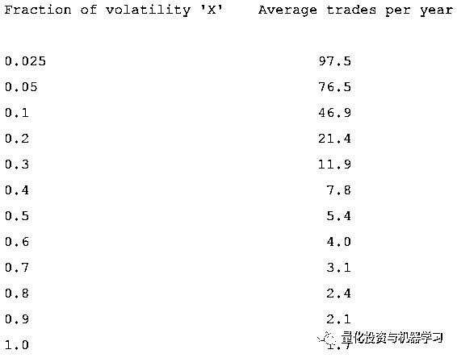
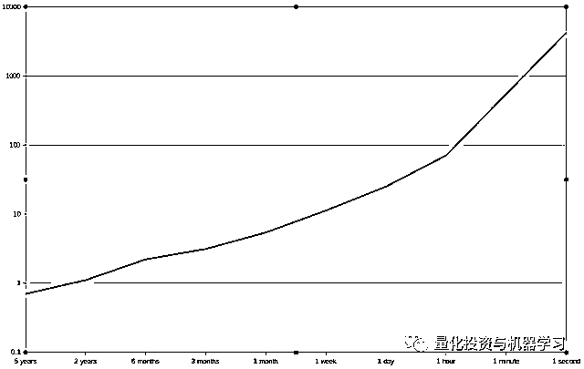
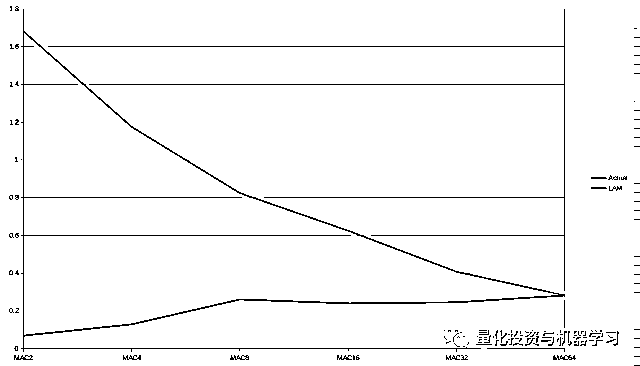
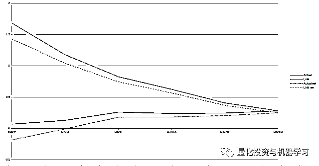
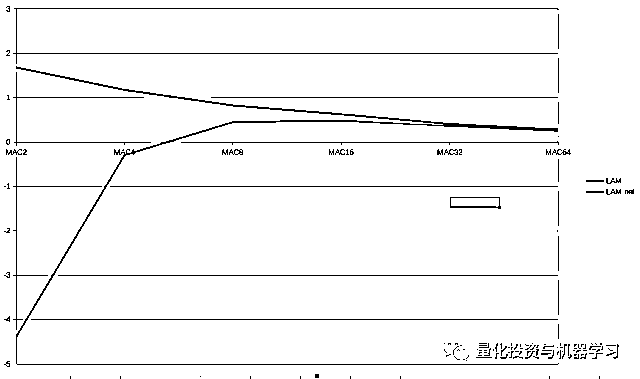
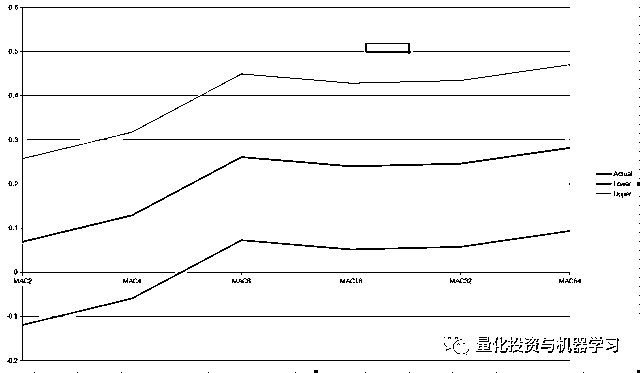
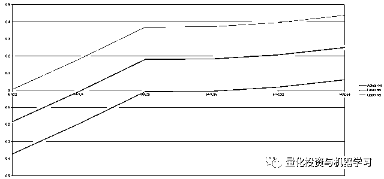
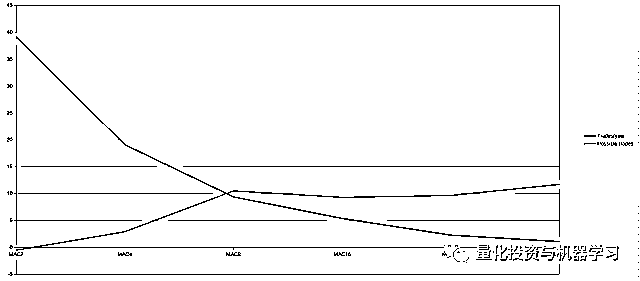
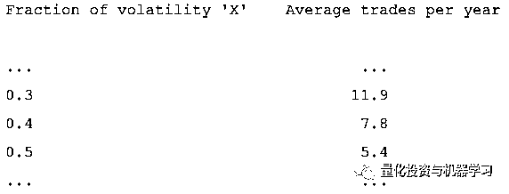

# 我们需要多快的速度进行交易？

> 原文：[`mp.weixin.qq.com/s?__biz=MzAxNTc0Mjg0Mg==&mid=2653297858&idx=1&sn=6001abf44a4f89b8cb9d8d726861f1d7&chksm=802dded7b75a57c16d21753882446ec7a0f561d36082623161ef6afee47019f99ec493cc3ac9&scene=27#wechat_redirect`](http://mp.weixin.qq.com/s?__biz=MzAxNTc0Mjg0Mg==&mid=2653297858&idx=1&sn=6001abf44a4f89b8cb9d8d726861f1d7&chksm=802dded7b75a57c16d21753882446ec7a0f561d36082623161ef6afee47019f99ec493cc3ac9&scene=27#wechat_redirect)

**标星★****置顶****公众号     **爱你们♥   

作者：Rob Carver     编译：1+1=6

这是深度交易系列的第二篇：

第一篇：[我们应该承受多大的风险？](http://mp.weixin.qq.com/s?__biz=MzAxNTc0Mjg0Mg==&mid=2653297453&idx=1&sn=d42b3cecd3bf66d7c572badb8566496c&chksm=802dd938b75a502e7d3c7a27e953b3c188fb22cd9ddb5bee44fdae60d8d7310f9f2bd0ddcbb8&scene=21#wechat_redirect)

***0***

**概述**

我们应该多快交易？我们希望让扣除成本后的预期收益最大化。这就是两件不同的事：

*   **预期成本收益**

*   **成本**

首先，我们将讨论交易成本的度量和预测。然后讨论预期收益如何受到交易速度的影响。最后，我们将讨论这两个量之间的相互作用，以及如何使用它们来决定交易的速度。

***1***

**成本类型**

两个关键的类型:

*   **持有成本**

*   **交易成本**

持有成本是你在持有一个头寸时整个时间里所支付的成本，不管你是否在交易它。

交易成本在每次交易时支付。包括佣金、印花税等，以及执行成本（在下面会有更详细地定义）。

一些大型交易者还支付 exchange 费用，尽管这些费用通常包括在佣金中。

因此，计算成本的基本公式为：

****每年**的总成本 = 持有成本 +（交易成本*交易数量）**

***2***

**执行成本**

大多数类型的成本很容易定义和预测，但是执行成本略有不同。首先：**执行成本是中间价格交易成本与实际交易价格之间的差额。**

举个例子，如果一个市场有 100 个 bid，101 个 offer，那么中间价就是这些出价的平均值：100.5

有些人把加权平均数作为中间价来计算，用每边的成交量作为权重。这种成本的另一个术语是市场冲击（market impact）。

如果我们做一个市价单，并且我们的交易量小到足以满足在 bid 和 offer 时的交易量，那么我们的执行成本将正好是差价的一半。如果我们的市价单太大，那么我们的执行成本会更大。

一般来说，我们可以估计执行成本或从实际交易中度量它们。你可以通过观察你交易市场的差价来估算成本，或者使用别人的估算。

## Andrea Frazzini 等人的这篇论文对交易量很大的人进行了评估：

https://papers.ssrn.com/sol3/papers.cfm?abstract_id=2294498

你可以看到，某人在一天内交易市场成交量的 0.1% ，却要支付大约 5 个点（0.05%）的执行成本。交易总量 0.2%的人将多支付 50%，即 7.5 个基（0.075%）。

**在估算成本时，有几个因素需要牢记在心：交易类型、交易规模。**

*   使用市场指令的小型交易者：假设你支付一半的差价

*   使用限价指令或执行指令的小型交易者：可以支付更少的钱，但平均支付大约四分之一的差价。

*   较大型的交易者：将支付超过一半的差价，并需要计算他们的交易量。

如果你的交易速度比较慢，你可以使用执行算）。如果你交易的是任何速度的均值回归策略，你可以使用限价单，限价是围绕你对公允价值的估计而设置的（尽管你可能想利用市价单来实现止损）。如果你的交易策略是快速的趋势跟踪策略，那么你将不得不使用市价单。

如果你的交易速度非常快，那么假设交易成本不变可能是不现实的，因为市场会对你的订单流做出反应，这将极大地改变你的成本。在这种情况下，建议只使用实际交易的数据。

还有其他方法可以降低成本，比如平滑你的仓位或者使用 buffering。如果你是程序化交易，你可以把它们纳入你的回测，看看它们对你的成本估计有什么影响。

***3***

**线性和非线性**

这里很重要的一点是，无论从哪方面来看，规模较小的交易者都面临着每笔交易的固定执行成本。如果他们的交易数量翻倍，那么他们的交易成本也会翻倍。**较小型的交易者有线性交易成本。**

持有成本将不受交易的影响，其他成本（如佣金）可能不会随着交易规模和频率线性增加，但这是一个合理的近似值。

但规模较大的交易者面临的问题是：每笔交易的成本。 如果他们进行规模更大或更多的交易，他们的每笔交易成本将会增加（例如从 5 个点增加到 7.5 个点）。如果他们将交易数量增加一倍，那么执行成本将增加一倍以上；使用上面的数字，他们的成本会增加 3:2 倍是因为他们的交易数量增加了一倍，然后再增加 50%，因为每笔交易的成本在增加。**较大型的****交易者有非线性交易成本。**

***4***

**如何衡量成本？**

我们应该用什么单位来衡量成本？它应该用点值（pips）还是基点（BP）？是美元还是按我们账面价值的百分比？

由于许多不同的原因，我们认为**衡量成本的最好方法是根据风险调整后的收益**。风险是通过预期的年化收益率标准偏差来衡量的。

例如，假设我们以每股 100 美元的价格买卖 100 股大宗股票。每笔交易的价值是 1 万美元。我们计算出每笔交易的成本是 10 美元，也就是 0.1%。这些股票每年的标准偏差为 20%。每笔交易的成本是 0.1 / 20 = 0.005 单位的风险调整收益率。请注意，这与通常衡量风险调整后收益率的夏普比率很相似。我们以负的夏普比率来有效地衡量成本。

在这个计算中，不包括无风险利率，否则，当我们用相同单位的预期成本收益减去成本的夏普比率时，我们最终会把它抵消掉。

为什么说得通呢？它使得比较不同工具、账户大小和时间段之间的交易成本变得更加容易。以美元计价的交易成本对标普 500 指数这样的大型期货合约来说似乎很高，但实际上相当低。由于 COVID-19 危机，目前大多数市场的利差相当大，但这意味着按风险调整后的成本实际上相当接近。

***5***

**交易数量估计**

让我们回到上面的基本公式:

****每年**的总成本 = 持有成本 +（交易成本*交易数量）**

我们需要计算预期的交易数量。该怎么做呢？

*   从止损相对于波动性的大小来推断。

*   程序化交易者：从回测中得到。

*   程序化交易者：根据运行交易系统的类型使用一些启发式算法。

稍后，当我们尝试计算出我们应该交易多快时，我们将使用此表中的数据。

***6***

**交易成本计算案例**

让我们考虑一下欧洲美元期货的成本。欧洲美元的远期交易价格相对较高，但仍比大多数散户投资者青睐的价差合约、利差押注和即期外汇等产品便宜。

每个合约指数点价值 2500 美元，我们持有的 2023 年 6 月合约的当前价格是 99.45 美元。所以每个合同的现值是 2500*99.45 = 248625 美元。经纪商收取每份合约 1 美元的佣金，价差为 0.005 个百分点。

以市价单的形式交易一份合约的成本是差价的一半：0.5*0.005* 2500 = 6.25 美元加上 1 美元的佣金= 7.25 美元。这是名义价值的 0。0029%没有任何税收或其他费用。不管我们交易了多少合同，每次交易的名义价值都是 0.0029%。

持有成本呢?每份合同都必须按季度滚动。通常情况下，滚动是可能的，而不是两个单独的交易。这降低了风险，但也意味着它的成本与常规交易的执行成本相同（尽管我们将支付两笔佣金）。所以每一个的 roll 交易成本是 6.25 美元加上 2 美元= 8.25 美元，也就是名义价值的 0。00332%，四季度加起来的持有成本总计为 0.0132%。

让我们把这些转换成风险调整的术语。欧洲美元的风险目前有所上升，但在更正常的时期，其平均每年约为 0.5%。执行成本是 0.0029/0.5 = 0.0058。持有成本是 0.0132/0.5 = 0.026。都以夏普比率为单位。

公式如下：

**每年总成本 = 0.026 +（0.0058*交易数量）**

现在我们可以在上面的表格中插入一个 x 的值，例如，如果我们使用 X=0.5 -> 5.4：

**每年的总成本= 0.026 + （0.0058 *5.4）= 0.058**

***7***

**预期成本收益：理论**

现在让我们把注意力转向预期成本收益。它是如何受到交易速度的影响的？如果我们在给定的时间内将交易数量翻一番，我们的利润能翻一番吗？

我们的利润不能翻倍，但应该也不会增加。从理论上讲，如果我们将交易数量翻倍，我们的利润将增加 2 的算数平方根：1.414，以此类推。这就是所谓的**主动管理法则**。这表明你的信息比率将与你所下的不相关赌注的平方根成比例。如果我们做一些假设，那么我们可以将其归结为**你的收益（或夏普比率）与你在给定时间段内交易数量的平方根成比例。**

***8***

**预期成本收益：实践**

主动管理法则是一种理论，有效地代表了可能性的上限。以巴菲特为例：

他的信息比率约为 0.7（这对于一个长期买入并持有的投资者来说是非常好的），他的平均持有期时间很长，假设是 5 年左右。根据主动管理法则，如果巴菲特缩短持有期，增加交易，他的 IR 会是什么？

x 轴-持有期，y 轴-信息比率

把它缩短到 2 年将使它达到略高于 1.0。但后面的事情就变的不怎么样，我们需要一个对数刻度来显示发生了什么。等到巴菲特的持仓时间缩短到一周时，他的 IR 已经超过了 10%，管持仓时间要长得多，但他还是跻身于世界上最好的高频交易公司之列。

当图表以 1 秒的持有期结束时，仍然远低于高频交易的范围，这时，巴菲特就有了一个四位数的 IR，但不太可能。

这是一个愚蠢的例子，所以让我们举一个更现实的例子。使用移动平均交叉规则 MAV （64,256）时的平均夏普比率约为 0.28。它每年进行 1.1 笔交易。如果我们用更短的移动平均线，MAV（32,128）来加速呢？

如果从 MAC(2,8)开始交易， LAM 的夏普应该是 1.68。现实是 0.07。虽然在 MAC8 和 MAC64 之间的表现一直很好，但动量在较短的时间框架内并不能很好地发挥作用。**你不能只是提高交易规则的速度，然后指望赚更多的钱；实际上，你可能赚得更少。**

***9***

**净收益**

现在我们将预期成本收益与成本放在一起，看看它们能告诉我们什么。现在，我们将坚持使用一套移动平均规则和欧洲美元期货交易的成本。每年总成本 = 0.026 +（0.0058*交易数量），每个交易规则的交易数量将来自于回测。

更快的规则现在看起来更糟糕，实际上是在赔钱。对于这条特殊的交易规则，我们能以多快的速度交易的问题是显而易见的：越慢越好。建议在你的系统中保留至少 3 个移动平均线的变化，以获得足够的多样化，但最快的两个变化显然是在浪费钱。

重要提示：将所有工具的平均 SR 预期成本收益与欧洲美元的成本进行了比较。我们没有单独使用欧洲美元的夏普比率，由于利率的长期趋势，欧洲美元的夏普比率要远远高于平均水平。这可以避免过拟合。

这些结果对于具有线性成本的小型交易者是有效的。如果应用在大型交易者身上呢一？我们假设当交易量增加一倍时，每笔交易的成本增加 50%：

很糟糕。即使我们假设 LAM 是可能的，加速也会在某一时刻停止工作（这里是在 MAC16 附近）。这是因为预期成本收益会随着频率的平方根而提高，但成本的增幅超过了线性水平。

***10***

**收益不确定时的净收益**

到目前为止，我们认为预期成本收益和成本是同样可以预测的。但事实并非如此。预期成本收益实际上是很难预测的，原因有很多。

让我们来看看 SR，看看不同速度下交易规则的主观反应，这次添加了一些置信区间。我们不会用正常的 95%区间，而是用 60%。这意味着我可以有 20% 的信心认为 SR 估计高于置信线下限。我们还假设有 20 年的数据来估计 SR：

现在让我们增加成本。我们可以把它们看作是抽样方差为 0 的完美预测：

一旦我们计算了成本，就会有更清晰的证据表明，最快的交叉操作明显比最慢的交叉操作更糟糕。看起来我们也有理由相信所有较慢的交叉有一个预期的 SR 至少为 0。

***11***

**经验法则**

以上所有内容在理论上都很有趣，但要将其应用到实践中，显然还有很多工作要做。在这里我们把它称之为**限速**，

**不要在成本上花费超过你预期成本收益的三分之一**

如何在实践中使用它？

**每年总成本 = 持有成本 +（交易成本*交易数量）**

**每年最高成本（限速） = 预期 SR / 3**

**预期 SR / 3 = 持有成本 +（交易成本*交易数量）**

**最大交易数量 = [(预期 SR / 3) - 持有成本] / 交易成本**

针对欧洲美元：

年总成本= 0.026 +(0.0058 *交易数量)

最大交易数量=[(预期 SR / 3) - 0.026] / 0.0058

根据不同的交易规则，预期的 SR 是不同的，但如果我把它代入上面的公式，就会得到下图中的红线：

蓝线表示每年的实际交易量。当蓝线高于红线时，我们就超速了。注意，对于最快的规则，速度限制实际上是负的；这是因为单是持有成本就超过了 MAC2 预期 SR 的三分之一。

使用这种启发式，我们将放弃两个最快的变化；而 MAC8 只是溜进去的，这给了我们与上面更复杂的分析相同的结果。

***12***

**X 应是多少？**

限速启发式对于系统交易者非常有用，他们可以准确地测量他们的交易数量和期望。但对于那些使用他们不能或不愿进行回测的交易策略的交易员呢？

对于单个工具的交易，我们建议使用 0.24 左右的夏普比率（大致与较慢的 MAC 规则一致）

**最大交易数量 = [(预期 SR / 3) - 持有成本] / 交易成本**

**最大交易数量 = [0.08 - 持有成本] / 交易成本**

让我们来看一个欧洲美元的例子：

最大交易数量= [0.08 - 0.026] / 0.0058 = 9.3

这意味着我们止损中的“X”的最大值在 0.3 到 0.4 之间；建议使用 0.4 作为保守值。这相当于每年 7.8 笔交易，持有期约为 6 至 7 周。

重要提示：你还需要确保你的止损与你的预测范围一致。对于自由交易者来说，如果你打算一个月交易一次，那么请确保你的交易是基于未来几周的预期价格走势。对于程序化交易者，确保你的交易规则有一个与止损持有期相匹配的预期持有期。

2020 年第 74 篇文章

量化投资与机器学习微信公众号，是业内垂直于**Quant、MFE、Fintech、AI、ML**等领域的**量化类主流自媒体。**公众号拥有来自**公募、私募、券商、期货、银行、保险资管、海外**等众多圈内**18W+**关注者。每日发布行业前沿研究成果和最新量化资讯。

你点的每个“在看”，都是对我们最大的鼓励