# 基于 LSTM 的比特币价格预测模型（系列 1）

> 原文：[`mp.weixin.qq.com/s?__biz=MzAxNTc0Mjg0Mg==&mid=2653297840&idx=1&sn=aec408cac6bd0fd4eb0690686e535b55&chksm=802ddea5b75a57b38389c51d74b909ecc84751628ebf1ae745d301b7ba346dafe7d7101cbfa7&scene=27#wechat_redirect`](http://mp.weixin.qq.com/s?__biz=MzAxNTc0Mjg0Mg==&mid=2653297840&idx=1&sn=aec408cac6bd0fd4eb0690686e535b55&chksm=802ddea5b75a57b38389c51d74b909ecc84751628ebf1ae745d301b7ba346dafe7d7101cbfa7&scene=27#wechat_redirect)


**标星★****置顶****公众号     **爱你们♥   

作者：Pawel     编译：1+1=6

**让预测不断逼近！**

***1***

**前言**

设计并训练由输入/训练数据（比特币价格时间序列/60min）驱动的 LSTM，预测一小时内的比特币价格，从而在整个测试数据样本中实现真实价格和预测价格之间的最小均方根误差(RMSE)。

***2***

**数据准备**

基于 Ethereum（ETH/USD）、Tezos（XTZ/USD）、Litecoin（LTC/USD）三种加密货币的收盘价序列，我们希望对 BTC/USD 的收盘价进行预测，有可能包含 BTC/USD 数据。

数据如下： 

```py
from ccrypto import getMultipleCrypoSeries
import numpy as np
import pandas as pd
import matplotlib.pyplot as plt
from IPython.display import display, display_html, HTML

ccpairs = ['BTCUSD', 'ETHUSD', 'XTZUSD', 'LTCUSD']
df = getMultipleCrypoSeries(ccpairs, freq='h', exch='Coinbase',
                            start_date='2019-08-09 13:00', end_date='2020-03-13 23:00')

display(df)
```

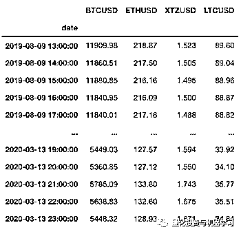

可视化：

```py
from sklearn.preprocessing import MinMaxScaler

scaler = MinMaxScaler(feature_range=(0, 1))
sdf_np = scaler.fit_transform(df)
sdf = pd.DataFrame(sdf_np, columns=df.columns, index=df.index)

plt.figure(figsize=(12,6))
plt.grid()
plt.plot(sdf)
plt.legend(sdf.columns)
```

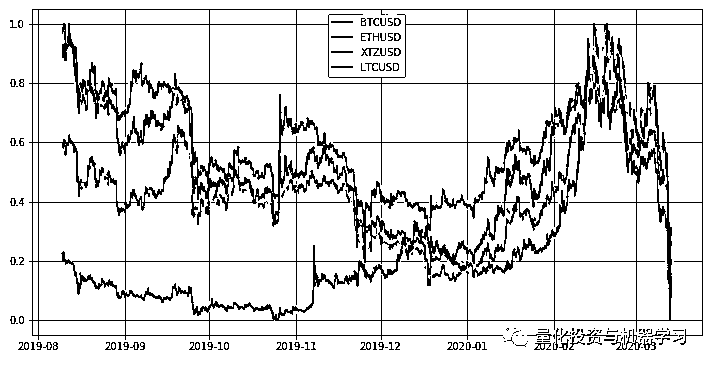

之所以选择 Litecoin 和 Ethereum，是因为它们与比特币的相关性非常高，无需考虑时间的长短。我们可以通过测量滚动窗口大小函数中的平均线性相关来判断：

```py
blue, orange, red = '#1f77b4', '#ff7f0e', '#d62728'  
plt.figure(figsize=(12,4))
plt.grid()

avg_corr1, avg_corr2, avg_corr3 = list(), list(), list()

for win in range(3, 72): # hours
    avg_corr1.append(df.ETHUSD.rolling(win).corr(df.BTCUSD) \
                     .replace([np.inf, -np.inf], np.nan).dropna().mean())
    avg_corr2.append(df.XTZUSD.rolling(win).corr(df.BTCUSD) \
                     .replace([np.inf, -np.inf], np.nan).dropna().mean())
    avg_corr3.append(df.LTCUSD.rolling(win).corr(df.BTCUSD) \
                     .replace([np.inf, -np.inf], np.nan).dropna().mean())

plt.plot(range(3, 72), avg_corr1, '.-', color=blue, label='ETH vs BTC')
plt.plot(range(3, 72), avg_corr2, '.-', color=orange, label='XTZ vs BTC')
plt.plot(range(3, 72), avg_corr3, '.-', color=red, label='LTC vs BTC')

plt.legend()
plt.xlabel('Rolling Window Length [hours]', fontsize=12)
plt.ylabel('Average Correlation', fontsize=12)
```

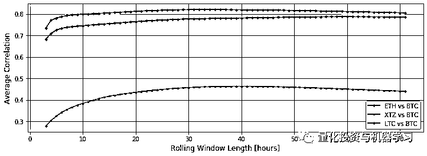

***3***

**特征工程**

将特征和标签进行区分。通过标签，我们将了解想要预测的值。比如，比特币 1 小时、2 小时、3 小时的价格（标签），或者只是 1 小时的价格（标签）。 

在训练样本中，标签用于训练。为此，我们提供了一系列的特征，并向计算机显示相关的标签。例如，如果我们设置的特征是三个加密货币一小时前（T-1）和两个小时前（T-2）的价格，而标签是一小时后的比特币价格（t），我们希望计算机学习其他加密货币价格的 expected 值与“预期”比特币价格之间的关系。为什么呢？原因很简单，基于过去的学习经验，当新的、从未见过的加密货币价格序列或测试样本出现相似性时，比特币的价格预测应该更准确。这就是学习的目标。如果你赤手空拳地去碰一口煎锅，你将学会不再以同样的方式去碰它。

假设在上面的推理中我们是正确的。如果是这样，我们可以看看特征和标签的准备过程。首先，让我们准备一个函数，它允许在一行中并排显示两个 DataFrames：

```py
def displayS(dfs:list, captions:list, space=5):

    output = ""
    combined = dict(zip(captions, dfs))
    for caption, df in combined.items():
        output += df.style.set_table_attributes("style='display:inline'") \
                  .set_caption(caption)._repr_html_()
        output += space * "\xa0\xa0\xa0"
    display(HTML(output))
```

接下来，我们将使用 ccrypto library 中的另一个函数，它只接受原始时间序列，允许我们指定哪个函数应该作为标签（在我们的例子中是 BTC/USD），以及我们希望使用多少小时滞后来生成一组特征：

```py
label = 'BTCUSD'

from ccrypto import get_features_and_labels

out_X, _, out_y, _ = get_features_and_labels(df, label,
                                             timesteps=2,
                                             exclude_lagged_label=False,
                                             train_fraction=0  
                                            )

display(df.head())
displayS([out_X.head(), out_y.head()], ['Features:', 'Label:'])
```

返回结果：

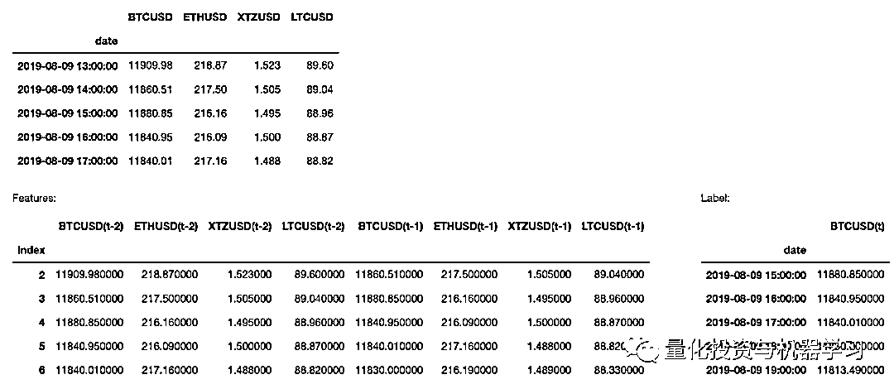

***4***

**训练测试样本分离**

同样的函数也可以用来将输入数据拆分为训练样本和测试样本。我们所要做的就是决定使用时间序列的哪一部分来训练 LSTM 网络。 我们取 95%：

```py
train_fract = 0.95

train_X, train_y, test_X, test_y = get_features_and_labels(df, label,
                                                           timesteps=2,
                                                           exclude_lagged_label=False,
                                                           train_fraction=train_fract
                                                          )

print(train_X.shape, train_y.shape, test_X.shape, test_y.shape)
```

（4972, 8) (4972, 1) (260, 8) (260, 1)

因此，我们将使用 4972 个观测值乘以 8 个特征进行训练，并对 260 个新的比特币收盘价进行样本外测试。如果我们能够非常准确地预测这 260 个值，那说明这次的研究成功了！

```py
data_size = df.shape[0]
train_size = int(data_size * train_fract)
test_size = data_size - train_size

plt.figure(figsize=(12,6))
plt.grid()

for cn in sdf.columns:
    plt.plot(np.arange(train_size+test_size), sdf[cn], color=grey, \
            label='True Signal ' + cn)

plt.plot(np.arange(train_size, train_size+test_size), sdf[label].iloc[train_size:], \
            color=blue, label='Test Signal ' + label)

plt.axvspan(train_size, test_size+train_size, facecolor=blue, alpha=0.1)
plt.annotate("Train Sample", xy=(2075, 0.875), fontsize=15, color=grey)
plt.annotate("Test Sample", xy=(4350, 0.075), fontsize=15, color=blue)
plt.xlabel("Data Points")
plt.ylabel("Normalized Time-Series")
plt.legend(loc=3)
```

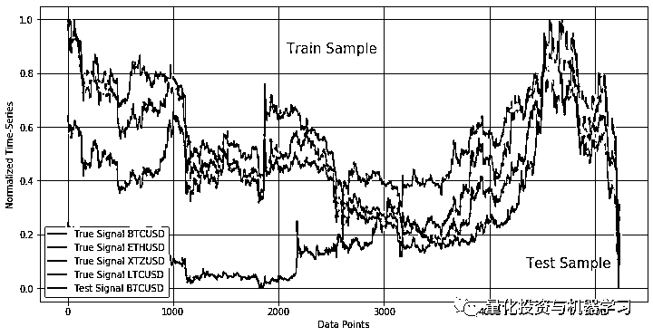

***5***

**LSTM 与比特币**

我们将设计一个简单的网络架构。公众号将在今天推文的后续部分中解释 RNN、LSTM 引擎的工作原理。现在，只要知道我们的 LSTM 将由 8540 个单元和一个 Dropout 层组成就足够了。输出是一个稠密层（一个单元）来返回预测的比特币价格。

我们将使用 TensorFlow 2.1.x（TF）构建 LSTM 网络。

TF 使用基于 keras 的 wrapper，该 wrapper 要求输入数据采用特定的格式。首先，我们需要重用 get_features_and_label 函数，将训练和测试样本作为 NumPy 数组返回，而不是 Pandas 的 DataFrame，然后使用重塑函数为 TF 准备数据：

```py
train_fract = 0.95
timesteps = 2
train_X, train_y, test_X, test_y = get_features_and_labels(sdf, label,
                                                           timesteps=timesteps,
                                                           train_fraction=train_fract,
                                                           as_np=True,
                                                           exclude_lagged_label=False)

train_X = train_X.reshape((train_X.shape[0], 1, train_X.shape[1]))
test_X = test_X.reshape((test_X.shape[0], 1, test_X.shape[1]))

print(train_X.shape, train_y.shape, test_X.shape, test_y.shape)
```

(4972, 1, 8) (4972, 1) (260, 1, 8) (260, 1)

准备好输入数据后，我们开始设计网结构：

```py
import tensorflow as tf

tf.random.set_seed(7)

dropout_fraction = 0.1
units = 8*5
ishape = train_X.shape[1], train_X.shape[2]

model = tf.keras.models.Sequential()
model.add(tf.keras.layers.LSTM(units, return_sequences=True, input_shape=ishape))
model.add(tf.keras.layers.Dropout(dropout_fraction))
model.add(tf.keras.layers.TimeDistributed(tf.keras.layers.Dense(1)))

model.compile(loss='mse', optimizer='adam')

print(model.summary())
```

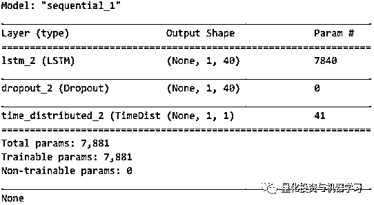

LSTM 网络的训练可还以通过以下拟合函数来执行：

```py
n_epochs = 3000
batch_size = train_X.shape[0]//5

history = model.fit(train_X, train_y, epochs=n_epochs, batch_size=batch_size,
                    validation_data=(test_X, test_y), verbose=0, shuffle=False)
```

epochs 的数量仅仅意味着我们需要对网络进行多长时间的训练，其中批量大小是训练中使用的数据点的大小。如果 verbose 设置为 0，model.fit 函数将不会显示拟合的进度。如何 verbose=1，我们可以在进程运行时预览它:

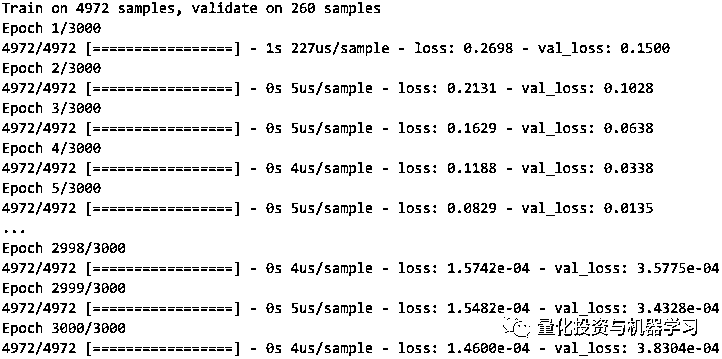

为了可视化损失函数的演变，使用以下代码：

```py
plt.figure(figsize=(12,2))
plt.grid()
plt.plot(history.history['loss'], label='train')
plt.plot(history.history['val_loss'], label='test')
plt.ylabel('Loss')
_ = plt.legend()

plt.figure(figsize=(12,2))
plt.grid()
plt.ylabel('Loss')
plt.semilogy(history.history['loss'], label='train')
plt.semilogy(history.history['val_loss'], label='test')
_ = plt.legend()
```

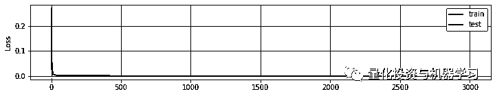

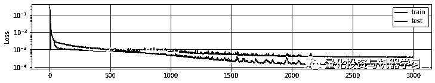

***6***

**测试样本中比特币收盘价的预测**

TF 允许使用一行代码对测试样本的模型进行预测。为了检验拟合优度（预测的比特币价格与实际价值），我们将使用均方误差回归损失（MSE）来度量：

```py
yhat = model.predict(test_X)
yorg = sdf[label].iloc[train_X.shape[0]+timesteps:]

yhat_f = yhat.flatten()
yorg_f = yorg.values.flatten()

from sklearn.metrics import mean_squared_error
rmse = np.sqrt(mean_squared_error(yhat_f, yorg_f))
print('Test MSE: %.5f' % rmse)
```

Test MSE: 0.01957

这是什么意思？这是我们在玩了几个小时后得到的最低的误差测量，最终的 fit 测试样本如下:

```py
z = np.zeros((test_size-timesteps, 4))
z[:,0] = yhat_f
yhat_inv = scaler.inverse_transform(z)[:,0]
yorg_inv = scaler.inverse_transform(sdf)[:,0]

plt.figure(figsize=(12,6))
plt.grid()
plt.plot(df.index[0:train_size], yorg_inv[:train_size], '-', color=grey, \
         label=label+' True Signal (train)')
plt.plot(df.index[train_size+2:], yorg_inv[train_size+2:], '-', color=blue, \
         label=label+' True Signal (test)')
plt.plot(df.index[train_size+2:], yhat_inv, '-', color=red, label=label+ \
         ' Close Price Prediction')

plt.title('Test MSE: %.5f' % rmse)
plt.ylabel('BTC/USD', fontsize=12)
plt.xlim([pd.to_datetime('2020-03-01'), df.index[-1]])
plt.ylim([4000, 9500])
_ = plt.legend(loc=3)
```

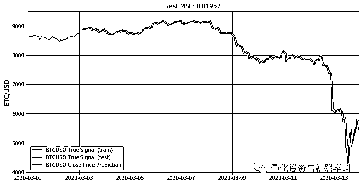

看看预测值和实际比特币收盘价之间的差异：

```py
btc = yorg_inv[train_size+2:]
btc_hat = yhat_inv

plt.figure(figsize=(12,4))
plt.grid()
res = btc_hat - btc
plt.plot(df.index[train_size+2:], res)
plt.title('Residuals')
plt.xlim([pd.to_datetime('2020-03-01'), df.index[-1]])
plt.savefig("/Users/pawel/Desktop/resid.png", bbox_inches='tight')
```

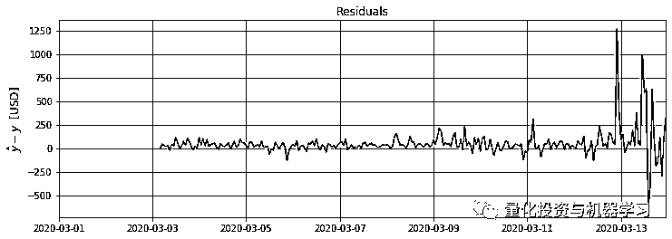

这张图揭示了很多。首先，我们可以看到，RNN LSTM 网络无法预测一个突然的价格下跌，这段下跌是由冠状病毒相关的恐惧所推动的。在此之前，它能更好地处理与实际价格偏离的预测，偏离范围在 0 到 150 美元之间，偏离-50 到 250 美元之间。

在接下来的文章里我们将做进一步的阐述。敬请各位读者期待！

系列 2 正在路上···

2020 年第 73 篇文章

量化投资与机器学习微信公众号，是业内垂直于**Quant、MFE、Fintech、AI、ML**等领域的**量化类主流自媒体。**公众号拥有来自**公募、私募、券商、期货、银行、保险资管、海外**等众多圈内**18W+**关注者。每日发布行业前沿研究成果和最新量化资讯。

你点的每个“在看”，都是对我们最大的鼓励