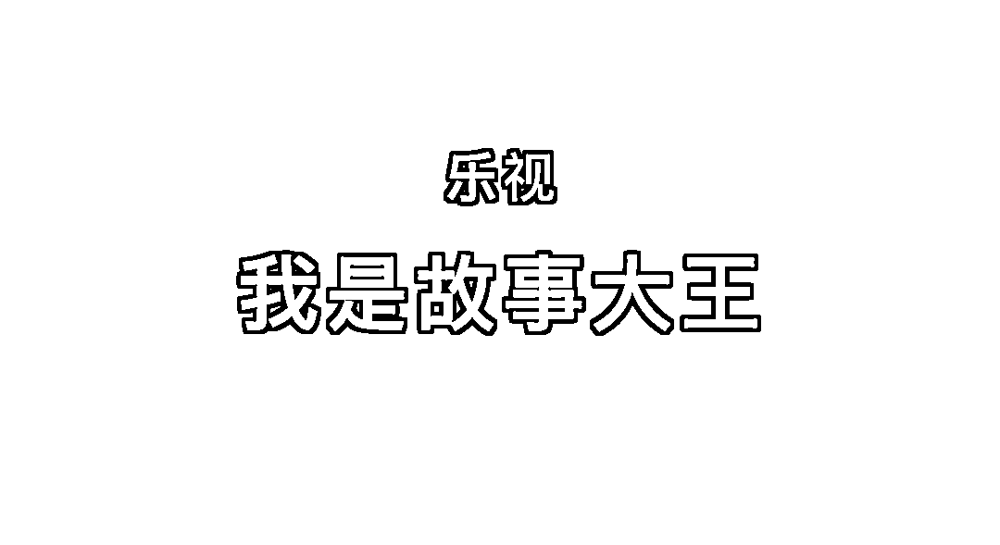
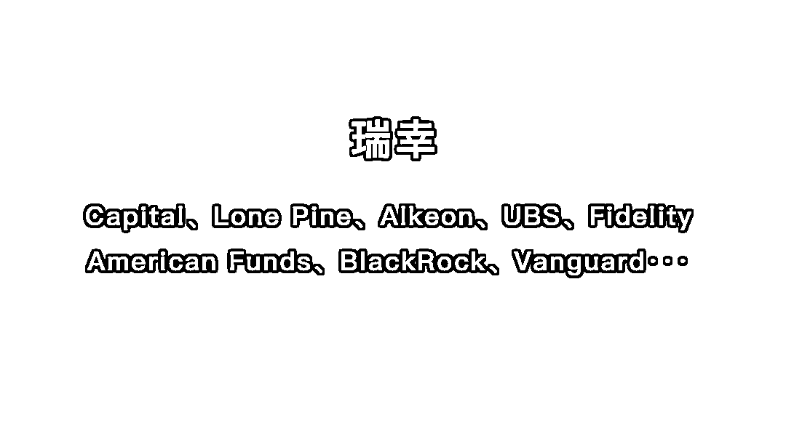
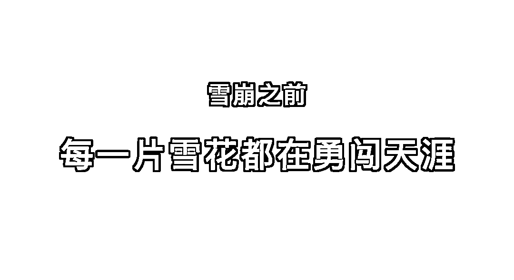
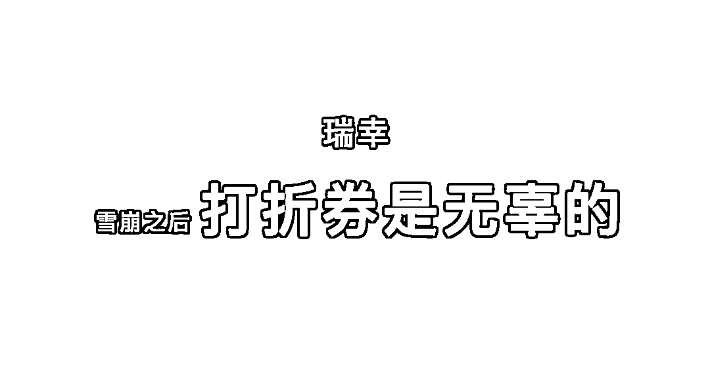
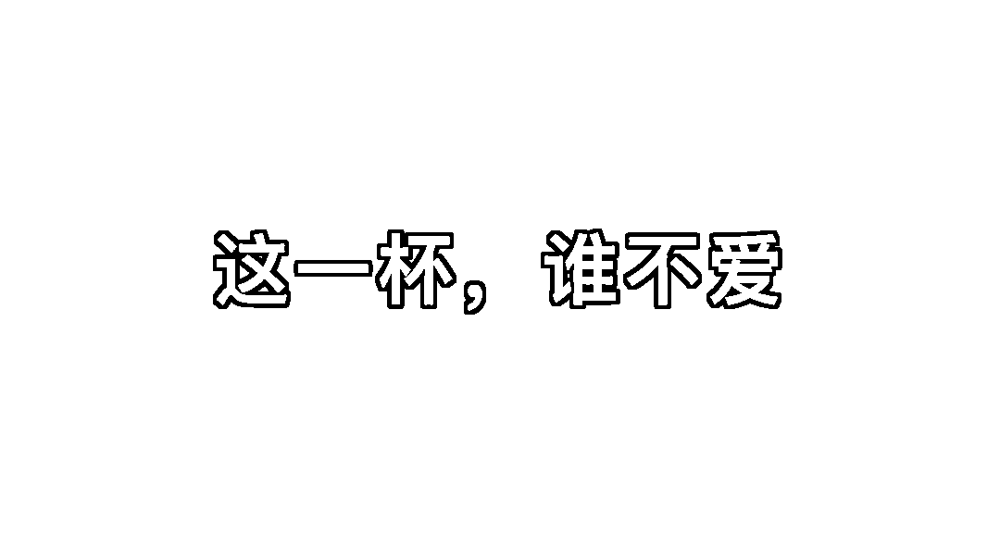
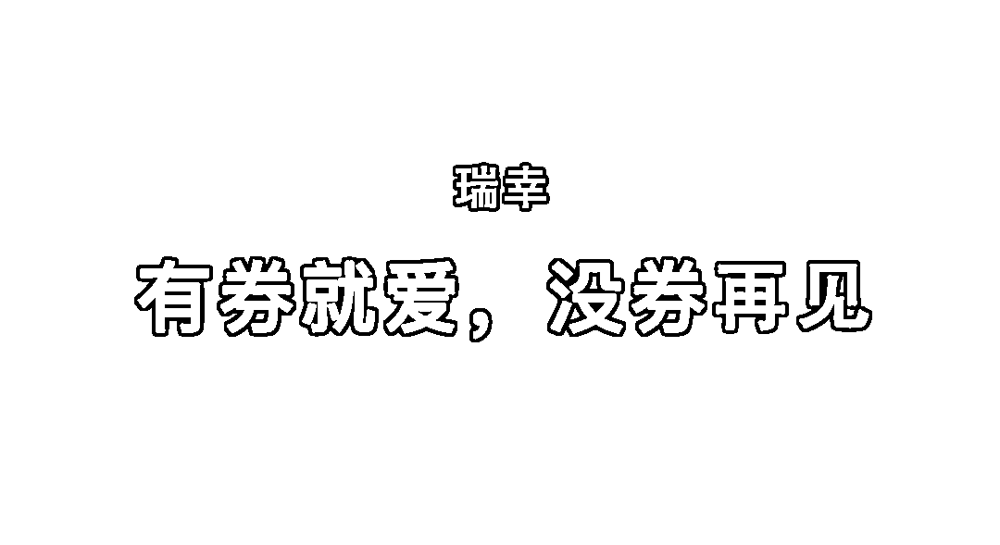
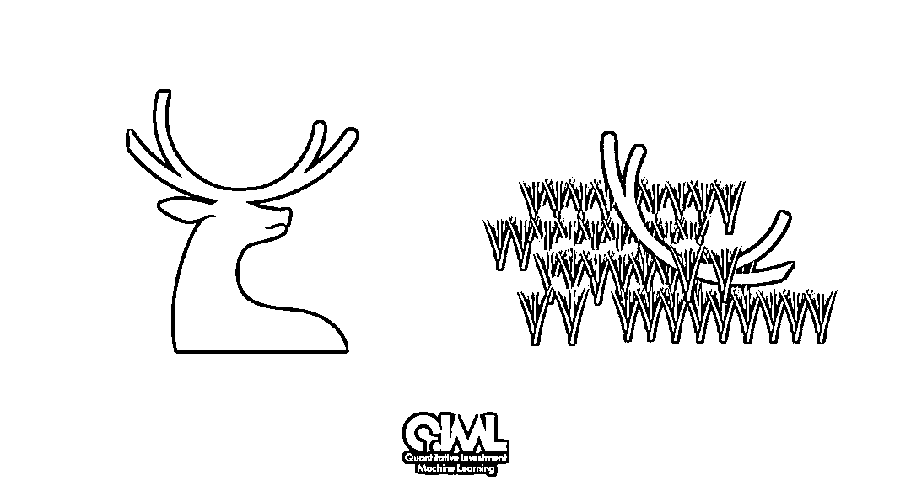

# 瑞幸：就当是一场梦，醒来赶紧把券用！

> 原文：[`mp.weixin.qq.com/s?__biz=MzAxNTc0Mjg0Mg==&mid=2653297818&idx=1&sn=8c1c6e464f08ec55b44a7a7e48454e36&chksm=802dde8fb75a579932db2567ee2af7dcb35299f6c4fb1973ea26ad897d72a571c3b43c39fccc&scene=27#wechat_redirect`](http://mp.weixin.qq.com/s?__biz=MzAxNTc0Mjg0Mg==&mid=2653297818&idx=1&sn=8c1c6e464f08ec55b44a7a7e48454e36&chksm=802dde8fb75a579932db2567ee2af7dcb35299f6c4fb1973ea26ad897d72a571c3b43c39fccc&scene=27#wechat_redirect)

**标星★****置顶****公众号     **爱你们♥   

量化投资与机器学习编辑部独家

<<< 向左滑动查看

<<< 向左滑动查看

<<< 向左滑动查看

<<< 向左滑动查看

<<< 向左滑动查看

<<< 向左滑动查看

<<< 向左滑动查看

<<< 向左滑动查看

<<< 向左滑动查看

资本市场的障眼法：

成功了我们叫：**资本运作（eg：神州）**

卖给别人了我们叫：**功成身退（eg：摩拜）**

砸了盘子我们叫：**骗子（**eg：**ofo）**

**那么，瑞幸应该叫什么呢？**

预知后事如何，坐等瑞幸应对。

**2020，见证历史，刻骨铭心！**

**精选文章：**

[1、算法交易，此篇足矣！](http://mp.weixin.qq.com/s?__biz=MzAxNTc0Mjg0Mg==&mid=2653293436&idx=1&sn=10a9de897ee9e6d0b6712ce31b8fffe5&chksm=802dc969b75a407f1877708aa4d743941f6b63b19c97b76a45f571d8287fc5fd848bfe9f0e50&scene=21#wechat_redirect)

[2、Twitter 上的情绪如何预测股价走势](http://mp.weixin.qq.com/s?__biz=MzAxNTc0Mjg0Mg==&mid=2653291745&idx=1&sn=860c56fb01d0a6277476b06a0db68148&chksm=802dc6f4b75a4fe2e7e202bd278daa413b949e947dac5cfbcb82e9d25ca48e7f0443a899f1cf&scene=21#wechat_redirect)

[3、一顿操作猛如虎，涨跌全看特朗普！](http://mp.weixin.qq.com/s?__biz=MzAxNTc0Mjg0Mg==&mid=2653293918&idx=1&sn=957c919a3f6446a0dee57b59380cbf17&chksm=802dcf4bb75a465da5159e4a2ab6f4fa52c4ca2cb6f3f526f38c5996755c799254d994a5f7a6&scene=21#wechat_redirect)

[4、利用深度学习最新前沿预测股价走势](http://mp.weixin.qq.com/s?__biz=MzAxNTc0Mjg0Mg==&mid=2653290080&idx=1&sn=06c50cefe78a7b24c64c4fdb9739c7f3&chksm=802e3c75b759b563c01495d16a638a56ac7305fc324ee4917fd76c648f670b7f7276826bdaa8&scene=21#wechat_redirect)

[5、华尔街失守：23 万交易员被机器人取代](http://mp.weixin.qq.com/s?__biz=MzAxNTc0Mjg0Mg==&mid=2653295698&idx=1&sn=8962f70a639c81174400861bec2883de&chksm=802dd647b75a5f517994a266985166ccacb63cac9f5589103d157ae699cdff9d37e4886671de&scene=21#wechat_redirect)！

[6、所有模型都是错的，但其中有些是有用的！](http://mp.weixin.qq.com/s?__biz=MzAxNTc0Mjg0Mg==&mid=2653293065&idx=1&sn=45b6a1db897b5c5c928a2bd87076c5dc&chksm=802dc81cb75a410a049cb6c5f7d1412ecb4ecfbaf46d390e41c5bf5d81add3d21839e2095c36&scene=21#wechat_redirect)

[7、用新闻来预测股价走势，带你吊打 Kaggle](http://mp.weixin.qq.com/s?__biz=MzAxNTc0Mjg0Mg==&mid=2653290456&idx=1&sn=b8d2d8febc599742e43ea48e3c249323&chksm=802e3dcdb759b4db9279c689202101b6b154fb118a1c1be12b52e522e1a1d7944858dbd6637e&scene=21#wechat_redirect)！

[8、严谨解决 5 种机器学习算法在预测股价的应用](http://mp.weixin.qq.com/s?__biz=MzAxNTc0Mjg0Mg==&mid=2653290588&idx=1&sn=1d0409ad212ea8627e5d5cedf61953ac&chksm=802dc249b75a4b5fa245433320a4cc9da1a2cceb22df6fb1a28e5b94ff038319ae4e7ec6941f&scene=21#wechat_redirect)

[9、2019 最新西蒙斯访谈：量化策略、职业与交易](http://mp.weixin.qq.com/s?__biz=MzAxNTc0Mjg0Mg==&mid=2653293316&idx=1&sn=1828e486f53b70a21c04b94b020ed5c6&chksm=802dc911b75a4007c02d27551ebdfe712dfc60f8dfb6caf2aa9b6244d5f494741a8923413d6a&scene=21#wechat_redirect)

[10、2020 全美 MFE 权威鄙视链出炉：Quant 何去何从？](http://mp.weixin.qq.com/s?__biz=MzAxNTc0Mjg0Mg==&mid=2653295958&idx=1&sn=16a90ff07a8c0d7b2abb1bc5cedc01d4&chksm=802dd743b75a5e557cef55b30a9ea233ee69b2ab0cb85f92bcede3d2e31d880ee27e47789b69&scene=21#wechat_redirect)

[11、TensorTrade：基于深度强化学习的 Python 交易框架](http://mp.weixin.qq.com/s?__biz=MzAxNTc0Mjg0Mg==&mid=2653295002&idx=1&sn=ce0ec3c2e22e7bd2dd297199225d500a&chksm=802dd38fb75a5a9937a454e9f9d568a19626f62fcc9a820e9f737a143d1c5d0869426bb13e62&scene=21#wechat_redirect)

2020 年第 72 篇文章

量化投资与机器学习微信公众号，是业内垂直于**Quant、MFE、Fintech、AI、ML**等领域的**量化类主流自媒体。**公众号拥有来自**公募、私募、券商、期货、银行、保险资管、海外**等众多圈内**18W+**关注者。每日发布行业前沿研究成果和最新量化资讯。

你点的每个“在看”，都是对我们最大的鼓励