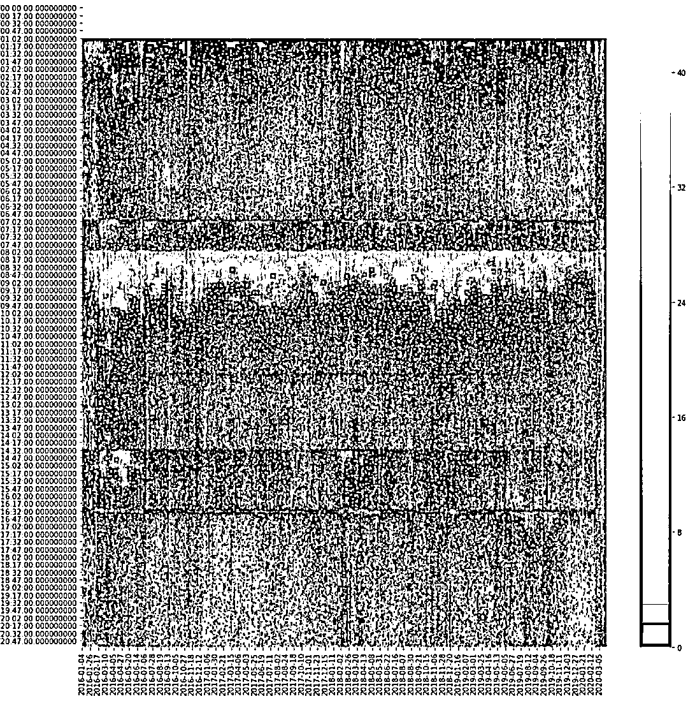
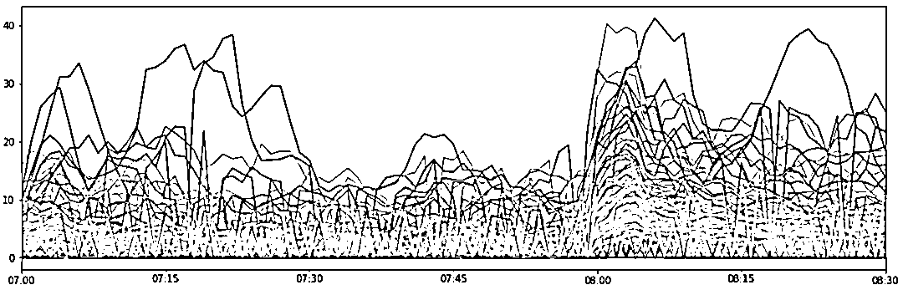

# 波动率预测：基于 CNN 的图像识别策略（附代码）

> 原文：[`mp.weixin.qq.com/s?__biz=MzAxNTc0Mjg0Mg==&mid=2653297780&idx=1&sn=6ca992371677a5b7c11ef557b1f076f2&chksm=802dde61b75a577755140c2f4c15f6417eed49be4dff87bd372fce2b4d16706b2779775b55d1&scene=27#wechat_redirect`](http://mp.weixin.qq.com/s?__biz=MzAxNTc0Mjg0Mg==&mid=2653297780&idx=1&sn=6ca992371677a5b7c11ef557b1f076f2&chksm=802dde61b75a577755140c2f4c15f6417eed49be4dff87bd372fce2b4d16706b2779775b55d1&scene=27#wechat_redirect)


**标星★****置顶****公众号     **爱你们♥   

作者：Chuan Bai   编译：1+1=6

***1***

**前言**

金融市场主要处理时间序列方面的问题，围绕时间序列预测有大量的算法和工具。 今天，我们使用 CNN 来基于回归进行预测，并与其他一些传统算法进行比较，看看效果如何。

我们这里关注的是**市场波动率**，具体来说，就是**股市开盘前后的波动率。**

***2*** 

**问题**

我们觉得，开盘前的波动率（vol）可能是一个很好的指标。如果我们能够准确地预测波动率，我们就可以利用它做些事情。

***3***

**数据准备**

2016 年 1 月至 2020 年 3 月富时 100 指数合约数据。


可视化：


我们感兴趣的数据是价格的波动率，本质上就是价格的标准差。我们构造的波动性指标是：用最高价减去最低价（分钟 bar），同时应用一个大小为 N 的移动平均窗口。


原则上，当价格大幅波动时，波动率应该变大，为了测试这一点，我们随机选择一个交易日，然后根据当天的 vol 和价格来确认这一点。


为了比较所有交易日的波动率，我们绘制了基于时序的波动率。波动率是根据 5 分钟的时间窗口计算的。每个点代表最后 5 分钟的体积，在 1070 天内每分钟计算一次。


可以看到，这些峰值似乎在一小时内重复出现，例如在 0000 和 0100、0700 和 0800 处出现峰值。让我们来画出热力图来检查这些值。

‍

‍

我们可以看到时间是 Daylight Saving Time（夏令时），所以需要将夏令时调整为 GMT（格林尼治标准时间），如下所示：

‍

在某些时期，波动率很大。贯穿热力图的实线表明，在某些时间，波动性持续较高，这些都是合理的。

*   0100：CFD 开始进行交易

*   0700：欧盟股市盘前

*   0800：英国股市开盘

*   1200：中午

*   1430：美国股市开盘

*   1630：英国股市收盘

我们还可以看到，在 2020 年 3 月的几天里，波动率很高。


如果我们想要利用波动率，它应该越高越好，那么最高的时间应该是股市开盘的时候，即 0800。如果我们可以用开盘前一小时的波动率来预测开盘后 5 分钟的波动率（通常这一时间段是一天中波动率最大的时候），那么我们可以围绕这个时间段去进行交易。



上图显示了 2016 年至 2020 年期间所有交易日的总波动率。我们可以看到，波动率往往在 0800 点市场开盘后立即回升，几分钟后回落。

我们假设开盘前和开盘后的波动率之间存在相关性。因此，如果我们在开盘前 1 小时和开盘后 5 分钟分别画出波动率的平均值，它们应该总体上会有一个上升趋势，确实如此：


x 轴是开盘前 1 小时的平均波动率，y 轴是开盘后 5 分钟的平均波动率。两者虽有相关性，但它们之间存在很多变量，因此不是一个可靠的预测因子。例如，根据这个图表，如果开盘前的平均波动率为 7.5，我们有理由假设市场开盘后的波动率在 5 到 25 之间，这没啥帮助。

***4***

**进一步讨论**

我们基本上对开盘前和开盘后的波动率做了线性回归分析。接下来我们加入一些稍微复杂的算法。将 1070 个样本分为三组：训练、验证和测试。

*   训练：0-699（截止 2018-10-09）

*   验证：700-899（截止 2019-07-25）

*   测试：900-1070（截止 2020-03-25）

**▌方法 1：线性回归**

由于数据有分组，所以线性回归的统计数据与使用完整数据集生成的统计数据略有不同。


从上面的图我们可以看出，**相关性仍然很强，但可决系数很低**，我们不能用这个方法来解释开盘后的波动率变化。

改进预测的方法之一是增加特征的数量，这就导致了多变量（元）回归。在这种情况下，我们可以利用开盘前一小时的分钟（1min）来预测开盘后的波动率：


统计数据上整体有所改善，但仍然不行，这里所有的线性回归都使用 statsmodel 库中的 OLS。

```py
import statsmodels.api as sm

def lingres(X, y, title=''):
    X_test = X[900:]
    y_test = y[900:]
    X = X[:700]
    y = y[:700]

    model = sm.OLS(y, X).fit()
    predictions = model.predict(X)
    plot_out(y, predictions, title + ' Train')
    predictions = model.predict(X_test)
    plot_out(y_test, predictions, title + ' Test')
    return model
```

****▌**方法 2：梯度提升法**

在进行预测特别是分类时，梯度增强是标准的方法，它将为我们提供一个非常好的基准，以便后面做进一步改进。

**这里我们使用 LightGBM**，输入到模型中的特征本质上与多元回归相同。

```py
from lightgbm import LGBMRegressor
from sklearn.model_selection import cross_validate

regr = LGBMRegressor()
scores = cross_validate(regr, X, y, cv=5, scoring=['neg_mean_squared_error', 'r2'])
scores
#{'fit_time': array([0.242456, 0.243822, 0.285033, 0.266963, 0.213427]),
# 'score_time': array([0.003387, 0.003706, 0.004177, 0.003168, 0.003078]),
# 'test_neg_mean_squared_error': array([ -3.989691, -1.751312, -1.646064, -2.936831, -11.072056]),
# 'test_r2': array([0.473771, 0.327672, 0.443433, 0.042896, 0.609157])}
```

通过 5 种不同的交叉验证评估，该模型在我们数据样本的不同切面上表现不是很稳定，这表明在我们的数据在不同部分存在某种不平衡的离群样本。尽管当我们更深入地研究预测过程时，这可能是一个问题，但就本文而言，只要我们有相同的训练、验证和测试集，我们就不需要过多担心，因为这是我们的第一次尝试。 

如前所述，我们需要在不同的方法中保持样本的一致性，因此我们只训练前 700 个样本，并预测样本 900+个样本 。

```py
train_index = [x for x in range(700)]
test_index = [x for x in range(900, 1070)]
X_train, X_test = X[train_index], X[test_index]
y_train, y_test = y[train_index], y[test_index]
regr.fit(X_train, y_train)
y_hat = regr.predict(X_test)
y_train_hat = regr.predict(X_train)
```

训练集和测试集结果：


训练结果比方法 1 好，R 方为 0.94，但测试集的预测失败了。虽然它在测试集中表现不是很好，但仍然比我们使用纯线性回归所做的预测要好。

**▌方法 3：MLP（神经网络）**

当我们在预测中有如此大的方差时，神经网络可能能够描述输入特征之间的复杂关系，并发现它们之间的隐藏关系。

**我们使用 FastAI 作为深度学习库来构建底层网络，目前 FastAI 是建立在 PyTorch 之上的**。大家可以描述自定义的 PyTorch 模型并将其传递到 FastAI 以获得 FastAI 提供的训练工具。


https://www.fast.ai/

我们使用与 LightGBM 相同的输入和输出集，并将数据输入到 2 个隐层的 MLP 网络中，每个隐层有 300 个神经元。

```py
from fastai.tabular import *

dep_var = 'target'
y.name = dep_var
mlp_df = pd.concat([X, y], axis=1)
procs = [Normalize]

data = TabularDataBunch.from_df('.', mlp_df.iloc[:900], dep_var, valid_idx=range(700, 900), procs=procs)
learn = tabular_learner(data, layers=[300,300], loss_func=mse, metrics=[r2_score, explained_variance])

learn.lr_find(start_lr=1e-6, num_it=50, end_lr=1e-1)
learn.recorder.plot()
learn.fit_one_cycle(3, slice(3e-4), wd=0.2) 
```

经过几次迭代训练，我们可以得到类似这样的预测结果。


我们可以看到，由于最近市场的波动，测试集中的波动率最高，因此验证数据集对我们的测试数据不具有代表性。然而，与之前的方法相比，在统计数据方面表现较好。

***5***

**基于图像识别的回归分析**

在基于图像的回归之前，我们的目标参数需要做一点修改，因为在转换过程中我们会丢失数值。因为在转换成图像之前，每个时间窗口内的值都被归一化了。  

为了弥补这一缺陷， 我们用开盘前后的平均价格比作为我们的目标。通过这种方式，我们向神经网络提出了一个问题：与盘前波动率相比，开盘后的波动率会有多大？例如，如果开盘前的平均波动率是 10，而开盘后的波动率是 50，我们的目标是预测 5 而不是原始的 50。

为了防避免这种问题的发生，我们训练了一个 MLP 网络，其与前面的方法具有相同的结构、相同的数据。


注：由于在除法计算后出现了巨大的峰值，所以波动率上限为 30，如下所示：

Raw vol_after / vol_before


Capped@30 vol_after / vol_before

与原始值的预测相比，MLP 的间接预测结果略差，但差别不大。现在我们有了 CNN 网络可以比较的基准。

***6***

**图像转换**

借助 Gramian Angular Field 和 pyts 库的帮助下，我们现在可以根据点之间的极坐标关系将任何时间序列转换成图像。


https://arxiv.org/pdf/1506.00327.pdf

在下面的代码中，其每天创建一个图像，每个图像描述开盘前 60 分钟的波动率。

```py
from pyts.image import GramianAngularField
from matplotlib import pyplot as plt

from multiprocessing import Pool, cpu_count

gadf = GramianAngularField(image_size=60, method='difference')
X_gadf = gadf.fit_transform(X)

def convert_img(idx):
    fig = plt.figure()
    ax = plt.subplot(111)
    try:
        fname = f'imgs/{idx}.png'
        if os.path.exists(fname):
            return
    except:
        return
    ax.imshow(X_gadf[idx], cmap='rainbow', origin='lower')
    ax.set_title('')
    ax.set_xticks([])
    ax.set_yticks([])
    fig.savefig(fname, bbox_inches='tight')

p = Pool(cpu_count())
_ = p.map(convert_img, (i for i in range(1070)))
```

对于 CNN 网络来说，它本质上是使用 ResNET34 作为底层，然后在顶部加上一个[1024,512]稠密层，并使用一个简单的线性激活节点执行最终的回归。

```py
data = (ImageList.from_csv('imgs', 'labels.csv')
                 .split_by_idxs(list(range(700)), list(range(700, 900)))
                 .label_from_df()
                 .databunch())

learner = cnn_learner(data, models.resnet34, loss_func=mae, metrics=[r2_score])
learner.model[1]
# Sequential(
# (0): AdaptiveConcatPool2d(
# (ap): AdaptiveAvgPool2d(output_size=1)
# (mp): AdaptiveMaxPool2d(output_size=1)
# )
# (1): Flatten()
# (2): BatchNorm1d(1024, eps=1e-05, momentum=0.1, affine=True, track_running_stats=True)
# (3): Dropout(p=0.25, inplace=False)
# (4): Linear(in_features=1024, out_features=512, bias=True)
# (5): ReLU(inplace=True)
# (6): BatchNorm1d(512, eps=1e-05, momentum=0.1, affine=True, track_running_stats=True)
# (7): Dropout(p=0.5, inplace=False)
# (8): Linear(in_features=512, out_features=1, bias=True)
# )
```

经过反复的训练，我们得到了这样的结果：


我们可以看到，即使预测相同的目标，基于图像的回归也比 MLP 对应的回归表现得好得多。

不通方法的比较：


我们可以看到，MLP 在预测绝对波动率值时的表现优于其他所有方法，而 CNN 在预测相对波动率时在各个方面都优于同一网络。

**因此，在进行时间序列预测时，CNN 是一个很好的选择，尽管它确实需要大量的计算能力来进行图像转换和训练。**

2020 年第 71 篇文章

量化投资与机器学习微信公众号，是业内垂直于**Quant、MFE、Fintech、AI、ML**等领域的**量化类主流自媒体。**公众号拥有来自**公募、私募、券商、期货、银行、保险资管、海外**等众多圈内**18W+**关注者。每日发布行业前沿研究成果和最新量化资讯。

你点的每个“在看”，都是对我们最大的鼓励