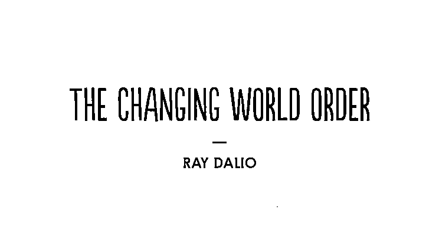
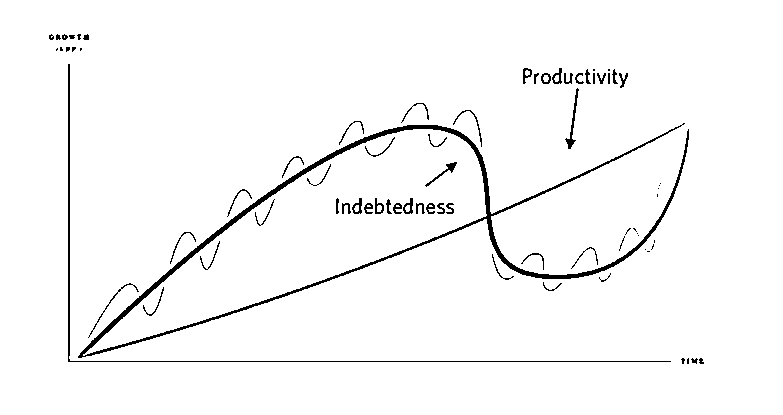
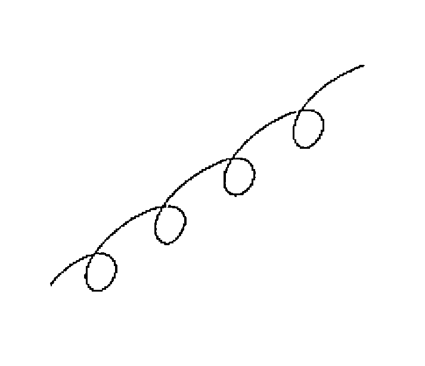
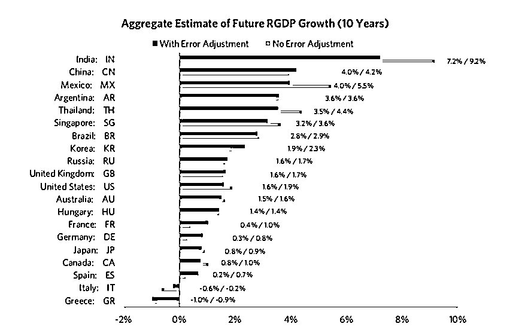
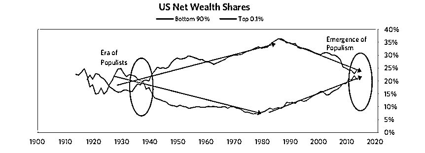

# 达里奥最新万字长文：悄悄变化的世界格局与宏观周期

> 原文：[`mp.weixin.qq.com/s?__biz=MzAxNTc0Mjg0Mg==&mid=2653297685&idx=1&sn=16093064aa379aca644464e1ebec470f&chksm=802dde00b75a5716c20880597ec65cb358eea2e8e0ddebb16bec24692d2b25af1e2abca97b98&scene=27#wechat_redirect`](http://mp.weixin.qq.com/s?__biz=MzAxNTc0Mjg0Mg==&mid=2653297685&idx=1&sn=16093064aa379aca644464e1ebec470f&chksm=802dde00b75a5716c20880597ec65cb358eea2e8e0ddebb16bec24692d2b25af1e2abca97b98&scene=27#wechat_redirect)

**标星★****置顶****公众号     **爱你们♥   

作者：Ray Dalio

桥水基金的创始人和首席投资官 Ray Dalio 凭借桥水基金的优异业绩、浸淫全球宏观市场数十年的深刻洞见，以及《原则》和《债务危机》两本书，一本解释个人生活工作原则，一本则从宏观角度解释一个经济体的运行规律，赢得了市场的追捧和读者的喜爱。

最近，他在领英上发布了**最新系列的研究《Changing World Order》**，这次超脱出个人和经济体的运行规律，他试图通过研究过去 500 年的包括中、美、英以及其他 6 个国家等全球主要经济力量交替兴衰的形式，来解释我们正处在一个 50-100 年长周期背景下的特殊时期，即变化的世界格局与力量的交替，以及即将到来的经济、地缘政治和价值观上的震荡和巨大改变。

本篇文章由溯元育新刘嘉培原创，微信公众号：溯元育新（WeChat ID: EnvolveGroup）。

溯元育新是专注于研究商业世界与精神文明领域代际变迁的专家集团。

我相信接下来很长的一段时间内，我们将会经历一个与过往【完全不同】（radically different）的特殊时期：这个时期将会颠覆我们过往对世界的认知，但类似的时期同时又在历史长河中反复发生过很多次。

生产力水平与债务周期有着密切的关系[1]

这个观点是我在过去 1 年半的时间里仔细研究之后得出的结论。在过去 1 年半的时间里，我主要研究了全球各大帝国 / 王朝的崛起与衰落，这个兴衰过程中他们的储蓄货币（reserve currency）与经济市场；其次我加入了在过去一段时间看到的“并非寻常”但“似曾相识”的市场信号（development），这些市场信号在我的人生中从来没有发生过，但经过研究，我知道在历史当中曾经反反复复发生过很多次。最重要的是，我看到了 3 个对我们的生活息息相关、至关重要的事件： 

**1.经济增长困局：**全球经济体的高负债率（high level of indebtedness）+低利率，将会极大程度限制全球各大央行刺激经济增长的能力；

**2.内部冲突：**各国家内部巨大的贫富差距与相应的政治分歧，带来了不断恶化的内部社会与政治冲突；

**3.外部冲突：**中国作为一个不断发展且冉冉上升的世界强国（world power），正在挑战过分扩张后显得力不从心的美国，这个过程中产生了很多地缘冲突与贸易冲突。 

**回看历史，我们现在所经历的时期，相似度最高的是 1930-1945 年之间的时期；我们都知道那段时间发生了什么，而这也是我非常非常担心接下来会发生的一切的重要原因。**

在研究历史的过程中，我看到的是一长一短两种典型周期的吻合与交叉，分别是 10-20 年左右的“过渡性”周期，与随之而来的 50-100 年的经济政治大周期。这些经济政治大周期又由两种元素组成： 

**1.安乐繁荣发展期：决策者（people with power）在一起和谐共处并携手并进，以合适可持续的方式追求创造财富；**

**2.痛苦下行震荡期：各方为争夺权力和财富不断摩擦产生冲突，打乱了经济的和谐发展与生产力的不断提升，有时甚至会导致战争和社会动荡（revolution）。**

这些震荡时期通常像一场暴风雪一般，即便造成很多破坏和痛苦，也将会解决因为很多弱点和过分放纵带来的产物，例如过多的负债；且在最终将会把市场基本面（fundamentals）带回到一个更理智合理的水平。这自然会产生一种适应痛苦变化的过程，最终将我们整体变得更加强壮和柔韧，尽管最后将会有新的、与我们所熟识不同的世界秩序和新的世界力量产生。

这一切将会如何发生，答案只能从研究、学习相似的历史案例中来 -- 例如 1930-1945 年的那段时期，也有大英帝国、荷兰王朝的兴起与衰落，中国不同王朝的兴衰成败等等。**从这些研究当中，我们能够挖掘出“现在我们究竟在经历什么”、“接下来可能会发生什么” 这两个问题的理解。这就是我接下来要发表的一系列研究的目的。**

我写下这篇文章的时候，COVID-19 作为一种全球大流行病正在肆虐，这也是一件我人生中从未经历过、但在历史长河中重演多次的重大事件，这也推动着我不断的去学习和研究历史来真正理解当下正在发生的一切。

对于一个需要在相对短的时间框架内作出投资决策的投资人来说，去研究超长时间框架下历史的演变、王朝的兴衰可能看起来很奇怪。但我的过往经验告诉我，我需要这方面的视角和知识来把投资真正做好。**我的职业生涯当中最大的那些错误，往往来自于错过了那些“在我的人生中没有发生过，但在历史当中反复重演”的市场信号（market moves）**。这些错误教会了我需要从历史和全球的角度来看经济和市场的发展历程，来去学习那些宝贵的市场运作方式（mechanics），**更重要的是在这其中提炼出一些普适的原则（timeless and universal principles）。**

市场给我的第一个“大惊喜”是在 1971 年 ，那年我 22 岁，在纽交所打暑期工当记账员。1971 年 8 月 15 号周日晚，尼克松总统宣布美元将会脱离金本位制度，不再承诺美元和每盎司黄金可以进行固定兑换。美元当时大跌。我一边听着，一边意识到美国政府刚刚对他们的约定承诺违约了，“金钱”这个我们所熟知的概念可能会彻底结束了。我当时心里暗叫不妙。周一我上班的时候在想，股市可能会大跌，而且交易大厅里面肯定会一片混乱。我走进交易大厅的时候，的确一片混乱，但这并不是由股市大跌导致的，股市的表现正相反，整体暴涨 4%。我整个人都呆住了。

**后来想想，这当然是因为我之前从来没有经历过货币贬值，所以才做出了错误的预测。接下来的一些日子，我钻进了各种历史文献里，发现了很多类似货币贬值的案例都对股市有着相似的影响。**进一步研究之后，我理解了这背后的原理，而这个宝贵经验将会在不久的将来一次又一次的帮助我安全度过市场波动与危机。**不过这并不是故事的结尾，我也是又经历了好几次痛苦的“大惊喜”，才真正正视了现实：我需要真正理解在过去 100 多年里面，在全球主要国家里面发生的所有重要经济、市场事件（big economic and market moves）。**

换句话说，如果过去发生过一些重大事件（例如 1930 年代的大萧条），我不能肯定地说“这不会发生在我身上”，所以我必须研究清楚它的发生机理的并做好相应的准备。通过我的研究，我发现在历史上重复发生过很多性质类似的特定事件（比如各种经济萧条）。像医生研究许多特定类型疾病的不同案例一样，通过研究它们，我可以更深入的了解其的发生机理。**我的工作方式，是研究尽可能多的【特定事件】的重要案例，然后在此过程中抽象形成一个典型事件，我称之为典型范例（archetype）。**

典型范例可以帮助我了解驱动这些事件不断发展的因果关系。然后，我会比较特定事件与典型范例之间的关系，以了解导致二者之间差异背后的原因。**这个过程有助于我加深对因果关系的理解，以至于我可以以“如果…那么..”（if / then）语句的形式创建决策机制，即如果 X 发生，那么就下 Y 赌。****然后，我对实际事件进行观察，并与我们之前设计的原型模版和对应的期望值进行比对和测量 。**在桥水，我和我的同事们以一种非常系统化、结构化的方式来执行上述过程。如果事态发展顺利，我们将继续押注接下来通常发生的事情，如果事态发生偏离，我们将尝试理解其中原因并逐步纠正。 

我的方法不是为学术研究而创建的一种研究方法论；它是一套非常实用的原则，而我依靠严格执行这一套原则来做好我的工作。作为一个全球宏观投资者，我的工作要求我比竞争对手更深刻地了解经济的运作原理和市场变化。在我多年来与市场进行博弈并试图总结出一套原则的过程中，我逐步了解到： 

**1.投资人预测和应对未来的能力高低，取决于对事物变化背后的因果关系的理解深浅。**

**2.要了解因果关系，投资人应该去研究这些事物过去的变化和表现。**

数十年来，桥水的业绩记录可以衡量这种方法的实用性。

为了探寻这些普适性的原则，我针对这些事件进行了许多研究。在这个过程中我了渐渐解到，大多数事情，例如繁荣时期、萧条时期、战争、 revolution、牛市、熊市等，都会随着时间推移反复发生。**这些现象出现的原因基本上是相通的，而且以周期的形式进行反复；更重要的是，它们通常以比我们的寿命更长的周期来进行。**这帮助我将大多数经济事件视为上述事件中的“再一次发生”，就像生物学家在野外遇到某个生物时，会识别出该生物属于什么物种（或其中之一），来思考一下如何那种事物起作用，并尝试探寻并使用普适性的进化原则来有效地处理它。

**以这种方式看待事件，有助于将我的观点从嘈杂的事件噪音中转移出来，使我能够以超越本次事件之外的角度，来观察其随时间推移的规律变化。**通过这种方式，我对相互关联的事件本身了解得越多，我就越能发现它们之间的相互影响。例如，经济周期与政治周期如何相互作用，以及它们在更长的时间框架内如何相互作用。我还了解到，当我注意细节时，我看不到全局；当我注意全局时，我看不到细节。然而，为了理解这些模式及其背后的因果关系，我需要同时从更高层次，更广阔的视野和更基础的层次，更详细的视角来看待，并考察最重要的市场力量之间的相互关系 。在我看来，似乎大多数事物都是随着周期向上发展（随着时间的推移而改善），就像是一个朝上的开瓶器：

大多数事物都是随着周期向上发展

例如，随着时间的流逝，我们的生活水平会提高，因为我们的知识会进步，从而提升我们的生产力；但是我们的经济却起起伏伏，因为我们的债务周期使实际的经济活动在宏观的上升趋势中上下波动。

**我相信人们往往会错过生命中重要的“进化时刻”的原因是，我们每个人都只能够经历宏观周期中一小部分、且发生在现在的事情。**某种程度上来说，我们就像蚂蚁一样忙于在短暂的生命中搬运面包屑，而不是对全局规律和宏观周期、驱动它们的重要且相互关联的事物、我们在周期中的所处位置、接下来可能发生的事情有更广阔的视野。

从这个角度来看，我已经相信只有有限数量的个体，会沿着有限的道路不停走下去，导致他们遇到有限数量的情况，最终产生有限数量的故事 / 事件；而这些事件会随着时间的推移而不断重复。

**而在这个循环往复的过程中，唯一改变的是这些个体们的身份/背景，和他们使用的技术。**

**这份研究并非是我的偶然兴起，而是一环扣一环的研究过程中推演而得出。**具体我是如何想到要研究世界格局的变迁和帝国王朝的兴衰、以及它们背后的经济与货币周期演变的呢？

**研究人类历史中存在的各种货币和信贷周期，使我意识到了【长期债务周期】（通常持续约 50 至 100 年）的存在。**这使得我开始以与过去截然不同的方式来分析和理解当下发生的情况。例如，在利率触达 0％、美联储印发大量钞票并购买金融资产，来应对 2008-09 年的那场全球金融危机之前，我曾研究过 20 世纪 30 年代发生过的类似事情和市场走向，这使得我们的基金能够平稳度过市场波动而且获利。从那项研究当中，我还看到了这些中央银行的行为如何推高了金融资产价格和振兴了经济表现，作为结果，贫富差距则被拉大，并导致了接下来我们经历的民粹主义和各种社会冲突。现在，我们在市场当中看到了在 2009 年后时期发挥同样作用的力量。

桥水基金对于各国 10 年经济增长率的预测[2]

2014 年的时候，因为我们的投资策略，我开始预测一些国家的经济增长率。**我们使用类似的方法来研究了许多案例，以期找到经济增长的驱动因素，并提出了一些普适性的指标来预测这些国家在 10 年内的经济增长率。在此过程中，我对不同国家的经济表现好坏优劣的原因有了更深入的了解。在将这些指标整合到了量表和公式当中后，我们可以对全球 20 个最大的经济体进行 10 年的经济增长估算。**除了对我们的投资决策有帮助外，我还认为这项研究可以帮助各经济体中的相关决策者。因为他们如果能够看到这些普适性的因果关系，那么就可以提前知道，如果改变 X，将会在未来产生 Y 效应。我还看到，相对于中国和印度等新兴大国，美国的这些 10 年经济指标（例如教育质量和负债水平）正在不断恶化。

**这份报告文末点击链接可以获取，名为**：“Productivity and Structural Reform: Why Countries Succeed and Fail, and What Should Be Done So Failing Countries Succeed.”[3]

在 2016 年特朗普当选后不久，随着发达国家民粹主义的日益明显，我开始研究民粹主义的历史。**这对我而言，突显了当下的深刻社会和政治冲突背后的财富差距和价值观分歧，这跟 1930 年代经济大萧条时的财富、价值观分歧非常相似。**研究过程中，我还发现了为什么主张改革的（left）民粹主义者和主张保守的（right）民粹主义者，往往更倾向于民族主义、军国主义、贸易保护主义和对抗主义，以及这种做法最终导致的可怕结果。我看到了经济/政治层面改革和保守主张之间的冲突可能变得多么强烈，以及这种冲突对经济，市场，财富和权力的强烈负面影响。这使我对过去和现在正在发生的事件有了更好的了解。 

通过进行这些研究以及观察我周围发生的事情，**我发现美国人们正经历着巨大的经济状况差距；而这些差距，往往被【经济平均水平】的烟雾弹所掩盖。**因此，我将经济水平分为五等份，通过查看收入最高的 20％人群，一直到最低的 20％人群，然后分别研究这些人群的状况。这促成了两项研究。

20 世纪 30 年的贫富差距扩大+民粹主义兴起

当下的美国正在接近类似的水平[4]

第一项研究是“Our Biggest Economic, Social, and Political Issue: The Two Economies—The Top 40% and the Bottom 60%”这份报告量化地分析了美国穷人和富人之间生活水平和经济状况的巨大差异，**这让我再一次深刻理解到了我们正在走向的两极分化、以及民粹主义的深渊。**这些发现、结合我和我妻子在慈善事业中所看到的现象，以及康涅狄格州社区及其学校的贫富差距、机会鸿沟的残酷现实，引导我创作了“Why and How Capitalism Needs to Be Reformed”这份报告。

**两份报告可以在文末点击链接获取：**

“Our Biggest Economic, Social, and Political Issue: The Two Economies—The Top 40% and the Bottom 60%”[5]

“Why and How Capitalism Needs to Be Reformed”[6]

同时，通过我多年来在其他国家的投资和研究，我看到了全球经济和地缘政治的巨大变化，尤其是在中国格外突出。在过去的 35 年中，我在不断地去往中国做实地研究和调查的过程中，很幸运地能与一些中国的高层决策者结识。**这帮助我近距离地了解了中国取得的巨大成就以及背后的能力和历史观。这些优秀的能力和远见卓识使中国成为美国在生产，贸易，技术，地缘政治和世界资本市场上的有效竞争对手。**

顺便说一句，你可以在以下网站免费阅读这些研究：www.economicprinciples.org。

我写下这些东西的原因，是因为我需要研究并了解正在发生的重要事件，**而这些事件在我一生中都没有发生过，但在历史的进程中反复发生过非常多次。**这些重要事件又是三大力量的变化及其引发的问题所导致的。

**1) 长期货币和债务周期**

**THE LONG-TERM MONEY AND DEBT CYCLE **

美国过去 40 年的联邦基金利率（federal funds rate），2020 年接近历史最低[7]

在当下正常人的一生中，利率都没有低到今天这样的水平，乃至出现了负利率的情况。**在 2020 年初，超过 10 万亿美元的债务处于负利率状态，并且为了再融资和满足财务赤字的需求，我们很快将需要发行数量庞大的新债务。**雪上加霜的是，巨额养老金和医疗保险也同时快要到期亟待支付了。这些严酷的情况，对我提出了一些非常重要的问题：

*   **自然地，我想知道为什么有人会想持有负利率的债券（购买$100 到期支付$98），以及在负利率情况下，利率到底可以低到什么程度？**

*   **我也想知道，如果经济和市场不能被压低，将会发生什么？**

*   **当下一次经济下滑不可避免、而我们又面临负利率的情况下，央行们将如何发挥他们应有的刺激经济的作用？**

*   **中央银行会发行更多的货币，导致其价值下降吗？**

*   **如果在如此低的利率下债务所用的结算货币贬值会发生什么？**

这些问题使我进一步问自己，如果投资者逃离以世界常见储备货币（即美元，欧元和日元）结算的债券，那么央行将采取什么措施应对？这是央行们必须要认真对待的问题，考虑到用来偿还债券的货币发生贬值、同时支付利息的债券还处于负利率的情况同时发生。

加入一点背景知识，储备货币（reserve currency）是全世界公认的交易和储蓄货币。能够印制世界主要货币的国家（现在是美国）享有特权且处于非常强大的地位，而以世界储备货币计价的债务（即以美元计价的债务）是实现世界资本市场平稳运转、经济稳定发展这一目标的最基本构成要素。**在过去的历史当中，基本上所有的“世界储备货币”的地位最终都不可避免的被终结了；而对于享有这种特殊特权（印发“世界储备货币”）的国家而言，这种终结往往会导致非常糟糕的结局。因此我也开始怀疑和思考，美元会否、何时、为什么会在成为世界领先的储备货币的过程中走向下降和终结，以及这将如何改变当下的世界格局与经济形势。**

**2) 国内财富和权力周期**

**THE DOMESTIC WEALTH AND POWER CYCLE **

****

美国前 40%富有的人跟剩下的 60%的人资产配比情况；可以明显看到富人的金融资产占比高达 35%[8]

在美国内部来看，当下的财富差距，价值观差异和政治主张分歧，比我一生中所经历的任何时候都要大。通过研究 1930 年代和其他两极分化特别严重的时代，我了解到无论哪一方胜出（无论是主张改革的还是主张保守的，left or right），都将对经济和市场产生巨大影响。**所以，我自然地想知道，这些财富、价值观和主张上的分歧和差距将在我们的时代造成什么样的影响。我对历史的研究告诉我，当财富和价值观差距巨大并且经济不景气时，关于如何分配产出和收入的冲突将会大幅增多。**下一次经济衰退到来时，人们和决策者将如何相处和互动？这使得我特别担心，因为上文提到的中央银行通过削减利率以刺激经济增长的能力，现如今也受到了极大的限制。

除了这些传统工具（削减利率）已经无效之外，印刷额外的钞票和购买金融资产（现在称为“量化宽松”）也扩大了贫富差距，因为购买金融资产将会推高这些资产的价格，**而往往能够购买金融资产的，是富人而不是穷人。**

**3) 国际财富与权力周期**

**THE INTERNATIONAL WEALTH AND POWER CYCLE **

**在国际角度上来看，美国在我这一代人的一生中，第一次碰到了旗鼓相当的对手。**中国已经以多个方面比美国更具有竞争力，并且以比美国更快的速度实现经济增长。如果趋势继续下去，那么在作为一个世界强国的大部分、最重要的方面，它将比美国更强大。（或者至少将成为一个有价值的竞争对手。）我一生中大部分时间都在密切关注两个国家的动态，现在我看到了冲突在迅速增加，尤其是在贸易、技术、地缘政治、资本领域，以及经济/政治/社会形态等。**我忍不住想知道，这些冲突以及由此产生的世界秩序变化将如何在未来几年里不断发展，并对我们所有人产生什么样子的影响。**

这三股力量的同时出现，激起了我的好奇心。在我的研究中，我开始关注类似又三股力量同时出现的时期，例如 1930-45 年时期以及许多类似的历史时期。

举个详细的例子：

*   **1929-32 年和 2008-09 年两个时代都发生了严重的债务和经济危机。**在这两个时代下，利率均达到了 0％，这极大的限制了中央银行利用降息刺激经济的能力。因此，两次中央银行都印制了大量货币来购买金融资产，这种行为都最终导致了金融危机，且由于资产价格上涨，贫富差距被极度拉大。

*   **在这两个时期中，巨大的财富和收入差距导致了高度的政治两极分化，**其形式是更大规模的民粹主义的出现。以及，由【社会主义者】领导的主张改革（left）激进民粹主义者，和【资本主义者】领导的主张保守的（right）激进民粹主义者之间的斗争。**当新兴大国（比如 1930 年代的德国和日本）日益挑战现有的世界大国时，这些国内冲突就会慢慢升温发芽。**

*   最后，就像今天一样，这三股力量的融合意味着，如果不了解其中任何因素的重叠影响，就不可能理解其中任何一股力量。 

当我研究这些因素时，我知道短期债务周期逐渐进入到了晚期，而经济的低迷期会在不久的将来来临。**尽管我确实知道，在历史进程当中流行病和其他自然灾害（例如干旱和洪水）有时是造成这些重大格局变化的重要因素，我没有想到这次格局变化的催化剂会是当下的全球流行病（COVID-19）。**

为了了解这三股力量本身、及三者的融合可能意味着什么，我查看了过去 500 年来所有主要帝国（empires）及其货币的兴衰，**其中最密切地关注了三个体量最大的：美国和现在最重要的美元，之前最重要的大英帝国和英镑，以及更久远的荷兰帝国和荷兰盾**。我也关注了德国，法国，俄罗斯，日本，中国和印度这六个非常重要但统治程度相对小一些的帝国（empires）。**在这六个国家中，我给予了中国最多的关注，并回顾了其 600 年以前的历史，因为： **

**1.中国在整个人类历史中曾经有非常重要的地位，现在的地位仍然非常重要，而且在将来可能会变得更加重要；**

**2.它丰富的历史提供了许多王朝兴衰的案例，这能帮助我更好地了解其中的自然规律及其背后的驱动性力量。**

研究了这些案例之后，我发现有一个更大的叙事浮现了出来，其中最重要的是技术创新和自然灾害，在推动这些帝国兴衰的过程中发挥了重要作用。通过考察不同帝国和不同时期的案例，我发现地位重要的帝国周期通常持续大约 150-250 年，**在这个周期中，巨大的经济，债务和政治周期持续大约 50-100 年**。通过研究这些涨跌分别带来的影响，**我们可以抽象出一个平均水平的【典型范例】，然后可以研究它们在此基础上如何以不同的方式起作用、以及变化的原因**。这样做对我有很多启发。但是我面临的挑战，是找到一种传达方式，使得大家能够理解。

**在研究这些问题的时候，我感觉自己像是一只试图理解宇宙的蚂蚁。 **

我的问题比答案多得多，而且我知道我正在深入研究一些别毕其一生尝试究其道理的领域。因此，我积极而谦卑地吸取了一些杰出的学者和从业者的知识，他们每个人都对这个难题的某些方面有深入的了解，尽管没有人具有我需要的全面理解和才能，去充分回答我的所有问题。为了了解这些周期背后的所有因果关系，我把以下三者结合了起来：

*   历史学家（他们专门研究复杂历史的不同部分）

*   决策者（既具有实践经验又具有历史观点）

*   统计数据（由我们出色的研究团队通过阅读古代和当代书记和档案提取而来）

虽然我学到了很多可以充分利用的知识，但我认识到，为了是我自己对未来的发展和前景充满信心（足够到可以投资未来），目前我所知道的只是我应该知道的一小部分。不过，我也从经验中知道，如果我等到学到足以对自己的知识感到满意的程度，我将永远无法使用或传达我所学到的知识。

因此，请读者理解，这项研究是以一种自上而下的（top-down）、从全局出发（big-picture）的视角，为你提供我过去的研究成果和对未来充满不确定性的预测（very low-confidence outlook for the future）。**你应该将这里的结论作为【理论】而非【事实】。**也请记住，尽管采取了如此多的假设和审慎角度，我仍然犯了非常非常多的错误，**这也是为什么我在投资中最最重视资产的多元化。**因此，每当我向你提供我的想法时，就像我在本研究中所做的那样，请意识到我正在尽我所能，将自己的想法公开地传达给你。

你可以自行评估我的研究所得的价值与对错，并用这些知识去做你感兴趣的事情。

与所有我过去的研究分享一样，我将尝试分别以简洁明了的方式，以及全面细节的方式来分享我的研究所得。为此，我分两部分编写了这本书。

**第 1 部分以一种非常简化的典型范例（archetype）的方式，总结了我在对帝国的兴衰的研究中所学到的所有知识，这些都是我对特定个体案例进行研究后得出的**。为了使最重要的概念易于理解，我将以白话形式撰写，主张清晰而不是精确。我的一些措辞大体上是准确的，但并非总是如此。（我还将以粗体突出显示关键语句，以便你可以阅读这些内容，而跳过其余内容以快速了解观点）

**首先，我将我的发现提炼成不同帝国总实力的指数（index），从而概述了不同帝国的权力之间如何涨潮退潮、流转变化；这一指数由八个代表不同实力类型的指标构成。**然后，我对这些不同类型的实力进行了解释，以便你了解它们的变化机制，最后，我讨论了我认为这对未来的意义。

第 2 部分更深入地介绍了所有的个体案例，**用同样的指数（index）表示在过去 500 年中，所有主要帝国的更替和力量变化。**通过这种方式展示信息，可以使你在阅读第 1 部分时了解我认为这些起伏更替背后的变化原理；然后选择是否进入第 2 部分，以单独和对照的方式，来查看这些有趣的案例。在此之外，你还可以拿着第 2 部分的数据和案例分析，去回扣对照，分析关于第 1 部分中解释的模板（template）。**我的建议是两个部分都看，因为第 2 部分中分析的这些世界强国，他们在过去 500 年演变背后的宏大叙事，是非常激动人心的。**

这个故事通过以下事件呈现了世界秩序演变的顺序图景：

**荷兰帝国的崛起和没落，之后是大英帝国的升起和衰落，随后是美国的迅猛发展和衰落的早期，最后落笔在中国的崛起。它还将这三大世界力量与历史中的德国、法国、俄罗斯、日本、中国和印度兴荣和衰败进行了比较。**

正如你将在每个分析中看到的那样，尽管并非完全相同，但它们都大致遵循了一定规律和周期。另外，**我希望你会像我一样，坐上时光列车，从公元 600 年至今发现关于中国古代王朝兴衰的故事，并为之着迷。**通过研究王朝的历史，我了解到中国的王朝兴衰与世界其他地方的相似之处（大部分都是如此），也帮助我了解了其中的不同之处（这就是使中国与西方有所不同的原因）。**这也使我更深入的理解了中国决策者们（leaders）的观点，他们都认真研究了这些朝代，吸取了教训，总结了经验，并开创了新方法和新能力。 **

坦白说，如果不研究过去所有的历史，我真的不知道如何理解现在正在发生的事情，以及接下来即将发生的一切。但是，**在介绍这些引人入胜的个体案例之前，让我们深入研究一下我们上文提到的【典型范例】（archetypical case）。**

**参考资料**

[1]生产力水平与债务周期有着密切的关系 source: https://economicprinciples.org/downloads/ray_dalio__how_the_economic_machine_works__leveragings_and_deleveragings.pdf

[2]桥水基金对于各国 10 年经济增长率的预测 source: https://economicprinciples.org/downloads/ray_dalio__how_the_economic_machine_works__leveragings_and_deleveragings.pdf

[3]Productivity and Structural Reform: Why Countries Succeed and Fail, and What Should Be Done So Failing Countries Succeed.

https://economicprinciples.org/downloads/ray_dalio__how_the_economic_machine_works__leveragings_and_deleveragings.pdf

[4]source: https://www.bridgewater.com/resources/bwam102317.pdf

[5]“Our Biggest Economic, Social, and Political Issue: The Two Economies—The Top 40% and the Bottom 60%”https://www.bridgewater.com/resources/bwam102317.pdf

[6]“Why and How Capitalism Needs to Be Reformed

https://www.economicprinciples.org/Why-and-How-Capitalism-Needs-To-Be-Reformed/

[7]source: https://tradingeconomics.com/united-states/interest-rate

[8]source: https://www.bridgewater.com/resources/bwam102317.pdf

2020 年第 67 篇文章

量化投资与机器学习微信公众号，是业内垂直于**Quant、MFE、Fintech、AI、ML**等领域的**量化类主流自媒体。**公众号拥有来自**公募、私募、券商、期货、银行、保险资管、海外**等众多圈内**18W+**关注者。每日发布行业前沿研究成果和最新量化资讯。

你点的每个“在看”，都是对我们最大的鼓励