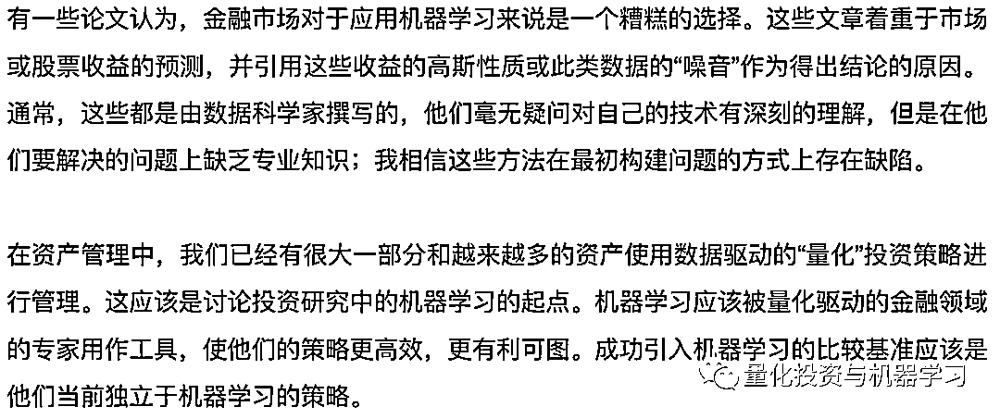
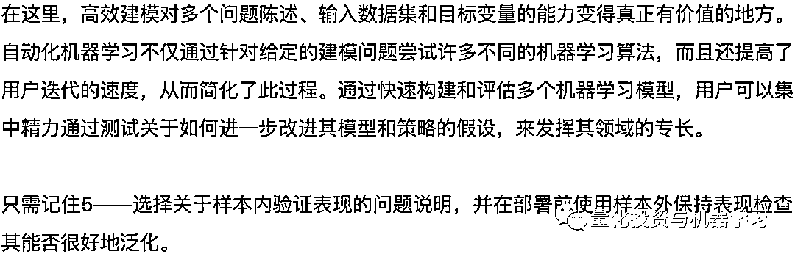

# 五个经验教训：机器学习应用量化策略的那些坑！

> 原文：[`mp.weixin.qq.com/s?__biz=MzAxNTc0Mjg0Mg==&mid=2653297668&idx=1&sn=70e83c404a310e0c3213f916d413cc3b&chksm=802dde11b75a5707d5f84a9d8d368d5aef9d1a3279c0e634687edeea9220bd9e716283446147&scene=27#wechat_redirect`](http://mp.weixin.qq.com/s?__biz=MzAxNTc0Mjg0Mg==&mid=2653297668&idx=1&sn=70e83c404a310e0c3213f916d413cc3b&chksm=802dde11b75a5707d5f84a9d8d368d5aef9d1a3279c0e634687edeea9220bd9e716283446147&scene=27#wechat_redirect)

**标星★****置顶****公众号     **爱你们♥   

作者：IAN J. HISSEY  编译：方的馒头

***1***

**前言**

***2***

**在量化研究中引入机器学习**

***3***

**自动化机器学习**

***4***

**建立和测试模型**

为了表明机器学习可用于增强传统的量化因子，我们建立了中国 A 股的股票预测模型。我们为 2012 年 12 月至 2019 年 8 月编制了中证 800 指数的股票表现和各种因子数据的月度概况。我们将目标变量设置为股票的未来一个月收益，并使用原始投资组合模型中的因子。

***5***

**不要混淆样本内和样本外**

***6***

**屏蔽噪音并一次建模**

与机器学习的典型用例（如预测同店销售额或个人银行贷款违约的可能性）不同，股票收益数据是嘈杂的。众所周知，时间序列金融数据受复杂行为困扰，包括异方差性、黑天鹅和尾部相关性。在我们的案例中，我们并不试图预测市场收益，而只是预测要投资的股票。为了最大程度地减少这些现象的影响，我们可以仅关注基准相对或同级相对表现，以将噪声降至最低。

***7***

**简化问题陈述以产生更好的模型**

***8***

**解释你的模型与构建模型一样重要**

此图表解释了特征与预测的关系。这些可以是并且通常是非线性的。就价值而言，公司的风险敞口越高，我们模型中的预测就越高。

然后，我们可以从理论到实践的理解，并研究该策略的交易方式。下图显示了该模型推荐的公司的 SWS 行业。Y 轴在 1 到 5 的范围内显示一个行业的相对重要性，其中 1 表示最高，气泡的大小表示观测的频率。我们的模型在收购电子行业的公司时避免了金融和公用事业。

然后，我们根据之前强调的国有企业标志将预测分为两组。通过分析各组股票收益的相关性，我们发现该模型根据公司是否为国有企业给出了截然不同的建议。对于国有企业，我们的模型更倾向于价值股票，而对于民营企业，我们的模型倾向于对成长型公司进行更多投资。

***9***

**尝试多种方法并快速失败**

***10***

**结论**

2020 年第 66 篇文章

量化投资与机器学习微信公众号，是业内垂直于**Quant、MFE、Fintech、AI、ML**等领域的**量化类主流自媒体。**公众号拥有来自**公募、私募、券商、期货、银行、保险资管、海外**等众多圈内**18W+**关注者。每日发布行业前沿研究成果和最新量化资讯。

你点的每个“在看”，都是对我们最大的鼓励