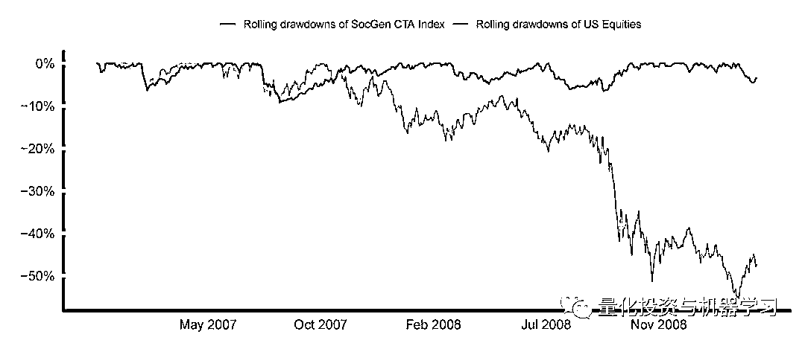

# 熊市策略

> 原文：[`mp.weixin.qq.com/s?__biz=MzAxNTc0Mjg0Mg==&mid=2653297640&idx=1&sn=78a8e1b9600bf2a07c7b81f86ac269dd&chksm=802dd9fdb75a50eb1cdd543a4b1f7df81bca521f57a3a16e6292669a549110582ba61f846a21&scene=27#wechat_redirect`](http://mp.weixin.qq.com/s?__biz=MzAxNTc0Mjg0Mg==&mid=2653297640&idx=1&sn=78a8e1b9600bf2a07c7b81f86ac269dd&chksm=802dd9fdb75a50eb1cdd543a4b1f7df81bca521f57a3a16e6292669a549110582ba61f846a21&scene=27#wechat_redirect)

**标星★****置顶****公众号     **爱你们♥   

作者：ReSolve   编译：方的馒头

***1***

**前言**

过去几周对投资者来说是最近记忆中最艰难的时期，因为我们观察到全球市场的强烈抛售始于 2 月下旬，一直持续到 2020 年 3 月初。自 2008 年以来，在全球金融危机最严重的时候，股票市场遭受的损失最大。随着人们对 COVID-19 冠状病毒爆发的担忧赶上了资本市场，我们回顾了过去两周发生的事件，同时分析了过去漫长的熊市如何发展以及战术策略如何应对。

最近的抛售让全球市值蒸发了数万亿美元，这是美国股市历史上跌幅最大的一次。这次冲击发生在股价大幅上涨之后——这是有史以来最长的牛市。

历史上最快的亏损-Ken French

美国股市经历了一轮往返-Ken French

尽管在此期间许多策略遭受了重大损失，但有些策略却为投资者提供了所谓的危机 Alpha。退一步看，在这一类别中表现出色的策略在过去几年中一直难以取得任何有意义的收益，而许多目前承受亏损的策略实际上表现良好，并与股市保持同步。

***2***

**投资者去哪了？**

当你是一个资深的基金经理，有着数十年的管理经验。当在这种情况下投资者有两种焦虑并采取行动，这些举措放大了市场本身所造成的伤害。这些不良反应通常是由以下燃眉之急引起的： 

1、我们亏了钱；投资者认为你的策略是为了在熊市中赚钱。

2、我们亏了钱；投资者担心这是大规模熊市的开始，而且他们不相信你的策略将能够驾驭这种市场。

关于第一个问题，像这样的时刻提供了一个机会来提醒投资者，诸如趋势股票、托管期货或其他方面的策略通常旨在通过不断变化的经济体制进行市场冲浪。这并不总是意味着它们领先于曲线。实际上，策略通常会在突然抛售的第一阶段就被越位，尤其是在市场为近期收益做出重大贡献的情况下。

冲浪市场绝不是线性的努力。在迎接下一个预期浪潮之前，这是一个波澜起伏的过程。因此，战术指令中的此类修正应被视为投资者在努力争取超额长期收益时所支付的风险溢价。

至于第二个问题，人们普遍猜测这可能是长期股市熊市的开始，这当然是有可能的。因此，值得花几分钟时间进行案例分析来研究最近一次熊市（2007-2009 年大金融危机（GFC））的走势。

***3***

**熊市剖析**

如果我们确实进入了一个新的熊市，那么下面的例子可以清楚地表明，这可能是一系列长期亏损和复苏的初始阶段：

数据来自：Tiingo。美国股票在这里以先锋股票市场指数基金（VTI）ETF 为代表

在整个熊市周期的背景下，看看 CTA 是如何在整个 2007-2009 年全球金融危机熊市中航行是有启发性的（也是鼓舞人心的）：

数据来自：CSI 数据、彭博

上图显示，CTAs 通过调整和保护整个两年的股市下跌，在几个月而不是几周的时间内完成了自己的工作。

在最近的市场调整的背景下，下面的下跌和复苏图表描绘出了更加引人注目的景象：

数据来自：CSI 数据、彭博。在整个熊市中，趋同之后是背离

值得注意的是，随着熊市和价格走势的展开，SocGen CTA 指数在 2007 年遭受了前两次大幅下跌，跌幅之大令人不安，同时美国股市也遭受了跌幅。当时，趋势指标的平衡仍偏向于最近产生最佳收益的资产。 事实上，这些资产多次反弹至新高。

更重要的是，随着 2008 年熊市的加深，CTA 指数能够抑制更大规模的下跌。尽管 2008 年第三季度雷曼兄弟倒闭以及各国政府对危机的蔓延做出的反应迟缓，但该指数仍很快恢复，因为 CTA 管理者转向了旨在在市场压力下蓬勃发展的市场，例如黄金、国债和现金，以及所有相应的做空机会。

***4***

**冲击历史**

经济周期通常会在许多年内将各国带向发展、增长和繁荣的上升期，直至通货膨胀、停滞和衰退的阴霾。这种众所周知的繁荣—萧条周期可以有多种形式，但通常会被系统的冲击所打断。20 世纪 70 年代的中东战争和石油禁运。20 世纪 80 年代的通胀恐惧。20 世纪 90 年代初的储蓄和贷款危机。有时，一系列奇怪的冲击（例如 2000 年的网络泡沫破裂以及 2001 年的 9/11 恐怖袭击）将导致特别严重的危机，对此做出的回应（在这种情况下，将是长期的非常宽松的货币政策）可能会播下下一轮衰退的种子。可以说，2001 年为缓解压力而采取的行动为 2008 年和全球金融危机的过渡行为播下了种子。

这让我们来到了今天。冠状病毒大流行和随后的油价暴跌似乎对脆弱的全球经济造成了重大打击。始于 2020 年 2 月下旬的全球市场当前抛售，可能仅仅是更大的熊市周期的序幕，或者是全球资产价格持续上涨的趋势中的一次冲击。

目前尚不清楚资产类别将出现什么新趋势。在重大调整期间，领导层经常发生重大变化，许多投资者对旧的趋势太过分心，以至于看不到新的机会展现在他们眼前，无论是从 2000/2001 熊市中出现的大宗商品和新兴市场趋势，还是最终因全球金融危机的灰烬而成为美国历史上最持久的美国牛市。现实情况是，市场混乱为下一个投资机会埋下了伏笔。战术策略不仅可以在过渡期间保留资本，而且还可以系统地将资本配置给因市场错位而产生的新的和不断发展的机会。 **请记住，投资趋势/范式诞生于沮丧和不信任之中，却在欣喜和得意中消亡。**

***5***

**战斗还是逃跑？**

我们反复看到一个可预见的、有缺陷的声明，尤其是那些在第一次调整之前就已经考虑策略配置的投资者，他们提出了这样的抗议，那就是：

***once the horse is out of the barn, there’s no point in investing***

一个简单的思考练习应该有助于克服这个“战斗还是逃跑”的结论。 让我们来看看全球市场的两条潜在发展道路：

1、由于政府采取了协调行动、医疗措施或其他情况，市场意识到冠状病毒引发的经济衰退比预期的要容易控制得多。风险偏好回归，经济复苏，牛市再延续几年。

2、由于政府的无能、病毒的突发效应、对信贷和市场其他角落或其他情况的反馈影响，股市进入了一个新的熊市，这抹去了 5-10 年的累积收益。 

在这两种情况下，全球资产类别之间都会出现机会。

**如果情况 1 奏效，则策略管理者将被设计为识别信号并倾向于将股票风险配置新兴的成功资产类别，这可能是先前范式或新事物的延续。这将使投资者在股市反弹中获得收益。**

**如果情况 2 奏效，那么策略就有能力识别信号并强调旨在在通货紧缩或通货膨胀停滞的典型挑战时期繁荣的市场。配置黄金、现金和/或主权债券等资产可以在经济困难时期保护甚至增加资本。**

不可避免的是，市场风险偏好将会恢复，新的机会将会出现，就像经历了一段时间的全球冲击之后那样。也许我们将进入大宗商品的领导时期，或者也许在经过近十年的冬眠之后，外国发达股票将活跃起来。无论结果如何，策略都可以在新兴市场体系中发挥关键作用并从中获利。

**唯一能够对股市历史上最快的下跌做出反应的策略是尾部保护策略和纯粹的趋势跟踪策略。**前者是一贯的亏损者，而后者的策略在过去 11 年中一直难以产生有意义的收益。 

跟上股市的繁荣，这意味着当潮流逆转时冒着遭受重创的风险，尤其是当它如此迅速地发生时。我们为获得更高的长期收益而支付的风险溢价，这是我们所做的权衡。在这段时间里，投资者可以放心地理解这些策略的特征，以及策略适应系统不断遭受冲击的能力！

2020 年第 65 篇文章

量化投资与机器学习微信公众号，是业内垂直于**Quant、MFE、Fintech、AI、ML**等领域的**量化类主流自媒体。**公众号拥有来自**公募、私募、券商、期货、银行、保险资管、海外**等众多圈内**18W+**关注者。每日发布行业前沿研究成果和最新量化资讯。

你点的每个“在看”，都是对我们最大的鼓励