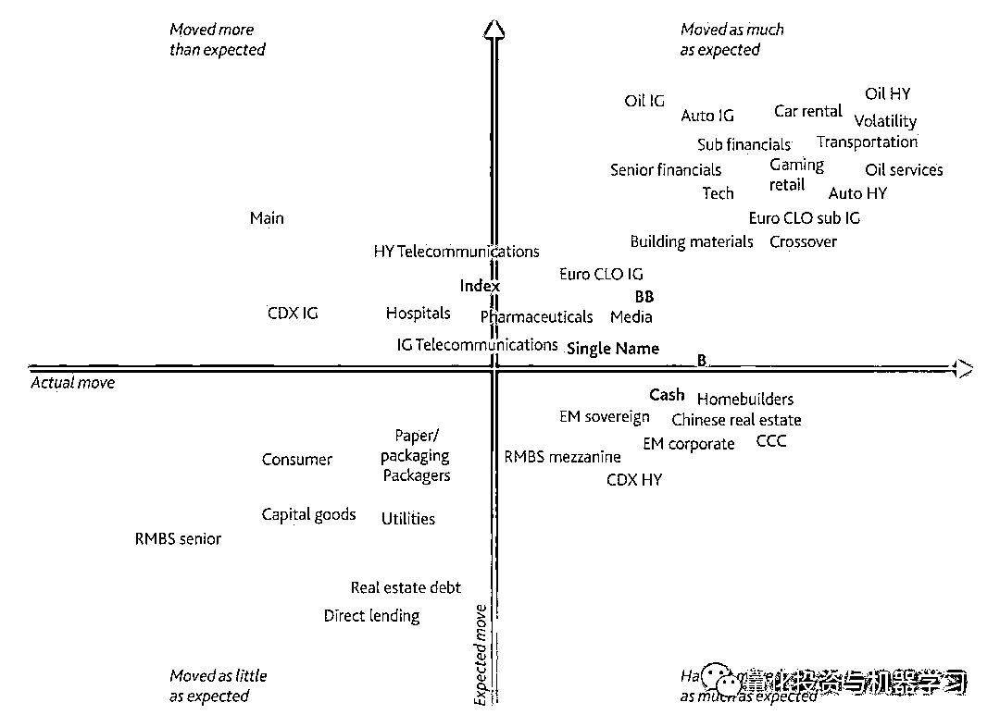
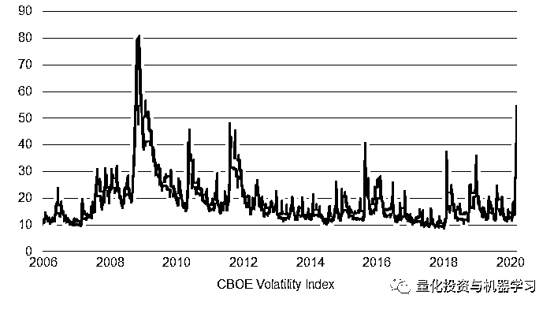
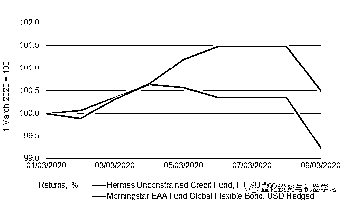
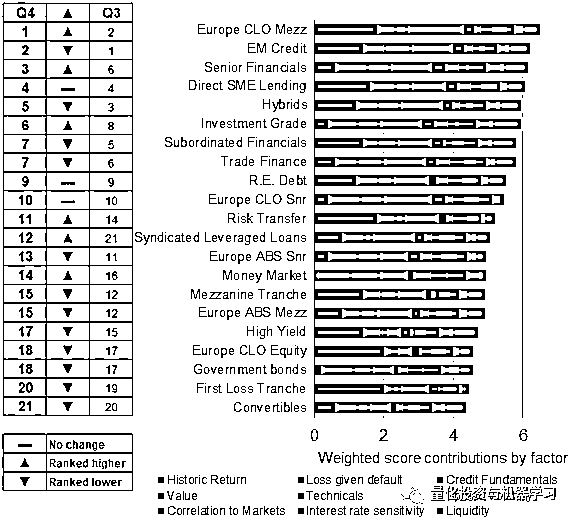

# 信贷市场的崩溃：不是 V 型，而是 U 型

> 原文：[`mp.weixin.qq.com/s?__biz=MzAxNTc0Mjg0Mg==&mid=2653297629&idx=1&sn=5625141b2fa13a8fc015fcbc988ee253&chksm=802dd9c8b75a50de59e77900d51f012845d6175921854b5e676ee2e1b8c54aa75d673aadbfcc&scene=27#wechat_redirect`](http://mp.weixin.qq.com/s?__biz=MzAxNTc0Mjg0Mg==&mid=2653297629&idx=1&sn=5625141b2fa13a8fc015fcbc988ee253&chksm=802dd9c8b75a50de59e77900d51f012845d6175921854b5e676ee2e1b8c54aa75d673aadbfcc&scene=27#wechat_redirect)

**标星★****置顶****公众号     **爱你们♥   

作者：Federated Hermes   编译：方的馒头

## 前言

固定收益投资者应从什么方面了解近期的市场动向，他们在近期、中期和长期内应如何应对？在充满不确定性的氛围中，我们考虑偏向高质量信贷和采取灵活措施来防范不利因素如何帮助投资者抵御任何进一步的动荡。我们还回顾了我们的多资产信贷框架，并考虑了整个固定收益领域中可能会出现机会的地方。

## 黑色星期一(II):信贷市场受挫

油价暴跌之后，周一全球市场损失惨重，而且越来越明显的是，冠状病毒已成为全球卫生紧急事件。这是一个动荡的两周的高潮，其中：

*   信用息差已达到表明我们生活在近乎完美的世界中的水平。
*   冠状病毒病例总数超过 100,000 例。
*   第二大病例发源地意大利宣布隔离其四分之一的人口。
*   美联储（Fed）试图通过降息 50 个基点来安抚市场，但失败了。
*   石油输出国组织（OPEC）和俄罗斯未能达成限制供应的协议，导致石油价格下跌了 30％。

即使股票市场受到了特别的影响，亚洲和意大利的股票市场从高峰到低谷都下跌了 25％以上，对固定收益市场的影响也很大。石油价格战加剧了这一点，因为信贷比股票更容易受到石油和天然气市场的冲击。

周一，美国 10 年期国债收益率跌至历史新低，而英国国债收益率历史上首次跌至零以下。高收益息差飙升，周一早盘，iTraxx 交叉指数上涨 152 个基点，交易范围超过 500 个基点，2 月中旬增加了 150％。

这些市场变化需要一定的背景。上周，信贷市场变现优于股票市场，我们认为，信贷利差太紧且波动率过低已经有一段时间了。投资者在很大程度上也没有区别优质和劣质发行人。

## 注重质量信誉

在过去的几天里，我们对高品质名称的偏好逐渐凸显。虽然这对于我们的方法至关重要，但近几个月来，我们对信贷基本面、估值和低利率贷款的普遍性以及较低预期回收率的担忧加剧了我们对低质量信贷的厌恶。目前，我们在 B 级和 CCC 级信用的敞口低于 10%，而在高风险收益的敞口为 50%。

与直觉相反的是，我们对高质量信用的偏好尚未开始使我们受益。这是因为低质量的信贷往往流动性较低，因此在动荡中并未找到清算价格，而我们所面临的一些流动性更强的工具已经退出并如预期的那样遭受了价格下跌的冲击。在未来几天（或可能数周）内，我们预计此次调整将被计入流动性较低的信贷中，例如 CCC 评级的信贷，到目前为止，它们的流动性没有预期的那么大。

## 价格行动：领先还是落后？

我们对我们的分析师和投资组合经理进行了调查，要求他们对他们所在行业、资产类别和工具的价差变动进行主观和定性的分析。图 1 显示了他们对价差扩大幅度大于或小于预期的看法。

图 1.截至 2020 年 3 月 10 日，市场走势与我们的预期有关

资料来源：Hermes，截至 2020 年 3 月。

例如，在市场环境中，交叉指数变动 300 个基点被认为是适当的，而 CDX 投资等级指数的 65 个基点的跳跃超出了我们的预期。我们的调查突出了一些有趣的趋势：

*   欧洲似乎比美国受到的影响更大。与以美国为中心的 CDX 投资等级指数相比，欧洲 iTraxx 主要指数的变动幅度太大，后者稍为偏高。同样，与似乎滞后的 CDX 高收益指数相比，iTraxx 交叉指数的走势更符合预期。
*   可能是因为它们是最明显引，指数的衍生形式比单名称衍生产品经历了更大的价差变动。现金流也没有达到预期，需要追赶。
*   同样，BB 等级的信用定价比 B 或 CCC 等级的信用定价更现实。我们认为，后两者尚未找到清算水平。
*   到目前为止，新兴市场的表现似乎不错，并可能需要进一步调整价格。利率的下降和更好的凸性似乎比发达市场的高收益行业更能支撑这一资产类别。
*   石油市场的信贷工具已受到重大影响。虽然这对于资产负债表更加不稳定的发行人可能是必要的，但在边际上，我们的能源分析师认为，这对于可靠的投资级信贷的长期敞口而言是过高的。

## 防范下行风险

股票市场的波动率处于自 2008 年以来的最高水平（见图 2），并且还影响了信贷指数，我们使用了防御性交易来保护我们灵活信贷策略的表现。在我们的“绝对收益信用”和“多策略信用”策略中，我们结合使用了指数、曲线和单一名称头寸的组合来建立防御。随着人们购买最容易获得的保护，这些产品的表现不及实体市场。

图 2\. VIX 飙升至金融危机以来的最高水平

资料来源：彭博，截至 2020 年 3 月。

我们的直接和曲线指数头寸被用作流动性对冲以缓解动荡。信贷曲线趋平有利于投资组合，绝对收益信贷在欧洲投资级市场上有 5 至 10 年的扁平化交易。此外，多策略信贷因其贷款、投资级和新兴市场信贷的风险敞口而得到提振，与传统的高收益解决方案相比，它们提供了额外的防御层。

就单一名称而言，在提款之前，我们已经对发行人进行了信用违约掉期交易，这些发行人从基本面或相对价值的角度来看不受欢迎，或者暴露于冠状病毒。我们通过 Avis 和 American Axle 在汽车领域的负面定位继续为我们带来良好的表现。

我们还利用机会主义的防御性交易来保护我们在基础行业中的顺周期偏见和最佳选择理念。在抛售之前，我们已经基于价值、环境、社会和治理方面的理由，购买了 Glencore 和 FCX 等发行人的保护。随着分散性的增加，我们应该从 Ineos 和 Tenet Healthcare 的资本结构交易中受益。

在我们的无限制信贷基金中，我们使用了期权来减少市场冲击的影响。当我们购买这些期权时，它们的名义价值非常有意义，而且它们的履约价格实在是物超所值。[1]由于潜在息差扩大了，这些息差已转移至价内货币[2]，并在此期间提供了强大的 gamma[3]和上行空间。

结果，我们将它们纳入了更长的期限、更大的名义价格以及更多的非现金头寸。我们现在拥有期权敞口，为我们的长期头寸保持了凸性和保护性，还设法使该策略的一些主要收益明确化。

这产生了积极的结果（见图 3）。我们的无限制信贷基金的期权敞口帮助其在截至周一的一周内交付了 0.49％的资金，相比之下，晨星公司[4]追踪的全球弹性债券基金的平均损失为 0.77％。要详细了解我们如何抵御市场不利因素，请参阅我们最近发表的文章“ 弹性信贷：下行保护的好处”。

图 3.无限制信贷：期权敞口支持表现

unconstrained-chart

Hermes 无限制信贷基金，净滚动年度表现(％)

|   | 无限制信贷 |
| --- | --- |
| 31/01/19 至 31/01/20 | 12.47 |
| 31/01/18 至 31/01/19 |   |
| 31/01/17 至 31/01/18 |   |
| 31/01/16 至 31/01/17 |   |
| 自成立以来 | 8.59 |

**过往表现并非未来表现的可靠指南。** 截至 2020 年 3 月。显示的表现为自 2018 年 5 月 30 日播种以来的所有成本和管理费用的累计净值。

## 震惊中的机遇

我们的流动性偏好和下行保护措施意味着我们有能力重新定位为我们可能希望以相对价值为基础的名称，但是最近表现不佳。像 2019 年第一季度一样，我们更适合购买其他投资者正在出售的信贷。

鉴于最近的动荡和不明朗，我们意识到不确定因素，并倾向于“离家近”。有时候，寻找最大的推动者是合乎逻辑的，认为他们可能会提供最佳机会。例如，我们认识到以价格为基础，能源行业看起来非常有吸引力。但是，我们仍然保持谨慎态度，因为 OPEC+联盟的解体表明，将会出现新的油价均衡，这将挑战盈亏平衡价格和现金流。

展望市场震荡之外，我们继续在整个固定收益领域看到机遇。每个季度，我们都会在公共和私人信贷范围内编制固定收益资产的相对价值框架，并按 11 个不同因素对它们进行排名。这将指导我们的多资产信用解决方案中的资产分配决策。我们在季度 360°报告中发布了该框架。

图 5 显示了 12 月底的该框架。在这一点上，冠状病毒不是问题，风险情绪是积极的，信贷市场的交易接近五年来最紧的水平。

图 5.多资产信贷相对价值框架，2019 年 12 月

资料来源：Hermes，截至 2020 年 12 月。

面临的挑战是，要在一组资产中找到有吸引力的风险调整后的机会，这些资产主要是渴望收益的投资者的主要目标。一月份，我们排名前三的资产也是表现最好的，新兴市场信贷和金融业务在公共信贷市场上处于领先地位。由于投资者抓住了要约的价差溢价，抵押贷款债务（CLO）夹层风险敞口也出现了反弹（我们在上一期 360°中强调了这一点）。

快进两个月，信贷状况大不相同。随着投资者评估冠状病毒和油价暴跌这是两个无法预料的事件，目前的价差已接近五年来的最高水平。这些发展显然使我们当前的框架过时了，当我们在本月底更新它们时，排名应该会发生重大变化。

届时，我们期望在实际交易资产时能更清楚地了解价格变动，而不是按市价（如目前大多数公共和私人信贷）定价。尽管基本面将较弱，但当前的信贷利差表明，对渴望收益的投资者将有更多机会。

投资等级和高收益公共信贷利差的极端变化意味着它们的价值分数应该上升，从而使它们的排名进一步上升。而且，由于资产支持证券和 CLO 利差已落后于企业信贷，因此我们在 1 月份看到的 CLO 与企业信贷利差之间的溢价将被侵蚀，从而使欧元 CLO 按相对价值计算的吸引力降低。

相比之下，像直接贷款这样的私人信贷敞口仅适度扩大。因此，这些资产的非流动性溢价已经减少，这意味着在经过风险调整后，它们的吸引力降低了。但是，正如我们在过去的两周中所看到的，在短短几周内，很多事情都会发生变化。要了解更多信息，请查看我们的 2020 年第二季度 360°版本，其中将包含我们的更新的相对价值框架，并将于 4 月发布。

## 病毒波动率：需要协调行动

我们敦促投资者在未来几周内谨慎行事。与我们在 2019 年第一季度目睹的复苏不同，我们预计市场不会迅速收复过去两周记录的所有损失。我们怀疑这次是“ U 形”恢复的可能性更大，而不是像之前的 SARS 和 MERS 这样的病毒爆发后的“ V 形”反弹，这是假设该病毒得到了精心策划的控制。

全球经济增长显然将在今年上半年放缓。尽管 V 形先例表明暂时的经济影响，但我们要提醒，冠状病毒的传播速度似乎更快。此外，在这一点上，我们对实际死亡率、感染率和发生突变的可能性知之甚少。

确实，尽管市场目前看起来超卖，但这并不意味着它不能走低。事态发展取决于下半年全球增长的轨迹以及能否控制这一大流行病。与 2008 年和 2011 年一样，市场仍然有可能被暂停交易，从而有效地将其隔离。

这种情况需要各国央行之间进行密切协调，并采取货币和财政宽松政策。尽管中国当局应该采取更多刺激措施，但货币政策有其局限性，尤其是在应对诸如冠状病毒之类的供应方冲击时。此外，利率处于历史低点，量化宽松政策压低长期收益率有一个极限。任何货币宽松政策都应与有意义的政府行动相结合，通过外科手术使用财政刺激和安全网直接支持个人和公司。

信贷市场的行情取决于下半年的情况。虽然对公司现金流的短期打击是可以控制的，但全年亏损却并非如此。冠状病毒发展轨迹非常不确定，并可能传播到其他发达市场。

## 不自然的平静：黑色星期一之路

2 月 11 日，世界卫生组织正式将该病毒命名为 Covid-19。至此，已确认有 43,000 人被感染，另有 1000 人死亡。然而，信贷息差一直徘徊在空前紧张的水平附近，iTraxx 交叉指数交易在 210 点。

随着病例数上升至约 100,000，病毒传播到更多国家，橡皮筋越来越紧。OPEC 未能通过削减石油供应来支持市场的事件是导致其暴跌的原因，并引发了惊人的短期市场波动。

总而言之，考虑到“新”的基本面，这一举动可以说是过头了。然而，围绕冠状病毒仍然存在很多不确定性。信贷市场比股票具有更不对称的风险特征，加剧不确定性。

基本面将继续恶化，技术面可能会更糟。进入黑色星期一的基金无论在风险还是在流动性上都没有防御性，这些基金可能会被赎回。考虑到所需的干预规模，除了关闭市场外，关闭基金也并非不可能。

在如此不稳定的背景以及如此大的波动性下，随着价格与资产的基本质量脱节，显然将存在机会。自金融危机以来，对市场服务如此出色的最明显的一种就是“逢低买进”的心态。但是，鉴于我们看到了即将到来的 U 型复苏，我们认为现在不是仓促出手的时候。

同时，我们认为最好的方法是保持灵活性，并利用我们的流动性和更高质量的偏好，努力通过积极的管理来增加 alpha 并减轻负面 beta。最重要的是，我们将保持沟通渠道的畅通，以帮助我们的投资者在波涛汹涌的大海中航行。

**风险状况**

*   投资的价值和从中获得的收入可能下降也可能上升，也可能无法收回原始的投资额。
*   无法保证目标。
*   应该注意的是，任何海外投资都可能受到汇率的影响。
*   此信息不构成任何人发出的购买或出售任何相关证券或金融工具的邀请或要约。
*   如果该策略投资于债务工具（如债券），则存在签发合同的实体无法偿还债务或支付债务利息的风险。如果发生这种情况，则该策略的价值可能会急剧变化并可能导致损失。该策略广泛使用金融衍生工具（FDIs），其价值取决于基础资产的表现。该资产价格的微小变化可能会导致外国直接投资的价值发生较大变化，从而增加潜在的收益或损失。

2020 年第 64 篇文章

量化投资与机器学习微信公众号，是业内垂直于**Quant、MFE、Fintech、AI、ML**等领域的**量化类主流自媒体。**公众号拥有来自**公募、私募、券商、期货、银行、保险资管、海外**等众多圈内**18W+**关注者。每日发布行业前沿研究成果和最新量化资讯。

你点的每个“在看”，都是对我们最大的鼓励