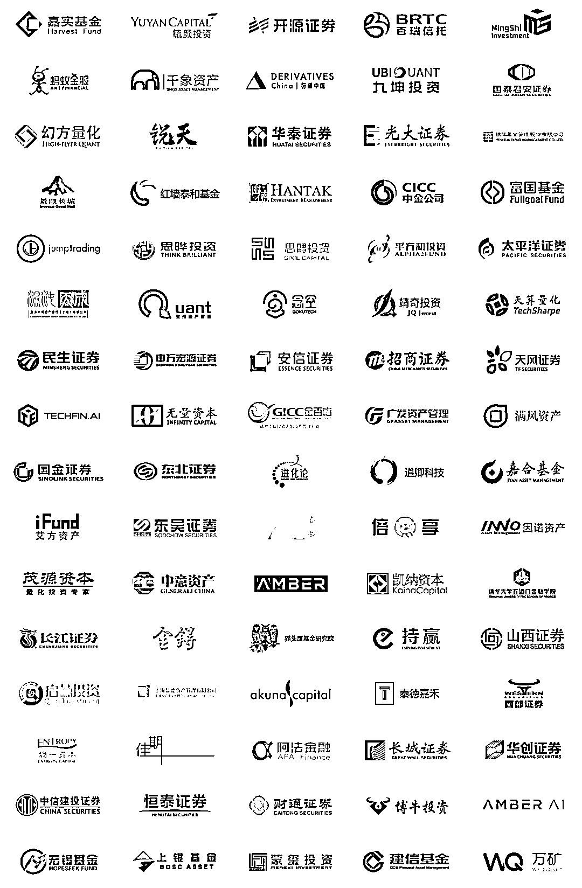

# 凯丰投资 | 量化多岗位招聘（全职）

> 原文：[`mp.weixin.qq.com/s?__biz=MzAxNTc0Mjg0Mg==&mid=2653297623&idx=1&sn=023660802893f30b424778a05e974e62&chksm=802dd9c2b75a50d4fbafc1032d2f4cd9f5b081eb07a922e0a6829ff33041e097791bf305e99d&scene=27#wechat_redirect`](http://mp.weixin.qq.com/s?__biz=MzAxNTc0Mjg0Mg==&mid=2653297623&idx=1&sn=023660802893f30b424778a05e974e62&chksm=802dd9c2b75a50d4fbafc1032d2f4cd9f5b081eb07a922e0a6829ff33041e097791bf305e99d&scene=27#wechat_redirect)

**标星★****置顶****公众号     **爱你们♥

量化投资与机器学习微信公众号，是业内垂直于**Quant**、**MFE**、**Fintech****、AI、ML**等领域的**量化类 TOP 自媒体**。公众号拥有来自**公募、私募、券商、期货、银行、保险资管、海外**等众多圈内**18W+**用户，我们为所有量化金融机构**免费提供**岗位招聘与推广，再次感谢各大金融机构对我们的信任和支持！

**公司介绍**

深圳市凯丰投资管理有限公司是一家专注于大宗商品、债券、权益类资产及其衍生品投资的全球宏观私募基金管理公司，是中国证券投资基金业协会会员、中国期货业协会会员、具有中国证券投资基金业协会登记的私募基金管理人资格。经过数年发展，凯丰投资现已成为中国头部私募之一，资产管理规模逾百亿。

自 2012 年成立至今，凯丰投资始终致力于打造一支高水平的投研团队，以投研为核心进行前瞻布局及持续投入。秉承“极精微，致广大”的投资理念，凯丰投资注重将细节研究与宏观判断相结合并进行交叉验证，从纷繁复杂的细节表象中提炼规律、推演趋势、择机投资，通过对全产业链的深度覆盖、宏观周期波动的精准把握以及大类资产轮动的判断，敏锐发掘投资机遇，从而为投资者带来长期稳定的绝对回报。 **公司地址**

**深圳**

**量化风控岗**

**岗位职责**

1、全面负责大类资产市场风险、流动性风险等投资风险的评估、监控与管理；
2、进行风险模拟、压力测试等数据分析工作；
3、负责基金产品和投资经理投资风格与绩效的评估与管理工作；
4、维护风控数据库，出具风险分析报告和向海内外机构提供数据支持；
5、针对各类型风险，根据公司的风险战略，风险管理制度等，协助制订或修改风险管理流程、风险控制标准，并负责相关风险管理制度与流程的执行和落实。

**任职要求**

1、国内外名校硕士以上学历，金融、经济、计算机、统计、数学等相关专业，具有数量金融、金融工程等背景，CFA，FRM 优先；
2、有风险管理相关实习经验或金融机构工作经验优先；
3、熟悉金融市场法律法规，有量化风险模型建模经验的优先，熟悉债券、期货、衍生品和风险管理模型的优先；
4、较强的数据分析能力，熟练运用 Matlab 或 VBA 或 C++等编程工具，熟悉 Oracle、SQL 等数据库。

**交易员**

**岗位职责**

1、熟悉交易规则，快速准确执行投资经理下达的交易指令；
2、学习了解交易所与公司相关风控制度，防范交易合规风险；
3、收集更新交易所交易、风控规则并及时传达给投资经理；
4、协助完善投资经理结算、风控等业务流程；
5、公司和上级交办的其他工作。

**任职要求**

1、重点高校全日制本科及以上学历；
2、对数字有较强敏感性，思维活跃，反应敏捷；有交易下单经历，懂一定技术分析指标者优先；
3、人品端正，心理素质较强，具有较强的逻辑思维能力、创新和钻研精神；
4、执行力强，学习新知识能力突出，可快速适应并上手全新交易方法者优先录用；
5、具备一定的抗压能力，能够接受夜盘交易工作。

**交易系统开发工程师**

**岗位职责**

1、开发并维护量化交易系统，包括交易通道、行情通道、风控、订单管理、策略、算法等模块；
2、支持系统的日常运行。

**任职要求**

1、重点高校全日制本科及以上学历，计算机、电子信息类相关专业，3 年以上 C++开发经验；
2、熟练掌握 C/C++语言, 编程习惯良好，熟悉 Linux/Shell 的使用； 
3、熟悉多线程编程，对算法和数据结构有较好理解；
4、熟悉 Linux 开发环境下的 C++开发调试和测试技术； 
5、较强的逻辑思维能力，认真踏实，良好的沟通能力和团队协作精神；
6、有金融交易软件业务开发经验者优先。

*注：我们对每家机构都经过严格的核对和身份认证，确保信息的准确性和邮箱的真实性。大家可放心投递！

**具体投递方式**

投递邮箱

***hr@kffund.cn***

**简历命名**

****姓名+岗位********+来****源（公众号名称）****

**企业如有招聘需求，****请发邮件至：**

***lhtzjqxx@163.com***

**免费提供此项服务**

**部分实名招聘合作机构**

不定期更新···