# 十、篇精选报告（最新）：大起大落，保持冷静！

> 原文：[`mp.weixin.qq.com/s?__biz=MzAxNTc0Mjg0Mg==&mid=2653297612&idx=1&sn=61746a53a2a50d700e1f990e8f05c696&chksm=802dd9d9b75a50cfeca65d5f6b11353a92286735a122c321c54bb427c4750cf2ba3b985088e3&scene=27#wechat_redirect`](http://mp.weixin.qq.com/s?__biz=MzAxNTc0Mjg0Mg==&mid=2653297612&idx=1&sn=61746a53a2a50d700e1f990e8f05c696&chksm=802dd9d9b75a50cfeca65d5f6b11353a92286735a122c321c54bb427c4750cf2ba3b985088e3&scene=27#wechat_redirect)

**标星★****置顶****公众号     **爱你们♥   

最近在全球股市波动的情况下，想必大家的心情是不稳定的，越是这样，我们越要有一个良好的心态，下面是公众号最近看到的几篇比较有意思的报告，分享给各位读者，希望你冷静、从容面对！

**获取全部报告 PDF，文末获取**

***0***

**说在前面的话**

股市崩盘是始料未及的，但与此同时，股市崩盘遵循着一种可以辨认的模式，周期性很常见。

人们很容易把注意力集中在唯一性的一面，而过分关注这一次的不同之处。**“这次不一样”是一个危险的短语，无论在好的时候还是坏的时候**。尽管每次崩盘都有许多独特的方面，但关注这些方面会导致投资者在投资组合中变得过于乐观和过于悲观。

同时，它还试图强调否认这样的暴跌确实出乎意料，**导致许多人后悔没有按照那种“在高点卖出”的感觉采取行动**。事实上，没有人知道这次崩盘会像这样发生，即使我们在 2 月份都“有这种感觉”，如果采取行动，我们之前也会卖出很多次，导致平均收益率大幅下降。

在危机时刻的另一个方面是**做点什么**和**什么也不做**的冲动同时存在。

**做点什么**的强烈要求进一步分化了投资者，使买卖双方都显得很诱人。上午，我们可能倾向于持有现金，但到了下午，我们就看到了买入机会。

**什么也不做**的冲动也分为两种，一种是明智的，另一种是天真的。难怪投资会显得如此具有挑战性，让人情绪低落。

谨慎的投资者并没有在这些相互冲突的选择中转换（猜测），而是继续遵循他们在危机开始之前选择的投资方式。这消除了大部分（不是全部）痛苦，反而是认识到巨大的投资机会。

1 月份的共识是“情况非常乐观”，2 月份的共识是“将是一个快速的 v 型”，3 月份的共识是“衰退即将来临”。市场已经形成共识，真正推动市场向前发展的是意外和意外。未来与既定共识的差异越大，市场走势就越强劲。

**与其过度依赖他人的短期解释和对现在的预测（只是对近期市场走势的推断），不如让我们回到最初投资的原因，从更长远的角度来考虑。这种放缓，无论目前看起来有多严重，都将逐渐消失。**

***1***

**第一篇**

大量研究表明，大多数专家并不能做出很好的预测。  

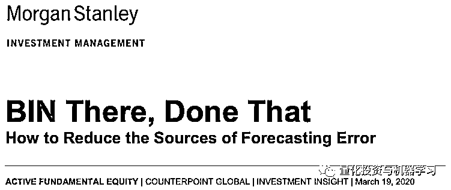

BIN 模型中，b 表示 bias，i 表示信息，n 表示噪音。

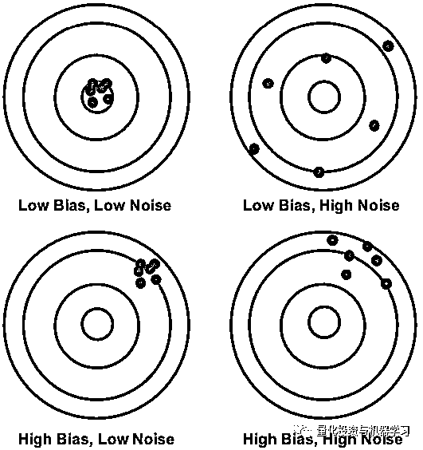

***2***

**第二篇**

RAIN 模型是一个简单、有四个步骤来管理急性压力。  

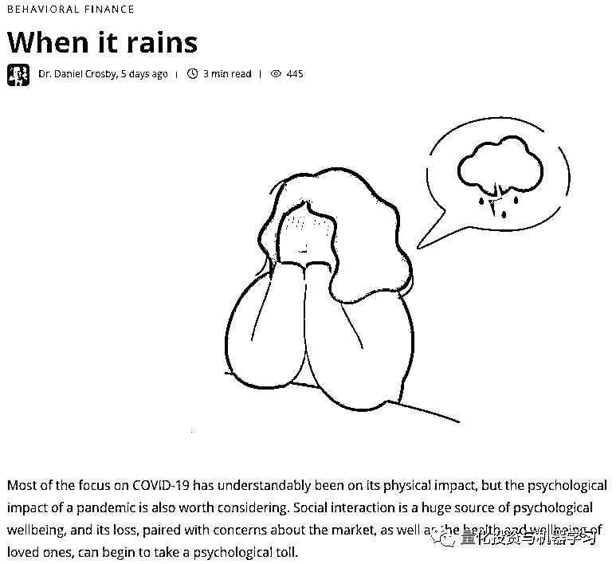

***3***

**第三篇**

冲浪市场决不是一个线性的努力，它是一个波涛起伏的过程，在赶上下一个预期的浪潮之前有许多起伏。

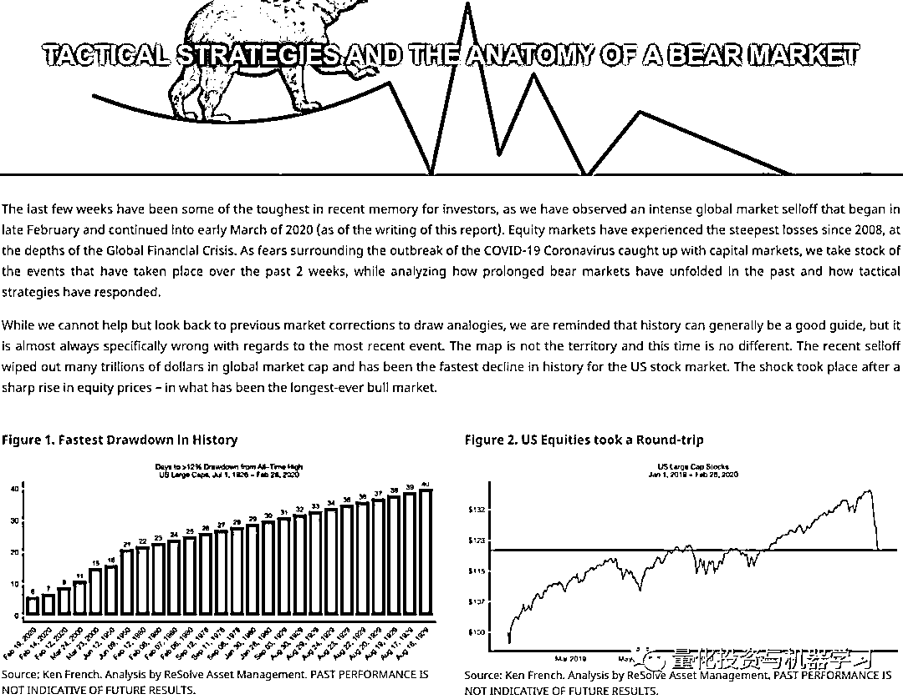

***4***

**第四篇**

冠状病毒的负面影响会使标准普 500 成份股的未来收益潜力降低 30%吗？我们认为答案是否定的。  

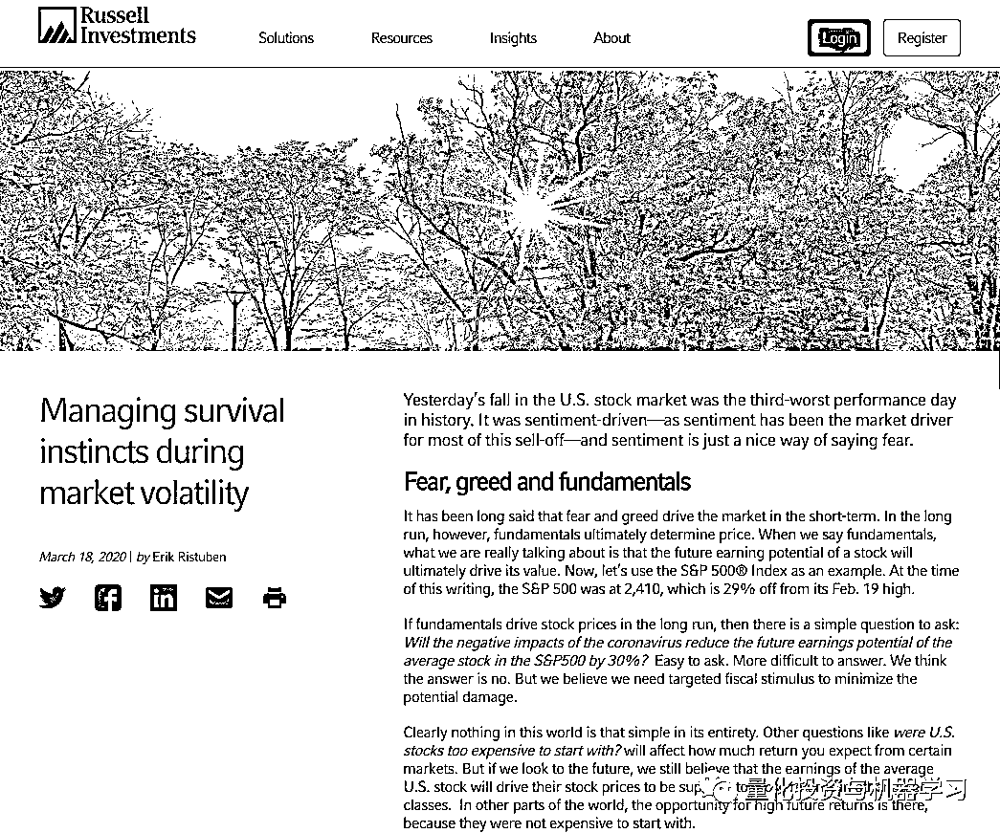

***5***

**第五篇**

我们现在的收益预测是，美国股市 10 年的年收益率为 5%。这大大高于截至 2019 年底 1%的年增长率预测。

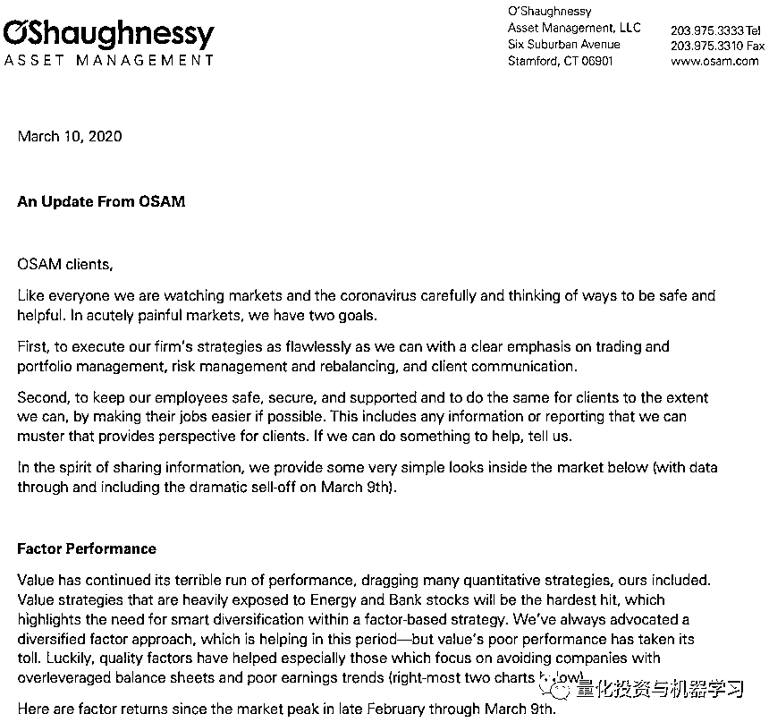

***6*** 

**第六篇**

# 随着市场回归正常，财富积累倒退了数年，恐慌性抛售和错过上涨行情就会卷土重来。

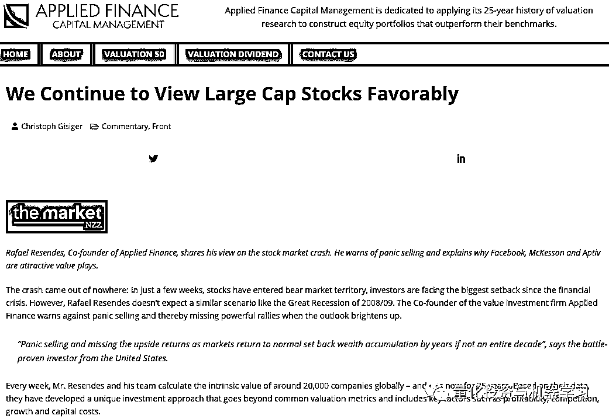

***7***

**第七篇**

只有一种方法可以治愈绝症：你必须制定一个再投资的作战计划，并坚持下去。

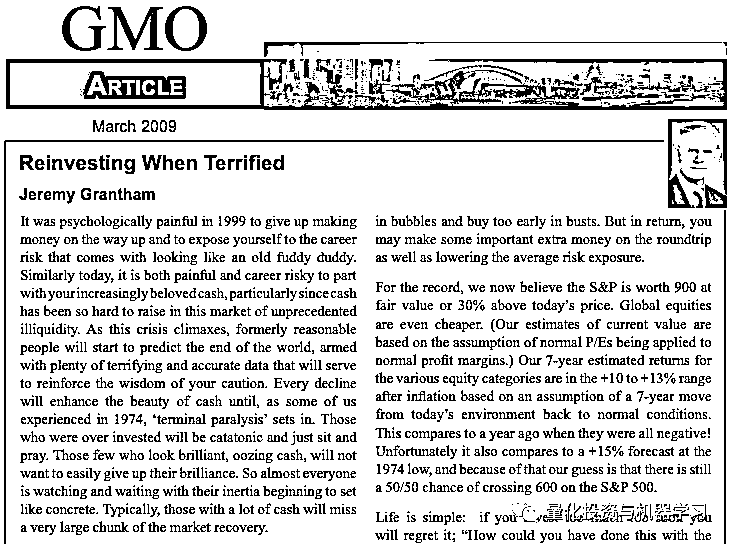

***8***

**第八篇**

恐慌的投资者在市场底部抛售股票，可能需要数年时间才能实现盈亏平衡。

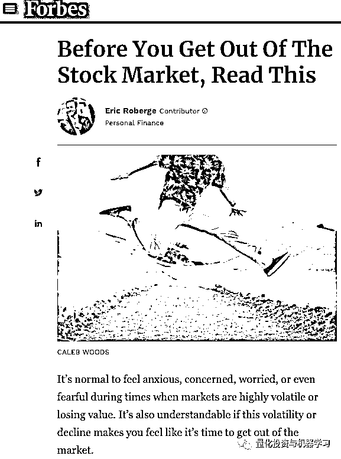

***9***

**第九篇**

这是我们的选择，是让恐惧还是希望支配我们的思想。  

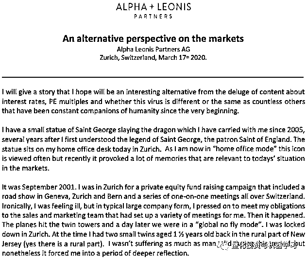

***10***

**第十篇**

当你理解了这个令人警醒的消息，并允许它缓和你的投资预期时，你更有可能从这个好消息中受益。

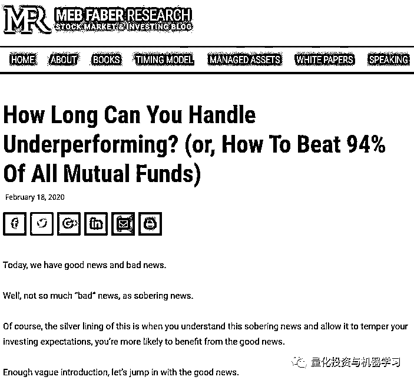

**下载以上所有文章 PDF**在后台回复 

**10 篇 _QIML**

2020 年第 63 篇文章

量化投资与机器学习微信公众号，是业内垂直于**Quant、MFE、Fintech、AI、ML**等领域的**量化类主流自媒体。**公众号拥有来自**公募、私募、券商、期货、银行、保险资管、海外**等众多圈内**18W+**关注者。每日发布行业前沿研究成果和最新量化资讯。

你点的每个“在看”，都是对我们最大的鼓励