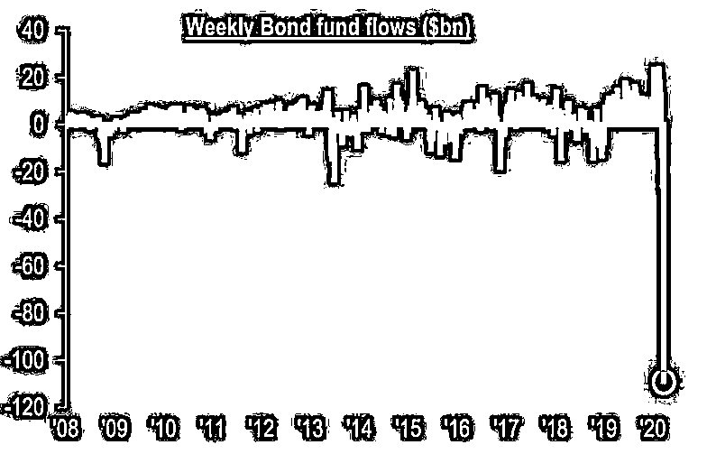
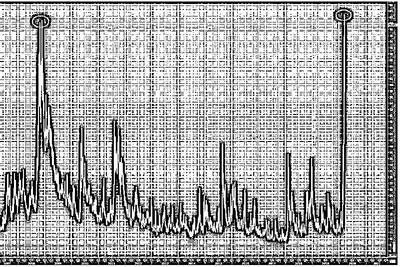
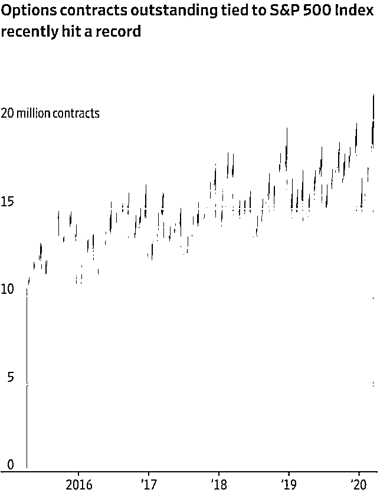
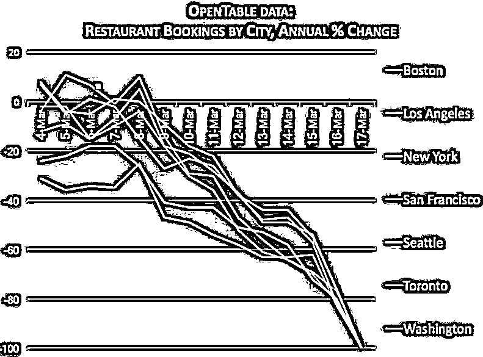
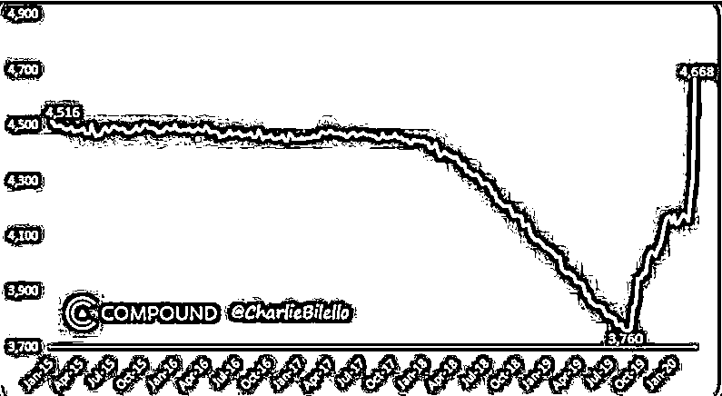

# 今晚别睡！见证美股今年最激烈搏杀

> 原文：[`mp.weixin.qq.com/s?__biz=MzAxNTc0Mjg0Mg==&mid=2653297584&idx=1&sn=7365a49a9f140ac61174a73176bc2f1e&chksm=802dd9a5b75a50b3b6f79cd8e6d3d643af155ebaae02d9f1084545c7851bbe744fc56960c3e4&scene=27#wechat_redirect`](http://mp.weixin.qq.com/s?__biz=MzAxNTc0Mjg0Mg==&mid=2653297584&idx=1&sn=7365a49a9f140ac61174a73176bc2f1e&chksm=802dd9a5b75a50b3b6f79cd8e6d3d643af155ebaae02d9f1084545c7851bbe744fc56960c3e4&scene=27#wechat_redirect)

**标星★****置顶****公众号     **爱你们♥   

作者：Wind

**香港万得通讯社报道，自从进入 3 月份美股剧情高潮迭起，一天涨停一天跌停，三月第三个周五美股将迎来牛熊切换后的第一个“四权到期日”（quadruple witching day），当天四种期权产品同时到期交割，多空双方激烈搏杀。** 

**美股的“四权到期日”，又称“四巫日”，指美股市场每季度的衍生品到期结算日，分别在三月、六月、九月和十二月的第三个星期五，**当日股指期货、股指期权、个股期货与个股期权同时到期**。当天基金经理会进行仓位调整，导致市场波动性剧烈。在上涨行情中催化行情再创新高，下跌趋势里加速滑坡。**

**本周五是 2020 年第一个“四巫日”。在美股 12 年长牛中，投资者已经习惯性做多，以前的“四巫日”虽然也会有起伏，但总体波动不是特别剧烈。现在美股牛熊切换刚完成，进入快速下降通道，多空双发第一次搏杀交割日，其结果不言而喻。**

**3 月的美股表现每一天都是活久见！历史上共发生五次熔断，三月份见证了四次，现在还差三个熔断，就能体会到什么是“八熔八耻”！**3 月 9 日当天，一生一次的奇观更是让我们赶上了，美股和美债同时熔断！债券单周净流出创历史之最。****

****

****波动性指数（VIX）3 月 16 日日创下历史极值 82.69，成功刷新 08 年创造的历史记录 80.86。**而<ai type="22" parm="{}">芝加哥期权交易所</ai>暂停场内操作，历史上从未遇到过，这可能是有史以来不确定性最大的一个“四巫日”。**

****

**近期的对冲操作放大了市场的波动，大型机构在急跌时会执行 mkt 操作（期权市价指令），导致他们不得不出售更多期权以保持中性风险敞口，这样一来，期权市场的波动就无法避免，也难以完整预测。**

**纽交所 3100 家上市公司中，**近 2600 家目前处于“限制卖空”状态**，但抛售风险依然在增长，因为熊市已经确立，不和趋势为敌是投资第一要务。**

****今晚将有超过价值 1.5 万亿美元的标普 500 相关期权到期，规模历史之最，其中约 1/3 未行权（outstanding)**。虽然最近市场的成交量已经急剧放大，但是参见最近一次的“四巫日”，2019 年 12 月 20 日，当天美股市场 118 亿股换手，去年日均换手约 70 万股，这还是在稳稳当当的牛市里，所以今晚成交一定会放出今年目前为止巨量。**

****

**Interactive Brokers 首席策略师表示：“赶紧系好安全带，最后几个小时市场双向波动可能会极其剧烈”。**

**也有机构持反向观点，<ai type="7" parm="{}">野村证券</ai>分析师麦克艾利戈特（Charlie McElligott）就指出，一般来说“四巫日”当天所有资产类别的波动性都会非常大，但就目前来看，股市波动本就极大，恐慌指数 VIX 也处于历史高位，波动性再度飙升的空间不大。**

**从基本面来看，**新冠确诊数字在美国继续攀升和美联储大规模撒币也在进行多空较量。****

**据约翰斯·霍普金斯大学数据，截至美东时间 19 日 20 时，美国新冠病毒确诊病例 13680 例，死亡 200 例，**其中确诊病例数字几乎比 24 小时前翻了一倍**。有美国官员表示，随着检测的铺开，确诊病例还会快速增长。**纽约、西雅图、华盛顿等州已经开始限制出行。****

****

**但美联储救市撒币也不手软，3 月份已经把降息、逆回购、三大非常规货币工具都搬出来了。**联邦基准利率几乎为０，资产负债表创新高达到 4.668 万亿美元，最近一周购买 3560 亿美元资产，单周购买额度也创下历史之最。****

****

**是美联储多头胜出，还是新冠空头更强？今晚可能出现第一阶段答案。截止发稿（15：50）美股期指涨幅持续扩大，纳指期货涨逾 4%，道指期货、标普 500 指数期货均涨近 3%。**

**2020 年第 62 篇文章**

**量化投资与机器学习微信公众号，是业内垂直于**Quant、MFE、Fintech、AI、ML**等领域的**量化类主流自媒体。**公众号拥有来自**公募、私募、券商、期货、银行、保险资管、海外**等众多圈内**18W+**关注者。每日发布行业前沿研究成果和最新量化资讯。**

******你点的每个“在看”，都是对我们最大的鼓励**