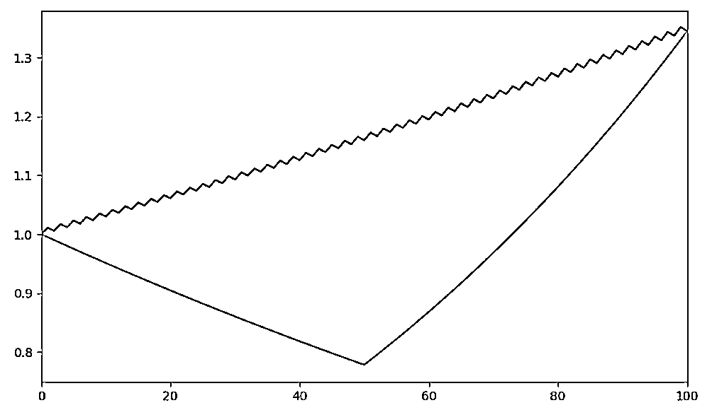
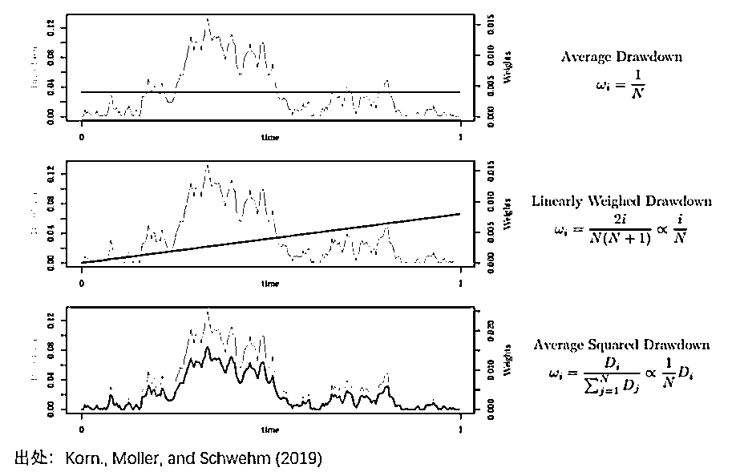
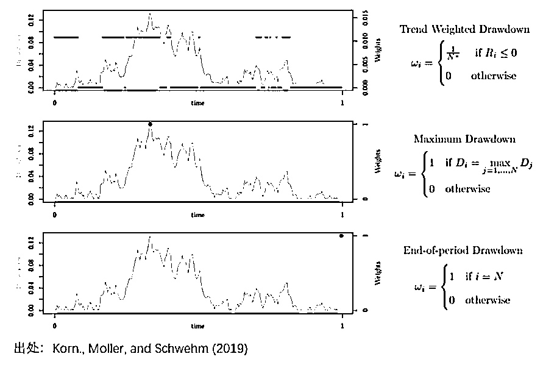
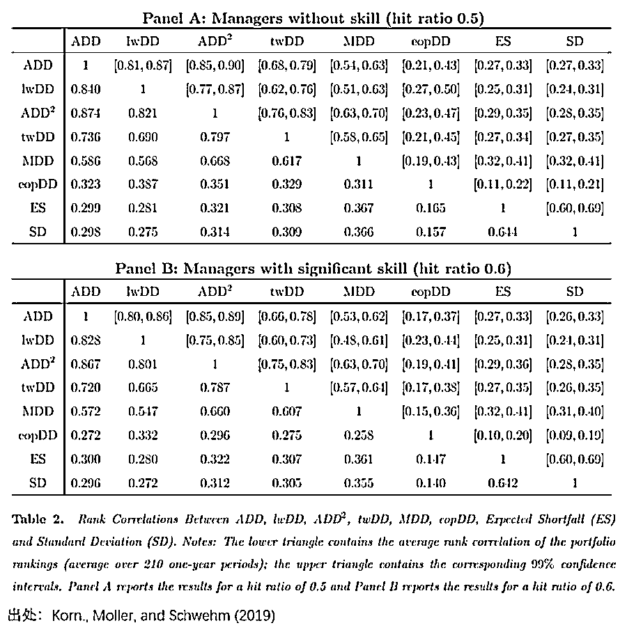
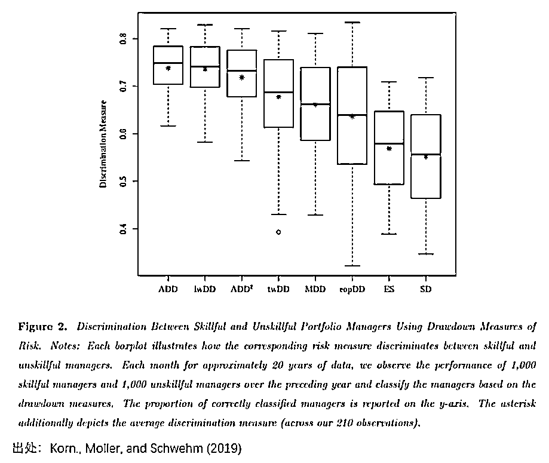

# 一个策略的自白

> 原文：[`mp.weixin.qq.com/s?__biz=MzAxNTc0Mjg0Mg==&mid=2653297560&idx=1&sn=252fb6175b6461a79c4001f49432c99b&chksm=802dd98db75a509b72e853f44b3d8b27bb17a2d83818035789ac3065c118fb2edd84843eb81e&scene=27#wechat_redirect`](http://mp.weixin.qq.com/s?__biz=MzAxNTc0Mjg0Mg==&mid=2653297560&idx=1&sn=252fb6175b6461a79c4001f49432c99b&chksm=802dd98db75a509b72e853f44b3d8b27bb17a2d83818035789ac3065c118fb2edd84843eb81e&scene=27#wechat_redirect)

**标星★****置顶****公众号     **爱你们♥

作者：石川，北京量信投资管理有限公司创始合伙人，清华大学学士、硕士，麻省理工学院博士。

***0***

**引言**

我是一个策略。

我的管理人付出了很多的努力、使用科学的方法打造我。我历经模型提出、数据收集、回测验证、过拟合评价、模拟盘检验等多道工序，最终变成了现在的样子。

我在样本外的实盘中日复一日、年复一年地按照管理人设想的方式运转。从未出过差错。

但是最近，我的管理人在使用我以及和别人讨论我的时候，有些做法让我觉着很费解。这些做法包括“随机模式误解 + 小数定律偏误”、“吃补药”、“过度关注最大回撤”以及“择时”。

Something is Not Right。

我希望和我的管理人说说心里话。

***1***

**随机模式误解 + 小数定律偏误**

长期来看，我的夏普率大概稳定的维持在 1.5 左右。然而最近一段时间无疑是我的“高光时刻”。最近两个月我的夏普率高达 3.0，这让我的管理人很高兴，非常高兴，非常非常高兴。

但我却觉着他这种情绪很危险。我希望告诉他千万不要误入 Tversky and Kahneman (1971) 指出的“小数定律偏误”。这两位心理学大咖通过研究发现了人们习惯犯以下两种错误：

1\. 误认为不同的小样本之间会很相似；

2\. 误认为小样本能够很好的代表总体。

除此之外，在通常情况下，人们会低估随机模式出现的频率。这一现象往往和小数定律偏误叠加，造成对总体错误的认知。

举个例子。在一个游戏中，参与者被要求猜测五轮扔硬币的结果（fair coin，正反面出现概率各为 50%，以 1 代表正面、0 代表反面）。最终得到的结果是，有 121 人猜测结果是 11010，35 人猜测结果为 10101，而 1 人猜测结果是 11111。11010 和 10101 里面都有三个 1，但猜前者的人数却更多，只因它看上去更随机一些，而非像 10101 那样 1 和 0 完美交错。而 11111 仅有 1 人猜测这说明人们认为随机结果不应如此一致。但事实上，这三种结果的概率完全相同，都是 (1/2)⁵ 不是吗？

在另一个实验中，263 名大学生在统计课上被要求判断 10 次扔硬币中出现连续正面，或连续反面的最大次数。比如，如果某次结果是 1101000110，那么最大的就是连续 3 个反面。在这些学生中，仅有 13% 的学生猜测最大连续结果的次数超过 4。然而事实却是，在 10 次扔硬币中，出现 4 次或 4 次以上连续结果（正或反）的概率高达 47%，远超过 13%。大多数人并不能正确认识到随机数据中出现连续相同结果的概率有多高。一旦连续结果出现，人们倾向认为这并非随机结果，而是有潜在的原因。

而对随机模式的误解也会随着游戏次数的增加（即数据量的增加）而加重。有一个教授，曾经做过一个非常有意思的实验。他让学生尽可能随机的给出长度为 100 的 0、1 序列（模拟扔硬币的结果）。与此同时，他使用电脑的随机数也生成一个长度为 100 的序列。使用统计检验两个序列发现，学生并不能很好的产生真正的随机序列。

当随机序列的长度变为 100 时，在通常的情况下是可以出现 6 到 8 个连续的 0 或者 1 的（即在随机生成的序列中，你可以在局部看到 00000000 或者 1111111 这样的排列）。但是，人们产生的“随机”序列却远比真实的有序的多。如果你也对这个实验感兴趣，不妨访问下面这个网站：

*http://faculty.rhodes.edu/wetzel/random/mainbody.html*

以上例子均说明，人们对于随机序列产生的结果往往没有很好的认知。很多看似不可能的结果 —— 比如连续的 0 或者 1 —— 其实都是总体中的一个常见的结果。而随着样本数量的增加，看上去多么不可思议的随机模式也都会出现。

作为一个策略，假如我的收益率分布保持不变的话，那么收益率序列的一个局部（即一段短时间内）也会出现连续涨、或者跌的结果，就正如上面扔硬币的例子。然而，由于这种结果给人的感受并不随机，如果这时再叠加小数定律偏误，那么人们会误以为这个结果暗示着总体已经发生了变化。

在投资中，大数定律是我的朋友；而小数定律偏误却让我如临大敌。只有当交易次数足够多的时候，才能客观的评价我的优劣。仅根据有限次交易结果就改变对我的看法则非常危险。

每年春节前，“X 年 X 涨”、“持股过年”这些标题从来不会缺席。可结果却又如何呢？因为疫情的影响，2 月 3 日节后第一个交易日，超过 3000 支股票跌停。当样本点非常少的时候，使用有限的样本点根本无法可靠的计算出变量的变化范围。

说到这，我还想起一个类比。亨利之后，阿森纳再无前锋，阿德巴约难堪大用。有段时间，阿德巴约连续进球，出现了高光时刻。有好事者采访时任曼联主帅弗格森时问他如何看待阿德巴约的表现。弗格森冷冷地说“他不是水平高，而是人生状态比较好。”

***2***

**吃补药**

我是一个量化策略，管理人总是希望引入最新的技术来改造我，以期获得更高的夏普率。我把这种改进称为“吃补药”。

在我们策略圈，海外有三大药厂，分别为 ***Jo****urnal of Finance、Journal of Financial Economics、Review of Financial Studies***。这三大厂的药最给力，比没有执照的黑作坊靠谱的多。

然而最近，我感觉补药吃的有点勤，这让我感觉很不好。我想对管理人说“学而不思则罔”。

对先进的技术 —— 交易算法、资产配置模型、数据处理方式 —— 着迷固然无可厚非。但是，针对特定的问题选择最合适的模型才能看出管理人的功力。不是所有的“补药”都能取得立竿见影的效果。只有真正搞懂其背后的逻辑以及应用时的假设，才有可能对症下药、有的放矢的解决问题。

量化策略绝不是一些神秘的魔法。醉心于模型的调教，见到数学公式就到处比划试试，则是舍本逐末。

“是药三分毒”。

***3***

**过度关注最大回撤**

作为一个策略，有很多评价我的风险收益特征的指标，最大回撤就是其中之一。当管理人和投资者介绍我的时候，无一例外的会对我的最大回撤探讨一番。

诚然，最大回撤是一个非常重要的风险指标，但我想说的是，它并不是唯一的评价指标，也绝非最合理的评价指标。举个极端的、假想的例子。考虑如下两个策略。第一个策略的收益率序列分别为 { 0.011, -0.005, 0.011, -0.005, …}，长度为 100。第二个策略收益率序列的前 50 个点为 -0.005，后 50 个点为 0.011。它们的净值曲线如下图所示。

第一个策略由于涨一天、跌一天，最大回撤为 -0.5%；反观第二个策略，由于它先连续跌了 50 天，因此最大回撤高达 -22.2%。与最大回撤的差异形成对比的是，无论是日频预期收益、波动率还是夏普率，这两个策略却都是一样的。仅仅因为涨跌序列顺序不同，造成了不同的最大回撤。

顾名思义，最大回撤就是“最大”的那个回撤，它本身就是一个很偶然的量。在样本内回测，得到的最大回撤只有这么一个点估计。一旦参数发生变化，最大回撤也会发生变化。因此，使用点估计来评价最大回撤是不够合理的。更科学的做法是对策略的尾部建模，得到最大回撤的分布再进行分析。

然而，我想和管理人说的并不是这个，而是除了最大回撤外，还有很多更加合理的评价回撤的指标，比如平均回撤、线性加权回撤等。近日 Korn , Moller, and Schwehm (2019) 等人写了一篇定量评价不同回撤指标的文章。这篇文章虽然稍显 boring，但是很好的传递出了一个重要的信息，即在众多回撤指标中，最大回撤并非最合理的。

对于一个策略，在每个时刻 t，我们都可以算出它较其之前最高点的回撤，称为 t 时刻的回撤。而该文认为，不同的回撤指标仅是这些 t 时刻的回撤的某种加权平均。比如，整个策略的最大回撤就是不同 t 时刻的回撤中最大的那个。Korn , Moller, and Schwehm (2019) 使用了不同的权重方式，定义了不同的回撤指标，如下面两图所示。

接下来，Korn , Moller, and Schwehm (2019) 一文做了一个有趣的实验：考察不同回撤指标在区分策略上的能力。作为对照，它们考虑了随机策略（hit ratio = 0.5）和真正有正期望的策略（hit ratio = 0.6）。结果发现，在这些不同的回撤指标中，平均回撤（ADD）、线性加权回撤（lwDD）以及平均回撤平方（ADD²）的效果最接近 —— 表现在使用这些回撤指标对策略性能排序的相似度高。而最大回撤（MDD）与前三者的相似度却有一定差异。

既然存在差异，那么哪些回撤指标能够更好的区分随机策略和正期望策略呢？结果（下图）显示，ADD、lwDD 以及 ADD² 的效果最佳。相比于最大回撤 MDD，这些回撤指标更能够区分随机和正期望策略，因而是更合理的评价指标。

投资者都是厌恶风险的；没有谁在策略发生回撤后仍然会感到很愉悦。然而，我想说的是，过分关注最大回撤的点估计、而忽视其他指标则可能步入误区。如果我的管理人一味地为了迎合投资者、调节参数以降低（样本内）最大回撤，那很可能得不偿失。

***4***

**择时**

我想说的最后一点是能否对策略择时。作为一个策略，我总有表现好的时候、也总有表现差的时候，这其实都是正常的。然而，如果陷入第一节讨论的小数定律偏误，那可能会误认为可以择时。

如果我是一个满足“有效性”的策略，那么择时基本上是徒劳的。有效性的定义如下：

一个有效的策略应该是时序收益率均值为正，且每期收益率之间满足 IID 分布，它的夏普率无法通过其他作用于其收益率序列之上的函数来提高。

上面这段话的意思是，如果有一个非有效的策略，它的时序收益率序列由 {R(t), t = 0, 1, …} 表示；那么存在一个作用于长度为 n 的历史收益率序列 {R(t-n), …, R(t)} 的函数 h，并令 g(t) = h{R(t-n), …, R(t)}，则以 {g(t), t = 0, 1, …} 为收益率序列的新策略比原始策略有更高的夏普率：SR(g(t)) > SR(f(t))。

夏普率衡量了一个策略的随机性，因此只要是存在随机性的策略，其夏普率就一定有上界。如果一个策略的各期收益率之间有相关性，那么则可以充分利用收益率的相关性来找到一个函数 h，使改进后的策略有更高的夏普率，直到各期收益率之间满足 IID。

一旦策略已经满足有效性 —— 按照上述定义，对于大部分外部投资者来说，他们看到的管理人的策略已经十分有效了 —— 额外的择时无法带来更好的风险收益特征。

***5***

**结语**

我是一个策略。我的管理人把他的投资实践经验归纳总结，将经验抽象提炼转化成为科学知识，便形成了我。希望这份自白让我的管理人听到我的心声，规避量化投资中的一些常见问题，为投资者争取更高的风险调整后收益。

我只是一个策略。

I am only as good as the person who runs me.

参考文献

Korn, O., P. M. Moller, and C. Schwehm (2019). Drawdown measures: Are they all the same? SSRN No. 3473694.

Tversky, A. and D. Kahneman (1971). Belief in the law of small numbers. Psychological Bulletin, Vol. 76(2), 105 – 110.

2020 年第 60 篇文章

量化投资与机器学习微信公众号，是业内垂直于**Quant、MFE、Fintech、AI、ML**等领域的**量化类主流自媒体。**公众号拥有来自**公募、私募、券商、期货、银行、保险资管、海外**等众多圈内**18W+**关注者。每日发布行业前沿研究成果和最新量化资讯。

你点的每个“在看”，都是对我们最大的鼓励