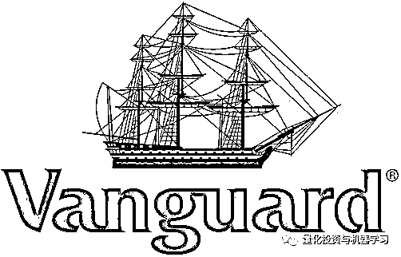
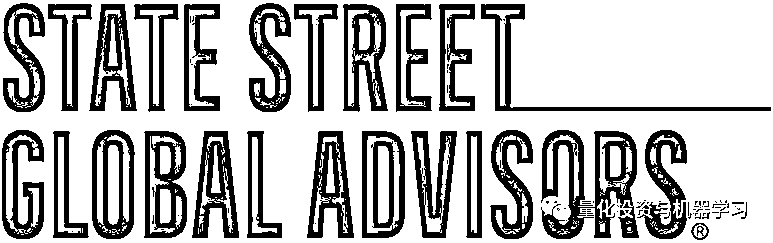
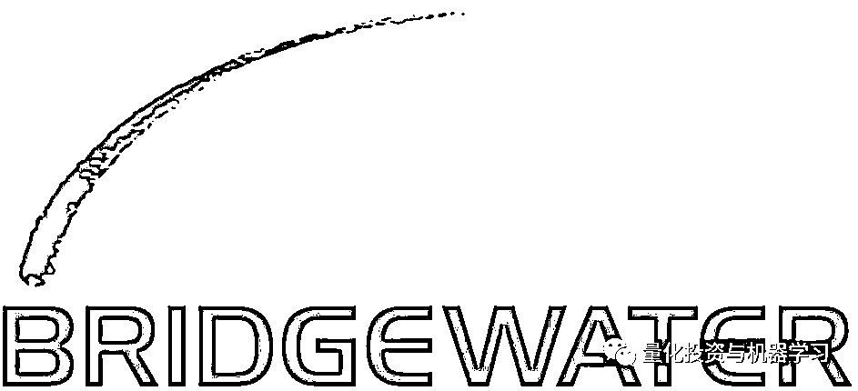
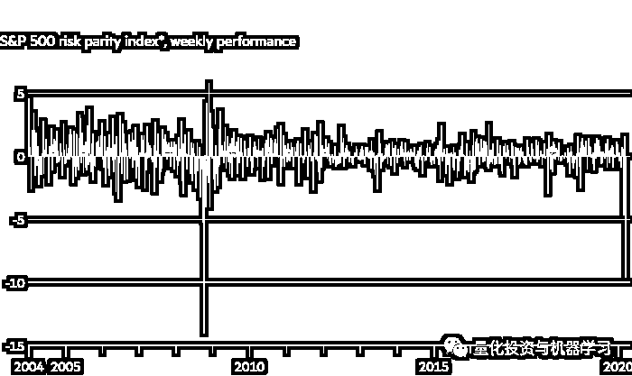
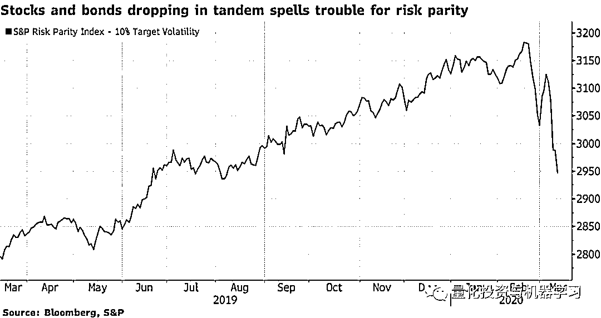

# 全球三大基金资产缩水 2.8 万亿美元！达里奥的日子也不好过~

> 原文：[`mp.weixin.qq.com/s?__biz=MzAxNTc0Mjg0Mg==&mid=2653297552&idx=1&sn=a8d6ee38be0080c5b0b545b125a8511f&chksm=802dd985b75a5093227b80cecd0fc2b57aaceff7038535febd1407641b740965c9996b945916&scene=27#wechat_redirect`](http://mp.weixin.qq.com/s?__biz=MzAxNTc0Mjg0Mg==&mid=2653297552&idx=1&sn=a8d6ee38be0080c5b0b545b125a8511f&chksm=802dd985b75a5093227b80cecd0fc2b57aaceff7038535febd1407641b740965c9996b945916&scene=27#wechat_redirect)

**标星★****置顶****公众号     **爱你们♥   

量化投资与机器学习比编辑部

相关阅读 

[全球顶尖对冲基金备受疫情煎熬，文艺复兴暴跌 7%！](http://mp.weixin.qq.com/s?__biz=MzAxNTc0Mjg0Mg==&mid=2653297437&idx=1&sn=9f00834975468c9731f853fb38cd245d&chksm=802dd908b75a501ed04de3e95b97bc8157f19c751767de7784d30d249f41a0419e330de58ef9&scene=21#wechat_redirect)

今年早些时候，在 iShares ETF 的推动下，**贝莱德（BlackRock）**的资产规模创下逾 7.4 万亿美元的纪录。但根据英国《金融时报》的计算，随着全球股市崩盘，包括标普 500 指数自 2 月份触顶以来下跌了 20％，这一数字如今已下降近 1.4 万亿美元，至 6 万亿美元。 

贝莱德（BlackRock）的股价已较 2 月份的高点下跌了 28%，使其市值降至 640 亿美元。

今年 1 月，**先锋集团（Anguard）**的资产达到 6.2 万亿美元，2 月底跌至 5.9 万亿美元，目前的资产规模约为 5.4 万亿美元。先锋集团（Anguard）表示，3 月份资产有所下降，但仍有正的现金流，包括今年头两个月逾 770 亿美元的投资者净流入。

今年早些时候，**道富环球（State Street Global Advisors）**的资产超过 3.1 万亿美元。假设与美国股市同步下跌，其资产规模在过去 4 周将减少约 6000 亿美元，至 2.5 万亿美元。

尽管这三家机构都以其庞大的指数型基金和 ETF 业务而闻名，但它们也拥有大量需要支付高额费用的主动投资组合。

当然，贝莱德（BlackRock）的表现可能比其他同行好点，因其庞大的机构客户基础和多样化的产品组合。**贝莱德（BlackRock）超过一半的资产投资于股票策略，31%投资于固定收益，8%投资于多资产，7%投资于货币市场基金，2%投资于另类投资。** 

对于那些从被动投资的持续增长中茁壮成长起来的巨头来说，2020 年 2 月很可能是他们的黄金期。央行的刺激措施可能会让市场回到好时光。

除了这三家巨头，全球最大对冲基金桥水也是日子难过。在股票、债券、大宗商品和等出现大幅逆转后，**其旗舰基金今年下跌约****20%****。**

达里奥说：“我们很失望，因为我们本应该在这次交易中赚钱，而不是像 2008 年那样赔钱。” 

根据消息显示，**桥水旗下的 Pure Alpha Fund II 本月迄今累计下跌约 13%，今年头两个月累计下跌 8%。**桥水管理着约 1600 亿美元资产，其中约一半是纯 Alpha 宏观策略。

Pure Alpha 采用传统的对冲基金策略，通过预测宏观经济趋势，押注各种证券（包括股票、债券、大宗商品和货币）的走向。

Pure Alpha 的设计宗旨是：**与客户选择的基准相比，不管市场走向如何，都能产生正的 Alpha，没有系统性偏差。Pure Alpha 基金采用了桥水的混合组合策略。**

**这些基金与市场其它领域也没有关联。 **根据桥水早期的一份文件显示，从该基金成立到 2018 年底，其与股市的相关系数为 0.19，与债券的相关系数为 0.15，与其他对冲基金经理的相关系数为 0.07。

2008 年，Pure Alpha 给投资者带来了很好的收益，在标普 500 指数下跌 37%的一年里，该指数上涨了 9.4% 。 在 2018 年，Pure Alpha 的表现略好于市场。

Pure Alpha 策略的结构还为投资者提供了不同程度的波动性。客户通常会将一只 Pure Alpha 基金叠加在他们选择的 Beta 策略上，比如叠加在标普 500 指数上或全天候上。覆盖策略涉及使用衍生工具复制或抵消一个资产类别或市场风险敞口。

同时，桥水还持有股票指数的看跌期权，这有助于缓冲损失。

去年，桥水 Pure Alpha II 20 年来首度亏损！详情请看：

[达里奥怎么了？桥水 Pure Alpha II 20 年来首度亏损！](http://mp.weixin.qq.com/s?__biz=MzAxNTc0Mjg0Mg==&mid=2653296245&idx=1&sn=feb94792da3da5a9ec96ce2692e5bd45&chksm=802dd460b75a5d76136066cf1113bfe7458db15df6900a8b298d85c212f0558ffbd681cb91bb&scene=21#wechat_redirect)

说起风险平价。上周：

**桥水的风险平价基金遭受了自 2008 年以来最糟糕的一周！也是有记录以来表现第二差的一周！**

这些基金之所以出现巨额亏损，是因为支撑这些基金的核心理念之一在本周被打破：股票和低风险美国政府债券的价格双双下跌，而非相反。金融市场波动性的飙升，引发了从政府和企业债券到股票和大宗商品等各类风险平价基金的抛售。

**最受关注的标普 500 风险平价指数在 5 天内下跌 9.6%，创下 2008 年以来的最大跌幅**。该指数可以追溯到 2004 年。

其中跌幅最大的是 Wealthfront 风险平价基金，该基金自本周初以来已下跌 23.2%。其它遭受损失的基金包括 AQR 风险平价 HV 基金和 Putnam PanAgora 风险平价基金，前者下跌 12.7%，后者下跌 8.5%。

当然，也有风险平价的捍卫者指出，近几个月来，美国国债市场出现了令人震惊的牛市。在冠状病毒引发不确定性的时期，全球投资者纷纷寻求美国国债的安全性。直到上周六，不断上涨的美国国债价格推高了风险平价基金的收益率，抵消了股市早盘的损失。

今年 1 月份，达里奥在接受 CNBC 采访时曾敦促投资者离场观望。他表示：投资者不应该在 2020 年的股市中袖手旁观，换取多元化的投资组合。**因为现金是垃圾！**

好了。以上就是最新全球对冲基金的情况介绍。

2020 年第 59 篇文章

量化投资与机器学习微信公众号，是业内垂直于**Quant、MFE、Fintech、AI、ML**等领域的**量化类主流自媒体。**公众号拥有来自**公募、私募、券商、期货、银行、保险资管、海外**等众多圈内**18W+**关注者。每日发布行业前沿研究成果和最新量化资讯。

你点的每个“在看”，都是对我们最大的鼓励