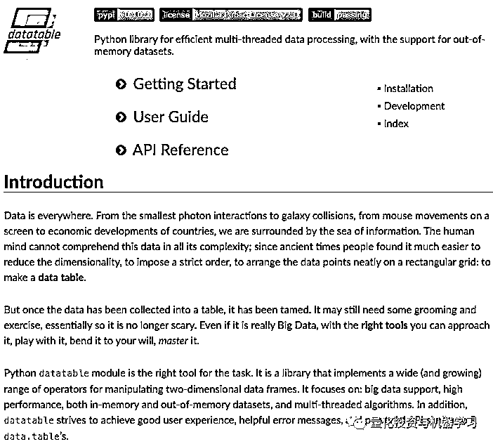
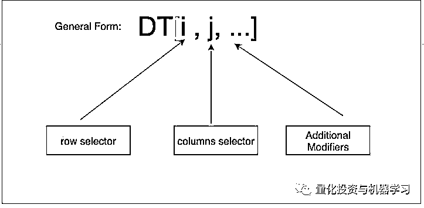
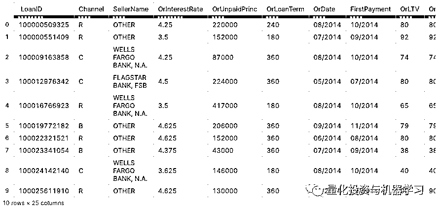
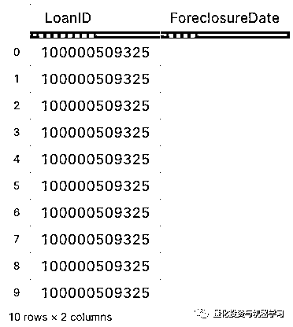
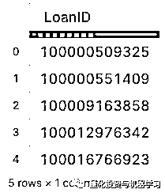
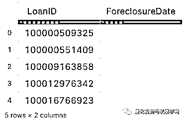
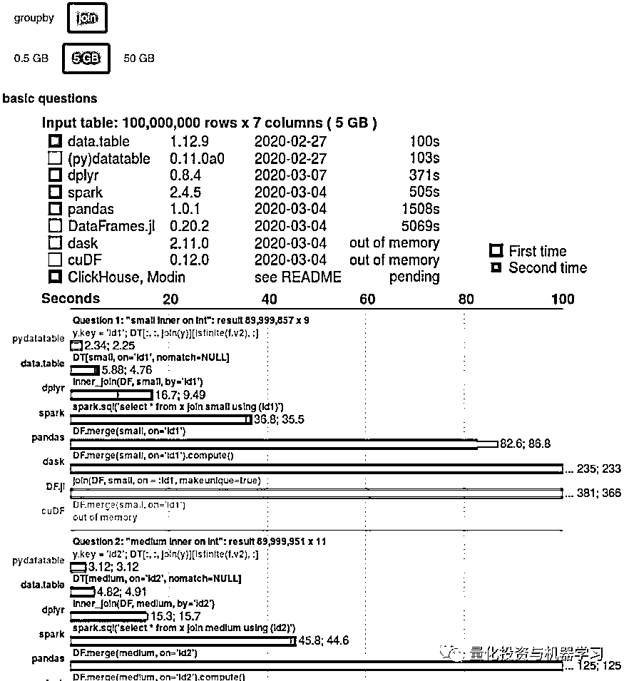
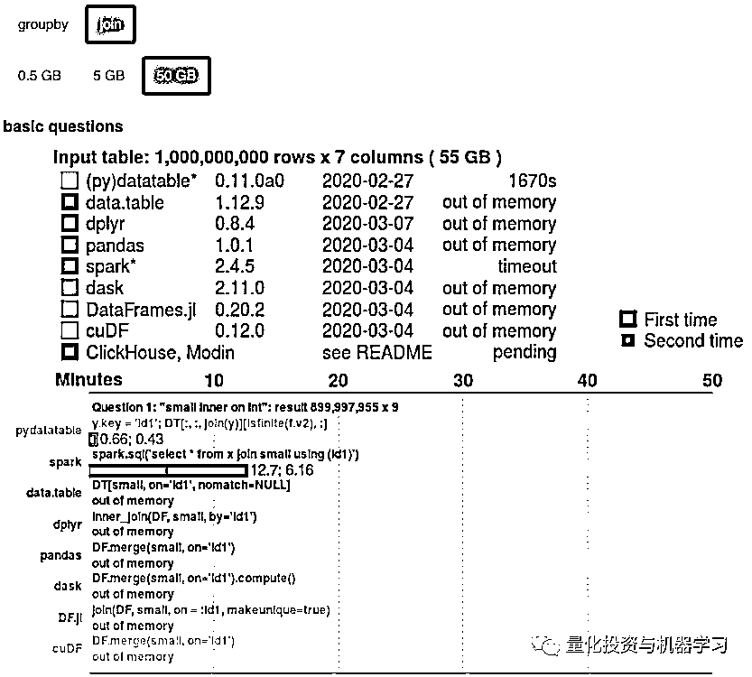
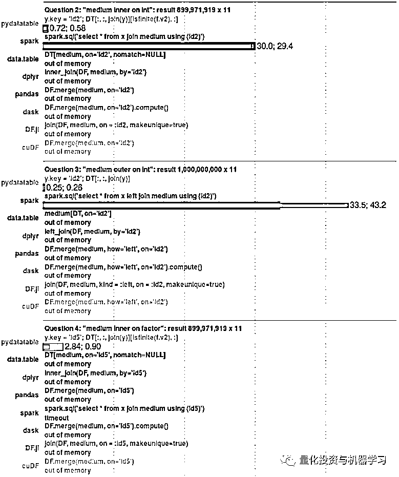

# Datatable：Python 数据分析提速高手，飞一般的感觉！

> 原文：[`mp.weixin.qq.com/s?__biz=MzAxNTc0Mjg0Mg==&mid=2653297525&idx=1&sn=c57fe41418041fcc10186f3b48bdbf53&chksm=802dd960b75a50769b8de1204923515d1e4c24e4e6d9dc4d40dd57f0352493cf9130feb099a7&scene=27#wechat_redirect`](http://mp.weixin.qq.com/s?__biz=MzAxNTc0Mjg0Mg==&mid=2653297525&idx=1&sn=c57fe41418041fcc10186f3b48bdbf53&chksm=802dd960b75a50769b8de1204923515d1e4c24e4e6d9dc4d40dd57f0352493cf9130feb099a7&scene=27#wechat_redirect)


**标星★****置顶****公众号     **爱你们♥   

作者：Parul Pandey    编译：1+1=6

***1***

**前言**

Datatable 是一个 Python 库：


详细介绍大家可以去官网查看： 



https://datatable.readthedocs.io/en/latest/?badge=latest

Datatable 的有点包括：

*   高效的多线程算法

*   Memory-thrifty

*   内存映射磁盘上的数据集

*   本地 C++实现

*   完全开源

**Datatable 主要语法**

在 Datatable 中，所有这些操作的主要工具是方括号表示法，其灵感来自传统的矩阵索引。



i 是行选择器，j 是列选择器。...表示附加修饰符。当前可用的修饰符是 by()、join()和 sort()。这个工具包与 pandas 非常相似，但更**侧重于速度和大数据支持。**

***2***

**案例分析**

我们利用机器学习来预测房利美获得的贷款是否会丧失抵押品赎回权。

**数据集**

使用 2014 年第三季度的数据集。下载的数据集包含两个名为 Acquisition.txt 和 Performance.txt 的文件：

*   Acquisition：包含每个借款人的个人信息，包括个人的债务收入比、信用评分和贷款金额等。

*   Performance：包含关于贷款支付历史的信息，以及借款人最终是否会拖欠贷款。

**目标**

我们的目标是通过这些数据来预测，那些最有可能拖欠抵押贷款的借款人。在开始分析之前，我们将使用 Python Datatable 来获得基本分析。

```py
import datatable as dt
```

接下来，我们将使用 Datatable 的 fread 函数读取获取和性能文件。下面的 fread()函数既强大又非常快。它可以自动检测和解析大多数文本文件的参数，从.zip 档案或 url 加载数据，读取 Excel 文件等等。

现有数据没有列标头，我们需要从列文件手动输入这些列标头。

```py
col_acq = ['LoanID','Channel','SellerName','OrInterestRate','OrUnpaidPrinc','OrLoanTerm','OrDate','FirstPayment','OrLTV','OrCLTV','NumBorrow','DTIRat','CreditScore','FTHomeBuyer','LoanPurpose','PropertyType','NumUnits','OccStatus','PropertyState','Zip','MortInsPerc','ProductType','CoCreditScore','MortInsType','RelocationMort']
col_per = ['LoanID','MonthRep','Servicer','CurrInterestRate','CAUPB','LoanAge','MonthsToMaturity','AdMonthsToMaturity','MaturityDate','MSA','CLDS','ModFlag','ZeroBalCode','ZeroBalDate','LastInstallDate','ForeclosureDate','DispositionDate','ForeclosureCosts','PPRC','AssetRecCost','MHRC','ATFHP','NetSaleProceeds','CreditEnhProceeds','RPMWP','OFP','NIBUPB','PFUPB','RMWPF', 'FPWA','SERVICING ACTIVITY INDICATOR']

df_acq = dt.fread('../input/Acquisition_2014Q3.txt',columns=col_acq)
df_per = dt.fread('../input/Performance_2014Q3.txt', columns=col_per)
```

```py
print(df_acq.shape)
print(df_per.shape)
--------------------------------------------------------------------
(394356, 25)
(17247631, 31)
```

与 pandas 不同，.head()函数显示前 10 行，不过大家可以指定序号。

```py
df_acq.head()
```



进度条的颜色表示数据类型，其中红色表示字符串，绿色表示整数，蓝色表示浮点数。

在 Performance 数据集中，我们只对 LoanID 和 ForeclosureDate 列感兴趣，因为这将为我们提供借款人身份证号，以及它们最终是否会违约。

**选择特定列**

因此，让我们只选择 LoanID 和 ForeclosureDate 列，并丢弃其余部分：

```py
df_per = df_per[:,['LoanID','ForeclosureDate']]
df_per.head(5)
```



**删除重复项**

```py
dt.unique(df_per[:,"LoanID"]).head(5)
```



**分组**

根据唯一的贷款 ID 对 dataframe 进行分组。这将确保数据集中只存在唯一的贷款 ID。

```py
df_per = df_per[-1:,:, dt.by(dt.f.LoanID)]
df_per.head(5)
```



 f-expression 支持算术运算以及各种数学和聚合函数。


**join Acquisition and Performance 数据 frames**

现在，让我们通过使用 theLoanID 列执行内部连接来组合 Acquisition 和 Performance frames。将结果 Dataframe 命名为 df。我们将使用它作为我们的目标变量。并将这一列重命名为 Will_Default，以避免混淆。

```py
df_per.names = ['LoanID','Will_Default']
df_per.key = 'LoanID'
df= df_acq[:,:,dt.join(df_per)]
```

**格式化目标列**

Will Default 列由日期组成。例如，如果借款人已经偿还了贷款，则会提到偿还贷款的日期。但是，如果还没有偿还贷款，则字段为空，将空白值替换为 0。字段的值为 1，这意味着借款人没有违约。他已经在某一天还清了贷款。

```py
# Replacing the dates in the Will_Default column with '0' and null values with 1
df[:,'Will_Default'] = df[:, {'Will_Default': dt.f['Will_Default']==""}]
df.head(5)
```

最后，让我们看看处理过的数据集的 shape：

```py
df.shape
-------------------------------------------------------
(394356, 26)
```

Dataframe 有 394356 行和 26 列，其中包含关于贷款利率、付款日期、属性状态和每个属性邮政编码的最后几个数字的信息。从这里开始，就可以将数据输入模型进行训练。大家还可以将其转换为 pandas dataframe、CSV 文件或二进制文件：

```py
df.to_pandas()
df.to_csv("out.csv")
df.to_jay("data.jay")
```

***3***

**总结**

如今，在数据科学生态系统中存在大量类似数据库的工具。为了比较它们的性能，我们建立了一个基准，该基准定期针对这些包的最新版本运行并自动更新。这对包的开发人员和用户都是有益的。  

例如，下面是在 5GB 和 50GB 数据集上执行的 join 函数的基准测试，可以看到，Datatable 的性能非常好。

**5GB 数据集：**



**50GB 数据集：**





当处理大数据时，Datatable 包确实很出色。**Datatable 强调对大数据的支持，并且可以真正提高在数据集上执行数据处理任务所需的时间**。

快去使用吧！

2020 年第 57 篇文章

量化投资与机器学习微信公众号，是业内垂直于**Quant、MFE、Fintech、AI、ML**等领域的**量化类主流自媒体。**公众号拥有来自**公募、私募、券商、期货、银行、保险资管、海外**等众多圈内**18W+**关注者。每日发布行业前沿研究成果和最新量化资讯。

你点的每个“在看”，都是对我们最大的鼓励