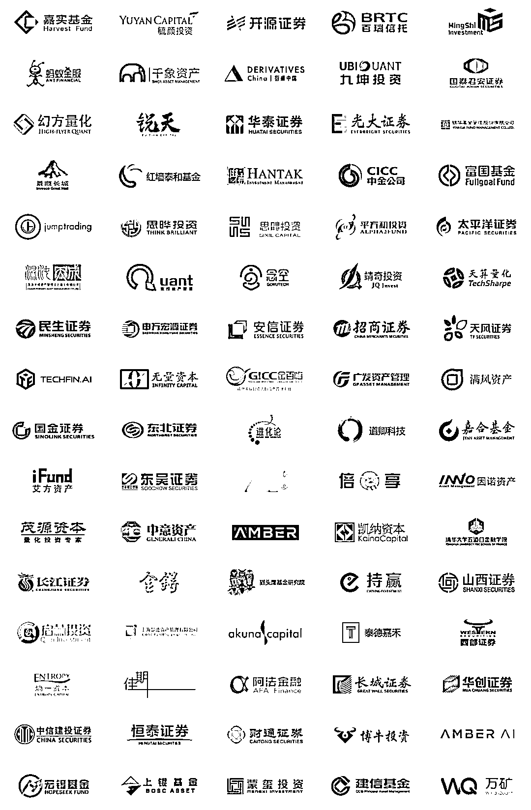

# 野村东方国际 | 量化岗招人啦！

> 原文：[`mp.weixin.qq.com/s?__biz=MzAxNTc0Mjg0Mg==&mid=2653297504&idx=1&sn=ad05047e69ca1b6a6ad228a9fdcee793&chksm=802dd975b75a50634f349bbc3a32ca369cdc023e53bdd28c609f6d608df6f883d9093cd9e0da&scene=27#wechat_redirect`](http://mp.weixin.qq.com/s?__biz=MzAxNTc0Mjg0Mg==&mid=2653297504&idx=1&sn=ad05047e69ca1b6a6ad228a9fdcee793&chksm=802dd975b75a50634f349bbc3a32ca369cdc023e53bdd28c609f6d608df6f883d9093cd9e0da&scene=27#wechat_redirect)

**标星★****置顶****公众号     **爱你们♥

量化投资与机器学习微信公众号，是业内垂直于**Quant**、**MFE**、**Fintech****、AI、ML**等领域的**量化类 TOP 自媒体**。公众号拥有来自**公募、私募、券商、期货、银行、保险资管、海外**等众多圈内**18W+**用户，我们为所有量化金融机构**免费提供**岗位招聘与推广，再次感谢各大金融机构对我们的信任和支持！

****公司介绍****

**野村东方国际证券有限公司于 2019 年 3 月由中国证监会核准设立，2019 年 11 月获得经营证券业务许可证，是首家新设外资控股券商。**

****工作地点****

**上海**

****量化研究员****

****工作职责****

**1、研究、开发、实现各类股票量化投资策略；**

**2、探索有价值的另类数据，贡献新的投资想法；**

**3、协助完成量化组合管理和绩效归因。**

****任职要求****

**1、国内外知名院校硕士及以上学历，数理、金融工程、计算机等相关专业；**

**2、3 年以上量化研究经历和一定的实盘投资经验，有可验证业绩者优先；**

**3、熟练使用 Python，有较强的独立编程能力，熟悉前沿的机器学习算法；**

**4、独立思考，有探索精神，注重逻辑和细节。**

***注：我们对每家机构都经过严格的核对和身份认证，确保信息的准确性和邮箱的真实性。大家可放心投递！** 

****具体投递方式****

**投递邮箱**

*****chinahr@nomuraoi-sec.com*****

****简历命名****

******应聘岗位+姓名+来****源（公众号名称）******

****企业如有招聘需求，****请发邮件至：****

*****lhtzjqxx@163.com*****

****免费提供此项服务****

 ****部分实名招聘合作机构**** **** 

**不定期更新···**