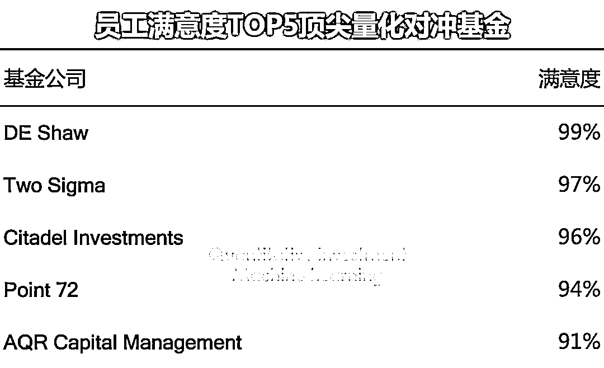
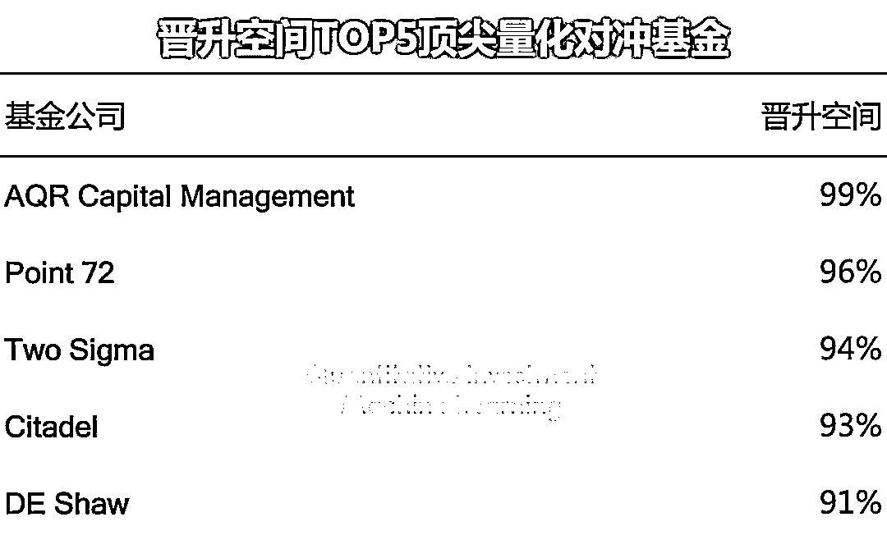
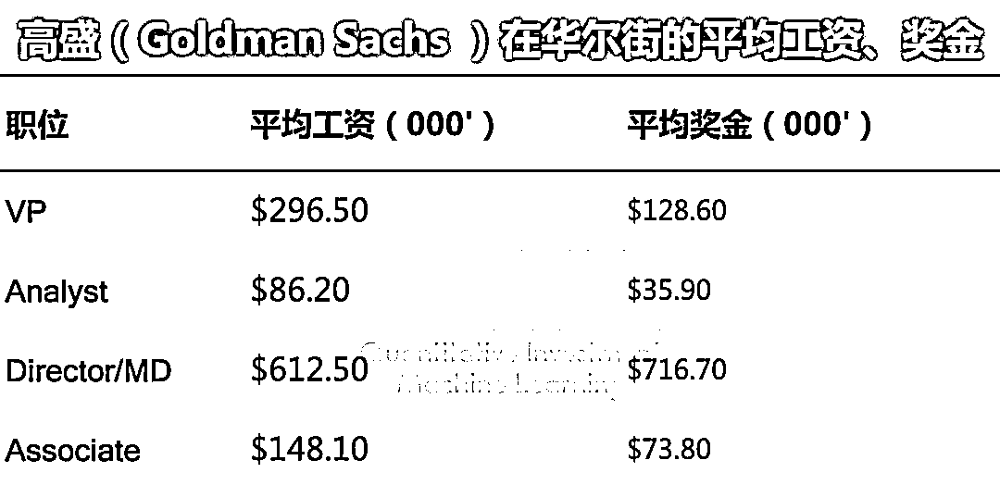
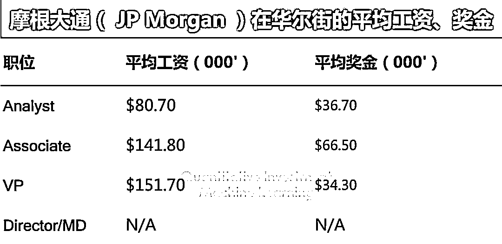
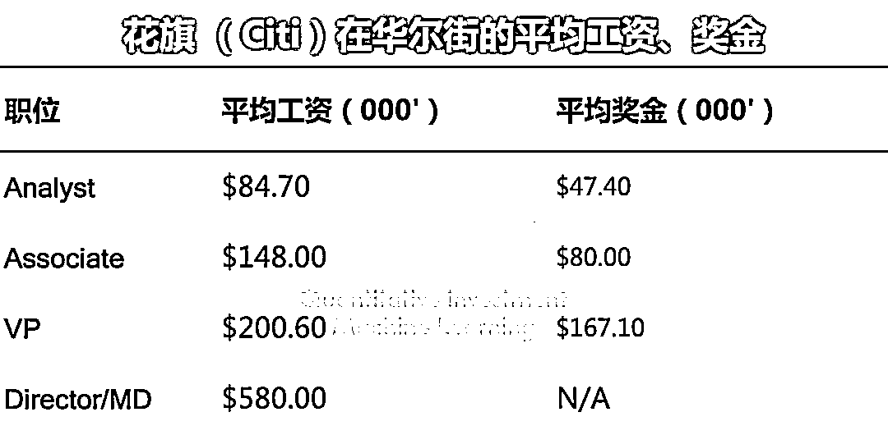
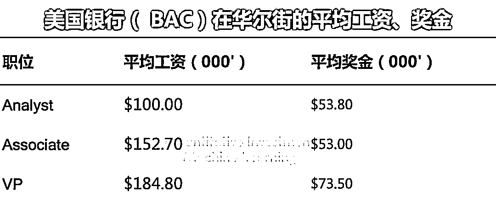
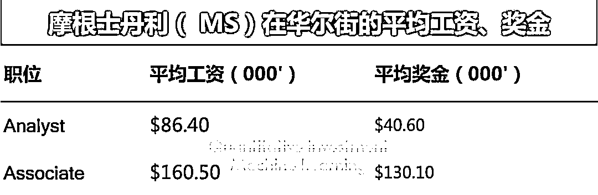
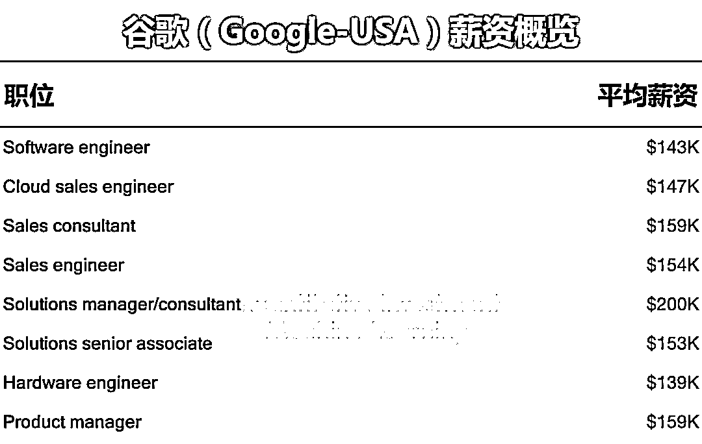

# 二千零二十、最新顶尖对冲基金、投行：薪资、满意度调查！

> 原文：[`mp.weixin.qq.com/s?__biz=MzAxNTc0Mjg0Mg==&mid=2653297492&idx=1&sn=ac29c0f5a4d3161e5fbede6bc4452df7&chksm=802dd941b75a50573fce1a27f92893da61d33f4b3abe7ba7ec5c6afae1f0808d59f5bf6bd553&scene=27#wechat_redirect`](http://mp.weixin.qq.com/s?__biz=MzAxNTc0Mjg0Mg==&mid=2653297492&idx=1&sn=ac29c0f5a4d3161e5fbede6bc4452df7&chksm=802dd941b75a50573fce1a27f92893da61d33f4b3abe7ba7ec5c6afae1f0808d59f5bf6bd553&scene=27#wechat_redirect)

**标星★****置顶****公众号     **爱你们♥   

量化投资与机器学习编辑部

我们根据 WSO 的最新数据，为大家整理了如下的表格，仅供参考。

**顶尖量化对冲基金**满意度和其他情况：

再看看**顶尖投行**的工资和奖金情况：

再来看看**顶尖的互联网公司**，我们做个对比。就拿谷歌举例：

下面的表格展示了谷歌为其一些关键角色支付的工资，这是基于谷歌在 2019 年申请美国 H1B 签证时提交的数千个工资数据集。谷歌提供的不仅仅是薪酬，他们还支付现金奖金和限制性 RSUs，这些期权在 4 年内平均分配，可以是固定薪酬的数倍。

总之，奖金的大小取决于很多因素：

**你的团队带来的总收入，以及你自己对收入的贡献...**

2020 年第 56 篇文章

量化投资与机器学习微信公众号，是业内垂直于**Quant、MFE、Fintech、AI、ML**等领域的**量化类主流自媒体。**公众号拥有来自**公募、私募、券商、期货、银行、保险资管、海外**等众多圈内**18W+**关注者。每日发布行业前沿研究成果和最新量化资讯。

你点的每个“在看”，都是对我们最大的鼓励