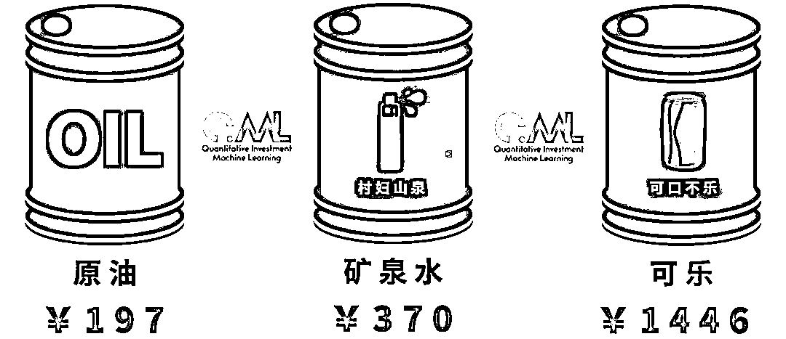
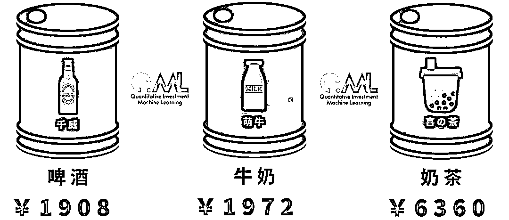
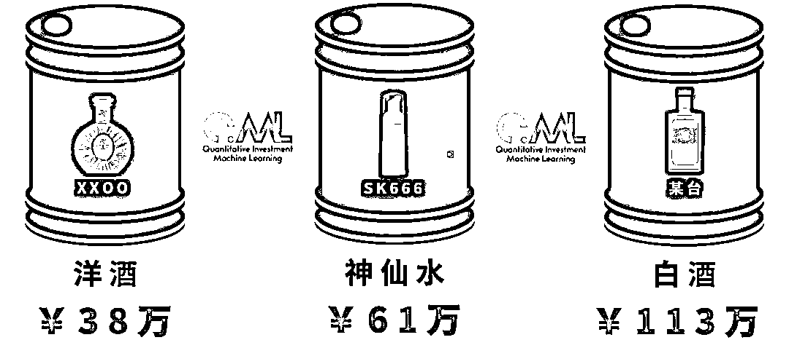
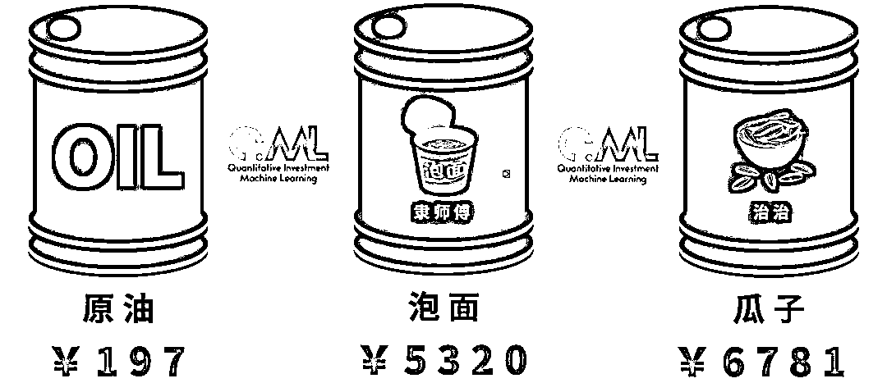
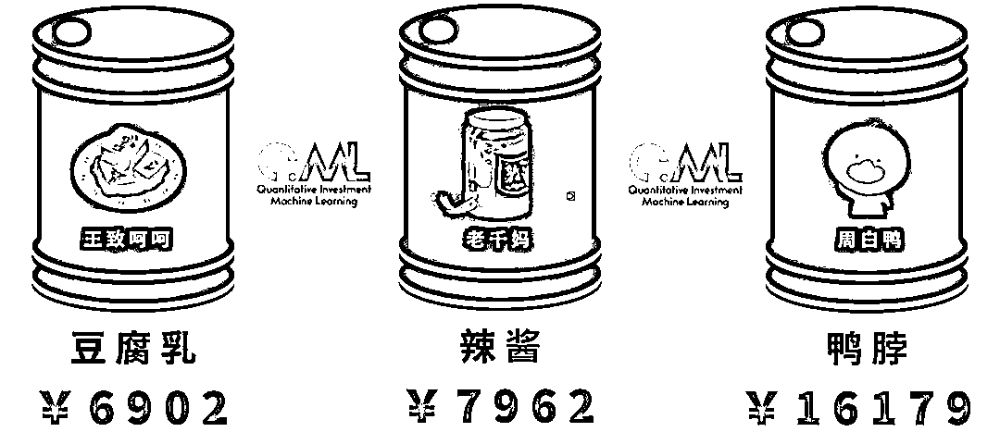
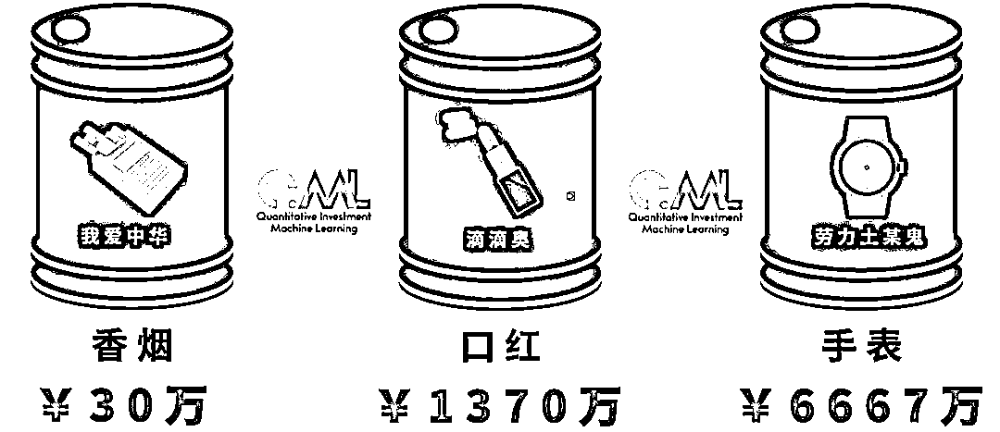

# 三十、美金一桶油意味着什么？

> 原文：[`mp.weixin.qq.com/s?__biz=MzAxNTc0Mjg0Mg==&mid=2653297475&idx=1&sn=f9ecb8062269e959e8c9426960845bfc&chksm=802dd956b75a504007e5832ef7e24cb656649f28d96555f27f0ee2ef655b52daf057074ee281&scene=27#wechat_redirect`](http://mp.weixin.qq.com/s?__biz=MzAxNTc0Mjg0Mg==&mid=2653297475&idx=1&sn=f9ecb8062269e959e8c9426960845bfc&chksm=802dd956b75a504007e5832ef7e24cb656649f28d96555f27f0ee2ef655b52daf057074ee281&scene=27#wechat_redirect)

**标星★****置顶****公众号     **爱你们♥   

量化投资与机器学习编辑部

最近油价太疯狂，直接上图！

**如果按照 1 桶原油 159 升（全球平均）**装满一桶：****

**如果按照 1 桶原油 137 公斤（全球平均）装满一桶：**

2020 年第 55 篇文章

量化投资与机器学习微信公众号，是业内垂直于**Quant、MFE、Fintech、AI、ML**等领域的**量化类主流自媒体。**公众号拥有来自**公募、私募、券商、期货、银行、保险资管、海外**等众多圈内**18W+**关注者。每日发布行业前沿研究成果和最新量化资讯。

你点的每个“在看”，都是对我们最大的鼓励