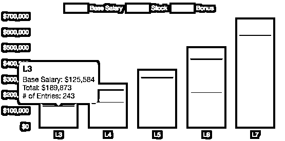
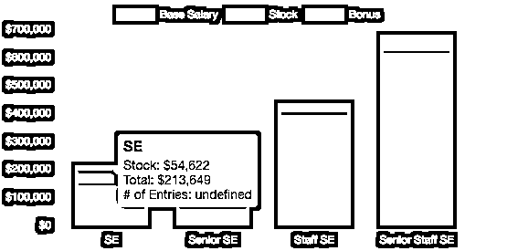
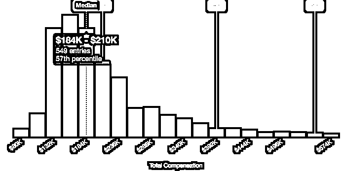

# 二千零二十、美国科技公司码农曝光！爸爸还是爸爸

> 原文：[`mp.weixin.qq.com/s?__biz=MzAxNTc0Mjg0Mg==&mid=2653297462&idx=1&sn=500aa4db293abe0f00ca1c8a6e61f3e2&chksm=802dd923b75a5035044398ee728e7edc628632c405427052a780ba6c8dbaa48e89365cae4faa&scene=27#wechat_redirect`](http://mp.weixin.qq.com/s?__biz=MzAxNTc0Mjg0Mg==&mid=2653297462&idx=1&sn=500aa4db293abe0f00ca1c8a6e61f3e2&chksm=802dd923b75a5035044398ee728e7edc628632c405427052a780ba6c8dbaa48e89365cae4faa&scene=27#wechat_redirect)

**标星★****置顶****公众号     **爱你们♥   

作者：Uni 酱    编译：UniCareer

他来了美国科技公司们带着他们的春招来了！在你面对着这些家家都有矿、福利感人的 Sponsor 大户千万不要冲昏头脑今天为你整理出了**Levels.fyi 实时更新的****美国顶级科技公司 SDE 职位薪资表**来看看哪家用实际行动宠员工？

***1***

**谁最爱小鲜肉？谁最宠老司机？**

先看打头阵的那几个最高级玩家，注意每家公司的职级认定方式不同，不过还是可以比较出，

*   对于刚毕业的 entry level 工程师，**Google**出的薪资最高，能达到**$189,864**

*   对于成熟的工程师，向来给钱大方的**Facebook**直接给出了**$924,500**（接近 100 万美元！）的年薪

*数据来源：Levels.fyi（下同）

**Facebook：**

E3 $186,155

**E8 $924,500**

**Microsoft：**

59 $163,942

67 $500,273

**Amazon：**

L4 $158,593

L7 $529,857

**Google：**

L3 $189,864L7 $680,104

**LinkedIn：**

SE $213,649L7 $677,750

***2***

**哪家独角兽最大方？**

猜猜谁是最大方的科技公司？

**答案**

**点击下方空白处获得答案**

**不是大厂，**

**而是美国第二大打车应用 Lyft！**

除了顶级公司，Levels.fyi 上还公布了独角兽公司的薪资。**给 Entry-level engineer 的薪资 TOP 5 竟然是三家独角兽公司最大方：Lyft、Stripe、Airbnb**，对刚毕业的留学生来说不要太友好哦~

**Lyft：**

T3 $237,352T6 $506,153

**Stripe：**

L1 $239,636L4 $592,800

**airbnb：**

L3 $219,500L6 $586,857

***3***

**哪个地区的码农赚最多？**

果然，在美国的科技界，够格和硅谷干 battle 的，就只有西雅图本图了，虽然薪资上还是 Bay Area 更胜一筹，但是在美国求职网站 Hired 发布的「2019 全球程序员薪资报告」中，Seattle 是码农最想 relocate 的城市 Top2，而在想要逃离湾区的码农中，西雅图也是他们的 best-pick！

**SF Bay Area**

**Seattle, WA**  

**NYC**

***4***

**想拿下高薪的 SDE offer，怎样提高竞争力？**

**争取有质量的实习**

**HR 在过简历的时候第一眼看的就是学校和实习。**而 Big Name 的实习是能让你简历瞬间脱颖而出的。有同学认为自己学校好，暑假曾在 CMU 实验室干活，算是背景比较强的一类，就算没有 Big Name 的实习，也简历一般也是会过的。但是实际上，他遇到了大量拒简历的情况，甚至很多 Software Engineer, New Grad 的职位都拒了他的简历。

要记住，**一般来说 master 只有一个 summer 实习的机会**，这是你能不能在毕业后找到 full-time 的关键，如果自己不努力说没就没了。

至于如何找到一份实习, 从开学的第一天就开始准备(也可以从来之前的那个暑假, 总之越早越好)。认真对待每一门课程，每一次 career fair, 每一封写给学长/姐帮你内推的邮件找实习。期间多面几家, learn from failure, 这些在找全职的时候也是非常有价值的经验。

**没有哪个行业永远都处于 EASY 模式**，而且 cs 本来就不是一个很看重名校光环看重简历的地方。湾区旁边 100 名开外学校拿到硅谷大公司 offer 的大有人在，其中很重要的一个因素就是专业能力。

**2、networking**

无论在哪都要刷人脉！！！

*   亲属资源：七大姑八大姨这个时候可以派上用场了，尤其是大一大二自己背景还没那么丰富的时候，亲属资源值得用。

*   已经工作的学姐学长：尤其是本院系本专业的学长姐，刚进学校这些资源都可以好好勾搭一下，毕竟有很多学长姐在你入学的时候就即将毕业了。在北美校友资源特别重要，许多大公司
*   教授推荐：如果你只在这个教授课上点到时说过话，那就别痴心妄想找教授推荐了。之前提到的帮教授做做 research，或是上课的时候多多表现，做个 TA 或 GA，也是刷存在感的好方法。
*   学校社团：学生组织绝对是建立人脉，搜寻机会的绝佳选择，不仅仅因为社团里的人脉，在社团还会组织各种活动，在这些活动上也可以结识到很牛的人。
*   来学校 Career Fair、Info Session、演讲的嘉宾：无论是学校请的、学生会请的还是院系请的，有机会就去参加，总有你意想不到的收获。
*   各类论坛/会议/社交晚宴：这种场合千万别忘记带名片。UniCareer 为了帮助更多的学员以及导师拓展 networking，会有月度的 Dine With Me 以及半年度的大型 Mingle。

**3、放宽视野，找其他行业的相关岗位**

哥大 CS 专业出身的导师 Amy 表示，一般说到 CS 毕业的求职方向，有这几种职业规划：

> 1\. FLAG（Facebook, LinkedIn, Amazon, Google）做一个有钱又快乐的码农，5-10 年后，进入创业公司做 CTO
> 
> 2\. Make the most use of NYC, CS 转走 Finance

金融行业和 IT 行业不太一样，对 GPA 有严格的要求，一般是要高于 3.5，所以想进金融行业的同学们，**在学校要抓好 GPA**。想在读书时就摸透行业的职业发展机会，除了和前辈多 Networking，还可以看看大牛云集的论坛，比如一亩三分地，ChaseDream。

心系武汉

**等疫情结束，花枝春满。**

**山河无恙，人间皆安。**

2020 年第 54 篇文章

量化投资与机器学习微信公众号，是业内垂直于**Quant、MFE、Fintech、AI、ML**等领域的**量化类主流自媒体。**公众号拥有来自**公募、私募、券商、期货、银行、保险资管、海外**等众多圈内**18W+**关注者。每日发布行业前沿研究成果和最新量化资讯。

你点的每个“在看”，都是对我们最大的鼓励