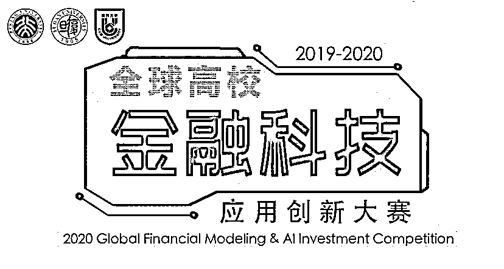
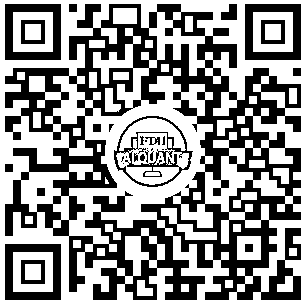
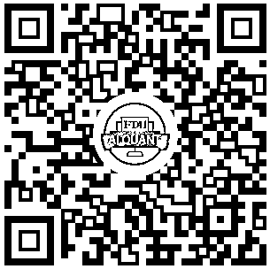

# 全球 Quant：北大、复旦喊你来搞事情！

> 原文：[`mp.weixin.qq.com/s?__biz=MzAxNTc0Mjg0Mg==&mid=2653297446&idx=1&sn=60d5fa1482d3976b7d7d94bfeea809cb&chksm=802dd933b75a50259adb88a0cd29ecd78d96e4807163dce3ff36e6346709efc79156d451ead5&scene=27#wechat_redirect`](http://mp.weixin.qq.com/s?__biz=MzAxNTc0Mjg0Mg==&mid=2653297446&idx=1&sn=60d5fa1482d3976b7d7d94bfeea809cb&chksm=802dd933b75a50259adb88a0cd29ecd78d96e4807163dce3ff36e6346709efc79156d451ead5&scene=27#wechat_redirect)

**标星★****置顶****公众号     **爱你们♥   

量化投资与机器学习编辑部

**我们正在全球寻找这样一群大学生：**

*   他们可能来自不同专业，经济金融、数理统计、计算机、财会、管理... 对探索大数据等科技工具在金融财经领域工作充满热情。

**我们想要给这样的学生：**

*   **专业指导、高额奖金、顶尖量化机构实习机会、实盘资金....**

**长按识别下方二维码****进入小程序即可报名**

**↓↓↓**

报名**2019-2020 全球高校金融科技应用创新大赛**，用智慧，赢得未来！

***1***

**大赛简介**

全球高校金融科技应用创新大赛是由北京大学数学科学学院和复旦大学经济学院发起，并联合建行大学、纽约大学金融与风险工程系、对外经济贸易大学金融战略与量化研究中心主办，苏州工业园区、苏州市金融科技协会、新加坡金融科技协会特别支持，面向全球高校开展的运用大数据、云计算、机器学习与人工智能技术在金融领域应用的科技创新大赛。

大赛旨在汇聚全球顶级高校与行业专家，推广基于大数据等方法的广泛金融科技应用，挖掘数学、计算机以及金融学等学科的复合型人才，实现金融科技领域的产学研转化， 努力打造产教融合的人才培养体系，为全面推动金融科技创新发展做贡献。

***2***

**大赛组织**

*   **主办单位：**北京大学数学科学学院、复旦大学经济学院、建行大学
*   **联合主办单位：**纽约大学金融与风险工程系、对外经济贸易大学金融战略与量化研究中心
*   **特别支持单位：**苏州工业园区、苏州市金融科技协会、新加坡金融科技协会
*   **承办单位：**建行大学苏州金融科技学院、Wind 资讯、UniCareer
*   **战略支持单位：**摩根大通（J.P.Morgan）、瑞银中国（UBS）、美国国际集团（AIG）
*   **技术支持单位：**WindQuant 万矿量化平台

***3***

**赛程安排**

| **日期** | **安排** |
| --- | --- |
| 2019 年 11 月-2020 年 3 月 31 日 | 线上报名+提交策略 |
| 2019 年 11 月-2020 年 3 月 31 日 | 高校宣讲/赛前培训 |
| 2020 年 4 月 3 日 | 公布入围决赛名单 |
| 2020 年 4 月 3 日-2020 年 5 月 15 日 | 模拟实盘/模型优化 |
| 2020 年 5 月 17 日 | 决赛赛前集训 |
| 2020 年 5 月 18 日 | 决赛 |
| 2020 年 6 月-2020 年 12 月 | 优秀项目赛后孵化 |

***4***

**赛事规则**

**1、参赛对象**

全球高校在校生（**本科生、研究生均可**），具有经济金融类、数理统计类、计算机类、管理类、财会类等相关专业背景，以及对利用大数据等科技工具从事金融财经领域工作感兴趣的个人或者团队。

**2、参赛规则**

参赛选手可以个人或者组队报名（**每队最多 3 人**），建议合理搭建学科背景交叉的团队参赛。

**3、赛题设置**

**▍ 投资策略赛区**

a. 比赛形式：利用 A 股市场作为应用场景，通过大数据、云计算以及机器学习等理论工具，结合金融知识，提交 A 股量化交易策略。

b. 回测平台：大赛专用回测平台，基于 Jupyter Noteboke 环境，提供可回测数据以及回测函数。

c. 回测时间范围：2013 年 1 月 1 日-2019 年 11 月 30 日

d. 回测初始资金：1000 万

e. 提交形式：策略报告（包括模型代码）

f. 初赛评审规则：夏普比率（40%）+策略创新（30%）+泛化能力（30%）

g. 决赛评审规则：进入决赛的队伍，进行模拟实盘；通过现场答辩以及模拟实盘成绩确定最终排名。

**▍ 风险预测赛区**

a. 比赛形式：基于上市公司财务数据作为应用场景，通过大数据、云计算等理论工具进行数据挖掘，结合财会知识搭建风险预测模型。

b. 建模平台：WindQuant 万矿量化平台，提供上市公司公开财务数据。

c. 选题规则：本题具有开放性，自选角度，通过对公开数据的分析，构建量化模型，对模型的结果进行复盘，评价模型的有效性，并详述预测的意义以及实际应用的价值。

d. 可选角度：

*   利用上市企业的财务报告，构建财务造假公司识别模型；

*   针对上市企业的财务报告，通过财务预警模型评估财报造假程度以及财务风险；

*   通过公开财务数据，预测某类上市公司的财务风险或市场系统性风险。

e. 提交形式：策略报告（包括模型代码）。

f. 评审规则：预测的准确性（40%）+模型创新性（30%）+应用价值（30%），进入决赛的队伍，最终通过现场答辩确定最终排名。

***5***

**奖项设置**

1、大赛设置为“投资策略赛区”与“风险预测赛区”两个赛区，每个赛区设置一等、二等以及三等奖：

**投资策略赛区**

*   一等奖 1 名，奖金**5 万元**

*   二等奖 1 名，奖金**2 万元**

*   三等奖 1 名，奖金**1 万元**

**风险预测赛区**

*   一等奖 1 名，奖金**3 万元**

*   二等奖 2 名，奖金**1 万元**

*   三等奖 3 名，奖金**5 千元**

2、所有进入决赛的选手均有机会获得在合作机构等的实习 offer。

3、优秀选手及其项目均有机会获得大赛战略合作方提供的孵化服务，进行成果转化。

***6***

**大赛参与高校**

北京大学、复旦大学、纽约大学、对外经济贸易大学、芝加哥大学、哥伦比亚大学、康纳尔大学、香港理工大学、香港科技大学、新加坡国立大学、新加坡管理大学、中国人民大学、中国科学技术大学、南开大学、天津大学、山东大学、上海交通大学、浙江大学、武汉大学、厦门大学、南京大学、上海科技大学、上海纽约大学、同济大学、上海财经大学、西南财经大学、华中科技大学、四川大学、苏州大学、西交利物浦大学、华南理工大学（部分，排名不分先后）

***7***

**报名方式**

**长按识别下方二维码****进入小程序即可报名**

**↓↓↓**

***8***

**大赛亮点**

通过本次大赛，你就有机会获得：

*   最新金融科技发展趋势和前沿行业解析

*   **最高 50000 元的奖金鼓励**

*   海内外著名高校高手同台竞技

*   演练金融建模实战经验、团队作战配合能力

*   参与**合作伙伴提供的孵化项目或者实盘基金**

*   纽约大学、北京大学、复旦大学知名教授的升学推荐信

*   来自**万得资讯、瑞银中国、摩根大通、美国国际集团**的面试或者实习机会

量化投资与机器学习微信公众号，是业内垂直于**Quant、MFE、Fintech、AI、ML**等领域的**量化类主流自媒体。**公众号拥有来自**公募、私募、券商、期货、银行、保险资管、海外**等众多圈内**18W+**关注者。每日发布行业前沿研究成果和最新量化资讯。

你点的每个“在看”，都是对我们最大的鼓励