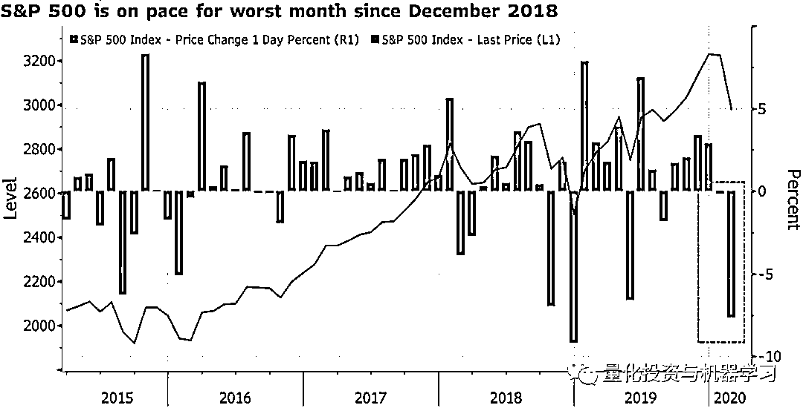
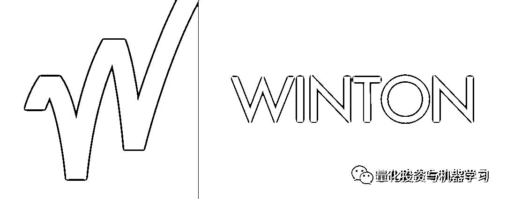
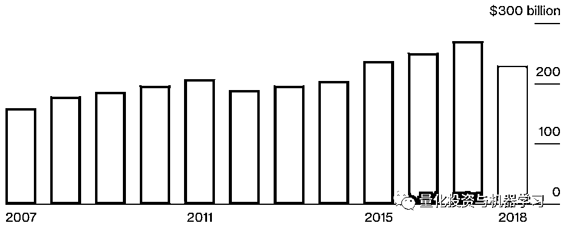
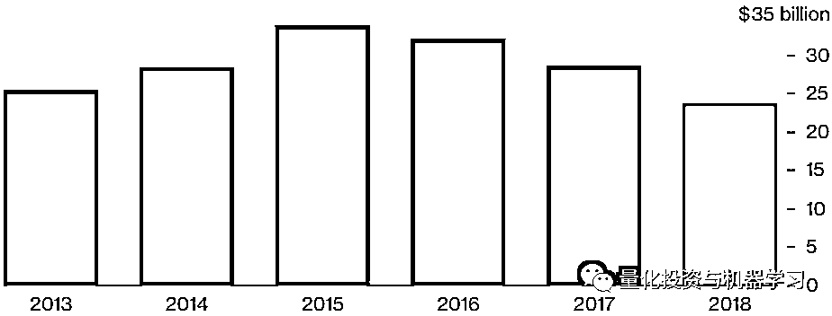
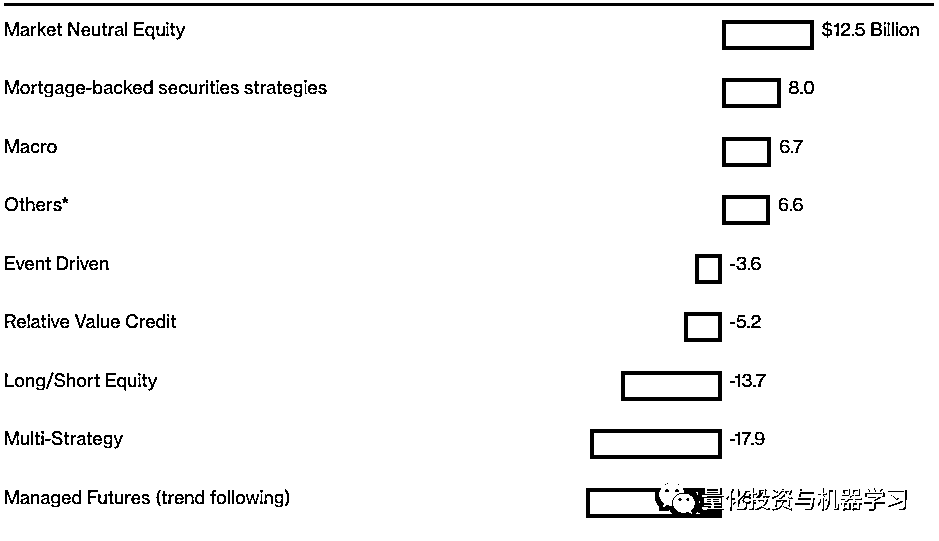
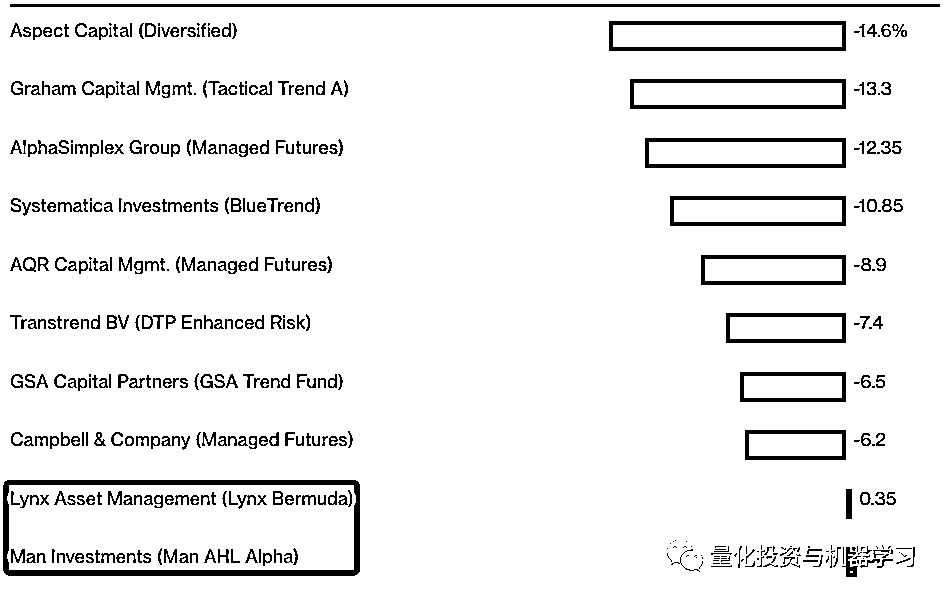
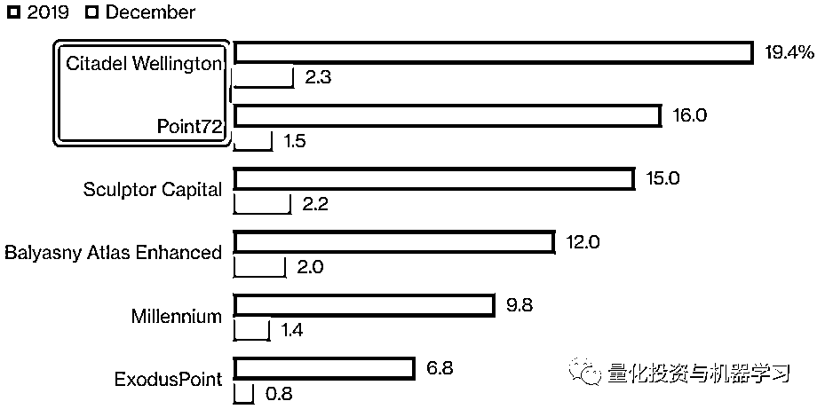
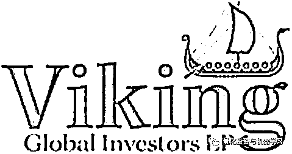

# 全球顶尖对冲基金备受疫情煎熬，文艺复兴暴跌 7%！

> 原文：[`mp.weixin.qq.com/s?__biz=MzAxNTc0Mjg0Mg==&mid=2653297437&idx=1&sn=9f00834975468c9731f853fb38cd245d&chksm=802dd908b75a501ed04de3e95b97bc8157f19c751767de7784d30d249f41a0419e330de58ef9&scene=27#wechat_redirect`](http://mp.weixin.qq.com/s?__biz=MzAxNTc0Mjg0Mg==&mid=2653297437&idx=1&sn=9f00834975468c9731f853fb38cd245d&chksm=802dd908b75a501ed04de3e95b97bc8157f19c751767de7784d30d249f41a0419e330de58ef9&scene=27#wechat_redirect)

**标星★****置顶****公众号     **爱你们♥   

量化投资与机器学习编辑部

今年 2 月以来，美股出现自金融危机以来最大跌幅。标准普尔 500 指数在五个交易日内暴跌 11% ，美国道琼斯工业平均指数指数跌至 6 月份以来的最低点，美国股市市值蒸发了近 3 万亿美元。再加上世界卫生组织提高了新冠肺炎的全球风险级别，大家的日子都有点难过！

*图片来自：彭博

西蒙斯老爷子的文艺复兴科技（Renaissance Technologies）旗下量化股票对冲基金上个月因股市震荡，**直接下跌了 7%！**该策略偏向于计算机驱动模型预期上涨的股票。

David Harding 的元盛资本（Winton）的基金上周在新冠肺炎引发的抛售中**损失了近 9%（截止今日）！**这只规模 76 亿美元的多策略基金 2 月底下跌 5.7%。该基金使用计算机驱动的模型进行跨资产类别的交易。

*图片来自：网络

David Harding 是对冲基金的先驱，数十年来，他的量化模型产生了两位数的收益率。

**Winton 的一个主要策略方向是****趋势跟踪** 。说起这个华尔街最受欢迎的交易策略之一，公众号多聊几句。

趋势跟踪比较简单，根据几十年的数据对价格趋势进行反向测试，确定何时进入和退出交易。当该算法确定市场上涨的可能性时，从股票、债券到大宗商品和货币远期的期货或衍生品合约就会自动发出买入指令。另一种情况是，如果价格预测看起来黯淡，空头期货头寸将减少，押注资产将减少。

问题是，趋势跟踪的基金经理不太善于应对突发事件，比如川普的一条 280 字的推文就让股市行情大变。最终，这种瞬息万变的市场情绪很容易就会扰乱趋势跟踪核心的内容：历史价格趋势。

2018 年 2 月初的崩盘真正暴露了 CTA 的局限性。趋势跟踪策略不像高频交易可以在几毫秒内进出交易，CTA 通常会在几天甚至几个月的时间内缓慢地改变持仓。

一些问题在于，**如今太多的资金追逐着同样的趋势，破坏了我们所谓的 Alpha。**

在经历了至少 13 年来严重的资金外流后，趋势跟踪量化基金资产在 2019 年出现了下跌：

*图片来自：Eurekahedge

上世纪 90 年代推广 CTA 的 David Harding 在 2019 年 7 月表示，他的 Winton 将远离趋势跟踪。各位想想啊，曾经 Winton20 年来以趋势跟踪为主要策略年均收益率高达 19%！现如今，趋势跟踪已失去了活力。这或许是 CTA 变得过时的最大迹象。

**同时，Winton 的旗舰基金将该策略的配置比例从 50%削减至约 30%。**将交易更多的证券，扩张进入新的市场，并开发新的算法，试图重新夺回以前的优势。

David Harding 还说：“费用一直在下降，资产规模一直在增加，许多公司正被推到绝境。**我绝对没有走投无路，但我绝对有创新的动力，不能自满。****”******

Winton 目前交易约 7000 只股票，四年前只有 1500 只。他们有一个在粮食期货方面有一个主要项目，涉及时间序列建模，数据可追溯到 100 多年前。Winton 还在研究天气模式，看看是否有办法预测和交易气候变化。

当 David Harding 开始远离他的主要支柱时，有些人选择离开。截至 2019 年年底，投资者已从 Winton 的基金中撤出 50 亿美元，使其管理的资产至 236 亿美元。

*图片来自：公开数据整理

根据 eVestment 的数据显示，投资者从所有趋势跟踪策略基金中撤资达 353 亿美元：

*图片来自：eVestment

去年，法兴银行的 SG 趋势指数（SGTrendIndex）中只有两个成分股有所上涨：

*图片来自：彭博

CTA 几乎就像是个交易顾问。 它需要的是明确性，而不是随机性！

当然，在美联储宣布降息以预防病毒对经济的影响后，十年期国债收益率跌至历史低点附近。与此同时，从欧洲到日本的债券价格都已逼近去年的高点。据法国兴业银行编制的一个指数，所有这些因素推动利率趋势跟踪策略创下了 1998 年以来的最佳表现。根据摩根大通的数据，所有这些交易都表明，CTA 缺乏进一步推高价格的能力。

再看看其他一些对冲基金公司的情况：

# Steve Cohen 的 Point72 在 2 月份增长近 1%。

# Point72 管理着 161 亿美元的资产，其收益率高于去年的平均水平。 Point72 在 2019 年上涨了 16% ，而行业平均水平为 9% 。

管理着 300 亿美元资产的 Citadel 旗下旗舰基金 Wellington fund2 月份上涨了约 1%，截至今年 2 月，Citadel 的基金增长了 4.5%。

公众号来插播一则 Citadel 和 Point72 的对比：

2019 年。规模 300 亿美元的 Citadel 旗下主要多策略对冲基金飙升 19.4%，超过了 Steve Cohen 的 Point72。Tactical Trading fund 上涨了约 20%，这是一只单独的多策略基金，使用股票和量化方法。类似的 Point72 上涨了约 16%。

*图片来自：彭博

Chase Coleman 旗下 Tiger Global 上个月的选股对冲基金上涨 2.1%，只做多的基金下跌 0.1%。

Philippe Laffont 的 Coatue 在其合格合伙人对冲基金 Qualified Partners 中增值了 0.4%。只做多的基金下跌了 2%。

David Meyer 管理的对冲基金 Contour Asset Management 是一只规模 14 亿美元的股票型基金，专注于科技、媒体和电信行业。该基金本月上涨了约 4%，今年迄今为止的收益率达到了 6%。这家成立 10 年的公司得到了瑞典资产管理公司 Brummer & Partners 的支持。

Andreas Halvorsen 的 Viking Global Equities fund 上涨了 1.1%。2020 年迄今的收益率为 3.1%。截至今年 1 月，该基金共管理了 178 亿美元的资金。

Aaron Cowen 的 Suvretta Capital Management，其对冲基金和只做多的基金都出现了亏损。多空股票基金上个月下跌 0.4%，今年迄今的涨幅降至 3.8%。

Dan Loeb 旗下旗舰基金 Third Point Partners 基金上个月下跌 6.5%，使今年的亏损达到 5.4%。

Sculptor Capital Management 旗下 master fund2 月份下跌 0.05%，2020 迄今的收益率降至 2.5%。雕刻家资本管理公司的前身是 Och-Ziff。

Brahman Capital 的多空股票基金 Brahman Partners II 上涨了 4.9%。2020 迄今的收益率达到 5.9%。

规模 22 亿美元的多空股票型基金 SoMa Equity Partners 2 月份在其主基金中增值 0.9%。专注于 TMT 的基金今年上涨了约 3%。

Brevan Howard 的宏观基金本月上涨了约 3%，这是因为今年年初这些基金一般都是做多债券和做空石油，随着人们越来越预期肺炎病毒将给全球经济带来压力、美国将降息，这些基金将赚得更多。 

David Einhorn 的 Greenlight Capital 截止 2 月底月下跌了 3.4%。

等等···

文章数据整理自：彭博、eVestment、Eurekahedge 和公开网络

心系武汉

**等疫情结束，花枝春满。**

**山河无恙，人间皆安。**

2020 年第 52 篇文章

量化投资与机器学习微信公众号，是业内垂直于**Quant、MFE、Fintech、AI、ML**等领域的**量化类主流自媒体。**公众号拥有来自**公募、私募、券商、期货、银行、保险资管、海外**等众多圈内**18W+**关注者。每日发布行业前沿研究成果和最新量化资讯。

你点的每个“在看”，都是对我们最大的鼓励