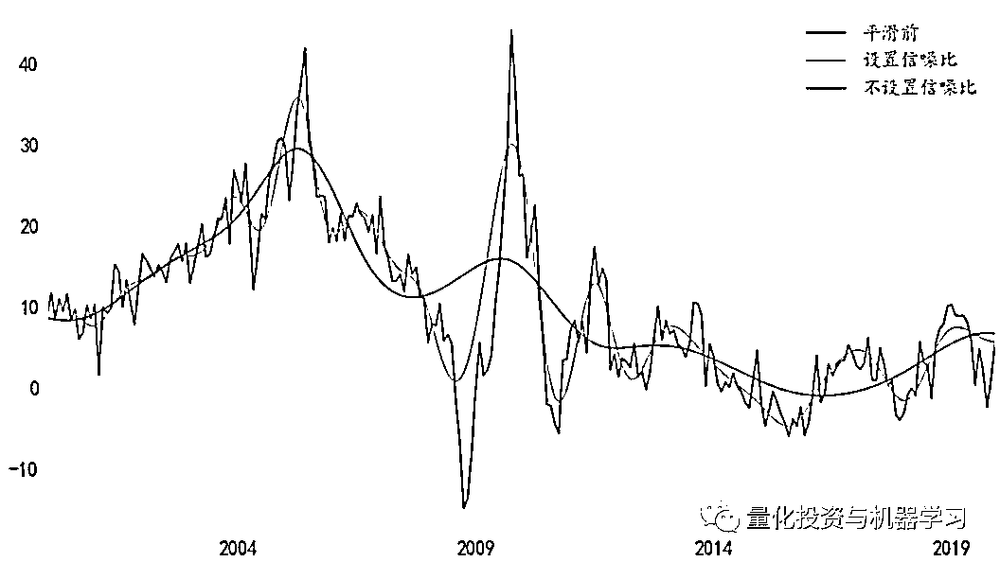
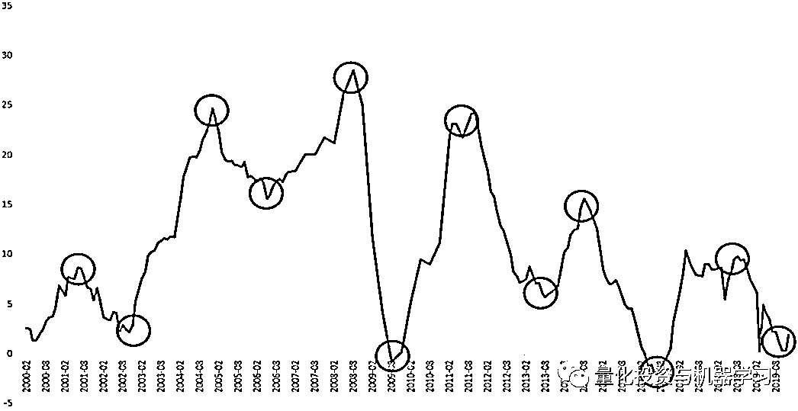
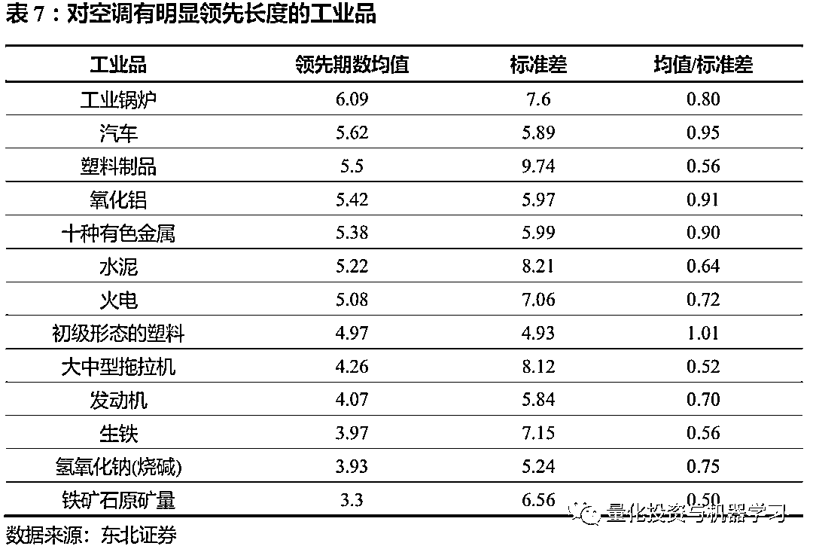
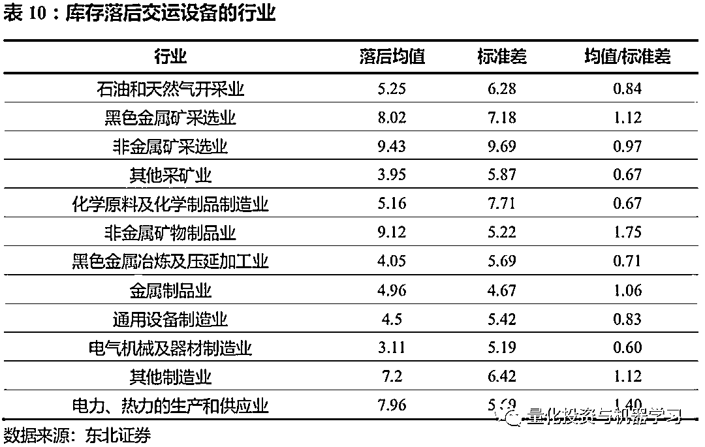

# 量化新视角：工业部门产业联动与周期规律

> 原文：[`mp.weixin.qq.com/s?__biz=MzAxNTc0Mjg0Mg==&mid=2653297397&idx=1&sn=6b148bb473c8d4a1b23386b04960a5f2&chksm=802dd8e0b75a51f657bcc0ffa9bbfc32c54908d43a2ed1ec2e37f21c9e35ffe1947960599a9b&scene=27#wechat_redirect`](http://mp.weixin.qq.com/s?__biz=MzAxNTc0Mjg0Mg==&mid=2653297397&idx=1&sn=6b148bb473c8d4a1b23386b04960a5f2&chksm=802dd8e0b75a51f657bcc0ffa9bbfc32c54908d43a2ed1ec2e37f21c9e35ffe1947960599a9b&scene=27#wechat_redirect)


**标星★****置顶****公众号     **爱你们♥   

作者：肖承志、周飞鹏 | 东北证券金融工程-量化视角下的工业部门产业联动与周期规律

编辑：量化投资与机器学习编辑部

***1***

**引言**

工业是国民经济的主导部门，它为经济中的各部门提供能源和原材料、生产工具以 及消费品。过去几十年来，第二产业在我国 GDP 中占比和增速贡献的重要性不言 而喻，市场也一度通过观察工业增加值来预判 GDP 的走势。但近年来工业增加值 的波动性相较股市在降低，只观察这一总量指标已无法满足市场对宏观经济、各行 业景气度的研究需求。在此背景下，我们认为有必要拆解工业生产体系，探寻工业 部门内产业各自的周期规律以及相互联动关系，以期为寻找结构性机会做准备。

在上一篇报告《经济指标周期及领先性确认的数理方法》中，我们从量化视角针对 如何有效触及经济数据、从而定量研究指标的周期规律及领先性的问题，提出了一 套数理流程。我们认为拐点是时间序列中一类特殊的极值点，它确定了周期、阶段 的划分，刻画了周期演绎的过程，同时也蕴含了指标间相位差的信息。因此，该流 程的核心部分即为拐点识别算法以及拐点对应算法。通过识别拐点，我们得以给指 标进行定期;通过拐点对应，我们可以探寻指标间周期的先后。

故在前一篇方法论的基础上，我们进一步试图利用模型测试工业部门三大指标体 系:分行业工业增加值、主要工业品产量、工业企业产成品存货的数据，以检验此 流程的效果并探寻其中的规律。

因此，本文的研究目的就是针对如何定量化研究经济周期，提供工具上的一个视角。具体的，我们试图解决以下问题:

1)我们的模型在大量数据上进行批量运算时有哪些需要注意的问题?

2)工业部门各产业的周期有何规律?

3)各工业产业间存在怎样的领先滞后性?

***2***

**方法回顾与实际应用的考量**

首先我们对分析问题的方法与流程进行简要的回顾，包括数据预处理、信号分离和 领先性的确认，其次是针对在大量数据上应用时可能存在的特殊情况进行算法调 整，使得算法适用于更广泛的数据。  

**2.1\. 方法回顾**

在计算指标间领先滞后关系的过程中，需要以下几个步骤:数据预处理与信号分离、 周期、阶段、拐点及领先性的确认。其中数据预处理与信号分离包括频率对齐、季 调和平滑;周期、阶段、拐点及领先性的确认包括拐点识别、拐点对应和领先期数 的确认。

**频率对齐**

流程的第一步为频率对齐。在研究两个或以上指标时，若指标频率不一，或者存在 某些缺失数据，我们无法直接对比。因此流程的第一步即将指标频率统一化与补充 缺失值。我们可根据需要将低频指标高频化，也可以反向操作。

若两变量分别是季频和月频，考虑到样本量大小，我们常将季频转为月频。若在某 一时间节点上，一个变量存在测量值，另一个变量数据缺失，我们常利用存在测量 值的前后时间节点的数据进行该数据的估算。此时线性插值是一种简便的手段。

**季调**

流程的第二步为季调。无论是生产、消费或其他类型经济指标，无一例外都会受源 自社会、自然、数据统计等因素的季节效应的影响，指标反映的经济活动中真实规 律会被一定程度掩盖。为此，流程的第二步，我们需剔除变量中由于季节性因素导致的扰动，即季调。

在对我国的数据进行分析时，季调过程中需要特别强调的部分是剔除春节效应。有 两方面原因：一是春节对指标的影响程度较大，体现为数据的大幅突变，影响统计 手段的判断;二是我们通常研究同比数据，由于其计算方式是相同月对比，可以很 自然地消除一大部分季节性因素，但仍然存在因春节在每年时间不同而导致的季节 性。由于春节在每年的时间不固定，给生产、消费活动带来的影响也相应在各年会 有变化。很多时候，同比数据的季调只需剔除节日效应即可。

**去趋势与平滑**

流程的第三步为去趋势与平滑。去趋势针对带有明显时间趋势的数据类型，而由于 本文处理的对象为同比/环比等增速数据，因此可略过去趋势而直接做平滑。在平滑 的过程中，本文使用的主要方法为经验模态分解(Empirical Mode Decomposition， 简称 EMD)。

**拐点识别**

流程的第四步为拐点识别。对于经过了上述三步数据预处理过程的时间序列数据， 利用 NBER 提出的 Bry-Boschan 算法 (1971) (B-B 算法)，通过对序列的各个极值点 进行处理，得到序列的拐点，进而得到数据序列的周期划分情况。

**拐点对应**

流程的第五步为拐点对应。在识别出了各个指标的拐点之后，利用这些拐点，构建 指标与指标之间的相位对照关系。

**领先期数确认**

流程的第六步为领先期数确认。在进行了指标与指标之间的拐点对应之后，我们利 用这一对应结果，计算两个指标之间的拐点的领先滞后期数的平均值和标准差，以 此作为指标间领先期数的衡量。

**2.2\. 如何使平滑更具适应性**

由于数据序列自身的长度和波动性有差异，序列与序列之间的能够实现理想平滑效 果的经验模态分解次数可能存在差异。虽然从实证结果来看，经验模态分解到第 3 层往往能取得较好的结果，但为了更好的表现指标自身的周期演绎情况与指标间的 联动关系，增强算法的数据适应性，本文引入信噪比的概念作为判断依据，将工业 增加值的当月同比数据经过三次经验模态分解后的信噪比作为阈值，其他数据分解 至信噪比小于该阈值或者分解次数达到 3 次时停止分解。

本文中信噪比的定义为经验模态分解后波动项标准差与噪音项标准差的比值。以下 图为例，其中 IMF4-11 及余波之和所代表的数据序列为波动项，IMF1、IMF2 和 IMF3 所代表的数据序列为噪声项。

**工业增加值信号分解**

****

数据来源：东北证券、Wind

考虑了信噪比后的平滑流程如下:

**各指标信号分解停止的算法**


数据来源：东北证券

我们以生铁产量的同比数据为例，加入了信噪比约束条件后，相较于只限制最大分 解层数的情况，平滑结果更贴近原数据，在剔除噪声的同时，尽可能保留长周期波 动的信息。

**加入信噪比限制与仅限制分解 3 层下的生铁产量平滑效果对比**



数据来源：东北证券、Wind

**2.3\. 如何使拐点对应更具包容性**

在拐点识别完成后，我们进一步将两两指标中的各自拐点进行对应匹配以确定指标 的领先滞后关系。总体上，我们的算法是以时间相隔远近来确认拐点是否对应。假 如有 A、B 两序列，我们将 A 作为基准序列，对其每个拐点进行遍历，并在每次遍 历中寻找给定相隔时间区间内是否存在 B 中拐点与之对应。**直觉上，不论 A 还是 B 做基准序列，我们期待算法给出的拐点对应关系应当是相同的，即算法应当在互换 两序列的输入先后顺序时，给出唯一的解**。上篇报告中，我们提出了拐点识别算法 的主要步骤，在此我们进行更加详细的介绍，尤其对改变变量输入顺序后可能会给 出不同对应关系的特殊情况进行分析，并讨论我们的处理方式。

我们先回顾算法主要流程。将 A(基准序列),B 两序列的拐点进行对应的过程如下:

**第一步：**给定参数-M、K，判断序列 B 在滞后范围(-M,K)(负数表示 B 滞后)内， 是否存在与序列 A 中各拐点对应的相同性质(峰/谷)的拐点;

**第二步：**对 A 中的每一个拐点 ，都在上述 B 的滞后范围内寻找类型相同的最近的 拐点进行匹配;若存在匹配，则进入下一步，否则判断该拐点的日期是否 小于两序列时间交集的最早日期，若否，则标记为对应拐点缺失，若是， 则标记为早期缺失，意味着是由于数据序列过短造成的;

**第三步：**判断寻得的 B 中对应的拐点 bi 是否此前已有对应拐点，若否，则标记 aj 和 bi 对应;若是，判断此前与之对应的拐点与 bi 之间的时间间隔是否小于 aj 和 bi 之间的时间间隔，若是，则将 aj 标记为对应拐点缺失;若否，则修正 bi 的对应关系为 aj;

**第四步：**对所有 aj 执行第 2、3 步后，检查各有对应点的 bi，其对应的 aj 是否满足时间上的由远至近。若出现 bi 对应 aj， 对应 ，j> 的情况，则判断 与 之间的时间间隔是否小于 与 之间的时间间隔，若是则将 标记为对应拐点缺失;若否，则将 标记为对应拐点缺失。

  **第五步：**检查 B 中所有拐点 ，将无对应的 标记为多余拐点( 出现在 A 序列最后 K 月内的除外，因为其对应的 仍有可能出现)。

**拐点对应算法主要流程图**


数据来源：东北证券

```py
**算法中需预先设定领先滞后倾向的部分:**

```

1、第 2 步中寻找类型相同的最近的拐点作为匹配时，若出现一个拐点领先 x 期， 而另一个拐点滞后 x 期的情况，需预先设定是保留领先关系还是滞后关系。

  2、第 3 步中若存在 与 对应，但 之前已有对应拐点 ，且 与 和 之间的时 间间隔相同时，需预先设定是保留领先关系还是滞后关系。

**下面我们介绍三种情况。****这些情况下，调换两指标哪个做基准序列后，算法会给出 两种对应关系。****我们分别给出解决方案以使算法更具包容性。**

**2.3.1\. 情况 1:存在交叉对应且时间间隔相同**

与 是 A 序列中的相邻的拐点( 在前)， 与 是 B 序列中的相邻的拐点( 在前)，若在原算法流程图第 5 步中， 与 对应、 与 对应，且 与 的时间间隔相同，此时若 A 为基准序列，则会保留 与准序列，则会保留 与 的对应。

**特殊情况 1 示例(黑色线表示无匹配)**


数据来源：东北证券

从上图中可以看出，当 A 序列作为基准序列时，红圈中的两个波谷会被进行匹配， 而当 B 序列作为基准序列时，红圈中的两个波峰会被进行匹配。考**虑到这两个波峰 和两个波谷的时间间隔相同，并且一个为基准序列领先，一个为基准序列滞后，总 体上在计算领先滞后期数时互相抵消。****因此，我们可以同时删除这两组对应。**

**2.3.2\. 情况 2:拐点的最近对应拐点已有匹配且不能更改与当前拐点对应**

与 是 A 序列中的相邻的同类型的拐点( 在前)， 与 是 B 序列中的相邻的同

类 型 的 拐 点 ( b i 在 前 )， 且 与 是 同 类 型 的 拐 点 ， 记 与 的 时 间 间 隔 为 ， 与 的时间间隔为 ， 与 的时间间隔为 ， < < <M,K，且 与 在原算法流程第 3 步中会被判断对应，则若 A 为基准序列， 将会被标记对应拐点缺失，若 B 为基 准序列，可能出现 与 对应的情况。

**特殊情况 2 示例(黑色线表示无匹配)**


数据来源：东北证券

从上图中可以看出，当 A 序列作为基准序列时，两个序列的被标记出的第二个波峰 不会被进行匹配，而当 B 序列作为基准序列时，这两个波峰会被进行匹配。这是由 于在进行拐点匹配的过程中只考虑了最近的拐点。**因此，为了提高信息的利用率， 当拐点能够对应的最近拐点已有匹配且不能更改对应时，考虑该拐点的滞后范围中 次近的拐点与之对应，即剔除当前能够对应的最近拐点后，再寻找能够对应的拐点。**

**2.3.3\. 情况 3:当前拐点的对应拐点在后续匹配过程中被修正为与其他拐点对应**

  与 是 A 序列中的相邻的同类型的拐点( 在前)， 与 是 B 序列中的相邻的同类 型 的 拐 点 ( b i 在 前 )， 且 与 是 同 类 型 的 拐 点 ， 记 与 的 时 间 间 隔 为 ， 与 的时间间隔为 ， 与 的时间间隔为 ， < < <M,K，且 与 在原算法流程第 3 步中会被判断对应，则若 A 为基准序列，可能出现 与 对应的情况，若 B 为基 准序列， 将会被标记对应拐点缺失。

**特殊情况 3 示例(黑色线表示无匹配)**


数据来源：东北证券

从上图中可以看出，当 A 序列作为基准序列时，两个序列的被标记出的第一个波峰 会被进行匹配，而当 B 序列作为基准序列时，这两个波峰不会被进行匹配。这是由 于在进行拐点匹配的过程中只使用了一次遍历。**因此，为了提高信息的利用率，当 拐点能够对应的最近拐点在后续匹配过程中被修正为与其他拐点对应，我们考虑该 拐点的滞后范围中次近的拐点与之对应，即在特殊情况 2 解决的基础上，在正序遍 历了基准序列后，再倒序遍历一次。**

**2.3.4\. 更具包容性的拐带对应算法**

将对以上三种情况的应对方式纳入算法中能使算法更具包容性。即使在特殊情况 下，调换两序列哪个做基准，也能给出同样的对应关系。最终，完整的流程图如下:


数据来源：东北证券

***3***

**工业部门三大指标体系的周期分布情况**

利用上述模型，我们测试三大工业指标体系的周期分布情况。三大体系分别是量价 角度的工业增加值:包含 1 个总量与 37 个行业分量的增加值当月同比增速、库存 角度的工业产成品存货体系:包含 36 个行业的存货当月同比，以及产出角度的工 业品产量体系:包括 60 个主要工业品的产量当月同比。除分行业增加值同比的时 间区间为 2006 年-2019 年外，其他指标均取 2000 年-2019 年。  

为了描述周期分布，我们在识别出指标拐点后，统计周期数目、周期平均长度、半 周期长度标准差、波峰到波谷与波谷至波峰的平均时间。其中周期平均长度的计算 方式为第一个拐点至最后一个拐点的时间除以识别出的半周期个数(拐点数减一); 半周期长度标准差为识别出的所有半周期持续时间的标准差;波峰至波谷与波谷至 波峰平均时长指下降阶段与上升阶段的平均持续时间。

**3.1\. 工业增加值体系**

首先，我们对工业增加值体系的指标进行测试，由于分行业的工业增加值指标的统 计开始时间较晚，因此，使用的数据是从 2006 年至 2019 年这 14 年的数据，周期 分布情况如下表:


由上表中可以看到，分行业增加值的周期长度普遍在 2.5 年至 4 年之间，且从周期 长度的波动角度来看，大多数指标周期持续时间较为稳定。这说明我们拐点识别的 算法能够较好地确定指标周期分布情况，也为后续的领先性确认提供了较好的基 础。从各个指标波峰至波谷和波谷到波峰的平均长度来看，两者的差异在各行业上 表现不一。

**3.2\. 工业品产量体系**

我们同时测试了 60 类主要工业品产量的周期分布情况，由于该指标开始发布的时 间较分行业增加值更早，因此我们选择 2000 年至 2019 年的数据进行测试，得到的 结果如下表所示:


可以看到，主要工业品产量的周期长度为 3 到 4 年左右，从周期长度的波动角度来 看，大多数指标的周期持续时间也较为稳定。从各个指标的上升与下降阶段平均用时来看，两者的差异在不同产品上表现不一。从产业链的角度思考，例如铁矿石原 矿量、生铁、粗钢和钢材有着较为明显的上下游关系，而从表中可以看到它们在二 十年间的周期数目、周期长度上也较为接近。

**3.3\. 工业产成品存货体系**

我们进一步测试库存指标的周期分布情况，依然选择 2000 年至 2019 年作为回测期。同时，我们选取工业企业产成品存货累计同比这一总量指标的拐点作为分析结果的 参考。通过计算，得到的结果如下所示:


**工业企业产成品存货累计同比**



数据来源：东北证券、Wind

由上图可见，库存总量指标自 2000 年以来经历了 6 轮周期，平均每个周期的长度 在 3-4 年之间。这与我们统计的分行业库存周期结果接近。且从周期长度波动性的 角度来看，大多数行业的周期时长较为稳定。

另外我们看周期内部，上升过程与下降过程平均时间的大小关系在各个行业上体现 得不一致。这或许使得在库存总量指标的层面上，波峰至波谷与波谷至波峰的平均 长度并没有非常显著的差异。

***4***

**工业产业的领先滞后关系**

接下来，我们观察三大指标体系中各指标的联动关系。我们以指标间拐点对应的结 果为基础，计算对应拐点间的平均间隔时间及其波动，该平均时间即为领先期数。这其中有三个细节需要注意。

**一是领先长度。**对应拐点平均间隔除受指标本身属性决定外，还受平滑结果的影响， 经验模态分解保留的长周期波动项可能相对原序列有一定的偏移。尽管这种偏移程 度相较普通的 MA 平滑要小，但仍可能对拐点间隔产生一定的影响。**因此，我们在 观察结果时，应保留那些领先期数较长的结果，而将领先期数较短的关系认为是巧 合或不显著。****在这一点上，经合组织 OECD 也采取了类似的标准。****而实际中我们对 期数的阈值设定应视具体情况给出。**


**二是指标间是否有经济逻辑关联。**有的指标对显示了较长的领先期数，但若这其中 无法用明确的逻辑解释，则这样的结果很可能是数据挖掘造成的类似“伪回归”，同 样需剔除。

**三是平均间隔的波动率可能较大。**每一轮周期中，产业传导的逻辑和效率可能会随 宏观背景、政策背景不同而有差异，较难避免。克服这一问题的方法或是将对某一 指标有领先性的指标合成为综合领先指标，但这并非本报告的重点。

**最后需要指出，由于每个指标体系中指标数目众多，两两测算的全部结果表格较大， 无法直接展示，因此下文中我们只展示其中部分结果作为例子。****如需完整结果欢迎 与我们交流。**

**4.1\. 产量视角下的领先性**

各工业品的产量周期存在先后性，我们从两个维度出发理解这种先后性。一是各品 类与总体均值对比，判断哪些是工业部门的显著先行周期;二是通过品类间对比， 寻找局部产业的领先信息。其中，由于产量数据没有直接衡量整体的总量指标，故 我们用工业增加值作为代理变量。

**4.1.1\. 例一:领先工业增加值的工业品**

我们测算了 60 种主要工业品产量同比数据与工业增加值同比的拐点对应情况，根 据总体的评估结果，我们设置 3 个月为有明显领先性的阈值。在此阈值筛选下，对 工业增加值有较明显领先性的工业品包括:水泥、生铁、工业锅炉、氧化铝、氢氧 化钠、汽车、彩电、小型拖拉机，领先期数如下:


从结果上看，上游原材料、中间工业品、最终工业品分别都有对工业增加值明显领先的指标。其中，原材料涉及了水泥、钢产业、有色、碱产业;中间工业品主要是 工业锅炉这一重要生产设备;而最终工业品包含汽车、拖拉机及彩电。

**首先，我们认为领先性的来源是其行业属性以及所处产业链位置，部分原材料因其 应用领域广且重要，同时位于产业链上游，对工业增加值的领先是合理的。**例如水 泥主要用于房地产、基础设施建设，这两个领域不仅都是我国经济需求端两大支撑， 其建设周期也有一定的持续时间。因此一方面，地产、基建开工前，水泥企业将提 前加大生产(由于水泥不易保存，提前量不大);另一方面，由于地产、基础设施 的建设周期长，其带动的一系列后周期需求连同整个工业部门的活跃度提升也将滞 后到来，因此水泥产量相较工业增加值这一整体均值概念将更早地在数据上有改 观。综合以上角度，我们认为水泥的领先是具备合理性的。

**工业增加值与水泥拐点匹配结果**


数据来源：东北证券、Wind

同时，观察对水泥有明显滞后的工业品类集中于工业生产工具、交通设备、能源、 家电等生活用品，这也印证了水泥通过领先于房地产、基建周期，成为对整体工业 部门的先行变量。


**另一方面，部分最终工业品虽处下游，但相较其他品类在产业占比、需求感知等方 面的特殊性也使其具备领先的合理逻辑。**例如，我们认为汽车的领先性一方面来源 于其产业链的长度及宽度决定了汽车在工业中的重要地位(2019 年汽车制造业的占 比约 5.8%，所有行业中排名第三);另一方面来源于汽车属非必须消费，对居民收 入及补贴政策有较大敏感性，需求端即将发生的变化能较早地为汽车生产所感知。

**工业增加值与汽车拐点匹配结果**


数据来源：东北证券、Wind

**4.1.2\. 例二:领先家电的工业品**

家电是一类重要的终端消费品，也是近年来资本市场比较关注的热点题材。传统意 义上，家电属房地产后周期消费项目，随地产周期的波动而起伏，从这个角度看地 产建材应领先家电;同时，从生产制造的角度看，由于企业实行提前订单制，终端 消费需求发生变化时，家电的生产用材应当先于家电本身产生变化。

我们以空调为例，筛选剔除没有显著领先长度的指标后，发现领先空调的工业品确 实集中在上游建筑、基建原材料及生产设备(水泥、铁、工业锅炉、大中型拖拉机、 发动机)，以及家电制造用材(有色金属、塑料)。




**例三:发动机与成品油的关系**

在所有结果中，我们除了观察到符合直觉的现象，也观察到似有矛盾之处，在此以 发动机-成品油的关系为例，说明我们看待整体领先关系的同时，也当关注内部关系 随时间的变化。从模型结果来看，发动机产量与汽油、柴油的关系恰好相反:汽油 领先于发动机，而发动机则领先于柴油。且其中特殊之处在于汽油对发动机的领先 始于 08-09 年期间，在此之前汽油则是落后于发动机。要理解这一点我们须明确统 计局统计的发动机产量，是以功率为单位而非个数，且同时包含汽油、柴油发动机。

汽油发动机主要用于乘用车。过去二十年中我国乘用车销量可大致划分为两个阶 段，到 2010 年的高增速时代，2010 年后的增速逐渐回落阶段。在第一阶段，随着 居民收入提升，汽车千人保有量快速拔高，汽油产量落后于汽油消费量、落后于汽 车产量;而第二阶段中，乘用车保有量已初具规模，新增需求边际下降，此时汽车、 汽油的产量先后关系发生了逆转，致使 2008-2009 年后发动机逐渐转为领先汽油。

而柴油发动机主要用于挖掘机、装载机等工程用车，这类车辆的需求主要使受地产、 基建周期的带动，工程用车的大量投入使用会拉升对柴油的需求，从而加大原油到 柴油的提炼。从这个角度说，汽油领先发动机，而发动机领先柴油的结果是合理的。  


**4.2\. 库存视角下的领先性**

我们测算了涵盖上游资源开采及加工、中游生产工具制造、下游轻工制造、各类设 备制造在内的 36 个行业产成品存货拐点对应情况。从结果上看，下游行业的存货 周期要领先于上游，我们分别以上游资源开采与下游的设备制造为观察切入点进行 说明。

**4.2.1\. 上游资源开采整体落后中、下游**

资源开采位于产业链的最上游，在与其他行业的显著关系中几乎都是滞后。我们以 有色金属采矿业为例，依然以 3 个月为显著领先长度阈值，显著落后有色采矿的行 业数为 0，而显著领先的则多达 23 个(占比为 66%)。剔除没有直接逻辑关联的行 业(如:食品、纺服、文体娱乐用品等)以及领先期数波动较大行业后，剩余 13 个行业。

这其中包括了产业链上的上游金属加工、金属制品，中游通用、专用设备，以及下 游计算机通信等电子设备、大型交运设备。  


**4.2.2\. 下游交运、电子设备制造领先中、上游**

我们再以下游制造业为研究对象，这里面主要是铁路、船舶、航空航天等交运设备， 以及计算机通信等电子设备。这些行业是工业部门的最下游，涉及的产业链长且广， 其生产需要用到各类中游通用、专用设备，电气器材以及上游各类金属材料、制品。

从结果上看，交运设备的库存周期明显地领先于上游资源、中游设备，其对各行业 的显著关系几乎都为领先，领先均值超过 3 个月的行业有 20 个(占比 57%)，剔除 没有直接逻辑关联的行业(如:食品、纺服、家具等)以及领先期数波动较大行业 后，剩余 13 个行业。

而计算机、通信等电子设备库存的领先行业数则更少，波动也更大，这些行业主要 是上游资源开采、能源供应、中游材料制品和电气器材。




***5***

**总结及展望**

当前基本面量化的市场热度不减，同时经济整体的波动在降低，投资者寻找结构性 机会的需求较大。在此背景下，本文基于前篇报告所提出的周期定期、领先性确认 的数理流程，在工业部门三大指标体系(产量、库存、增加值)上进行测试，我们 一方面检验该方法的适用性，另一方面试图将总量拆解为分量，探寻工业产业间的 联动关系与周期规律，为投资者把握行业景气度提供思路。

首先，我们对此流程在面对数目更多的指标时，当如何更具包容性作出思考。为了 使经验模态分解能在诸多不同波动特性的指标上得到较理想的平滑结果，我们引入 信噪比与最大分解层级的限制，使得平滑能够粗细得当。我们通过对三种特殊拐点 匹配情形的分析，进一步完善了拐点匹配算法，使得算法在改变序列输入顺序后能 给出同样的对应关系。

接着，我们利用模型识别出各行业产量、存货、增加值序列的拐点，并据此统计各 行业周期的平均长度、波动性以及周期内部两个阶段的平均长度。在三种视角下， 各行业的周期长度普遍在 3-4 年左右，而上升阶段与下降阶段所需时间的差异在各 行业上表现不一。进一步，我们对识别出的拐点进行指标间两两匹配，并根据对应 拐点间隔长度、间隔波动性、逻辑关联来筛选出潜在的领先关系。我们分别分析了 产量与库存视角下的行业间周期先后关联，并以其中部分结论作为示例。

在产量视角下，对工业增加值有显著领先性的工业品有水泥、生铁、工业锅炉、氧 化铝、氢氧化钠、汽车、彩电、小型拖拉机，分属上游原材料、中间工业品及下游 工业品。而由于地产后周期的属性，对家电有领先性的工业品集中在上游建筑、基 建原材料及生产设备(水泥、铁、工业锅炉、大中型拖拉机、发动机)，以及家电制造用材(有色金属、塑料)。另外，由于汽车增速在 2010 年前后发生阶段性变化， 发动机产量与汽油、柴油的关系恰好相反:汽油领先于发动机，而发动机则领先于 柴油。且其中特殊之处在于汽油对发动机的领先始于 2008-2009 年期间，在此之前 汽油则是落后于发动机。

在库存视角下，我们发现上游资源开采行业的存货周期整体落后于工业部门的中、 下游。其中，有色金属采选业落后于同属上游的金属加工、金属制品，中游的通用、 专用设备，以及下游计算机通信等电子设备、大型交运设备。反过来看，交运设备 制造领先于 13 个上游资源、中游设备，而电子设备库存的领先行业数则更少，波 动也更大，这些行业主要时上游资源开采、能源供应、中游材料制品和电气器材。

我们认为在测算工业体系数据时，这套以拐点识别、对应为核心的模型具有较好的 适用性，可以应用于更多宏观指标体系。同时我们注意到，单个指标对的拐点对应 关系可能具有较高的波动性，此问题该如何解决，以及模型结果如何直接指导投资， 还需后续研究。

***6***

**风险提示**

以上结果通过历史数据统计、建模和测算完成，在政策、市场环境发生变化时模型存在失效的风险。

心系武汉

**等疫情结束，花枝春满。**

**山河无恙，人间皆安。**

2020 年第 51 篇文章

量化投资与机器学习微信公众号，是业内垂直于**Quant、MFE、Fintech、AI、ML**等领域的**量化类主流自媒体。**公众号拥有来自**公募、私募、券商、期货、银行、保险资管、海外**等众多圈内**18W+**关注者。每日发布行业前沿研究成果和最新量化资讯。

你点的每个“在看”，都是对我们最大的鼓励