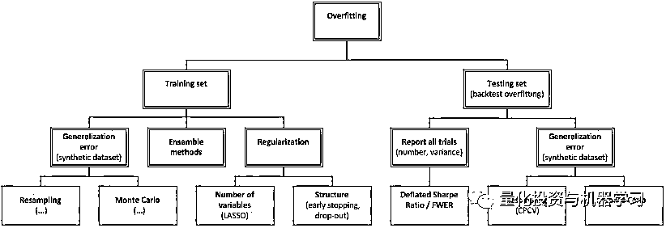
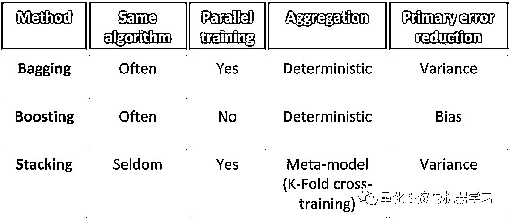

# 机器学习应用量化投资：『过拟合』终极解决方案！

> 原文：[`mp.weixin.qq.com/s?__biz=MzAxNTc0Mjg0Mg==&mid=2653297358&idx=1&sn=092b82b67e9c0791a34e200d941154c8&chksm=802dd8dbb75a51cd5024775f89a1799d654acff1cb54117678ec65c6a97d4e8d6d072726c69d&scene=27#wechat_redirect`](http://mp.weixin.qq.com/s?__biz=MzAxNTc0Mjg0Mg==&mid=2653297358&idx=1&sn=092b82b67e9c0791a34e200d941154c8&chksm=802dd8dbb75a51cd5024775f89a1799d654acff1cb54117678ec65c6a97d4e8d6d072726c69d&scene=27#wechat_redirect)

**标星★****置顶****公众号     **爱你们♥   

作者：Marcos López de Prado      编辑：1+1=6

## 1、前言

近年来，基金经理已开始用基于计算机的统计方法（例如 ML）代替或补充经典的统计方法（例如计量经济学）。知名的 ML 公司包括 RenTec，Two Sigma，DE Shaw，TGS，Capital Fund Management 等。

经典方法容易过拟合是由于其：依赖训练集的误差估计、假设仅进行了一次试验。在错误使用时，机器学习过拟合的风险比经典方法更高。今天为大家带来 Marcos 教授的一篇研究。

## 2、什么是过拟合

### ▍误差分解

考虑一个预测结果的函数，使得误差不可预测，其中和最小。

一个统计模型提出一个近似于的函数均方误差（MSE），是以下各项的总和：

*   偏差平方：
*   方差：
*   噪声：

估计量中偏差和方差的组合

### ▍偏差-方差权衡

当拟合数据不足时发生偏差

*   该模型混淆了噪声信号

当过拟合时发生方差

*   该模型混淆了信号噪声

通常，只能以增加方差为代价来减少偏差。

过拟合会导致模型方差，因为一个集合上的模型过拟合不能很好地泛化到该集合之外。

一个好的统计模型通过寻找偏差和方差之间的最佳平衡来最小化均方误差（MSE）

### ▍两种误差

1、我们可以将数据集分为两个子集：

*   **训练集：** **用于选择特征和拟合模型参数**

*   **这可能包括一个用于找到最佳超参数的验证集**

*   ****测试集：** **Hold out 数据，不用于拟合模型****

****2、我们可以估计两个样本内误差：****

*   ******训练集误差：** **训练集上估计的错误（用于拟合模型的数据相同）******
*   ********测试集误差：** **测试集上估计的错误********

********当我们试图最小化这些误差中的一个或两个时，就会发生过拟合。********

****

过拟合会发生在训练集和/测试集上
过拟合的量可以通过泛化误差来估计：模型在数据上的误差不用于选择模型**** 

## ****两种过拟合****

### ****▍训练集过拟合****

****1、训练集会过拟合，当：****

*   ****选择一个模型以最小化训练集误差****
*   ****以测试集误差的更高方差为代价****

****2、训练集过拟合与模型复杂度有关：****

*   ****这种过复杂度试图拟合信号，但最终拟合噪声****

****3、训练集过拟合通过估计测试集上的泛化误差能够容易地诊断，通过：****

*   ****重新采样方法（例如交叉验证）****
*   ****蒙特卡罗****
*   ****解决方法：简化模型、获取更多数据****

****

来源：Wikimedia Commons
过拟合的一个典型示例：（复杂）多项式函数提供了完美的拟合，因为它解释了所有噪声，但是与（简单的）直线相比，泛化的效果更差**** 

### ****▍测试集（或回测）过拟合****

****1、测试集过拟合发生在：****

*   ****选择一个模型以最小化测试集误差****
*   ****以更高的样本外方差为代价****

******2、测试集过拟合与多重测试（SBuMT）下的选择偏差有关。******

******3、测试集过拟合可以通过以下方式诊断：******

*   ******估计未发现数据（样本外）的泛化误差******
*   ******控制模型选择中涉及的独立试验的数量和方差******

******4、解决方法：******

*   ******从一个新的（未发现的）数据集开始******
*   ******调整假阳性的概率******

************

******测试集上的策略过拟合将无法对未发现的数据上（样本外）执行。注意：**这种过拟合与模型复杂性完全无关。********

## ****经典统计方法****

### ****▍什么是经典统计方法？****

****1、经典的统计方法遵循 Ronald Fisher 发起的研究项目：****

*   ****研究人员的统计方法（1925）****
*   ****实验设计（1935）****

****

https://statistics.stanford.edu/research/ra-fisher-21st-century**** 

****2、该项目建立在：****

*   ****相关性、矩量法****
*   ****拟合优度、极大似然估计****
*   ****统计显著性、假设检验、p 值、方差分析****
*   ****渐近性质所需的强假设****

****3、该项目：****

*   ****是在计算机时代之前发展起来的****
*   ****被计量经济学学会采用（建于 1930 年）****
*   ****是最受欢迎的计量经济学教科书的主干****
*   ****已成为金融期刊接受/要求的标准****

****

来源：The Web of Science**** 

****经济学中只有不到 1％的期刊文章提及与 ML 相关的术语，例如分类器、聚类、神经网络、机器学习。****

### ****▍训练集过拟合****

****1、经典统计模型试图通过正则化处理训练集过拟合问题：****

*   ****降低复杂性（例如自由度）****
*   ****降低复杂性（例如逐步回归）****

****2、然而，经典模型：****

*   ****不在训练、验证和测试集之间拆分数据****
*   ****不估计泛化误差****

****3、**训练集既是验证集，又是测试集**。因此，经典正则化无法防止训练和测试集过拟合。****

****

来源：Wikimedia Commons**** 

****计量经济学软件和论文中经常使用逐步回归，以降低模型的复杂性，从而限制训练集的过拟合。不幸的是，这几乎可以肯定，计量经济学模型将遭受测试集过拟合的困扰。****

### ****▍测试集过拟合****

****1、经典的统计模型被设计成****

*   ****在计算机发明之前（例如 Pearson-Neyman Lemma [1933]）****
*   ****仅运行一次****

****2、**经典统计学很少控制 SBuMT******

******3、测试集过拟合的一个普遍示例是 p-hacking：******

*   ******研究人员对同一数据进行多项统计检验******
*   ******每次检验的假阳性率为 5％******
*   ******组合假阳性率迅速收敛至 100％

    ******

******假阳性概率在第一次试验后迅速上升。金融杂志上的文章几乎总是把研究结果当作是单一试验的结果。因为这种情况很少发生，所以大多数金融领域的发现都是错误的。******

## ******基于计算机的统计方法（ML）******

### ******▍什么是 ML（机器学习）？******

******1、ML 算法可以学习高维空间中的复杂模式：******

*   ******ML 算法可能会找到一种无法用一组有限方程组简单表示的模式******
*   ******解决方法通常涉及大量变量以及它们之间的相互作用******
*   ******与其他经验工具不同，研究人员不会在数据上强加特定的结构******

******2、ML 算法依赖于计算密集型方法，例如：******

*   ******泛化误差的估计******
*   ******集成法、启发法（heuristics）******
*   ******用最少的假设进行实验假设检验******

************

******假设你有一个 1000x1000 的相关矩阵...一个聚类算法发现有 3 个块：高度相关、低相关、不相关。******

### ******▍机器学习对过拟合的解决方法******

******1、每种过拟合类型都有几种 ML 解决方法。******

******2、训练集过拟合的解决方法是：******

*   ******集成方法******
*   ******正则化方法******
*   ******泛化误差（测试集）******

******3、测试集过拟合的解决方法是：******

*   ******所有试验的报告******
*   ******泛化误差（样本外）******
*   ******所有这些方法都比开发经典方法时需要更多的算力******

******专门设计用来防止两种类型的过拟合的各种 ML 方法的概述。 无需选择一种方法，并且所有方法都可以同时应用：******

************ ******### ▍训练集：集成方法

1、集成方法结合了一组低相关的弱学习者，以创建一个性能优于单个学习者的学习者。

2、集成方法的三种主要类型是：

*   Bagging
*   Boosting
*   Stacking

3、此外，还有混合方法：

*   例如，随机森林将随机子空间打包结合在一起（每个分割处的特征随机采样，无需替换）

WX20200229-134434@2x

大多数 ML 算法都可以用于集成算法。例如，通过适当的并行化，SVC 算法可以被“打包”以减少训练集的过拟合，同时减少额外的计算时间。

如果弱分类器的精度最小，打包也可以减少偏差。

### ▍训练集：正则化方法

1、正则化通过向模型引入附加信息来防止过度拟合。

2、此附加信息采用复杂度惩罚的形式：

*   仅在解释能力得到一定程度的保证的情况下，适合数据的优化算法才会增加复杂性

3、三种主要的正则化类型：

*   Tikhonov：系数的  范数
*   LASSO：系数的  范数
*   Elastic Net：它结合了 Tikhonov 和 LASSO

WX20200229-134650@2x

由  范数定义的约束区域更有可能将某些权重设置为恰好为零。相反，由  范数定义的约束区域很少将任何权重设置为零。Elastic Nets 克服了 LASSO 的两个局限性：

(a) 当变量多于观测值时，它们不会饱和。
(b) 它们没有从多个多重共线性变量中选择一个，而将其余的丢弃。

### ▍训练集：泛化误差

1、估计测试集上泛化误差的主要方法有两种：**重采样**和**蒙特卡罗**。

2、**重采样**通过从观察到的数据集中采样来生成合成数据集

*   确定性采样（例如：K 倍变异系数）
*   随机采样（例如：自举法）

3、**蒙特卡罗**通过在数据生成过程中运行蒙特卡罗来生成综合数据集：

*   参数（例如：状态切换马尔可夫链）
*   非参数（例如：GAN）

通过估计泛化误差来控制训练集过拟合的 ML 方法的摘要

### ▍测试集：控制所有试验

1、SBuMT 夸大模型的性能统计信息：

*   与样本内数据相比，该模型的样本外性能更差

2、控制性能膨胀的两种主要方法：

*   **参数**：得出调整后的 p 值

*   多重比较谬误（Familywise error rate，FWER）
*   伪发现率（False discovery rate，FDR）

*   **非参数：** **缩小模型的性能，同时控制试验的数量和方差**

*   **例如：收缩夏普率（Deflated Sharpe Ratio）**

****

**SBuMT 的非参数方法依赖较少的假设，并且往往更可靠**

### **▍测试集：泛化误差**

**1、一旦研究人员选择了最终模型，我们就可以进一步估计其在未发现的数据上的泛化误差。**

**2、为了做到这一点，我们可以使用针对训练集泛化误差描述的相同技术来生成新的合成数据集。**

**2、例如：**

*   **组合交叉验证可用于：**

*   **生成不同于研究人员使用的新测试集**
*   **引导测试集误差的整个分布（不仅是平均值），比其均值更难拟合**

*   **蒙特卡罗方法可生成任意大的新（未发现的）数据集。**

**

https://myriad.etsfactory.com/beating-rivals** 

**Myriad 是非参数蒙特卡罗工具的一个示例，该工具生成与观测数据的统计属性匹配的合成数据集。**

## **结论**

**1、当使用不当时，ML（机器学习）过拟合的风险非常高：**

*   **鉴于 ML 的强大功能，该风险要高于经典统计方法**

**2、但是，ML（机器学习）依靠复杂的方法来防止：**

*   **训练集过拟合**
*   **测试集过拟合**

**3、因此，普遍认为 ML 过拟合是错误的。**

**4、更准确的说法是：**

*   ****在错误的方面，ML（机器学习）过拟合****
*   ******在正确的方面，ML（机器学习）比传统方法更能抵抗过度拟合******

********5、当涉及到非结构化数据的建模时，ML（机器学习）是唯一的选择：********

*   ******典统计学应该作为 ML（机器学习）课程的准备课程来教授，重点是防止过拟合！************ 

******心系武汉******

********等疫情结束，花枝春满。********

********山河无恙，人间皆安。********

******2020 年第 50 篇文章******

******量化投资与机器学习微信公众号，是业内垂直于**Quant、MFE、Fintech、AI、ML**等领域的**量化类主流自媒体。**公众号拥有来自**公募、私募、券商、期货、银行、保险资管、海外**等众多圈内**18W+**关注者。每日发布行业前沿研究成果和最新量化资讯。******

******************你点的每个“在看”，都是对我们最大的鼓励******