# 二千零二十、最新 MFE 薪资榜单出炉！第一名等于我一年工资

> 原文：[`mp.weixin.qq.com/s?__biz=MzAxNTc0Mjg0Mg==&mid=2653297350&idx=1&sn=020dee1b627601642ad364de3126ff44&chksm=802dd8d3b75a51c5679928dd286cc897e1200b9293c184c5be7a11e9a429cd92019207fce451&scene=27#wechat_redirect`](http://mp.weixin.qq.com/s?__biz=MzAxNTc0Mjg0Mg==&mid=2653297350&idx=1&sn=020dee1b627601642ad364de3126ff44&chksm=802dd8d3b75a51c5679928dd286cc897e1200b9293c184c5be7a11e9a429cd92019207fce451&scene=27#wechat_redirect)

**标星★****置顶****公众号     **爱你们♥   

作者：UniCareer、公众号编辑部 编辑：1+1=6 最近 RiskNet 发布了**2020 全球 MFE 综合排名**除了就业率、录取率还有上榜学校的薪资水平**没想到第一名能挣这么多钱？**

*******1*******

******2020 最新 MFE 薪资排名出炉******

****最近 RiskNet 发布了 2020 全球金融工程硕士项目排名。相比其他榜单，此次 RiskNet 还统计了各个学校的**录取率、就业率和薪资**。可以说，非常明白学生们的需求了。具体榜单如下：********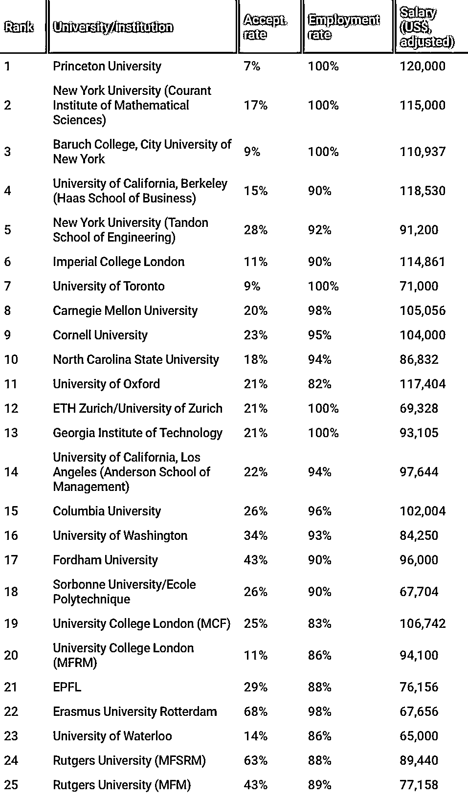****

*****图片来源：网络****

****据了解 RiskNet 这份榜单则根据毕业后 6 个月的薪资和平均就业率进行了一定调整。可以说对大学生来讲，更具有参考性。****

****美国开设金融工程专业的学校大部分只有一轮截止日期，截止日期早的一般在 12 月或者 1 月份，商学院下面开设的金融工程一般有 3-4 轮截止日期：最早一批大约在 10 月份。**建议大家最好在****10 月份****之前拿到理想的标化成绩后递交申请。******

********▍**TOP1：**普林斯顿大学********

********

*****图片来自：网络****

****无论在哪个榜单里，Princeton 都是老大哦。虽然人家的录取率最低，但是人家的**毕业率却高达 100%，MFE 毕业生平均薪资更是高达 12 万美元。******

****普林斯顿的项目名为 Master in Finance，实际上也是 Financial Engineering，其开设在 Bendheim Center for Finance 学院之下，该专业提供一年制和两年制两种毕业方式，大部分学生都是两年毕业，两年制的学生必须在第一年的暑假完成一次实习内容。**** 

****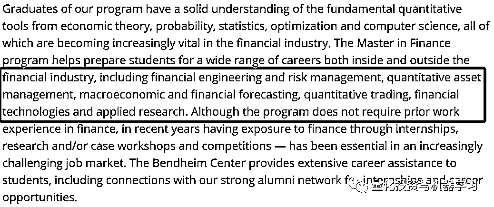****

****Bendheim Center for Finance 官网****

****普林斯顿大学课程项目主管 ren Carmona 强调，**该课程规模小、重点突出、师生之间的一对一互动，我们对学生给予个别关注**，这在许多其它课程中是找不到的。这是其成功的核心驱动力。它的招生人数比大多数同行都要少，只有 25 人，它的**录取率只有****5%****！******

****该课程的结果是，毕业生的平均**就业率达到 100%** ，六个月后的平均收入为**16 万美元**，这两个数字在同行中都是最高的。****

****Carmona 认为，与历史上更倾向于理论化的欧洲硕士课程相比，**美国商学院更注重职业教育，这可能会让它们在满足雇主需求方面占据优势。**他表示，欧洲仍在培养 Q Quant 为主。****

****那么什么是**Q Quant**呢：****

******Q 代表在风险中性测得 (risk-neutral measure) 下的 Quant，他们重模型轻数据，主要研究金融工程、衍生品定价、估值调整 (CVA) 等一切以模型为大的领域。****** 

****Q Quant 非常理论化和数学化，但该行业现在需要的是更多的 P Quant。 那么什么是**P Quant**呢：****

******P 代表在真实测度 (physical measure) 下的 quant，他们重数据轻模型，主要研究量化投资、机器学习等一切以数据为大的领域。******

****总结来说：****

******P Quant：****寻找 Alpha，其任务是“模拟未来“。******

******Q Quant：****主要做衍生品定价，其任务是“推断当前”。******

****所以排名第一不是吹的！****

**********▍****TOP2：****纽约大学******

********

****和其他榜单不同，此次榜单中占据排行榜第二名的是纽大，就业率同样为 100%，毕业生平均薪资比第一名要要低一点，为 11500 美元。**** 

************▍******TOP3：巴鲁克学院******

********

*****图片来自：网络****

****巴鲁克学院（Bernard M.Baruch College，CUNY）是一所以商科著名的位于美国纽约市曼哈顿的公立大学。其金融工程硕士项目，被誉为美国顶尖金工项目之一，在 2020 年 QuantNet 金融工程排名中位列第二。巴鲁克学院 MFE 注重培养学生定量金融方面的技能，且该校就业资源强大，每年进入摩根士丹利、摩根大通、花旗等企业的毕业生很多。****

****巴鲁克学院（Baruch College）的金融工程项目开设在魏斯曼人文与科学学院，每年仅秋季招生。**课程非常 Technical，且偏向实际应用**。而且必修课就会学 C++、Python,、VBA、SQL、R 等各类语言，还有非常细致**全面的面试辅导**，包括 Language expression，behavioral and technical questions 等。****

****Baruch 的**Networking 之强大**，校友遍布学校旁边的华尔街，想去哪学长学姐内推你，很多老师都是各大公司 Quant 组的主管。****

****Baruch 的 MFE 项目 1 年半，学生不止可以 Part-time 实习，还可以带薪实习。此外，不同于其他学校如 CMU，巴鲁克还允许学生延毕，给国际学生拖延找工作的时间。为了让 MFE 的学生就业真是操碎了心。论学校的 Career service，除了普林斯顿就是 CMU 和 Baruch 了。****

****给大家看一组数据**最新 CUNY 2019 年秋季入学统计数据：******

********506 名申请人，44 名录取，****8%****的录取率！********

*   ******录取申请人：******

*   ******平均 GPA：3.75******

*   ******平均 GRE：169.5******

*   ******口语：158******

*   ******就业公司：巴克莱，法国巴黎银行，Citadel，EY，高盛，JP 摩根，摩根士丹利，Point72，普华永道，Tower 等，都是顶尖投行和对冲基金公司！想不去都难******

*********2*********

********MFE 学生的就业出路有哪些********

******除了薪资高、就业率高，对于学生来讲，**MFE 最大的好处就是就业方向广泛**，无论是投行/咨询，还是买方爸爸 hedge fund，又或是 fintech 公司，MFE 的毕业生都被需要。******************

*******图片来源：网络******

******MFE 的课程其实就是为了就业设计的，毕业生遍及**投行资管，对冲基金，金融科技公司、评级和咨询公****司，从量化到数据科学家再到投资组合经理，风险管理，咨询，量化开发人员等等**。 从下面这份 Baruch 官方公布的 MFE 毕业生就业取向可以看出一些端倪。******

*******************图片来源：网络**************1、Investment Bank 投行**************投行是 MFE 毕业生最想谋职的地方，在投行领域如 Citi、J.P.Morgan、Goldman Sachs，利用自己对金融衍生品以及风险管理的知识，在市场上进行投资或投机性套利。而在投行，对于精通数学+IT 的 MFE 学生会更适合在 Back Office 做 Quant，Quant 的工作就是采用编程来设计并实现金融的数学模型。 **************2、Hedge Fund 对冲基金**************对冲基金是基于最新的投资理论和极其复杂的金融市场操作技巧，充分利用各种金融衍生产品的杠杆效用，承担高风险、追求高收益的投资模式。而 MFE 的毕业生选择去 hedge fund，如 AQR、Millennium Management、Verition Fund Management 等等，一般会有 2 种岗位：******

*   ******quant researcher：日常工作是构建 alpha 策略，为投资经理的投资决策提供参考。******

*   ******trading/execution：按照投资经理的指令下单，量化技能主要是用来构建算法，使交易成本尽可能最小。******

********3、Fintech Firm 金融科技公司**************如今大数据时代，金融行业也越来越重视 techology，而 fintech 正是通过 techology 去为 finance 服务，比如风控、交易、大数据建模。而 MFE 学生选择求职 Bloomberg, Wind，Moody 等金融科技公司，也是一个好去处，正好可以使用技术创新解决金融服务公司所遇到的问题。**************4、Consulting 咨询**************同样，咨询公司也是 MFE 学生的聚集地，通常是帮助客人并且提供专业服务。而咨询公司主要有 3 类：******

*   ********战略咨询（Strategy）**：这类公司专注于企业的战略发展（开拓新市场、开发新产品、并购、IPO 等），如三大咨询公司 MBB；******

*   ********运营咨询（Operation）**：这类公司专注于内部营运（绩效提升、流程优化等）并提供意见。如 Deloitte；******

*   ********IT 系统咨询（IT System）**：这类咨询公司专注于客户的 IT 方面的需求，最常见的是 ERP、SAP，Oracle 等企业管理软件的规划与实施。代表的公司为 Accenture、IBM。******

******当然，再优秀的师资、再好的就业率、再高的薪资，不努力一切都是妄想。MFE 的确是一个好的跳板，但也要等你蓄积能力，发挥出最好水平！************而从 MFE 毕业的同学，不仅去了高盛、JPM、Bloomberg 等大牛美国公司；我们在 NYU 的官网上还看见，2016-2019 毕业的中国留学生回国后拿到了**阿里、华为、中金、中国银行、工商银行、建设银行、中国资产管理公司、太平洋保险**等国内名企的 Offer。************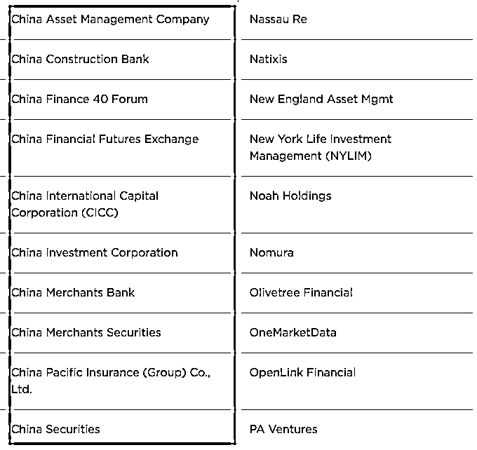*************图片来源：NYU Career Resources and Employment Stats（部分）******

*********3*********

********MFE 最常见的就业岗位：Quant********

******MFE 主要是用计算机来实现数学模型，从而解决金融相关的问题。所以，MFE 不同于 MBA 和 MSP，它主要是培养金融界的技术工作者，也称作金融工程师：**Quant**。******

******Quant 的职位主要集中在投资银行、对冲基金、商业银行和金融机构。负责的主要工作根据职位也有很大区别，比较有代表性的包括**Pricing、Model Validation、Research、Develop and Risk Management**，分别负责衍生品定价模型的建立和应用、模型验证、模型研究、程序开发和风险管理。******

******好了，我们再看看**国内外 Quant 的发展情况！********

******我们以**『量化研究员』**为关键词进行分析（薪酬只是税前基本工资、不包含每家机构分红、年终奖和有的没的）：******

************

********平均工资：¥ 19270/月********

******取自近 1 年 215 份样本，该数据仅供参考******

*******图片来自：职友集******

************

********平均工资：¥ 15270/月********

******取自近 1 年 406 份样本，该数据仅供参考******

******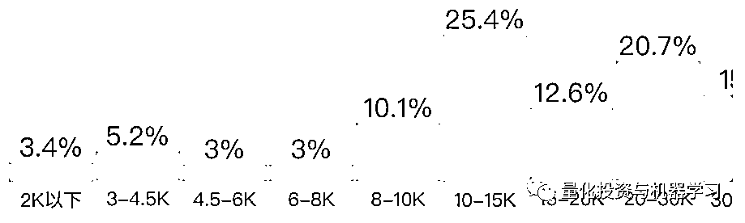******

*******图片来自：职友集******

************

********平均工资：¥ 19140/月********

******取自近 1 年 227 份样本，该数据仅供参考******

************

*******图片来自：职友集******

******为了更权威，也顺带做个比较，我们看看海外对待量化研究员岗位的薪酬是如何的？****** 

******这里必须要把 PayScale 搬出来。PayScale 最大的不同之处在于其所有的报告都是基于调查的原始数据，而不是由对地域，经济条件等因素进行“估算”所得出的。PayScale 绝不会对不同来源的数据进行混合使用，报告中出现的任何数据都是 PayScale 的工作人员认真收集，过滤，分析得到的。每一份提交到 PayScale 的档案都要经过一道道严格的过滤系统，这套过滤系统包含了 32 重检验条款，在最大限度上保证了档案信息的真实性和可靠性。在检验过程中，所有重复出现的档案都会被过滤掉，那些比较反常的档案也会被单独提取出来，由 PayScale 专家进行验证分析。最终，所有检验合格的档案会被添加到 PayScale 的数据库当中。PayScale 薪酬调查报告反映了工作地点，教育背景，职称水平，企业性质以及其他因素对个人薪酬的综合影响程度。******

********Quantitative Researcher**平均一年：**$110987********

*******图片来自：PayScale******

********工作年限与薪资********

******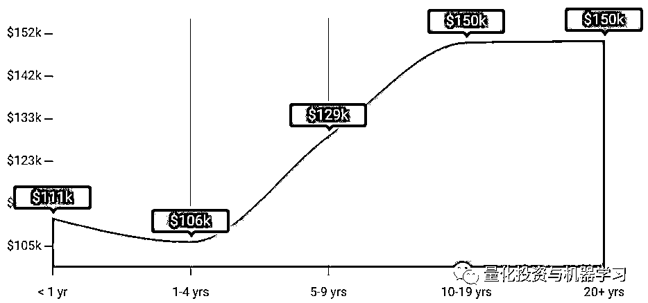******

*******图片来自：PayScale******

********Hedge Fund Manager**平均一年：**$103042********

******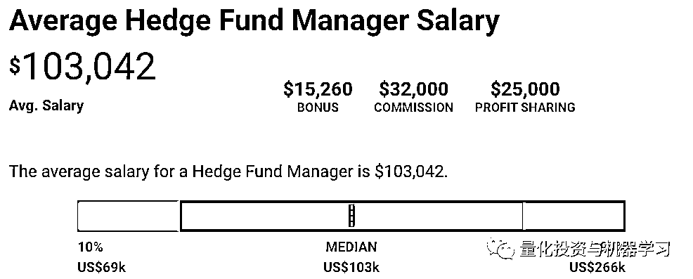******

*******图片来自：PayScale******

************

*******图片来自：PayScale******

******看看其他平台的：******

************

*******图片来自：indeed******

******针对到具体机构：******

********▍文艺复兴********

************

*******图片来自：量化投资与机器学习独家制作******

******数据表明，文艺复兴是很多对冲基金中薪酬最高的机构之一。然而，值得注意的是，**工资并不是大多数人为西蒙斯工作的原因。******真正的吸引力是他们向 Medallion 基金投资的机会**，该基金只对员工开放，自 1988 年成立以来，**每年的回报率约为****40%****。**********

************▍**桥水**********

****************

*********图片来自：量化投资与机器学习独家制作********

********这份表格上，高薪职位显然是 mission manager，年薪 18.5 万美元。目前还不清楚这指的是什么，但人们猜测这与戴利奥的原则有关，相对较高的薪酬反映出这一更广泛的使命对基金会有多么重要。********

**********▍Citadel**********

****************

*********图片来自：量化投资与机器学习独家制作********

********H1B 签证数据显示，Citadel 向其**交易主管**支付了**50 万美元**的薪酬。今年 6 月，一名**大宗商品主管**的薪资为**50 万美元**，而一名**量化交易主管**的薪资为**37.5 万美元**。******** 

**********资历较浅的量化研究人员的薪酬从 14.5 万美元到 22 万美元不等**。**电子交易分析师和助理的薪酬为 10.5 万美元或 15 万美元**。********

********值得注意的是，**H1B 数字不包括奖金**，如果你是一明投资交易人员并能产生 Alpha 收益，那么，上面的数字是相当可观的。在许多情况下，基本工资只占总薪酬的一小部分。********

**********▍千禧年**********

********千禧年对冲基金在全球范围内被分为 200 个独立运营团队，每个团队的**收益与其自身业绩成正比**。 而千禧年的薪酬结构更加细化：**如果你的团队的策略做得好，你就会得到奖励，即使该基金其他团队都出现了亏损。********** 

********这对你的工资和奖金意味着什么？千禧年没有在全球公布薪酬，但该基金的两家英国实体：Millennium Capital Management ltd.（英国控股公司，包括所有行政和投资人员）和 Millennium Capital Partners LLP（主要由投资人员组成）刚刚公布了截至 2018 年 12 月 31 日的年度薪酬信息。********

********Millennium Capital Partners 的薪酬最高。2018 年，12 名合伙人的平均利润分配为 130 万英镑（高于前一年的 110 万英镑），**收入最高的合伙人获得 650 万英镑**（低于前一年的 700 万英镑）。********

********除了 12 名合伙人，Millennium Capital Partners 在 2018 年聘用了**127 名专业投资人员**，向他们支付了总计 6900 万英镑的薪资，**平均每人 54.3 万英镑**。********

********如果加上行政人员，平均薪酬就会下降。Millennium Capital Management 在英国的 279 名员工（142 名专业人士和 137 名管理人员）2018 年的平均薪资为 9200 万英镑，**平均每人 33****万英镑**。********

********去年，千禧年旗下两家英国公司的营业额都增长了 19%左右，达到 2.26 亿英镑。然而，每个注册实体的成本几乎成比例增加，结果是利润基本停滞不前。********

**********▍其他**********

********下面列出的一些对冲基金是大型雇主。例如，Winton Capital Management 有 375 名员工。BlueBay 有 317 名。Aspect Capital 拥有 142 家公司等等。********

********除非你是合伙人，否则对冲基金对雇主的吸引力可能会比以前小。在伦敦的高盛（Goldman Sachs）， 2018 年的平均薪资为 31.4 万英镑，高于下表中的大多数对冲基金。一旦你加入了对冲基金，就很难再离开了。********

********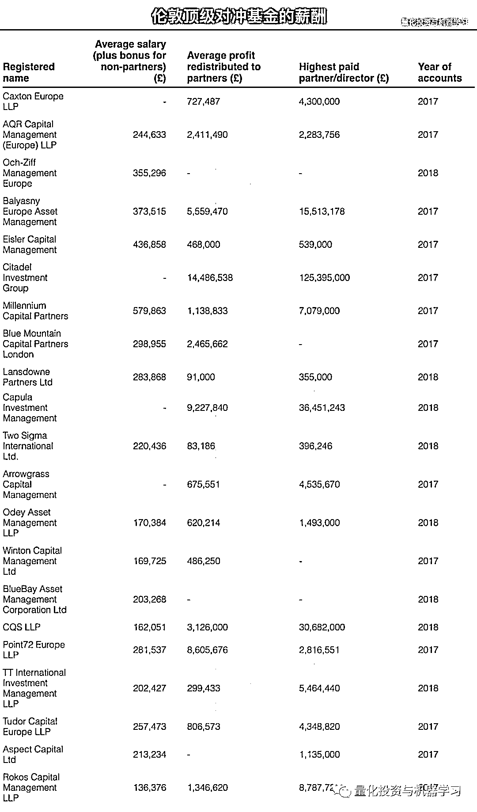********

*********图片来自：量化投资与机器学习独家制作********

**********硕士是门槛**********

********从公众号这几年对行业的观察来看，大专学历首先 pass，如果非要给个标准，那么**硕士是一个进门槛**。公众号在这里**不讨论学历是否决定能力**，大多数机构就是这么要求的，只有进了门，再说其他的。********

********在公众号的招聘专栏里，无论券商、私募、公募岗位要求一栏明确写着：********

********顺便打个小广告：量化投资与机器学习目前开设了**量化岗位直推**专栏。我们已**与近百家国内外知名公募、私募、券商、期货、金融科技公司等**机构建立了十分密切的合作关系，**免****费**为其发布招聘信息，为合作机构寻找量化人才。********

****************

**********券商金工**********

********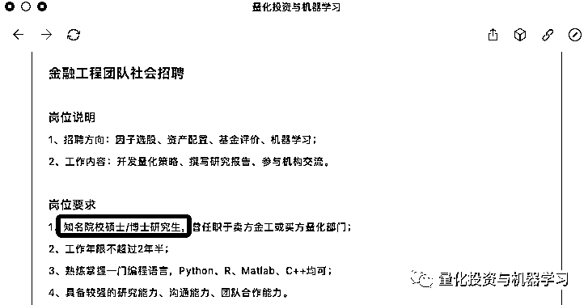********

*********图片来自：量化投资与机器学习招聘专栏********

**********量化私募**********

****************

*********图片来自：量化投资与机器学习招聘专栏********

**********公募基金********** 

****************

*********图片来自：量化投资与机器学习招聘专栏********

**********Quant 就业前景**********

********我们拿到了巴鲁克学院（Bernard M.Baruch College，CUNY）2018—2019MFE 就业分析报告：********

********下面这张表，左边是毕业生去往的公司，右边是对应的职位。像全球顶尖的量化对冲基金公司 AQR，各大顶尖金融机构 UBS、美林、巴克莱、德意志、JPMorgan、Morgan Stanley 等。********

********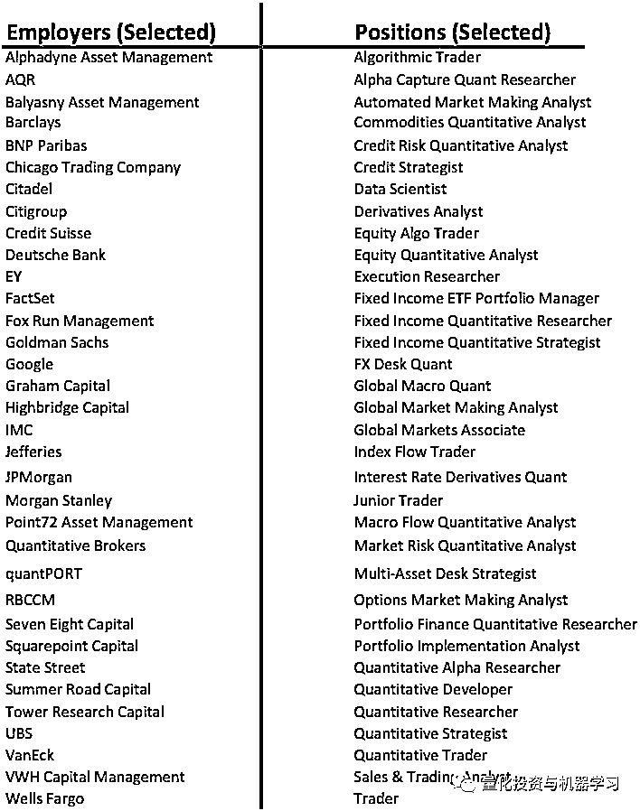********

*********图片来自：CUNY********

********再从这张图我们来看：********

****************

*********图片来自：CUNY********

********从事行业前三的是：**投资银行、对冲基金公司、资产管理公司**********

****************

*********图片来自：CUNY********

********工作职能前三的是：**Quant、交易、风险\数据科学**********

********还有毕业来上海的小伙伴。看来上海在国内金融地位杠杠的！********

********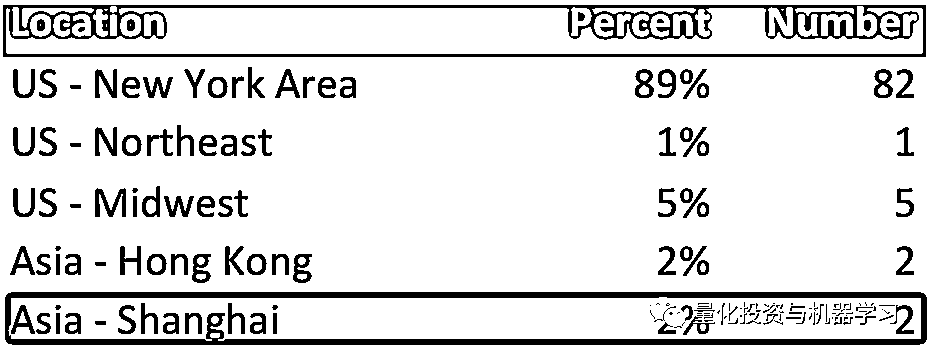********

*********图片来自：CUNY********

********看看人家第一年拿的工资：********

********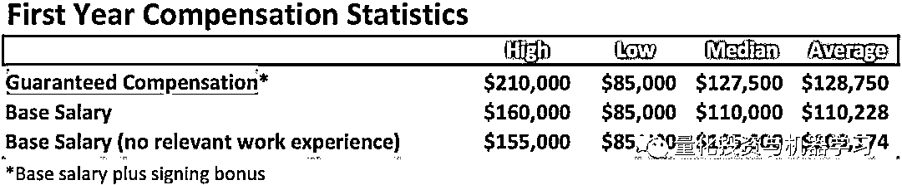********

*********图片来自：CUNY********

**********国内主要量化岗位**********

********除了薪资可观，Quant 的求职面也非常广，根据前面 CUNY 的报告所诉，涵盖其投行、对冲基金、资管、咨询、金融科技五大金融精尖行业，囊括了定量研究师、风控师、数据科学家、咨询交易员等多种岗位。具体例如：******** 

******** **• ****商业银行**（例如：汇丰银行、招商银行）********

**********• 投资银行**（例如：高盛、UBS）********

**********• 对冲基金**（例如：Citadel、九坤）********

**********• 会计师事务所**（例如：PWC、EY）********

**********• 软件公司**（例如：Wind、DataYes）********

********主流分为：********

**********▍买方：****公募********** 

**********特点：**朝九晚五，人际关系处理好，当甲方爸爸的感觉真好！********

**********工作：**做好研究，大多以股票为主，少数投资债券或者货币市场。手握数亿资金，与上市公司董秘、高管运筹帷幄。********

**********要求：****本科忽略！****最基本是硕士，PhD 也是挤破头，985&211，有些只招清北复交**，很正常。名校海龟也很吃香。其他的要求我们在下文介绍。********

**********评价：**从业情况，盈利能力、抗风险能力、稳定性等。还有管理基金的业绩综合排名、业绩排名稳定性等。********

**********未来：**研究员、基金经理助理、基金经理、某部门 MD 等出了本事以外。越想往上就得耗啊！********

************▍**卖方：****券商金融工程团队\研究所**********

**********特点：**朝九晚不知道，**一年坐的飞机可环绕地球 N 圈，真的很辛苦。**********

**********工作：****写研报、写研报、写研报**（你能想到的各种模型各种方法），**各种路演**（可能一份报告已经倒背如流，买方会根据卖方的表现来派点给卖），**寻创新**（多因子已经写烂啦哈哈~），保持与机构的密切沟通。********

**********要求：****本科确实很难啊！**基本硕士起，有些甚至要求 985，211 都不要。同等水平可能海龟会优先考虑。其他的要求我们在下文介绍。********

**********评价：**研报热度啊！新财富啊！不知道以后还有不。等~********

**********未来：**成为首席或者高级研究员，跳槽去买方、私募等。********

************▍**风云之地：****私募**********

**********特点：**看的是结果，各种投资思路、投资标的都有涉及。********

**********要求：**有来自券商、基金或者自民间的投资高手。所以学历相对不是特别严格。********

**********评价：****研究要和收益挂钩**。站在研究的角度，总有人愿意为高屋建瓴的所谓前瞻性和理论买单，私募却行不通。你可以基于你优漂亮的净值曲线去包装，但反着来不行！这样你作为研究员就没有了价值，最终沦为发产品时宣传三折页上打酱油的角色，熊市或震荡市时裁员降薪的首选。********

**********未来：**继续留用 or 成为大佬 or 走人。********

************▍**金融科技公司**********

**********特点：**服务产品，写相关研究报告，搞培训等。********

**********要求：**很典型的例子，现在国内很多量化平台都会招聘有一帮人为平台社区写各种研报复现、论文复现、策略复现等等。再者就是针对某一量化产品做深度开发研究。还有一些专门做量化课程培训。********

**********评价：**研报热度（主要为平台流量）、产品的功能好坏、培训口碑等。********

**********未来：**卖方、买方、私募或者自己干都有可能。********

********还有一类分法是这样，国内的量化工程师一般分两个方向：********

**********▍量化策略工程师**********

********做金融相关的量化策略编写、模型定价、风险控制等，数学和统计要求比较高。********

**********▍量化 IT 工程师**********

********开发和测试量化交易系统软件，实现策略代码实盘运行，跟程序员几乎无异。工作岗位集中在券商和期货公司的金工组或者 IT 部，商业银行的金工组，公募和私募基金公司，量化交易平台互联网公司以及软件公司。********

********还有一类属于交易员：********

**********▍自营交易员**（用公司的资金做交易的人）。********

********▍机构，买方，**基金经理**（用别人的钱做交易，做出决定或设计系统，不一定负责执行交易）。********

********▍**机****构，卖方**（例如投资银行的期权交易者，使用银行资本但不是主要的风险承担者）。********

********▍自筹资金的**独立交易员**（交易自有资金的人）。********

********从 NYU 的官网上还看见，2016-2019 毕业的中国留学生回国后拿到了**阿里、华为、中金、中国银行、工商银行、建设银行、中国资产管理公司、太平洋保险**等国内名企。********

*************************图片来源：NYU Career Resources and Employment Stats（部分）******************跨专业入行 Quant**********

********最近几年，很多跨专业的朋友（计算机、生物、物理、通信等专业）也想在量化的领域展示一下自己的抱负。还是劝各位：**量化有风险，入坑需谨慎。**********

********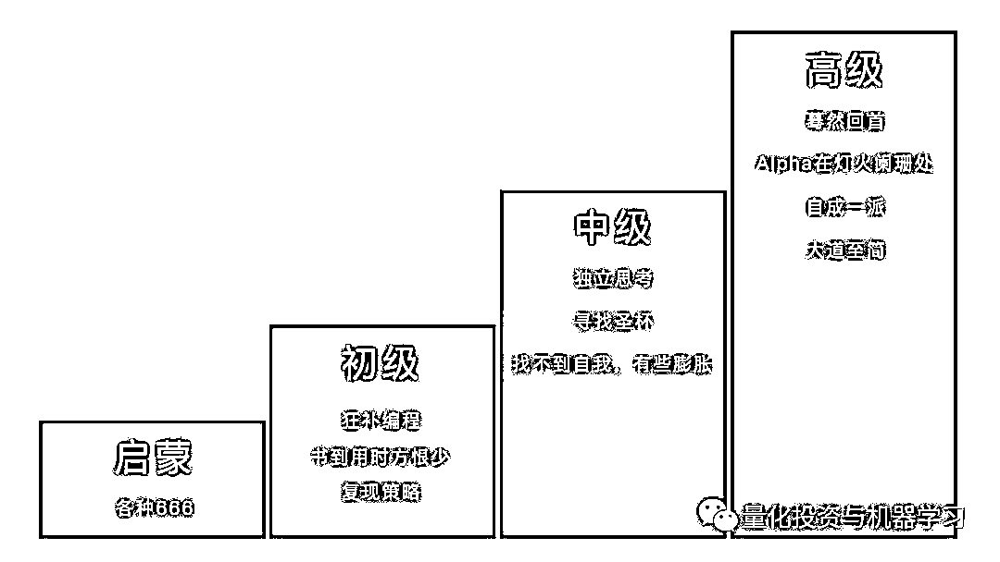********

*********图片来源：量化投资与机器学习公众号制作********

**********像计算机、物理等专业有自身的优势，但同时也有先天的不足！**********

********曾有一位华尔街量化大佬表示：“如果你没有计算金融、物理、工程或者统计等等偏 Quant 的硕士或者博士学位 ，几乎是不可能在顶级 Quant Trading 公司找到工作。”********

********一般来说，**物理背景比经管出身的数学、计算机能力强，在逻辑思维、数据分析上具有一定优势**。因为资产价格的变动和物理学家研究的物体运动是有相似之处的，所以善于建模,而且相对缺钱的物理学家就多多转战华尔街了。不少 buy side 的顶尖 Quant Team 至今只招理工 PhD。********

********其实很多 Quant 人，都是来自数学、物理等背景，所以他们看到这样的背景会觉得很亲切。面试官喜欢数学和物理背景的人，也是因为 Quantitative Skill 大多非常扎实。********

**********还有，想转行做 Quant，不能只靠 MFE！**********

********虽然来自 Top MFE 项目的毕业生基本可以保证一份投行的工作。当然，也仅限于凤毛麟角的几个大学（如卡内基梅隆、哥大、普林斯顿）。这些项目要**么声誉够好，要么学校资源、Career Service 够好，要么校友给力**。这些项目的毕业生无论在北美还是回国，发展都很好。******** 

********小编为大家提供一位资深 Quant 大牛的说法：********

**********我当年 2005~2006 年找工作的时候，那个时候没有特别多的 MFE 的那些 program，****现在大家去瞧瞧，美国哪个学校没有 MFE 啊，而且现在越来越多中国年轻人为了短平快的找工作，都自费去读那些专业****。****其实我们行内的都了解，读那些的基础不是特别好，开始可能就业比较容易，因为工作职位多，竞争也少，可是这些年积累下来，再加上那么多的 MFE 毕业生，华尔街上的工作形势又那么差，所以很多 MFE 找不到好工作也是正常。****不过比较 Solid 的 PhD 还是很容易在街上找到工作的。**********

********一位在顶级投行做了 5 年 Quant 的大牛说：********

**********“我曾经也是 MFE 的学生，但是学校的课程远远不够，在过去 5 年的工作中，我更加证明了我的观点，****那就是不遗余力的自学！****在这里我给大家介绍一些我的方法，如果你已经下定决定在投行做 Quant，请你尽早开始这样准备。****”**********

**********1\. Absorb (almost) all publicly available information**********

********你需要深入了解这三个方向:********

*   ********Finance/Trading********

*   ********Math (especially statistics) ********

*   ********Programmin********

**********没有你不需要的知识，只是有先后之分，广泛涉猎绝对没错。****除此之外，你需要拥有许多技能才能进入投行的视线。**********

**********在编程语言方面：**********

********今年最火的要属 Python 了，原因大家都知道。但是不能代表其他语言都不用了，**一些公募还在用 SAS，包括 R、MATLAB 等照用不误。**********

********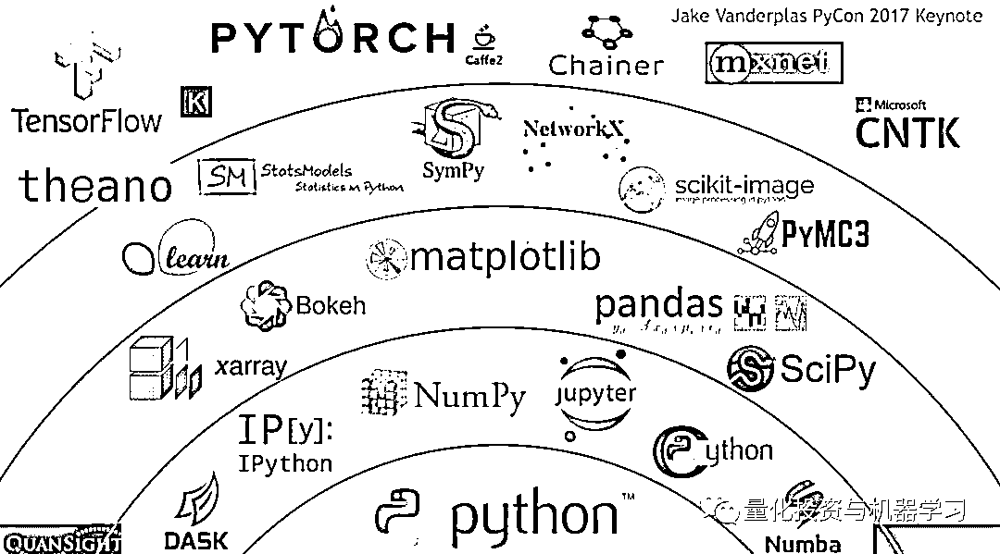********

*********图片来源：网络********

**********数据接口：**********

********除了编程，作为 Quant，最避不开的就是和各种主流数据库和 API 接口打交道；如果因为某些原因而无法使用完善的 API 接口，从数据库里调用数据也是很花功夫的。********

**********其它软技能：**********

********你必须有很强的好奇心和持续的兴趣，深入挖掘新想法和新技术，从而为不断出现的复杂问题寻求可能的解决方案。比如很火的 AI 与机器学习。********

********现在，很多量化机构将人工智能和机器学习与量化策略相结合。国内的一些顶尖私募，比如：九坤、幻方、朱雀等都在使用 AI 量化策略，从各大公司的招聘公告上也可以看出这点。********

****************

*********图片来源：网络********

********海外的大型对冲基金公司更是如此：********

*   **********Aidyia（香港**）：运用先进的人工智能技术，识别金融市场模式和预测价格走势。********

*   **********Binatix（美国）**：是最早使用机器学习算法来发现在投资中具有优势模式的公司之一。********

*   **********Kimerick Technologies（美国）**：机器学习和人工神经网络驱动预测交易的公司。********

*   **********Pit.ai（英国）**：一个机器学习驱动的对冲基金等等······********

********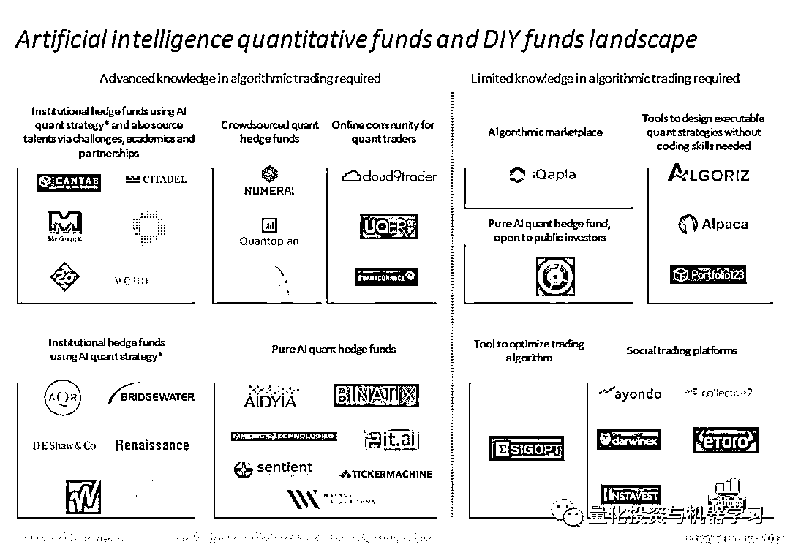********

*********图片来源：网络******** 

**********2\. Test and apply your knowledge**********

**********不停的尝试！**在应用和犯错中巩固你的知识。理解你要做的事情是什么，从而知道你做的每一步哪些有用，哪些没有用。********

**********3\. Meet and partner with others**********

********1+1=3。 **一定要找到自己的学习伙伴，或者找一位 mentor，在讨论和交流中发现自己思想上的局限**。一定不要羞于向别人展示你的成果，因为他人眼中的你，才是客观的。这有这样你才能不断进步。********

**********4\. Get a job at a trading firm**********

**********尽量多的去实践，**盲目的学知识也没有用，很多技能都是在工作中掌握的。********

********网络有一段话说的挺好，分享给各位读者：大家可能觉得搞量化的人就是整天和大量数据打交道，用一行行代码写出复杂的模型，然后没完没了地 Run，在回测和优化中挣扎，沉浸在数学和统计海洋里的一群人。实际上，这只是表面现象。虽然每个搞量化的人必须会写代码，也必须具备扎实的数学功底，在开发策略的过程中，的确需要分析大量数据，不断做回测和优化，但是，**这一切的背后是强大的金融思维和对金融市场的深刻理解****在支撑的**。换句话说，**如果你没有经济、金融的完整知识体系和工作经验，或者没有正确的、科学的思维方式，无论数学多么地好，也很可能在做无用功**；**即便编程多么在行，也只能沦为码农一枚（没有歧视程序员的意思哦）**。反过来说，如果你具备科学的思维和逻辑，并发现了经济、金融的某些规律，想做 Quant 就不难了。接下来，你只需花点时间学习编程工具，好好利用数据和代码为你实现自己的想法。********

********对于 Quant 这个词，人们或多或少存在一些误解或偏见。Quant 是 Quantitative 的简写形式，成为了一个名词，专指量化工作者。Quantitative 是形容词，后面跟 Strategist，意为“量化策略师”；跟 Researcher，是“量化研究员”的意思；跟 Trader，是“量化交易员”的意思；还可以跟 Finance，意为“数量金融学”。********

**********多数人把“Quant”理解成和交易相关的量化交易员和策略开发者，这属于狭义的定义。****其实，金融领域的量化的涵义是很宽泛的。从前中后台来看，量化可分为前台的量化交易、中台的量化研究和后台的量化风控。量化交易主要指算法交易，也就是交易员利用程序化交易平台，输入交易指令的相关算法，形成交易策略。量化研究除了量化策略的开发，还包括运用量化的方法研究经济、金融相关课题，比如宏观经济建模。就算只是量化策略研究，也分基本面量化和技术面量化。**********

**********从某种程度讲，不懂基本面的量化研究员是不合格的。**量化风控是指用量化的指标对风险进行识别、监测和控制的过程，如果能够搭建一套成体系的量化风控平台，对交易监控、交易分析、绩效归因等整体环节都能起到积极的作用。********

********Early Start 说：********

**********数学编程好=Top MFE 项目=华尔街、中环写字楼=房票人赢**********

********相信很多和我背景相似甚至更偏理工科的从业人员和我有着相似的经历：申请时对这一职业并未有着客观的了解。不过也确实没有资源：有几个身边有前辈在这个行业里做过呢？我们又不是犹太裔叫 Goldman。quant 发展于美国 08 年之前，12/13 年那时对行业的了解仅限于各种带有夸张色彩的文章及小说，不断洗脑重复着以下两点：********

**********1、Quant 是很牛的，只有数学最厉害的那批人才能做 。**********

**********2、Quant 是金融的未来。****只要模型做得好，就能跑赢市场，大佬就会求着给钱（当然大部分人连第一步都做不到）。**********

********这鸡汤熬得不论是有意还是无意，终究是误导了一些追随者。08 年前出书写文章还算有诚意，之后还炒冷饭就显得居心叵测，难免有刷智商费的嫌疑。这个世界搞金融就是搞金融。当然，MFE 目前还是外国人尤其是中国人进入这个世界的入场券，但它的本质永远都是金钱的过手、流通，无论是做市挣 spread 还是买方赌方向，都必须要触碰到钱、融入到商业行为中才行。如果把做最好的模型写最好的代码当作目标的话，终究不会进入核心层面。除非你能把模型当作商品卖给其他人。********

**********金融从业者做得优秀的话上限仍然很高。****这是一个英雄不问出处的行业，虽然不能像 10 年前那样让人一夜暴富，但仍旧比许多传统行业易出成绩**。这里又要说印度人，做了几年就出去开 fund，卖模型风生水起的不少，先不说他们能力如何，但是折腾的方向是值得参考和借鉴的。******** 

********读了 MFE 并非意味着就可以升职加薪，走上人生巅峰，也并非一定要做 Quant，只希望大家可以根据自己的喜好和自己的职业生涯规划，来理性对待自己的工作。********

********心系武汉********

**********等疫情结束，花枝春满。**********

**********山河无恙，人间皆安。**********

********2020 年第 49 篇文章********

********量化投资与机器学习微信公众号，是业内垂直于**Quant、MFE、Fintech、AI、ML**等领域的**量化类主流自媒体。**公众号拥有来自**公募、私募、券商、期货、银行、保险资管、海外**等众多圈内**18W+**关注者。每日发布行业前沿研究成果和最新量化资讯。********

************************你点的每个“在看”，都是对我们最大的鼓励********