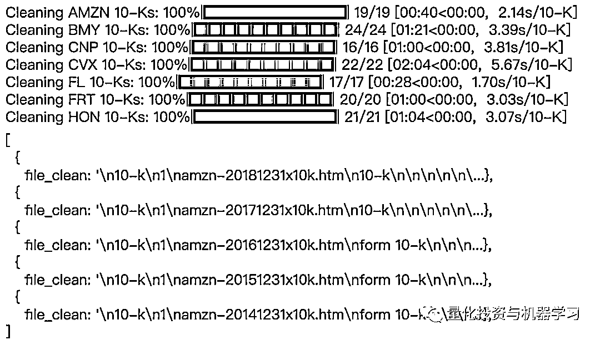

# NLP 量化交易：基于财务报表的情绪分析（附代码）

> 原文：[`mp.weixin.qq.com/s?__biz=MzAxNTc0Mjg0Mg==&mid=2653297344&idx=1&sn=242a3a8ce2d7f01913972751bc2f3e78&chksm=802dd8d5b75a51c3333abfca390280ac1ee0de36fa43a6d0351210437b3987446b223326efe2&scene=27#wechat_redirect`](http://mp.weixin.qq.com/s?__biz=MzAxNTc0Mjg0Mg==&mid=2653297344&idx=1&sn=242a3a8ce2d7f01913972751bc2f3e78&chksm=802dd8d5b75a51c3333abfca390280ac1ee0de36fa43a6d0351210437b3987446b223326efe2&scene=27#wechat_redirect)


**标星★****置顶****公众号**爱你们♥  

作者：Roshan        编辑：1+1=6

***0***

**前言**

在交易中的机器学习模型通常针对历史股价和其他定量数据进行训练，以预测未来股价。然而，自然语言处理（NLP）可以帮助我们分析财务报表，如 10-k 表，以预测股票走势。10-k 表是公司提交的年度报告，提供对其财务业绩的全面总结（这些报告是由证券交易委员会授权的）。对投资者来说，梳理这些报告常常是冗长乏味的。通过情绪分析（自然语言处理的一个子领域），投资者可以迅速了解报告的语气是积极的、消极等等。在 10-k 表中表达的整体情绪可以用来帮助投资者决定他们是否应该投资该公司。

***1***

**NLP 简介**

自然语言处理是人工智能的一个分支，它教会计算机阅读并从语言中获得意义。由于语言是如此复杂，计算机在理解文本之前必须经过一系列的步骤。下面是对典型 NLP pipeline 中步骤的快速解释。  


在完成这些步骤之后，我们的文本就可以进行分析了。现在我们开始研究吧！

关于 NLP 的知识，这里我们不过多讲述，大家可以上网进行学习！

***2***

**正文**

首先导入相关库文件：

```py
import nltk
import numpy as np
import pandas as pd
import pickle
import pprint
import project_helper

from tqdm import tqdm
```

project helper 库包含各种图形函数：

```py
import matplotlib.pyplot as plt
import requests

from ratelimit import limits, sleep_and_retry

class SecAPI(object):
    SEC_CALL_LIMIT = {'calls': 10, 'seconds': 1}

    @staticmethod
    @sleep_and_retry
    # Dividing the call limit by half to avoid coming close to the limit
    @limits(calls=SEC_CALL_LIMIT['calls'] / 2, period=SEC_CALL_LIMIT['seconds'])
    def _call_sec(url):
        return requests.get(url)

    def get(self, url):
        return self._call_sec(url).text

def print_ten_k_data(ten_k_data, fields, field_length_limit=50):
    indentation = ' '

    print('[')
    for ten_k in ten_k_data:
        print_statement = '{}{{'.format(indentation)
        for field in fields:
            value = str(ten_k[field])

            # Show return lines in output
            if isinstance(value, str):
                value_str = '\'{}\''.format(value.replace('\n', '\\n'))
            else:
                value_str = str(value)

            # Cut off the string if it gets too long
            if len(value_str) > field_length_limit:
                value_str = value_str[:field_length_limit] + '...'

            print_statement += '\n{}{}: {}'.format(indentation * 2, field, value_str)

        print_statement += '},'
        print(print_statement)
    print(']')

def plot_similarities(similarities_list, dates, title, labels):
    assert len(similarities_list) == len(labels)

    plt.figure(1, figsize=(10, 7))
    for similarities, label in zip(similarities_list, labels):
        plt.title(title)
        plt.plot(dates, similarities, label=label)
        plt.legend()
        plt.xticks(rotation=90)

    plt.show()
```

然后下载了用于删除 stopwords 的 stopwords 语料库和用于 lemmatizing 的 wordnet 语料库。

```py
nltk.download('stopwords')
nltk.download('wordnet')
```

***3***

**10-k 介绍**

10-k 文件包括公司历史、组织结构、高管薪酬、股权、子公司和审计财务报表等信息。为了查找 10-k 文档，我们使用每个公司唯一的 CIK (中央索引键)。

```py
cik_lookup = {
    'AMZN': '0001018724',
    'BMY': '0000014272',
    'CNP': '0001130310',
    'CVX': '0000093410',
    'FL': '0000850209',
    'FRT': '0000034903',
    'HON': '0000773840'}
```

我们从美国证券交易委员会获取一个 10-k 文件列表，并以亚马逊为例进行研究展示。

```py
sec_api = project_helper.SecAPI()
from bs4 import BeautifulSoup
def get_sec_data(cik, doc_type, start=0, count=60):
    rss_url = 'https://www.sec.gov/cgi-bin/browse-edgar?action=getcompany' \
        '&CIK={}&type={}&start={}&count={}&owner=exclude&output=atom' \
        .format(cik, doc_type, start, count)
    sec_data = sec_api.get(rss_url)
    feed = BeautifulSoup(sec_data.encode('ascii'), 'xml').feed
    entries = [
        (
            entry.content.find('filing-href').getText(),
            entry.content.find('filing-type').getText(),
            entry.content.find('filing-date').getText())
        for entry in feed.find_all('entry', recursive=False)]
return entries
example_ticker = 'AMZN'
sec_data = {}
for ticker, cik in cik_lookup.items():
    sec_data[ticker] = get_sec_data(cik, '10-K')
pprint.pprint(sec_data[example_ticker][:5])
```


我们收到一个 url 列表，指向包含与每个填充相关的元数据的文件。元数据与我们无关，所以我们通过用填充 url 替换 url 来获取填充。让我们使用 tqdm 查看下载进度，并查看一个示例文档。

```py
raw_fillings_by_ticker = {}
for ticker, data in sec_data.items():
    raw_fillings_by_ticker[ticker] = {}
    for index_url, file_type, file_date in tqdm(data, desc='Downloading {} Fillings'.format(ticker), unit='filling'):
        if (file_type == '10-K'):
            file_url = index_url.replace('-index.htm', '.txt').replace('.txtl', '.txt')

            raw_fillings_by_ticker[ticker][file_date] = sec_api.get(file_url)
print('Example Document:\n\n{}...'.format(next(iter(raw_fillings_by_ticker[example_ticker].values()))[:1000]))
```


将下载的文件分解为相关的文档，这些文档在填充物中以<document>开头，</document>结尾。

```py
import re
def get_documents(text):
    extracted_docs = []

    doc_start_pattern = re.compile(r'<DOCUMENT>')
    doc_end_pattern = re.compile(r'</DOCUMENT>')

    doc_start_is = [x.end() for x in      doc_start_pattern.finditer(text)]
    doc_end_is = [x.start() for x in doc_end_pattern.finditer(text)]

    for doc_start_i, doc_end_i in zip(doc_start_is, doc_end_is):
            extracted_docs.append(text[doc_start_i:doc_end_i])

    return extracted_docs
filling_documents_by_ticker = {}
for ticker, raw_fillings in raw_fillings_by_ticker.items():
    filling_documents_by_ticker[ticker] = {}
    for file_date, filling in tqdm(raw_fillings.items(), desc='Getting Documents from {} Fillings'.format(ticker), unit='filling'):
        filling_documents_by_ticker[ticker][file_date] = get_documents(filling)
print('\n\n'.join([
    'Document {} Filed on {}:\n{}...'.format(doc_i, file_date, doc[:200])
    for file_date, docs in filling_documents_by_ticker[example_ticker].items()
    for doc_i, doc in enumerate(docs)][:3]))
```


定义 get document type 函数以返回给定的文档类型。

```py
def get_document_type(doc):
    type_pattern = re.compile(r'<TYPE>[^\n]+')    
    doc_type = type_pattern.findall(doc)[0][len('<TYPE>'):]     
    return doc_type.lower()
```

使用 get document type 函数从填充内容中过滤掉非 10-k 文档。

```py
ten_ks_by_ticker = {}
for ticker, filling_documents in filling_documents_by_ticker.items():
    ten_ks_by_ticker[ticker] = []
    for file_date, documents in filling_documents.items():
        for document in documents:
            if get_document_type(document) == '10-k':
                ten_ks_by_ticker[ticker].append({
                    'cik': cik_lookup[ticker],
                    'file': document,
                    'file_date': file_date})
project_helper.print_ten_k_data(ten_ks_by_ticker[example_ticker][:5], ['cik', 'file', 'file_date'])
```


***4***

**预处理数据**

删除 html 并将所有文本都小写以清除文档文本。

```py
def remove_html_tags(text):
    text = BeautifulSoup(text, 'html.parser').get_text()

    return text
def clean_text(text):
    text = text.lower()
    text = remove_html_tags(text)

    return text
```

使用 Clean text 函数清理文档。

```py
for ticker, ten_ks in ten_ks_by_ticker.items():
    for ten_k in tqdm(ten_ks, desc='Cleaning {} 10-Ks'.format(ticker), unit='10-K'):
        ten_k['file_clean'] = clean_text(ten_k['file'])
project_helper.print_ten_k_data(ten_ks_by_ticker[example_ticker][:5], ['file_clean'])
```



现在我们整理所有的数据：

```py
from nltk.stem import WordNetLemmatizer
from nltk.corpus import wordnet
def lemmatize_words(words):

    lemmatized_words = [WordNetLemmatizer().lemmatize(word, 'v') for word in words]

    return lemmatized_words
word_pattern = re.compile('\w+')
for ticker, ten_ks in ten_ks_by_ticker.items():
    for ten_k in tqdm(ten_ks, desc='Lemmatize {} 10-Ks'.format(ticker), unit='10-K'):
        ten_k['file_lemma'] = lemmatize_words(word_pattern.findall(ten_k['file_clean']))
project_helper.print_ten_k_data(ten_ks_by_ticker[example_ticker][:5], ['file_lemma'])
```


删除停顿词：

```py
from nltk.corpus import stopwords
lemma_english_stopwords = lemmatize_words(stopwords.words('english'))
for ticker, ten_ks in ten_ks_by_ticker.items():
    for ten_k in tqdm(ten_ks, desc='Remove Stop Words for {} 10-Ks'.format(ticker), unit='10-K'):
        ten_k['file_lemma'] = [word for word in ten_k['file_lemma'] if word not in lemma_english_stopwords]
print('Stop Words Removed')
```


***5***

**10-k 情绪分析**

使用 Loughran-McDonald 情绪词列表对 10-ks 进行情绪分析（这是专门为与财务相关的文本分析而构建的)。

```py
sentiments = ['negative', 'positive', 'uncertainty', 'litigious', 'constraining', 'interesting']

sentiment_df = pd.read_csv('loughran_mcdonald_master_dic_2018.csv')
sentiment_df.columns = [column.lower() for column in sentiment_df.columns] # Lowercase the columns for ease of use

# Remove unused information
sentiment_df = sentiment_df[sentiments + ['word']]
sentiment_df[sentiments] = sentiment_df[sentiments].astype(bool)
sentiment_df = sentiment_df[(sentiment_df[sentiments]).any(1)]

# Apply the same preprocessing to these words as the 10-k words
sentiment_df['word'] = lemmatize_words(sentiment_df['word'].str.lower())
sentiment_df = sentiment_df.drop_duplicates('word')

sentiment_df.head()
```


使用情绪词列表从 10-k 文档中生成情绪词包。这个词包计算每个文档中感情词的数量。

```py
from collections import defaultdict, Counter
from sklearn.feature_extraction.text import CountVectorizer
def get_bag_of_words(sentiment_words, docs):

    vec = CountVectorizer(vocabulary=sentiment_words)
    vectors = vec.fit_transform(docs)
    words_list = vec.get_feature_names()
    bag_of_words = np.zeros([len(docs), len(words_list)])

    for i in range(len(docs)):
        bag_of_words[i] = vectors[i].toarray()[0]
return bag_of_words.astype(int)
sentiment_bow_ten_ks = {}
for ticker, ten_ks in ten_ks_by_ticker.items():
    lemma_docs = [' '.join(ten_k['file_lemma']) for ten_k in ten_ks]

    sentiment_bow_ten_ks[ticker] = {
        sentiment: get_bag_of_words(sentiment_df[sentiment_df[sentiment]]['word'], lemma_docs)
        for sentiment in sentiments}
project_helper.print_ten_k_data([sentiment_bow_ten_ks[example_ticker]], sentiments)
```


***6***

**Jaccard 相似度**

现在我们有了单词包，我们可以将它转换成布尔数组并计算 Jaccard 相似度。Jaccard 相似度定义为交集的大小除以两个集合的并集的大小。例如，两个句子之间的 Jaccard 相似度是两个句子之间的共同词语的数量除以两个句子中唯一词语的总数。Jaccard 相似度值越接近 1，集合越相似。为了更容易理解我们的计算，我们绘制了 Jaccard 的相似度。

```py
from sklearn.metrics import jaccard_similarity_score
def get_jaccard_similarity(bag_of_words_matrix):

    jaccard_similarities = []
    bag_of_words_matrix = np.array(bag_of_words_matrix, dtype=bool)

    for i in range(len(bag_of_words_matrix)-1):
            u = bag_of_words_matrix[i]
            v = bag_of_words_matrix[i+1]

    jaccard_similarities.append(jaccard_similarity_score(u,v))

    return jaccard_similarities
# Get dates for the universe
file_dates = {
    ticker: [ten_k['file_date'] for ten_k in ten_ks]
    for ticker, ten_ks in ten_ks_by_ticker.items()}
jaccard_similarities = {
    ticker: {
        sentiment_name: get_jaccard_similarity(sentiment_values)
        for sentiment_name, sentiment_values in ten_k_sentiments.items()}
    for ticker, ten_k_sentiments in sentiment_bow_ten_ks.items()}
project_helper.plot_similarities(
    [jaccard_similarities[example_ticker][sentiment] for sentiment in sentiments],
    file_dates[example_ticker][1:],
    'Jaccard Similarities for {} Sentiment'.format(example_ticker),
    sentiments)
```


***7***

**TFIDF**

从情感词列表中，我们从 10-k 文档中生成 term frequency–inverse document frequency（TFIDF）。TFIDF 是一种用于信息检索与数据挖掘的常用加权技术。TF 意思是词频(Term Frequency)，IDF 意思是逆文本频率指数(Inverse Document Frequency)。

TFIDF 的主要思想是：如果某个词或短语在一篇文章中出现的频率 TF 高，并且在其他文章中很少出现，则认为此词或者短语具有很好的类别区分能力，适合用来分类。TFIDF 实际上是：TF * IDF，TF 词频(Term Frequency)，IDF 逆向文件频率(Inverse Document Frequency)。TF 表示词条在文档 d 中出现的频率。IDF 的主要思想是：如果包含词条 t 的文档越少，也就是 n 越小，IDF 越大，则说明词条 t 具有很好的类别区分能力。如果某一类文档 C 中包含词条 t 的文档数为 m，而其它类包含 t 的文档总数为 k，显然所有包含 t 的文档数 n=m+k，当 m 大的时候，n 也大，按照 IDF 公式得到的 IDF 的值会小，就说明该词条 t 类别区分能力不强。

```py
from sklearn.feature_extraction.text import TfidfVectorizer
def get_tfidf(sentiment_words, docs):

    vec = TfidfVectorizer(vocabulary=sentiment_words)
    tfidf = vec.fit_transform(docs)

    return tfidf.toarray()
sentiment_tfidf_ten_ks = {}
for ticker, ten_ks in ten_ks_by_ticker.items():
    lemma_docs = [' '.join(ten_k['file_lemma']) for ten_k in ten_ks]

    sentiment_tfidf_ten_ks[ticker] = {
        sentiment: get_tfidf(sentiment_df[sentiment_df[sentiment]]['word'], lemma_docs)
        for sentiment in sentiments}
project_helper.print_ten_k_data([sentiment_tfidf_ten_ks[example_ticker]], sentiments)
```


***8***

**余弦相似度**

根据我们的 TFIDF 值，我们可以计算余弦相似度并绘制它随时间的变化。与 Jaccard 相似度类似，余弦相似度是用来确定文档相似程度的度量标准。余弦相似度通过测量投影在多维空间中两个向量夹角的余弦值来计算大小不同的相似度。对于文本分析，使用的两个向量通常是包含两个文档字数的数组。

```py
from sklearn.metrics.pairwise import cosine_similarity
def get_cosine_similarity(tfidf_matrix):

    cosine_similarities = []

    for i in range(len(tfidf_matrix)-1):

cosine_similarities.append(cosine_similarity(tfidf_matrix[i].reshape(1, -1),tfidf_matrix[i+1].reshape(1, -1))[0,0])

    return cosine_similarities
cosine_similarities = {
    ticker: {
        sentiment_name: get_cosine_similarity(sentiment_values)
        for sentiment_name, sentiment_values in ten_k_sentiments.items()}
    for ticker, ten_k_sentiments in sentiment_tfidf_ten_ks.items()}
project_helper.plot_similarities(
    [cosine_similarities[example_ticker][sentiment] for sentiment in sentiments],
    file_dates[example_ticker][1:],
    'Cosine Similarities for {} Sentiment'.format(example_ticker),
    sentiments)
```


***9***

**价格数据**

现在我们将通过对比股票的年度定价来评估 Alpha 因子。从 QuoteMedia 下载价格数据。

```py
pricing = pd.read_csv('yr-quotemedia.csv', parse_dates=['date'])
pricing = pricing.pivot(index='date', columns='ticker', values='adj_close')

pricing
```

***10***

**转为 Dataframe**

Alphalens 是一个用于 Alpha 因子性能分析的 Python 库，我们须将数据类型字典转换为 Dataframe。

```py
cosine_similarities_df_dict = {'date': [], 'ticker': [], 'sentiment': [], 'value': []}
for ticker, ten_k_sentiments in cosine_similarities.items():
    for sentiment_name, sentiment_values in ten_k_sentiments.items():
        for sentiment_values, sentiment_value in enumerate(sentiment_values):
            cosine_similarities_df_dict['ticker'].append(ticker)
            cosine_similarities_df_dict['sentiment'].append(sentiment_name)
            cosine_similarities_df_dict['value'].append(sentiment_value)
            cosine_similarities_df_dict['date'].append(file_dates[ticker][1:][sentiment_values])
cosine_similarities_df = pd.DataFrame(cosine_similarities_df_dict)
cosine_similarities_df['date'] = pd.DatetimeIndex(cosine_similarities_df['date']).year
cosine_similarities_df['date'] = pd.to_datetime(cosine_similarities_df['date'], format='%Y')
cosine_similarities_df.head()
```


在使用许多 Alphalens 函数之前，我们需要对齐索引并将时间转换为 unix 时间戳。

```py
import alphalens as al
factor_data = {}
skipped_sentiments = []
for sentiment in sentiments:
    cs_df = cosine_similarities_df[(cosine_similarities_df['sentiment'] == sentiment)]
    cs_df = cs_df.pivot(index='date', columns='ticker', values='value')

    try:
        data = al.utils.get_clean_factor_and_forward_returns(cs_df.stack(), pricing.loc[cs_df.index], quantiles=5, bins=None, periods=[1])
        factor_data[sentiment] = data
    except:
        skipped_sentiments.append(sentiment)
if skipped_sentiments:
    print('\nSkipped the following sentiments:\n{}'.format('\n'.join(skipped_sentiments)))
factor_data[sentiments[0]].head()
```


我们还必须在 unix 时间内创建 factor dataframes，以便与 alphalen 的 factor_rank_autocorrelation 和 mean_return_by_quantile 函数兼容。

```py
unixt_factor_data = {
    factor: data.set_index(pd.MultiIndex.from_tuples(
        [(x.timestamp(), y) for x, y in data.index.values],
        names=['date', 'asset']))
    for factor, data in factor_data.items()}
```

***11***

**因子收益**

让我们来看看随着时间的推移因子的收益：

```py
ls_factor_returns = pd.DataFrame()
for factor_name, data in factor_data.items():
    ls_factor_returns[factor_name] = al.performance.factor_returns(data).iloc[:, 0]
(1 + ls_factor_returns).cumprod().plot()
```


不出所料，表达积极情绪的 10-k 报告收益最大，而包含消极情绪的 10-k 报告损失最大。

***12***

**分位数基点（每天）**

只看因子加权收益率是不够的。一个好的因子在分位数上也是单调的。让我们看看因子收益的基点。 

```py
qr_factor_returns = pd.DataFrame()

for factor_name, data in unixt_factor_data.items():
    qr_factor_returns[factor_name] = al.performance.mean_return_by_quantile(data)[0].iloc[:, 0]

(10000*qr_factor_returns).plot.bar(
    subplots=True,
    sharey=True,
    layout=(5,3),
    figsize=(14, 14),
    legend=False)
```


利用因子秩自相关，我们可以分析 Alpha 随时间的稳定性。我们希望每段时期的 Alpha 排名保持相对不变。

```py
ls_FRA = pd.DataFrame()
for factor, data in unixt_factor_data.items():
    ls_FRA[factor] = al.performance.factor_rank_autocorrelation(data)
ls_FRA.plot(title="Factor Rank Autocorrelation")
```


***13***

**夏普比率**

最后，让我们计算夏普比率：

```py
daily_annualization_factor = np.sqrt(252)
(daily_annualization_factor * ls_factor_returns.mean() / ls_factor_returns.std()).round(2)
```


夏普比率为 1 是还能接受，要是 3 就很好了。我们可以看到，积极情绪与高夏普比率相关，而消极情绪与低夏普比率相关。其他情绪也与较高的夏普比率相关。然而，由于影响股票价格的复杂因素如此之多，在实际中复制这些收益的难度要大得多。

心系武汉

**等疫情结束，花枝春满。**

**山河无恙，人间皆安。**

2020 年第 48 篇文章

量化投资与机器学习微信公众号，是业内垂直于**Quant、MFE、Fintech、AI、ML**等领域的**量化类主流自媒体。**公众号拥有来自**公募、私募、券商、期货、银行、保险资管、海外**等众多圈内**18W+**关注者。每日发布行业前沿研究成果和最新量化资讯。

你点的每个“在看”，都是对我们最大的鼓励