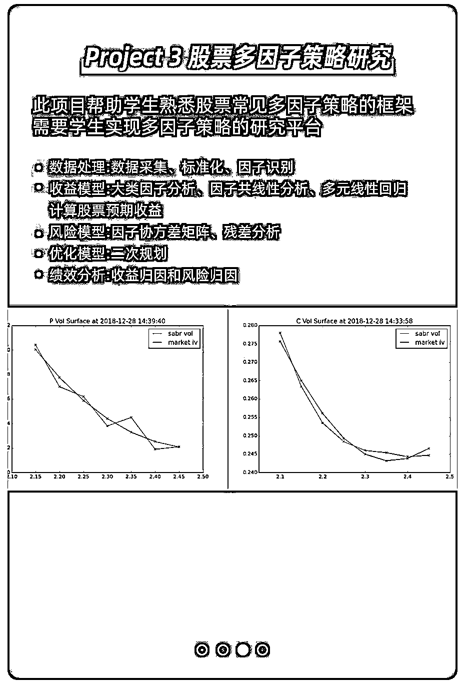

# 如何用 AI 技术？完成自己的量化投资模型与策略

> 原文：[`mp.weixin.qq.com/s?__biz=MzAxNTc0Mjg0Mg==&mid=2653297301&idx=1&sn=816e1a6d995067ba85d6357ad4c226bf&chksm=802dd880b75a519661e34cf6afa4f1bda00bf855e0c1d263ec3079afd4a875f58e28efcb55a7&scene=27#wechat_redirect`](http://mp.weixin.qq.com/s?__biz=MzAxNTc0Mjg0Mg==&mid=2653297301&idx=1&sn=816e1a6d995067ba85d6357ad4c226bf&chksm=802dd880b75a519661e34cf6afa4f1bda00bf855e0c1d263ec3079afd4a875f58e28efcb55a7&scene=27#wechat_redirect)

**标星★****置顶****公众号**爱你们♥  

在欧美，96%的证券交易经手交易机器人完成，而中国，这个比例仅为 3%-5%。2017 年国内电子化交易政策才逐步放开。

量化投资行业**市场红利巨大，薪资天花板高，相关人才紧缺，未来的就业机会广泛且高薪**。每年的新财富评选活动中，各大券商的金融工程团队逐鹿成为行业焦点，量化分析能力在金融行业愈发重要。

**除此以外，学会量化投资可以用于个人理财多多挣钱，提升个人资产。**

然而，作为金融、数学和计算机的三大学科交叉，量化金融领域创新频现、高尖人才密集，门槛较高，对初学者或转专业的人士来说，较难上手和入门。

**  在此背景下，AI+量化投资训练营应运而生**

本课程囊括了**股票、固定收益和衍生品**三大类资产，基本覆盖了量化领域可能遇到的所有交易品种，将 AI 与量化投资方向的交叉点相结合使大家能够轻松应用 AI 技术来完成自己的模型与策略。

专业的量化投资知识，丰富的职场实战经验，

系统化的教学新模式，精益求精的课程内容；

快速助你提升实力，让你在量化行业中抢占先机。是你量化投资第一课的最佳选择。

学完本课程完全**可以****创作****属于自己的策略模型。**

**课程六大优势：**

**开课吧量化投资课程与市面上课程的区别：**

**学习课程你将会获得：**

**△**通过量化投资个人理财获得收益

**△**通过富有挑战性，薪资的天花板高

**△**AI+量化投资是金融行业的未来发展方向

**《AI 与量化投资》课程大纲：**

**选修课：**

通过选修课的学习，可以夯实量化投资的基础，拓展学习和认知边界。

课程采用企业级真实项目，每个模块都有企业级别难度的综合项目练习，将知识揉碎融入企业级真实项目中，把 AI 的前沿技术应用到量化领域中。学员通过项目练习，融会贯通量化交易知识，直面实际工作中可能遇到的各类问题并加以解决。

**<<  滑动查看真实项目  >>**

**<<  滑动查看真实项目  >>**

本课程的老师，均来自国际名校且均具备世界知名企业的实际工作经验。我们相信，唯有真正的资深老师 + 良好的表达传授能力，才能给同学们真正的知识。同学们学到的，不仅仅是 AI 知识，更是一种学习习惯、思维方式和对世界的认知。

****《AI 与量化投资人才培养计划》****

****汇聚行业顶级师资力量****

****4 个月 4 大一线企业级真实项目****

****求职就业辅导一站式服务****

****助力个人理财、高薪就业****

**** 扫码加入 **** 

****

****

**本期招生名额不足 200 人**

********

**历时一年的课程研发，针对量化投资的企业用人要求，精心打磨每一个课程细节，课程设计科学合理，连接职场，适合每一个想要进入量化投资领域的求学者。**

****学完课程你能胜任如下工作：****

****定量分析师、定量研究员、投资分析师、量化交易员、量化开发工程师、量化策略师**** 

**注：大部分机构没有专门的金融工程部门，但每一个投资部门都有一部分团队和资金是做量化的。岗位之间的名称根据不同公司定义略有差别，主要看公司经营范围，以及公司人才需求来确定。**

****

**针对广大学员不同的就业需求，本次班期开设以下课程类型可供选择：**

****

****奖学金与助学金****

****

****注：湖北专项助学金、西部专项助学金、半额奖学金不累加，三选一。****

****全额退款****

********

****·**希望从事量化投资的应届毕业生、在读研究生、其他行业人员；**

****·**希望学习“量化技术”，提升个人理财效率；**

****·**传统交易员，想要转向量化金融交易员，提升职场竞争力。**

****我们需要你预备这样的能力：****

****△**数学专业优先，其次金融与计算机专业，需要学生拥有良好的思维逻辑；**

****△**至少具备本科学位，硕士及以上学位更佳；**

****→**持续自学能力，3 个小时的上课时间，每个项目投入时间至少一周以上，至少持续 5 个月以上进行学习；**

****▽**具备基础的数学能力，至少包括微积分，概率统计基础，线性回归等知识点。**

****▽**掌握良好的英语听说读写能力，至少具备英语 4 级以上；**

****▽**至少熟悉一门编程语言，如 Python / MATLAB，能够使用 Python 完成入学编程自测题；**

**不具备后三点的同学，我们有职业与学术规划师帮您选课，私人订制专属您的学习计划。 **

****我们课程录取流程：****

********

******《AI 与量化投资人才培养计划》******

******汇聚行业顶级师资力量******

******4 个月 4 大一线企业级真实项目******

******求职就业辅导一站式服务******

******助力个人理财、高薪就业******

****** 扫码加入 ****** 

********

********

****本期招生名额不足 200 人****

********

******【免责声明：文章内容不可视为投资意见。市场有风险，入市需谨慎。】******