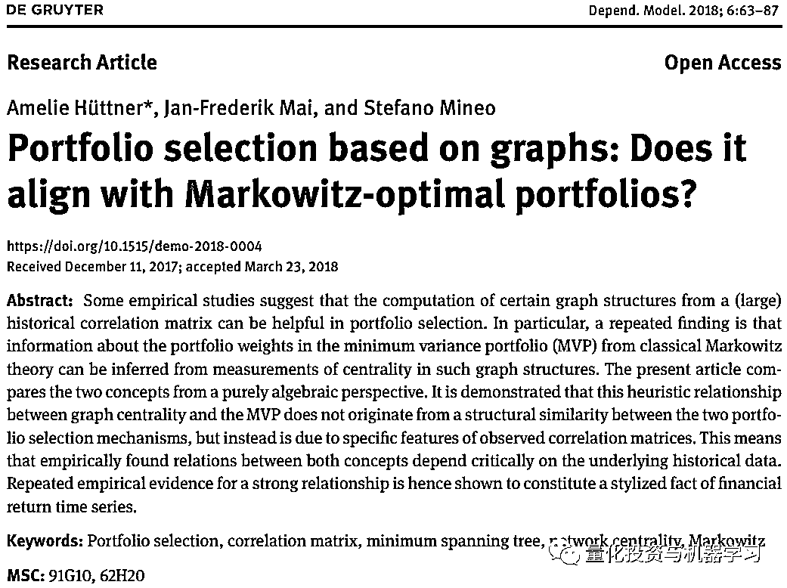
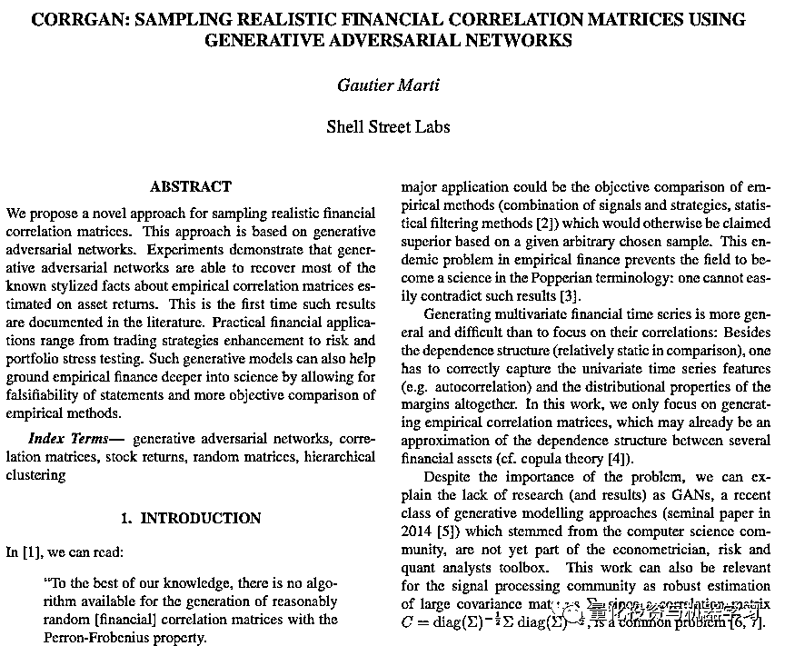
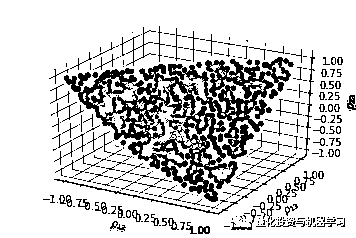
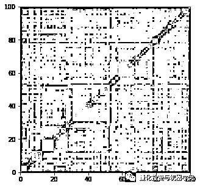
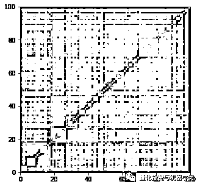
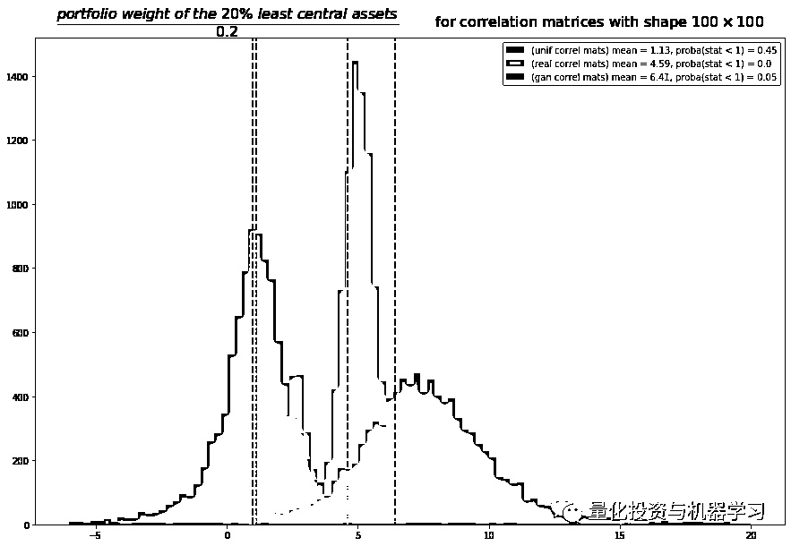

# 使用 CorrGAN：比较基于网络和最小方差的投资组合（附代码）

> 原文：[`mp.weixin.qq.com/s?__biz=MzAxNTc0Mjg0Mg==&mid=2653297296&idx=1&sn=a9ad491d45073f0617032f216c0d5590&chksm=802dd885b75a5193a2cefbfa6de1be84bfc7713198d459ff76f192e8f81cbbf77ee629e1b187&scene=27#wechat_redirect`](http://mp.weixin.qq.com/s?__biz=MzAxNTc0Mjg0Mg==&mid=2653297296&idx=1&sn=a9ad491d45073f0617032f216c0d5590&chksm=802dd885b75a5193a2cefbfa6de1be84bfc7713198d459ff76f192e8f81cbbf77ee629e1b187&scene=27#wechat_redirect)


**标星★****置顶****公众号**爱你们♥  

编辑：1+1=6

## 前言

许多经济物理学家已经注意到，利用股票（或其他资产）收益估计的经验相关矩阵构建的网络 leaves 的投资组合，与对同一股票估计的经验协方差进行最小方差优化所得到的投资组合非常相似。

> `The companies of the minimum risk Markowitz portfolio [MVP] are always located on the outer leaves of the [minimum spanning] tree.`   ——Onnela, J.-P., A. Chakraborti, K. Kaski, J. Kertész, and A. Kanto (2003). Dynamics of market correlations: Taxonomy and portfolio analysis. Phys. Rev. E 68(5), 056110*

这一反复出现的事实（从这两种不同的方法得到的投资组合的相似性）使研究人员认为，这两种方法之间可能存在深刻的数学联系。

Huttner 等人在一篇非常有趣的论文中指出事实并非如此：

*https://www.degruyter.com/downloadpdf/j/demo.2018.6.issue-1/demo-2018-0004/demo-2018-0004.pdf*

通过蒙特卡罗模拟，作者表明在一般情况下，两种投资组合构建方法的解决方案非常不同：**最小方差投资组合不一定投资于从相同的相关矩阵中提取的网络的外部 leaves。**

那么，如何解释研究者所关注的实证事实呢？

Huttner 等人认为它可能来自实际经验相关矩阵的特殊性质（而不是他们用于蒙特卡罗模拟的一致随机相关矩阵）。

他们在论文中指出：

> the previous Monte Carlo studies should be rerun using simulation algorithms that are able to produce correlation matrices that display only a subset of these stylized facts, as opposed to completely random correlation matrices (which display none of them) and market correlation matrices (which exhibit them all). […] Concerning the generation of correlation matrices whose MSTs exhibit the scale-free property, to the best of our knowledge there is no algorithm available, and due to the generating mechanism of the MST we expect the task of finding such correlation matrices to be highly complex.

我们认为 GANs 可以为这个问题提供有用的见解：

*   GANs 可以帮助抽样分析实际的金融相关性（CorrGAN）。

*   探索它们的潜在空间可以更好地理解金融相关矩阵的性质。

*   希望通过对潜在空间的分离可以很容易地控制生成模型，并且只对相关矩阵进行采样，从而验证 Huttner 等人突提出的问题。



**CorrGAN 论文链接**：https://arxiv.org/pdf/1910.09504.pdf

目前，我们只从 CorrGAN（一种基于数千个相关矩阵的 GAN，这些矩阵是根据标准普尔 500 指数股票的历史收益率估算出来的）中取样，并验证最小方差投资组合确实投资于从相同的相关矩阵中提取的网络外部 leaves。

```py
%matplotlib inline

import os
import numpy as np
import pandas as pd
import fastcluster
from scipy.cluster import hierarchy
from multiprocessing import Pool
from numpy.random import beta
from numpy.random import randn
from scipy.linalg import sqrtm
from numpy.random import seed
from tqdm import tqdm
import matplotlib.pyplot as plt

seed(42) 
```

我们定义两个函数:

*   计算最小方差权重
*   计算特特征向量中心性（网络中心性定义之一)

网络分析中，经常会用到中心性这个概念。通常在中心性的分析角度上有两种出发点：中心度和中心势。

中心度表示一个节点在网络中处于核心地位的程度；中心势表示整个图的紧密程度。换句话说，度表示单个节点的性质，而势表示整个图的性质。

## 用 onion 法采样的全随机相关矩阵

onion 法是一种精确地从  子集的相关矩阵上均匀分布采样的方法。

该方法的具体描述见：

*https://www.semanticscholar.org/paper/Behavior-of-the-NORTA-method-for-correlated-random-Ghosh-Henderson/d20f94efe7353594c804cc515e94817bd91b8f26*

当研究一些投资组合构建算法在样本内和样本外的行为时，以及它们如何相互比较时，这个抽样过程可能会很有趣。

onion 法：

```py
import numpy as np
from numpy.random import beta
from numpy.random import randn
from scipy.linalg import sqrtm
from numpy.random import seed

seed(42)
def sample_unif_correlmat(dimension):
    d = dimension + 1

    prev_corr = np.matrix(np.ones(1))
    for k in range(2, d):
        # sample y = r² from a beta distribution with alpha_1 = (k-1)/2 and alpha_2 = (d-k)/2
        y = beta((k - 1) / 2, (d - k) / 2)
        r = np.sqrt(y)

        # sample a unit vector theta uniformly from the unit ball surface B^(k-1)
        v = randn(k-1)
        theta = v / np.linalg.norm(v)

        # set w = r theta
        w = np.dot(r, theta)

        # set q = prev_corr**(1/2) w
        q = np.dot(sqrtm(prev_corr), w)

        next_corr = np.zeros((k, k))
        next_corr[:(k-1), :(k-1)] = prev_corr
        next_corr[k-1, k-1] = 1
        next_corr[k-1, :(k-1)] = q
        next_corr[:(k-1), k-1] = q

        prev_corr = next_corr

    return next_corr
sample_unif_correlmat(3)
array([[ 1.        ,  0.36739638,  0.1083456 ],
       [ 0.36739638,  1.        , -0.05167306],
       [ 0.1083456 , -0.05167306,  1.        ]])
from mpl_toolkits.mplot3d import Axes3D
import matplotlib.pyplot as plt

fig = plt.figure()
ax = fig.add_subplot(111, projection='3d')

n = 1000

correlmats = [sample_unif_correlmat(3) for i in range(n)]
xs = [correlmat[0,1] for correlmat in correlmats]
ys = [correlmat[0,2] for correlmat in correlmats]
zs = [correlmat[1,2] for correlmat in correlmats]

for c, m, zlow, zhigh in [('r', 'o', -50, -25), ('b', 'o', -30, -5)]:
    ax.scatter(xs, ys, zs, c=c, marker=m)

ax.set_xlabel('$\\rho_{12}$')
ax.set_ylabel('$\\rho_{13}$')
ax.set_zlabel('$\\rho_{23}$')

plt.show() 
```

代码展示↑↑↑

我们可以观察到一个椭圆形状，即所有相关矩阵的集合。我们可以有效地从这个集合中均匀采样！

下面的函数可用于根据 onion 法对椭圆截面上的均匀随机相关矩阵进行采样。

```py
def sample_unif_correlmat(dimension):
    d = dimension + 1

    prev_corr = np.matrix(np.ones(1))
    for k in range(2, d):
        # sample y = r² from a beta distribution
        # with alpha_1 = (k-1)/2 and alpha_2 = (d-k)/2
        y = beta((k - 1) / 2, (d - k) / 2)
        r = np.sqrt(y)

        # sample a unit vector theta uniformly
        # from the unit ball surface B^(k-1)
        v = randn(k-1)
        theta = v / np.linalg.norm(v)

        # set w = r theta
        w = np.dot(r, theta)

        # set q = prev_corr**(1/2) w
        q = np.dot(sqrtm(prev_corr), w)

        next_corr = np.zeros((k, k))
        next_corr[:(k-1), :(k-1)] = prev_corr
        next_corr[k-1, k-1] = 1
        next_corr[k-1, :(k-1)] = q
        next_corr[:(k-1), k-1] = q

        prev_corr = next_corr

    return prev_corr 
```

代码展示↑↑↑

## 由 CorrGAN 生成的实际金融相关矩阵

加载 10,000 个大小为 100 x 100 的相关矩阵，这些矩阵由 CorrGAN 生成。

```py
n = 100
a, b = np.triu_indices(n, k=1)

gan_corrs = []
for r, d, files in os.walk('gan_corrs/'):
    for file in files:
        flat_corr = np.load('gan_corrs/{}'.format(file))
        corr = np.ones((n, n))
        corr[a, b] = flat_corr
        corr[b, a] = flat_corr
        gan_corrs.append(corr)

plt.figure(figsize=(5, 5))
plt.pcolormesh(gan_corrs[0])
plt.show() 
```

代码展示↑↑↑

## 标普 500 成份股的经验相关矩阵

```py
real_corrs = []
for r, d, files in os.walk('corrs_med/'):
    for file in files:
        if 'corr_emp_100d_batch' in file:
            flat_corr = pd.read_hdf('corrs_med/{}'.format(file))
            corr = np.ones((n, n))
            corr[a, b] = flat_corr
            corr[b, a] = flat_corr
            real_corrs.append(corr)

        if len(real_corrs) >= 10000:
            break
dist = 1 - real_corrs[0]
Z = fastcluster.linkage(dist[a, b], method='ward')
permutation = hierarchy.leaves_list(
    hierarchy.optimal_leaf_ordering(Z, dist[a, b]))
prows = real_corrs[0][permutation, :]
ordered_corr = prows[:, permutation]

plt.figure(figsize=(5, 5))
plt.pcolormesh(ordered_corr)
plt.show() 
```

代码展示↑↑↑



## MVP 与特征向量中心性

下面定义的统计数据用于衡量 MVP 在多大程度上投资于网络的外部 leaves :

（占总资产 20%以上的投资组合权重）/ 0.2

如果平均而言，这个统计量等于 1，这意味着 MVP 和特征向量中心性之间没有关系。如果显著低于 1，则 MVP 将投资于中心资产。如果远远高于 1，那么 MVP 将投资于 leaves。

```py
def compute_stat_1(C, p=0.2):
    MVP_weights = compute_mv_weights(C)
    centralities = compute_eigenvector_centrality(C)
    # find the k (20%) smallest values
    k = int(len(C) * p)
    idx = centralities.argsort()[:k]

    return MVP_weights[idx].sum() / p 
```

代码展示↑↑↑

## 蒙特卡罗模拟

```py
nb_samples = len(gan_corrs)
list_nb_assets = [gan_corrs[0].shape[0]]

unif_ratios = {}
gan_ratios = {}
real_ratios = {}
for nb_assets in list_nb_assets:
    correlmats = [sample_unif_correlmat(nb_assets)
                  for sample in tqdm(range(nb_samples))]

    with Pool() as pool:
        values = list(
            tqdm(pool.imap_unordered(compute_stat_1,
                                     correlmats),
                 total=nb_samples))

    unif_ratios[nb_assets] = values

    with Pool() as pool:
        values = list(
            tqdm(pool.imap_unordered(compute_stat_1,
                                     gan_corrs),
                 total=nb_samples))

    gan_ratios[nb_assets] = values

    with Pool() as pool:
        values = list(
            tqdm(pool.imap_unordered(compute_stat_1,
                                     real_corrs),
                 total=nb_samples))

    real_ratios[nb_assets] = values 
```

```py
for d in list_nb_assets:
    unif_density, unif_edges, unif_hist = plt.hist(
        unif_ratios[d], bins=10000, density=True,
        stacked=True)
    unif_proba = sum([v for (v, b) in zip(unif_density, unif_edges)
                      if b <= 1]) * (unif_edges[1] - unif_edges[0])
    plt.clf()
    gan_density, gan_edges, gan_hist = plt.hist(
        gan_ratios[d], bins=10000, density=True,
        stacked=True)
    gan_proba = sum([v for (v, b) in zip(gan_density, gan_edges)
                     if b <= 1]) * (gan_edges[1] - gan_edges[0])
    plt.clf()
    real_density, real_edges, real_hist = plt.hist(
        real_ratios[d], bins=10000, density=True,
        stacked=True)
    real_proba = sum([v for (v, b) in zip(real_density, real_edges)
                      if b <= 1]) * (real_edges[1] - real_edges[0])
    plt.clf()

    plt.figure(figsize=(15, 10))
    plt.title(r'$\dfrac{portfolio~weight~of~the~20\%~least~central~assets}{0.2}$'
              + "\tfor correlation matrices with shape $100 \\times 100$",
              fontsize=16)
    bins = np.linspace(-6, 20, 100)

    # uniform random correlation matrices
    plt.hist(unif_ratios[d], bins, alpha=0.8,
             label="(unif correl mats) mean = "
             + str(round(np.mean(unif_ratios[d]), 2))
             + ", proba(stat < 1) = " + str(round(np.mean(unif_proba), 2)))
    plt.axvline(x=np.mean(unif_ratios[d]),
                color='b', linestyle='dashed', linewidth=2)

    # real financial correlation matrices
    plt.hist(real_ratios[d], bins, alpha=0.8,
             label="(real correl mats) mean = "
             + str(round(np.mean(real_ratios[d]), 2))
             + ", proba(stat < 1) = " + str(round(np.mean(real_proba), 2)))
    plt.axvline(x=np.mean(real_ratios[d]),
                color='r', linestyle='dashed', linewidth=2)

    # realistic random correlation matrices generated by CorrGAN
    plt.hist(gan_ratios[d], bins, alpha=0.8,
             label="(gan correl mats) mean = "
             + str(round(np.mean(gan_ratios[d]), 2))
             + ", proba(stat < 1) = " + str(round(np.mean(gan_proba), 2)))
    plt.axvline(x=np.mean(gan_ratios[d]),
                color='g', linestyle='dashed', linewidth=2)

    # baseline: 1 means no relation between centrality and MV weights
    plt.axvline(x=1, color='k', linestyle='dashed', linewidth=2)

    plt.legend()
    plt.show() 
```

代码展示↑↑↑



我们可以使用一致随机相关矩阵来重现 Huttner 等人的结论：一般来说，最小方差组投资合与中心性（蓝分布）之间没有关系。

然而，对于真正的相关矩阵估计的市场回收益（橙分布）我们可以注意到，统计的均值显著高于 1，甚至更强，没有值低于 1。证实了实证研究者的观点：**马科维茨/最小方差投资组合（Minimumvariance Portfolio, MVPs）倾向于投资于相关网络的 leaves**。所有基于实际相关性构建的 MVPs 投资组合都偏向于位于网络边缘的资产。为什么统计分布是双峰的？是不是因为本质上存在两种类型的相关矩阵和 MVP？例如，压力市场时期与正常市场时期的比较。在相关性通常很高的压力时期 ，相关网络将采用星形拓扑（假设一个中心资产和许多 leaves 直接连接到这个中心资产）。在这个初始配置中，许多 leaves 将得到大致相等的分配，因此 20%最小的中心资产不会超过 20%的基线。然而在正常情况下，风险因子更加多样化来驱动资产，相关性 / 网络拓扑将包含更深和更少的相关 leaves，这将从 MVP 中得到更多的分配，因此权重超过 magin 基线 20%的分配。这个假设还需要进一步研究。

关于 CorrGAN 生成的相关矩阵，作者还表明，对于实际的金融相关性，MVP 和基于网络的投资组合倾向于选择相同的资产。只有 5%的投资组合没有超过 20%的核心资产。但是，除此之外，这 20%的最小中心资产甚至比使用实际的经验相关矩阵的权重更大。我们可以看到，GAN 并没有完全掌握经验矩阵的所有属性：当我们使用合成矩阵时，用于比较 MVP 和基于网络的投资组合的统计数据并不具有双峰分布。

心系武汉

**等疫情结束，花枝春满。**

**山河无恙，人间皆安。**

2020 年第 46 篇文章

量化投资与机器学习微信公众号，是业内垂直于**Quant、MFE、Fintech、AI、ML**等领域的**量化类主流自媒体。**公众号拥有来自**公募、私募、券商、期货、银行、保险资管、海外**等众多圈内**18W+**关注者。每日发布行业前沿研究成果和最新量化资讯。

你点的每个“在看”，都是对我们最大的鼓励