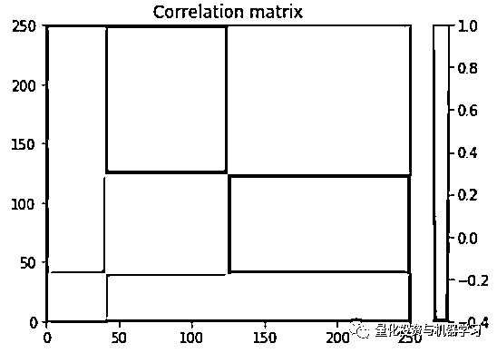

# 分层风险平价：基于图论和机器学习的新资产配置方法（附代码）

> 原文：[`mp.weixin.qq.com/s?__biz=MzAxNTc0Mjg0Mg==&mid=2653297285&idx=1&sn=c66343b644269ae292bfae200dd605be&chksm=802dd890b75a51861b214d62795a54ee8b2164aeeb70a1543a0b6b283039d2934b183ce0f2a3&scene=27#wechat_redirect`](http://mp.weixin.qq.com/s?__biz=MzAxNTc0Mjg0Mg==&mid=2653297285&idx=1&sn=c66343b644269ae292bfae200dd605be&chksm=802dd890b75a51861b214d62795a54ee8b2164aeeb70a1543a0b6b283039d2934b183ce0f2a3&scene=27#wechat_redirect)


**标星★****置顶****公众号**爱你们♥  

编辑：1+1=6

***1***

**前言**

风险平价是构建多样化和均衡投资组合十分流行选择。众所周知，大多数资产类别的未来表现很难预测。 通过仅使用资产的风险特征和相关矩阵构建投资组合，风险平价方法克服了这一缺点。Lohre、Rother 和 Schafer 三位作者在经典风险平价基础上，提出了分层风险平价。他们的方法是：

**利用****图论和机器学习****来构建投资领域的层次结构。****这种结构可以更好地将资产/因子划分为具有相似特征的集群，****无需依赖经典的相关性分析****。**

这些投资组合提供了更好的尾部风险管理，特别是对 skewed 资产和风格因子策略。

下面我们就来看看这篇论文的主要内容。

***2***

**正文解读**

**Hierarchical risk parity: Accounting for tail dependencies in multi-asset multi-factor allocations**

摘要：


我们应该关注的内容：

最近的文献提出了分层聚类下的风险平价分配模式，促使 Lopez de Prado 将该方法称为分层风险平价（HRP）：


给定一组资产类别和风格因子收益，相应的算法将根据一定的距离度量对这些资产类别和风格因子进行聚类，然后沿着这些聚类分配相等的风险预算。  这种集群可能被认为是比聚合风险因子更自然的组成部分，因为它们自动选择依赖结构，并形成有意义的成分，以帮助投资组合的差异化。


论文的贡献在于深入研究了分层聚类在多资产多因子投资环境中的应用和优点。特别是，它将把此方法与其他方法进行对比，比如 1=N、最小方差、标准风险平价和多样化风险平价。一个主要的创新是研究基于尾部相关聚类的 HRP 策略，而不是标准的基于相关性聚类。考虑到某些样式因子的尾部风险升高，这种方法可能特别相关。分层风险平价策略通常基于两个步骤：首先，分层聚类算法揭示了所考虑的投资领域的层次结构，从而得到基于树的表示。其次，投资组合权重是通过沿着层次结构应用分配策略得出的。

下面，公众号给大家举个 HRP 的小例子，然后再回到我们的论文解读中。

***3***

**分层风险平价案例**

我们再一次回顾一下分层风险平价：**它是一种执行资产配置的方法，不需要反协方差矩阵。****它本质上是采用标准的层次聚类算法，计算出一个层次树，然后对不同的聚类进行多样化处理。**

我们将按如下方式进行：

1、建立了一个人工相关矩阵 C 与几个层次集群；

2、把 C 转换成协方差矩阵；

3、从正态分布 N(0, Sigma)中抽样时间序列；

4、对这些时间序列应用分层风险平价。

```py
import pandas as pd
import numpy as np
from scipy.linalg import block_diag
from scipy.cluster.hierarchy import linkage
from scipy.spatial.distance import squareform
import matplotlib.pyplot as plt
%matplotlib inline

nb_alphas = 250
nb_observations = int(0.3 * 252)

quality = 0.6 * np.ones((nb_alphas // 6, nb_alphas // 6))
value = 2.4 * np.ones((nb_alphas // 2, nb_alphas // 2))
momentum = 2.6 * np.ones((int(nb_alphas * (1 - 1/6 - 1/2) + 1),
                          int(nb_alphas * (1 - 1/6 - 1/2) + 1)))

correl_mom_value = -1.2 * np.ones((int(nb_alphas * (1 - 1/6)) + 1,
                                   int(nb_alphas * (1 - 1/6)) + 1))

correl = (block_diag(quality, correl_mom_value) +
          block_diag(quality, momentum, value)) / 3
np.fill_diagonal(correl, 1)

mean_returns = np.zeros(nb_alphas)
volatilities = ([np.sqrt(0.1 / np.sqrt(252))] * (nb_alphas // 3) +
                [np.sqrt(0.3 / np.sqrt(252))] * (nb_alphas - nb_alphas // 3 - nb_alphas // 6) +
                [np.sqrt(0.5 / np.sqrt(252))] * (nb_alphas // 6))
covar = np.multiply(correl,
                    np.outer(np.array(volatilities),
                             np.array(volatilities)))
covar = pd.DataFrame(covar)
correl
array([[1. , 0.4, 0.4, ..., 0. , 0. , 0. ],
       [0.4, 1. , 0.4, ..., 0. , 0. , 0. ],
       [0.4, 0.4, 1. , ..., 0. , 0. , 0. ],
       ...,
       [0. , 0. , 0. , ..., 1. , 0.4, 0.4],
       [0. , 0. , 0. , ..., 0.4, 1. , 0.4],
       [0. , 0. , 0. , ..., 0.4, 0.4, 1. ]])
plt.pcolormesh(correl)
plt.colorbar()
plt.title('Correlation matrix')
plt.show()

plt.pcolormesh(covar)
plt.colorbar()
plt.title('Covariance matrix')
plt.show()
```




```py
alphas_returns = np.random.multivariate_normal(
    mean_returns, cov=covar, size=nb_observations)

alphas_returns = pd.DataFrame(alphas_returns)
plt.figure(figsize=(20, 10))
plt.plot(alphas_returns.cumsum())
plt.title('Performance of the different alphas', fontsize=24)
plt.show()
```


在实际情况下，这些时间序列是给定的，它们是一系列资产（如股票）的收益。

### **第一步：****估计相关矩阵**

```py
estimate_correl = alphas_returns.corr(method='pearson')
estimate_covar = alphas_returns.cov()
plt.pcolormesh(estimate_correl)
plt.colorbar()
plt.title('Estimated correlation matrix')
plt.show()

plt.pcolormesh(estimate_covar)
plt.colorbar()
plt.title('Estimated covariance matrix')
plt.show()
```


将相关性转化为距离，如下所示：

```py
distances = np.sqrt((1 - estimate_correl) / 2)
```

**第二步：****准****对角化**

**Lopez de Prado 应用了他所谓的 quasi-diagonalization，这个过程通常被称为矩阵序列化，可以通过层次聚类来完成。**

```py
`def seriation(Z, N, cur_index):
    """Returns the order implied by a hierarchical tree (dendrogram).

       :param Z: A hierarchical tree (dendrogram).
       :param N: The number of points given to the clustering process.
       :param cur_index: The position in the tree for the recursive traversal.

       :return: The order implied by the hierarchical tree Z.
    """
    if cur_index < N:
        return [cur_index]
    else:
        left = int(Z[cur_index - N, 0])
        right = int(Z[cur_index - N, 1])
        return (seriation(Z, N, left) + seriation(Z, N, right))

def compute_serial_matrix(dist_mat, method="ward"):
    """Returns a sorted distance matrix.

       :param dist_mat: A distance matrix.
       :param method: A string in ["ward", "single", "average", "complete"].

        output:
            - seriated_dist is the input dist_mat,
              but with re-ordered rows and columns
              according to the seriation, i.e. the
              order implied by the hierarchical tree
            - res_order is the order implied by
              the hierarhical tree
            - res_linkage is the hierarhical tree (dendrogram)

        compute_serial_matrix transforms a distance matrix into
        a sorted distance matrix according to the order implied
        by the hierarchical tree (dendrogram)
    """
    N = len(dist_mat)
    flat_dist_mat = squareform(dist_mat)
    res_linkage = linkage(flat_dist_mat, method=method)
    res_order = seriation(res_linkage, N, N + N - 2)
    seriated_dist = np.zeros((N, N))
    a,b = np.triu_indices(N, k=1)
    seriated_dist[a,b] = dist_mat[[res_order[i] for i in a], [res_order[j] for j in b]]
    seriated_dist[b,a] = seriated_dist[a,b]

    return seriated_dist, res_order, res_linkage

ordered_dist_mat, res_order, res_linkage = compute_serial_matrix(distances.values, method='single')
plt.pcolormesh(distances)
plt.colorbar()
plt.title('Original order distance matrix')
plt.show()

plt.pcolormesh(ordered_dist_mat)
plt.colorbar()
plt.title('Re-ordered distance matrix')
plt.show()`
```

****

********

### ******第三步：****递归二分法******

```py
**`def compute_HRP_weights(covariances, res_order):
    weights = pd.Series(1, index=res_order)
    clustered_alphas = [res_order]

    while len(clustered_alphas) > 0:
        clustered_alphas = [cluster[start:end] for cluster in clustered_alphas
                            for start, end in ((0, len(cluster) // 2),
                                               (len(cluster) // 2, len(cluster)))
                            if len(cluster) > 1]
        for subcluster in range(0, len(clustered_alphas), 2):
            left_cluster = clustered_alphas[subcluster]
            right_cluster = clustered_alphas[subcluster + 1]

            left_subcovar = covariances[left_cluster].loc[left_cluster]
            inv_diag = 1 / np.diag(left_subcovar.values)
            parity_w = inv_diag * (1 / np.sum(inv_diag))
            left_cluster_var = np.dot(parity_w, np.dot(left_subcovar, parity_w))

            right_subcovar = covariances[right_cluster].loc[right_cluster]
            inv_diag = 1 / np.diag(right_subcovar.values)
            parity_w = inv_diag * (1 / np.sum(inv_diag))
            right_cluster_var = np.dot(parity_w, np.dot(right_subcovar, parity_w))

            alloc_factor = 1 - left_cluster_var / (left_cluster_var + right_cluster_var)

            weights[left_cluster] *= alloc_factor
            weights[right_cluster] *= 1 - alloc_factor

    return weights

def compute_MV_weights(covariances):
    inv_covar = np.linalg.inv(covariances)
    u = np.ones(len(covariances))

    return np.dot(inv_covar, u) / np.dot(u, np.dot(inv_covar, u))

def compute_RP_weights(covariances):
    weights = (1 / np.diag(covariances))

    return weights / sum(weights)

def compute_unif_weights(covariances):

    return [1 / len(covariances) for i in range(len(covariances))]`**
```

****出于好奇，我们展示了使用估计的协方差矩阵和使用原始的协方差矩阵时间序列样本计算的结果，希望结果有点类似。****

```py
**`### Hierarchical Risk Parity

HRP_weights = compute_HRP_weights(estimate_covar, res_order)

print(round((HRP_weights * alphas_returns).sum(axis=1).std() * np.sqrt(252),
            2))
0.38

HRP_weights = compute_HRP_weights(covar, res_order)

print(round((HRP_weights * alphas_returns).sum(axis=1).std() * np.sqrt(252),
            2))
0.34
### 1 / N uniform weighting

unif_weights = compute_unif_weights(estimate_covar)

print(round((unif_weights * alphas_returns).sum(axis=1).std() * np.sqrt(252),
            2))
0.43
### Naive Risk Parity 1 / volatility

RP_weights = compute_RP_weights(estimate_covar)

print(round((RP_weights * alphas_returns).sum(axis=1).std() * np.sqrt(252),
      2))
0.29

RP_weights = compute_RP_weights(covar)

print(round((RP_weights * alphas_returns).sum(axis=1).std() * np.sqrt(252),
            2))
0.29
### Minimum Variance

MV_weights = compute_MV_weights(estimate_covar)

print(round((MV_weights * alphas_returns).sum(axis=1).std() * np.sqrt(252),
            2))
0.0

MV_weights = compute_MV_weights(covar)

print(round((MV_weights * alphas_returns).sum(axis=1).std() * np.sqrt(252),
            2))
0.22`**
```

****我们可以看到最小方差在某种程度上超过了样本内数据，因为获得的两个波动率非常不同，而使用样本内估计的波动率«使用真实协方差矩阵的波动率。我们将用样本外验证测试来验证这些观察结果。**** 

## ******第四步：****样本外验证******

****我们产生另一个样本，即两年期收益的时间序列。****

```py
**`nb_observations = int(2 * 252)

alphas_returns = np.random.multivariate_normal(
    mean_returns, cov=covar, size=nb_observations)

alphas_returns = pd.DataFrame(alphas_returns)
### Hierarchical Risk Parity

HRP_weights = compute_HRP_weights(estimate_covar, res_order)

print(round((HRP_weights * alphas_returns).sum(axis=1).std() * np.sqrt(252),
            2))
0.43

### 1 / N uniform weighting

unif_weights = compute_unif_weights(estimate_covar)

print(round((unif_weights * alphas_returns).sum(axis=1).std() * np.sqrt(252),
            2))
0.45

### Naive Risk Parity 1 / volatility

RP_weights = compute_RP_weights(estimate_covar)

print(round((RP_weights * alphas_returns).sum(axis=1).std() * np.sqrt(252),
            2))
0.32

MV_weights = compute_MV_weights(estimate_covar)

print(round((MV_weights * alphas_returns).sum(axis=1).std() * np.sqrt(252),
            2))
7.71`** 
```

****我们注意到，最小方差产量过度解决方案，不产生样本外表现的投资组合。****

****在这个例子中，分层风险平价并没有击败 naive 风险平价，它完全忽略了资产之间的相关结构。然而，这个例子对于 HRP 来说太简单了。**明天的推文我们会继续更深入的介绍。******

******好了，回到正文：******

****传统基于风险的配置策略首先直接应用于单个资产和因子，其次应用于由强加风险模型产生的八个综合因子。这八个因子为统计层次结构提供了一个基准集群。至于 HRP，在集群内部或跨集群使用的分配策略是基于逆波动率（IVP）或等风险贡献（ERC）的风险平价。对于层次聚类，我们使用了 Ward 方法和相异矩阵，或者基于相关矩阵，或者基于 LTDCs。为了便于比较，坐着考虑了 Lopez De Prado 的 HRP 策略的两个版本，它们都基于递归二分法：首先，复制原始策略，使用算法 1 中描述的单连接和逆方差分配。其次，我们考虑算法 2 中描述的一种变体，使用 Ward 的方法和 IVP，与 Lopez de Prado 的原始 HRP 策略进行比较。所考虑的策略概述见下表：****

********

****作者在 2012 年 1 月至 2017 年 12 月的六年时间里对投资策略进行了回测：****

********

****上表显示了绩效和风险统计以及平均策略周转率。首先，首先，我们注意到跨单一资产和因子的 1=N 策略在所有策略中具有最高的收益率。与此同时，1=N 承受着最高的波动性和最大的资产缩减，使其风险调整后的业绩低于平均水平。值得注意的是，当考虑经济因子而不是单一资产和因子时，潜在的不确定性并没有得到缓解；两个变量的平均值都在 3.5 左右徘徊。有趣的是，最小方差优化使这个数字已经翻倍到 7.2。不出所料，这两个投资组合在样本周期内的投资组合波动最小（分别为 0.84%和 0.90%)）。当然，与同等权重相比，最大回撤和风险调整收益率也有所提高。****

****更多内容大家可以下载论文进行阅读！下载地址：****

*****https://papers.ssrn.com/sol3/papers.cfm?abstract_id=3513399*****

****心系武汉****

******等疫情结束，花枝春满。******

******山河无恙，人间皆安。******

****2020 年第 45 篇文章****

****量化投资与机器学习微信公众号，是业内垂直于**Quant、MFE、Fintech、AI、ML**等领域的**量化类主流自媒体。**公众号拥有来自**公募、私募、券商、期货、银行、保险资管、海外**等众多圈内**18W+**关注者。每日发布行业前沿研究成果和最新量化资讯。****

************你点的每个“在看”，都是对我们最大的鼓励****