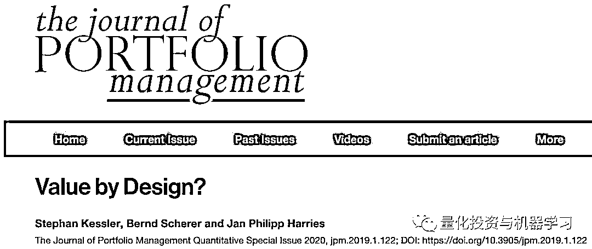
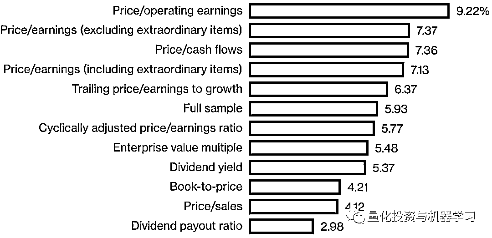
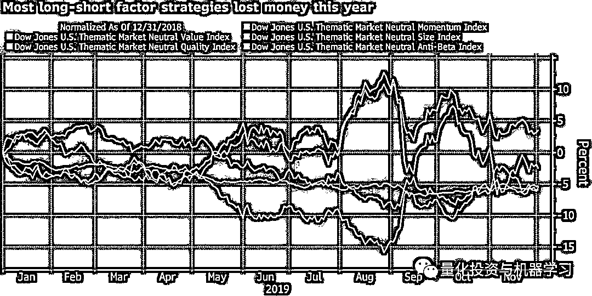
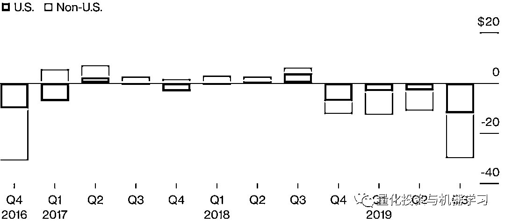
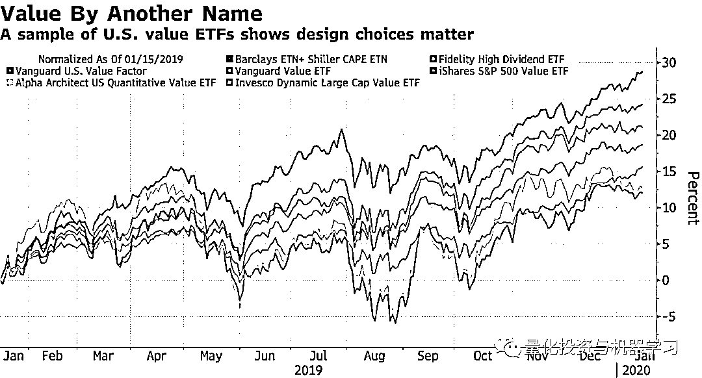
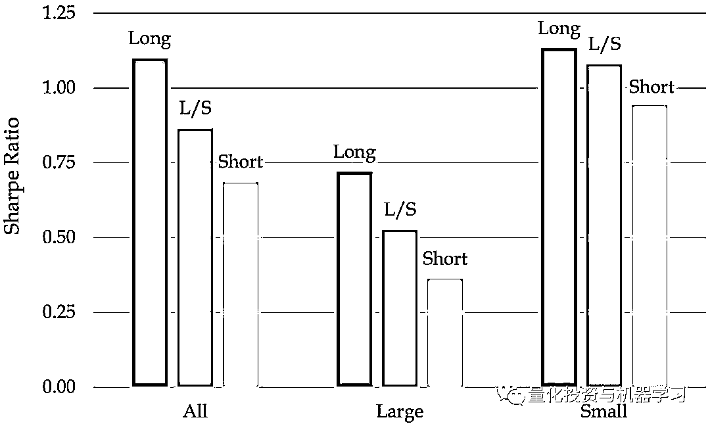
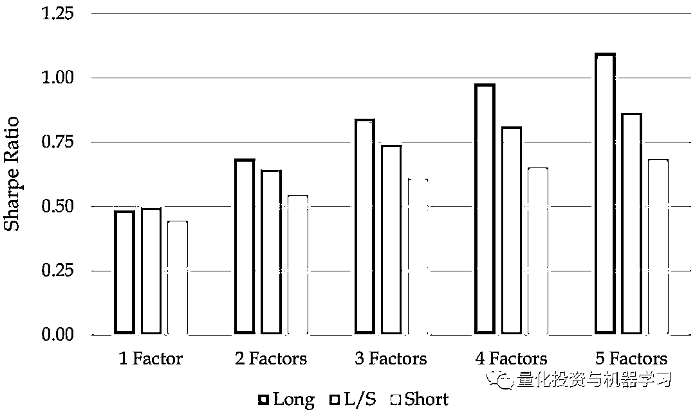

# 价值因子：3168 种策略！

> 原文：[`mp.weixin.qq.com/s?__biz=MzAxNTc0Mjg0Mg==&mid=2653297267&idx=1&sn=6f8d28df8625c7883c6b4f147cce6f67&chksm=802dd866b75a51701fe084cc2185dd8717b27df6b1b75623e30fd9bd544da2401b09ff48cc7e&scene=27#wechat_redirect`](http://mp.weixin.qq.com/s?__biz=MzAxNTc0Mjg0Mg==&mid=2653297267&idx=1&sn=6f8d28df8625c7883c6b4f147cce6f67&chksm=802dd866b75a51701fe084cc2185dd8717b27df6b1b75623e30fd9bd544da2401b09ff48cc7e&scene=27#wechat_redirect)

**标星★****置顶****公众号**爱你们♥  

编辑：1+1=6

价值因子，因子投资的支柱。

它可以概括为“低买高卖” 。这是一个非常简单的概念。当你需要决定什么是低，什么是高时，麻烦就来了。

根据摩根斯坦利 Stephan Kessler 领导的一个量化研究团队在**《Journal of Portfolio Management》**上发表的一项新研究统计，至少有 3168 种方法可以做到这一点（低买高卖的判定）。

摘要简介： 

虽然学者和从业人员在他们的工作中经常提到股票的价值投资，对于什么是真正的价值，人们没有达成共识。

根据所使用指标的不同，价值因子的年化收益率变化很大（从 1988 年 2 月到 2017 年 2 月，基于每个指标建立的策略平均年收益率）：

这篇论文不仅仅是学术性的。量化投资在大多数情况下科学且严谨，但它对人类决策的依赖可以在单一风格中激发出明显的区别，在这个因子长达十年的不佳表现已经导致一些人声称它的结构发生了变化。

*图片来自：彭博

资金外流可能也影响了整个行业的表现。 根据 Eurekahedge 的数据，市场中性的股票对冲基金在此期间损失了近 40 亿美元。 投资数据显示，2019 年前三个季度，机构投资者从做多型股票基金中赎回了 540 亿美元。

量化股票基金 2019 年资金流出如下：

*图片来自：eVestment

回到主题。研究人员发现，与 Fama-French 模型中使用的经典指标相比，大多数指标都能带来更大的收益。专注于现金流和收益可以带来了经风险调整后的最佳受益，而使用股息收益率则带来了最差的收益。

研究显示，在近 30 年的时间里，**表现最佳和最差的价值策略之间差距高达 463 个百分点。**

*图片来自：彭博

这与 Robeco 最近的研究相呼应。在这篇名为**《When Equity Factors Drop Their Shorts》**的论文中，Robeco 团队分析了股票多头和空头头寸对业绩的贡献，发现空头头寸几乎不值得费心。

这篇论文的核心包含在这张图中：

* This figure summarizes the Sharpe ratios of the long leg (‘Long’), long/short (‘L/S’), and short leg (‘Short’) of the equal-weighted combination of HML, WML, RMW, CMA and VOL factor portfolios for the sample period July 1963 – December 2018\. The sample is further split into Large and Small cap stocks, following the standard FamaFrench definition. 

研究人员对 1963 年至 2018 年间美国股票的收益率进行了仔细研究。 在测试了一个多头策略、一个空头策略（仅根据一个因子做空最差的股票）和一个多空策略之后，风险调整后的收益率对于只做多策略在所有情况下都更好。 不过，正如人们可能预期的那样，在小盘股中，收益率较高，多头与空头之间的差距最小。

此外，研究还表明，**增加额外的因子可以带来多样化的好处**。所有的投资策略都以这种方式提高了风险调整后的收益率，多对空的优势随着额外的因子而扩大。

* This figure shows the Sharpe ratio of factor portfolios when increasing the number of factors. Shown are the Sharpe ratio of the average portfolio over all possible single or multi-factor portfolios for 1-2-3-4-5 factor combinations. The long leg (‘Long’), long/short (‘L/S’), and short leg (‘Short’) results are depicted for the sample period July 1963 – December 2018. 

这篇论文还告诉我们，**价值的收益主要由多头而非空头押注推动。** **在做空方面，做空指数比做空个股更好**。他们写道，消除行业偏差：当某些行业，如银行业整体上变得廉价时，就会出现这种情况（有助于减少支出）。

因子投资的特点在于，不需要太多的人为手段我们就可以系统地在学术中获得收益驱动因子，比如质量、价值和动量。但是，正如这篇论文所指出的，**人类决策过程中存在的偏见和盲点无处不在，这些行为可以深刻地影响投资收益。**

除了选择一个信号，人类还决定如何权衡每只股票。比如投资者必须选择是做空指数还是做空个股，如何处理行业偏差，以及何时重新平衡投资组合。

作者还说：**像价值、动量或质量这样的策略标签可能会误导我们进行正确分类，因为它们暗示了策略之间存在更大的共性。**

心系武汉

**等疫情结束，花枝春满。**

**山河无恙，人间皆安。**

2020 年第 44 篇文章

量化投资与机器学习微信公众号，是业内垂直于**Quant、MFE、Fintech、AI、ML**等领域的**量化类主流自媒体。**公众号拥有来自**公募、私募、券商、期货、银行、保险资管、海外**等众多圈内**18W+**关注者。每日发布行业前沿研究成果和最新量化资讯。

你点的每个“在看”，都是对我们最大的鼓励