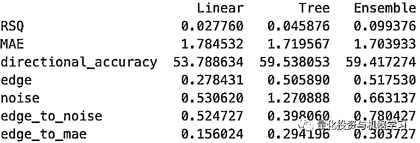

# 万千模型于一身：最强机器学习股票预测框架！

> 原文：[`mp.weixin.qq.com/s?__biz=MzAxNTc0Mjg0Mg==&mid=2653297255&idx=1&sn=3ef88b22d8811f6edb091e83c9810dfe&chksm=802dd872b75a516432dfe8a8c6180931b493245ea189e533d39a00f888b7ba3afc2c92adbaff&scene=27#wechat_redirect`](http://mp.weixin.qq.com/s?__biz=MzAxNTc0Mjg0Mg==&mid=2653297255&idx=1&sn=3ef88b22d8811f6edb091e83c9810dfe&chksm=802dd872b75a516432dfe8a8c6180931b493245ea189e533d39a00f888b7ba3afc2c92adbaff&scene=27#wechat_redirect)


**标星★****置顶****公众号**爱你们♥  

作者：Gray      编译：1+1=6

***1***

**前言**

金融市场大多是随机的。然而，它们并不是完全随机的。市场中存在着许多小的低效和模式，它们可以被识别出来，并被用来在市场上获得微弱的优势。

这些优势很少大到足以单独交易，交易成本和间接费用很容易覆盖我们的收益。但是**，当我们能够将许多这样的小优势结合在一起时，其收益可能是巨大的！**

在本文中，我们将给各位读者提供一个框架**Stacked Generalization**，中文叫**堆栈泛化**。

集成学习（Ensemble Learning）中除了 Bagging 和 Boosting 对数据的横向划分划分之外，还有一个纵向划分（加深）的方法， 一般称为 Stacked Generalization（SG）。

SG 指训练一个用于组合（combine）其他多个不同模型的模型，具体是说首先我们**使用不同的算法或者其他方法能够训练出多个不同的模型，然后将这些模型的输出作为新的数据集，即将这些训练的模型的输出再作为为输入训练一个模型，最后得到一个最终的输出。**

***2***

****堆栈泛化****

堆叠泛化框架最初是由 Wolpert 在 1992 年的一篇学术论文中提出的。自从它被首次提出以来，堆叠泛化已经得到了来自机器学习领域的关注。


http://citeseerx.ist.psu.edu/viewdoc/summary?doi=10.1.1.56.1533

**堆栈泛化是一种集成建模技术**。其核心概念是通过：

1、建立多个不同的模型（具有不同的学习算法、不同的超参数或不同的特征）来预测。

2、训练一个”元模型”或”混合模型”来确定如何结合每个这些多模型的预测，从而为一个回归或分类任务生成一个单一的、最佳的稳健预测。

下面是一种可视化的好方法。每一个 R1 到 Rm 模型都根据历史数据进行训练，并用于做出 P1 到 Pm 的预测。然后，这些预测就变成了用来训练元模型以确定如何组合这些预测的特征。


打个比方。想象一下，有一组投资分析师，他们的经理要求他们每个人对同一公司在多个季度的收益进行预测。然后经理来“学习”哪些分析师历来是最准确的。当然有些是准确的，有些是不准确的。当需要对未来进行预测时，经理可以为每个分析师的预测分配更多或更少的权重（在某些情况下是零权重）。

这就是为什么它被称为堆栈的原因。但**为什么还要泛化呢？**通过弱化那些看起来与数据过度匹配的模型，使模型对样本外（即不可见的）数据具有更大的泛化能力。这是通过允许元模型来学习哪些基础模型的预测在样本外表现良好（或差)），并适当地对模型进行加权来实现的。

***3***

**我们这么做的动机是什么？**

在我们看来，**堆栈泛化非常适合在嘈杂、非平稳、不稳定的金融市场中进行预测时所面临的****挑****战，****且有助于解决过拟合问题**。这是几乎所有应用机器学习在投资的从业者都认同的！  

更好的是，堆栈泛化允许我们以一种不会被更强的信号淹没的方式将相对微弱（正交）的信号混合在一起。

为了说明这一点，我们考虑一个典型的趋势跟踪策略，策略以 12 个月减去 1 个月的价格变动为基础。也许我们还认为，month-of-year 或近期的 IBIS 收益趋势对价格变化有微弱但仍然有用的影响。如果我们要训练一个将显性特征（12-1 动量）和较弱特征（季节性或 IBIS 趋势）集中在一起的模型，我们的模型可能会错过这些微妙的信息，因为显性特征掩盖了它们。

一个堆栈的模型，其中一个组成部分（例如一个基本模型）只关注动量特征，另一个部分只关注季节性特征，第三个部分只关注分析师修正特征，这些部分可以捕捉和使用更微妙的影响和更显著的动量效应。

***4***

**成功的关键**

这有两个具体的原则，将使你在很长一段路稳健的结果。

**1、样本外训练**

首先，**用于训练元模型的 P1 到 Pm 预测需完全脱离样本预测**，这一点非常关键。为什么？因为，为了确定哪些模型可能更好地泛化到样本外（即那些超拟合最小的模型），我们必须根据过去的预测（这些预测本身就是样本外的）来判断。

假设你使用不同的算法（如逻辑回归和决策树）来训练两个模型。这两种方法都是非常有用的（样本外），但是决策树更倾向于过拟合训练数据。如果我们使用样本内预测作为元学习者的特征，我们可能会给模型更大的权重，并倾向于过拟合。

有几种方法可以用于此目的。一些人建议将训练数据分解为 Train1 和 Train2 集，以便在 Train1 上训练基本模型，然后对 Train2 数据进行预测，用于训练集成模型。当然，集成模型的预测必须在另一个数据集上进行评估。

其他的则在基础模型上使用 K-fold 交叉验证预测（例如 scikit 的 cross_val_predict）来模拟样本外（ish）预测，从而将其输入集成层。

然而，在我们看来，**金融时间序列数据的最佳方法是在基础模型上****使用 walk-forward 训练和预测**。除了确保每一个基本预测都是真实的样本外，它还模拟了非平稳性随时间的影响。

**2、Non-Negativity**

这不是一个严格的规则，是使用 ElasticNet 或 lasso 这样的算法，将元模型限制为只学习非负系数，允许非负约束。

这项技术很重要，因为通常输入到元模型中的特征会有非常高的共线性（P1 到 Pm）。在高共线性时期，学习算法可以做一些古怪的事情，比如通过给一个模型分配一个高的正系数，而给另一个模型分配一个大的负系数，从而找到对过去数据的稍微更好的拟合。这不是我们真正想要的。

**但如果一个模型只有在不断预测错误结果的情况下才有用，那它可能就是一个我们不愿相信的模型。**

***5***

**数据准备**

对于这个简单的示例，我们将创建合成数据，不使用真实的市场价格来消除关于从模型中提取最大价值所需的特征和转换的模糊性。

**注意：**为了使数据集更真实，我们使用 quandl 的 API 从实际股票价格中提取一个索引，但是所有特征和目标值将在下面构造。

有了索引，我们将生成四个“隐藏因子”。这些是目标变量的非随机驱动因子，是我们理想情况下想要学习的“信号”。

为了确保这些因子是有意义的，我们将使用这些因子的组合来创建目标变量(y)。前两个隐藏因子与目标呈线性关系。后两个隐藏因子的关系更为复杂，涉及变量之间的相互作用。最后，我们将添加一个噪声组件，使我们的学习者为它工作。

最后，我们将创建几个与一个或多个隐藏因子相关的特征，包括大量的噪声和偏差。

**重点：**我们已经创建了 X 和 y 数据，有些是线性的，有些不是。这就是我们的建模将要学习的内容。

```py
import numpy as np
import pandas as pd
pd.core.common.is_list_like = pd.api.types.is_list_like
import pandas_datareader.data as web
%matplotlib inline

from IPython.core.display import HTML,Image
HTML('<style>{}</style>'.format(config.CSS))

def get_symbols(symbols,data_source, begin_date=None,end_date=None):
    out = pd.DataFrame()
    for symbol in symbols:
        df = web.DataReader(symbol, data_source,begin_date, end_date)[['AdjOpen','AdjHigh','AdjLow','AdjClose','AdjVolume']].reset_index()
        df.columns = ['date','open','high','low','close','volume'] #my convention: always lowercase
        df['symbol'] = symbol # add a new column which contains the symbol so we can keep multiple symbols in the same dataframe
        df = df.set_index(['date','symbol'])
        out = pd.concat([out,df],axis=0) #stacks on top of previously collected data
    return out.sort_index()

idx = get_symbols(['AAPL','CSCO','MSFT','INTC'],data_source='quandl',begin_date='2012-01-01',end_date=None).index
# note, we're only using quandl prices to generate a realistic multi-index of dates and symbols

num_obs = len(idx)
split = int(num_obs*.80)

## First, create factors hidden within feature set
hidden_factor_1 = pd.Series(np.random.randn(num_obs),index=idx)
hidden_factor_2 = pd.Series(np.random.randn(num_obs),index=idx)
hidden_factor_3 = pd.Series(np.random.randn(num_obs),index=idx)
hidden_factor_4 = pd.Series(np.random.randn(num_obs),index=idx)

## Next, generate outcome variable y that is related to these hidden factors
y = (0.5*hidden_factor_1 + 0.5*hidden_factor_2 +  # factors linearly related to outcome
     hidden_factor_3 * np.sign(hidden_factor_4) + hidden_factor_4*np.sign(hidden_factor_3)+ # factors with non-linear relationships
      pd.Series(np.random.randn(num_obs),index=idx)).rename('y') # noise

## Generate features which contain a mix of one or more hidden factors plus noise and bias

f1 = 0.25*hidden_factor_1  +  pd.Series(np.random.randn(num_obs),index=idx) + 0.5
f2 = 0.5*hidden_factor_1  +  pd.Series(np.random.randn(num_obs),index=idx) - 0.5
f3 = 0.25*hidden_factor_2  +  pd.Series(np.random.randn(num_obs),index=idx) + 2.0
f4 = 0.5*hidden_factor_2  +  pd.Series(np.random.randn(num_obs),index=idx) - 2.0
f5 = 0.25*hidden_factor_1 + 0.25*hidden_factor_2  +  pd.Series(np.random.randn(num_obs),index=idx)
f6 = 0.25*hidden_factor_3  +  pd.Series(np.random.randn(num_obs),index=idx) + 0.5
f7 = 0.5*hidden_factor_3  +  pd.Series(np.random.randn(num_obs),index=idx) - 0.5
f8 = 0.25*hidden_factor_4  +  pd.Series(np.random.randn(num_obs),index=idx) + 2.0
f9 = 0.5*hidden_factor_4  +  pd.Series(np.random.randn(num_obs),index=idx) - 2.0
f10 = hidden_factor_3 + hidden_factor_4  +  pd.Series(np.random.randn(num_obs),index=idx)

## From these features, create an X dataframe
X = pd.concat([f1.rename('f1'),f2.rename('f2'),f3.rename('f3'),f4.rename('f4'),f5.rename('f5'),
               f6.rename('f6'),f7.rename('f7'),f8.rename('f8'),f9.rename('f9'),f10.rename('f10')],axis=1)
```

***6***

**探索性数据分析**

1、特征和目标变量的分布。

```py
X.plot.kde(legend=True,xlim=(-5,5),color=['green']*5+['orange']*5,title='Distributions - Features and Target')
y.plot.kde(legend=True,linestyle='--',color='red') # target
```


2、与目标变量相比，十个特征中的每一个都是简单的单变量回归。

```py
import numpy as np
import seaborn as sns
import matplotlib.pyplot as plt

sns.set(style="dark")

# Set up the matplotlib figure
fig, axes = plt.subplots(4, 3, figsize=(8, 6), sharex=True, sharey=True)

# Rotate the starting point around the cubehelix hue circle
for ax, s in zip(axes.flat, range(10)):
    cmap = sns.cubehelix_palette(start=s, light=1, as_cmap=True)
    x = X.iloc[:,s]
    sns.regplot(x, y,fit_reg = True, marker=',', scatter_kws={'s':1},ax=ax,color='salmon')
    ax.set(xlim=(-5, 5), ylim=(-5, 5))
    ax.text(x=0,y=0,s=x.name.upper(),color='black',
            **{'ha': 'center', 'va': 'center', 'family': 'sans-serif'},fontsize=20)

fig.tight_layout()
fig.suptitle("Univariate Regressions for Features", y=1.05,fontsize=20) 
```


3、显示特征之间相关性的 clustermap。

```py
from scipy.cluster import hierarchy
from scipy.spatial import distance

corr_matrix = X.corr()
correlations_array = np.asarray(corr_matrix)
linkage = hierarchy.linkage(distance.pdist(correlations_array), \
                            method='average')
g = sns.clustermap(corr_matrix,row_linkage=linkage,col_linkage=linkage,\
                   row_cluster=True,col_cluster=True,figsize=(5,5),cmap='Greens',center=0.5)
plt.setp(g.ax_heatmap.yaxis.get_majorticklabels(), rotation=0)
plt.show()
label_order = corr_matrix.iloc[:,g.dendrogram_row.reordered_ind].columns 
```


***7***

**基础模型**

堆栈泛化的第一步是生成基础模型，即从我们输入特征中学习的模型。我们将创建两个基本模型用于我们的集成：

1、一组简单的线性回归模型。

2、树模型的集合，在这种情况下，使用 ExtraTrees 算法。

如上所述，建立能够提供真实的样本外预测的模型是绝对重要的，我们将应用在 Walk-forward 建模中提出的方法。简而言之，这将在每个季度末进行重新训练，只使用当时可用的数据。预测是使用最新的训练模型。

为了更容易理解，我们将定义一个名为 make_walkforward_model 的简单函数，该函数在不同时间点训练一系列模型，并使用这些训练好的模型生成样本外预测。

```py
from sklearn.base import clone
from sklearn.linear_model import LinearRegression

def make_walkforward_model(features,outcome,algo=LinearRegression()):
    recalc_dates = features.resample('Q',level='date').mean().index.values[:-1]

    ## Train models
    models = pd.Series(index=recalc_dates)
    for date in recalc_dates:
        X_train = features.xs(slice(None,date),level='date',drop_level=False)
        y_train = outcome.xs(slice(None,date),level='date',drop_level=False)
        #print(f'Train with data prior to: {date} ({y_train.count()} obs)')

        model = clone(algo)
        model.fit(X_train,y_train)
        models.loc[date] = model

    begin_dates = models.index
    end_dates = models.index[1:].append(pd.to_datetime(['2099-12-31']))

    ## Generate OUT OF SAMPLE walk-forward predictions
    predictions = pd.Series(index=features.index)
    for i,model in enumerate(models): #loop thru each models object in collection
        #print(f'Using model trained on {begin_dates[i]}, Predict from: {begin_dates[i]} to: {end_dates[i]}')
        X = features.xs(slice(begin_dates[i],end_dates[i]),level='date',drop_level=False)
        p = pd.Series(model.predict(X),index=X.index)
        predictions.loc[X.index] = p

    return models,predictions 
```

要创建一系列 walk-forward 模型，只需传入 x 和 y 数据以及一个 scikit estimator 对象。它返回一系列模型和一系列预测。在这里，我们将针对所有特征创建两个基本模型，一个使用线性回归模型，另一个使用 Extra Trees。

```py
from sklearn.linear_model import LinearRegression
from sklearn.ensemble import ExtraTreesRegressor

linear_models,linear_preds = make_walkforward_model(X,y,algo=LinearRegression())
tree_models,tree_preds = make_walkforward_model(X,y,algo=ExtraTreesRegressor()) 
```

注意，在第一个训练好的模型之前不能进行任何预测，**因此在使用之前对预测进行**dropna()**非常重要。**

```py
print("Models:")
print(linear_models.head())
print()
print("Predictions:")
print(linear_preds.dropna().head()) 
```

```py
Models:
2012-03-31    LinearRegression(copy_X=True, fit_intercept=Tr...
2012-06-30    LinearRegression(copy_X=True, fit_intercept=Tr...
2012-09-30    LinearRegression(copy_X=True, fit_intercept=Tr...
2012-12-31    LinearRegression(copy_X=True, fit_intercept=Tr...
2013-03-31    LinearRegression(copy_X=True, fit_intercept=Tr...
dtype: object

Predictions:
date        symbol
2012-04-02  AAPL     -0.786846
            CSCO     -1.518537
            INTC      0.145496
            MSFT     -0.677892
2012-04-03  AAPL      0.403579
dtype: float64 
```

看看线性模型系数是如何随着时间演变的，这是很有启发的：

```py
pd.DataFrame([model.coef_ for model in linear_models],
             columns=X.columns,index=linear_models.index).plot(title='Weighting Coefficients for \nLinear Model') 
```


接下来，我们将创建一个简单的函数来评估多个模型性能指标，称为 calc_scorecard。

```py
from sklearn.metrics import r2_score,mean_absolute_error

def calc_scorecard(y_pred,y_true):

    def make_df(y_pred,y_true):
        y_pred.name = 'y_pred'
        y_true.name = 'y_true'

        df = pd.concat([y_pred,y_true],axis=1).dropna()

        df['sign_pred'] = df.y_pred.apply(np.sign)
        df['sign_true'] = df.y_true.apply(np.sign)
        df['is_correct'] = 0
        df.loc[df.sign_pred * df.sign_true > 0 ,'is_correct'] = 1 # only registers 1 when prediction was made AND it was correct
        df['is_incorrect'] = 0
        df.loc[df.sign_pred * df.sign_true < 0,'is_incorrect'] = 1 # only registers 1 when prediction was made AND it was wrong
        df['is_predicted'] = df.is_correct + df.is_incorrect
        df['result'] = df.sign_pred * df.y_true
        return df

    df = make_df(y_pred,y_true)

    scorecard = pd.Series()
    # building block metrics
    scorecard.loc['RSQ'] = r2_score(df.y_true,df.y_pred)
    scorecard.loc['MAE'] = mean_absolute_error(df.y_true,df.y_pred)
    scorecard.loc['directional_accuracy'] = df.is_correct.sum()*1. / (df.is_predicted.sum()*1.)*100
    scorecard.loc['edge'] = df.result.mean()
    scorecard.loc['noise'] = df.y_pred.diff().abs().mean()
    # derived metrics
    scorecard.loc['edge_to_noise'] = scorecard.loc['edge'] / scorecard.loc['noise']
    scorecard.loc['edge_to_mae'] = scorecard.loc['edge'] / scorecard.loc['MAE']
    return scorecard

calc_scorecard(y_pred=linear_preds,y_true=y).rename('Linear') 
```

```py
RSQ                      0.027760
MAE                      1.784532
directional_accuracy    53.788634
edge                     0.278431
noise                    0.530620
edge_to_noise            0.524727
edge_to_mae              0.156024
Name: Linear, dtype: float64 
```

由于我们不仅关心平均性能，还关心周期与周期之间的一致性，所以我们将创建一个简单的函数，它按季度重新计算我们的指标。

```py
def scores_over_time(y_pred,y_true):
    df = pd.concat([y_pred,y_true],axis=1).dropna().reset_index().set_index('date')
    scores = df.resample('A').apply(lambda df: calc_scorecard(df[y_pred.name],df[y_true.name]))
    return scores

scores_by_year = scores_over_time(y_pred=linear_preds,y_true=y)
print(scores_by_year.tail(3).T)
scores_by_year['edge_to_mae'].plot(title='Prediction Edge vs. MAE') 
```

```py
date                  2016-12-31  2017-12-31  2018-12-31
RSQ                     0.028539    0.017950   -0.006912
MAE                     1.777784    1.726196    1.779631
directional_accuracy   55.853175   52.104208   53.813559
edge                    0.274354    0.254843    0.254830
noise                   0.514929    0.502813    0.503823
edge_to_noise           0.532799    0.506835    0.505792
edge_to_mae             0.154323    0.147633    0.143193 
```


***8***

**进阶模型**

既然我们已经训练了基本模型并生成了样本外预测，现在就该训练堆栈泛化的集成模型了。

训练集成模型只需将基本模型的预测作为 X 数据流输入即可。为了清理数据并确保 X 和 y 具有兼容的维度，我们创建了一个简短的数据准备函数。

在这里，我们将使用 Lasso 来训练集合，因为它是少数几个可以 positive = True 的线性模型之一。这将确保集成将为每个模型分配一个正的或 0 权重。

```py
from sklearn.linear_model import LassoCV
def prepare_Xy(X_raw,y_raw):
    ''' Utility function to drop any samples without both valid X and y values'''
    Xy = X_raw.join(y_raw).replace({np.inf:None,-np.inf:None}).dropna()
    X = Xy.iloc[:,:-1]
    y = Xy.iloc[:,-1]
    return X,y
X_ens, y_ens = prepare_Xy(X_raw=pd.concat([linear_preds.rename('linear'),tree_preds.rename('tree')],
                                          axis=1),y_raw=y)

ensemble_models,ensemble_preds = make_walkforward_model(X_ens,y_ens,algo=LassoCV(positive=True))
ensemble_preds = ensemble_preds.rename('ensemble')
print(ensemble_preds.dropna().head())
```

```py
date        symbol
2012-07-02  AAPL      0.464468
            CSCO      0.238618
            INTC     -0.008967
            MSFT      0.864243
2012-07-03  AAPL      0.437890
Name: ensemble, dtype: float64 
```

请注意，集成的预测要到 7 月才开始，因为最早的训练集成模型要到第二季度末才可用。这对于确保集成模型在样本外数据上得到训练是必要的——而且它的预测也是样本外的。

再一次，我们可以观察集合模型随时间变化的系数。请记住，集成模型的系数表示每个基本模型的权重。在这种情况下，我们的树模型似乎比线性模型更有用，尽管线性模型正在逐渐赶上。

```py
pd.DataFrame([model.coef_ for model in ensemble_models],
             columns=X_ens.columns,index=ensemble_models.index).plot(title='Weighting Coefficients for \nSimple Two-Model Ensemble') 
```


***9***

**进阶模型与基本模型性能比较**

```py
# calculate scores for each model
score_ens = calc_scorecard(y_pred=ensemble_preds,y_true=y_ens).rename('Ensemble')
score_linear = calc_scorecard(y_pred=linear_preds,y_true=y_ens).rename('Linear')
score_tree = calc_scorecard(y_pred=tree_preds,y_true=y_ens).rename('Tree')

scores = pd.concat([score_linear,score_tree,score_ens],axis=1)
scores.loc['edge_to_noise'].plot.bar(color='grey',legend=True)
scores.loc['edge'].plot(color='green',legend=True)
scores.loc['noise'].plot(color='red',legend=True)

plt.show()
print(scores) 
```




观察结果：树型模型具有较高的精度和较高的 edge，但其噪声较大。线性模型的精度和 edge 较低，但噪声小得多。将两个模型集成在一起可以保持树模型的准确性，但将预测噪声降低了近一半。虽然这不是最有意义的测量指标，但令人惊讶的是，该合集的 RSQ 是两个基本模型的两倍多。在真实的交易中，了解一致性如何表现，以及表现的趋势是好是坏，也是非常重要的。下面，我们将按年份绘制四个性能统计数据：


我们可以看到：

1、总体比任何一个基本模型都要有效。

2、随着时间的推移，所有的模型似乎都在变得更好，而且它们有更多的数据可供训练。

3、随着时间的推移，整体效果似乎更加一致。就像一个多样化的股票投资组合应该比其中的个股波动更小一样，一个多样化的模型组合往往会在一段时间内表现得更稳定。

后面我们要做的：

堆栈泛化具有高度的灵活性，我们可以采取包括：

1、更多模型类型添加 SVM、深度学习模型、正则化回归和降维模型。

2、更多超参数组合：在特定算法上尝试多组超参数。

3、正交特征集：尝试在不同的特征子集上训练基模型。通过将每个基本模型限制在适当数量的特征上来避免“维数灾难”。

本文到此结束，希望大家有所收获。

心系武汉

**等疫情结束，花枝春满。**

**山河无恙，人间皆安。**

2020 年第 43 篇文章

量化投资与机器学习微信公众号，是业内垂直于**Quant、MFE、Fintech、AI、ML**等领域的**量化类主流自媒体。**公众号拥有来自**公募、私募、券商、期货、银行、保险资管、海外**等众多圈内**18W+**关注者。每日发布行业前沿研究成果和最新量化资讯。

你点的每个“在看”，都是对我们最大的鼓励